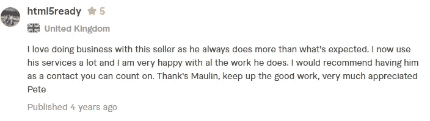

# 想成为一名成功的自由职业者？遵循这 4 条建议！

> 原文：<https://levelup.gitconnected.com/want-to-become-a-successful-freelancer-follow-these-4-tips-46b81468ce4a>

格伦·卡斯滕斯-彼得斯在 [Unsplash](https://unsplash.com/s/photos/freelancer?utm_source=unsplash&utm_medium=referral&utm_content=creditCopyText) 上拍摄的照片

自由职业很难。无论你是平面设计师、作家还是程序员，你都不可避免地需要成为销售人员和营销人员。

我从事自由职业已经 8 年了。我大学期间开始的兼职变成了全职工作。我做过平面设计师，网页设计师，现在是程序员。我有很多优秀的客户，甚至一些糟糕的客户。

如果你即将从事自由职业或者已经从事自由职业一段时间了，这里有一些建议可以帮助你。

# 1.总是超额交货

这是我希望早点学会的事情。超出项目范围的过度交付有几个好处。首先，它有助于迅速与客户建立良好的关系。这么看吧:

哪一次经历会让你记忆犹新？去餐馆吃你想要的东西，还是去同一家餐馆吃免费甜点？

其次，这给了客户很大的激励，让他们在你的档案上留下很好的反馈。即使你没有达到客户的全部期望，客户仍然会觉得有义务留下积极的反馈(或者至少不会留下消极的反馈)。这里有一篇这样的评论:

我收到的关于 Fiverr.com 的评论

你看了这样的评论不会更倾向于录用我吗:)？

不是每个人都认可你的方式——这很好。我从客户那里得到的反馈非常重要。

# 2.不要让自己负担过重

随着时间的推移，高质量的工作会给你带来大量的回报。承担过多的工作并降低你的交付品质量**会严重影响你**！

路易斯·比利亚斯米尔在 [Unsplash](https://unsplash.com/s/photos/overload?utm_source=unsplash&utm_medium=referral&utm_content=creditCopyText) 上拍摄的照片

我在 Fiverr 上提供了一项服务，可以把简历做成信息图表。当时只有我一个人提供这项服务。我开始收到许多订单，而且每周都在增加。最初，我在每个订单上花了至少一个小时，并获得了好评。

这是我第一次看到大钱。我认为我是不可战胜的，并且接受了每一个订单。3 个月后，我每天工作到凌晨 3 点。

贪婪控制了我，我的交付品质量下降了。我几乎没有在每个订单上花 20-30 分钟，为多个客户重复使用设计，也没有花时间去了解他们的具体需求。我最终得到了一系列**未交货** & **负面反馈**。

6 个月过去了，我一周只能接到一两个订单。那几个月的贪婪毁掉了我可能赚到的几年的收入。

> 承担大量工作很有诱惑力，但要确保你总是交付高质量的工作，因为从长远来看，这能给你更多的回报。

这就引出了我的下一个关于负面反馈的观点**。**

# 3.像查看亚马逊产品一样查看您的个人资料

当你想在亚马逊上买东西时，你会在商品说明或任何一个规格说明前检查什么？如果你像我和大多数人一样，你会检查那个产品的评论。

> 不可否认，社交证明是购买产品时考虑的最大因素之一。同样的因素也适用于你的自由职业档案——你需要避免负面反馈。

负面反馈会让人怀疑你的能力或性格。我已经在前一篇技巧文章中解释了它的作用。无论如何，**不惜一切代价避免**。如果你根本没有交付或如果客户对你的工作不满意，**只需退还客户**！—即使总数很大。

失去这笔钱可能会令人沮丧，但失去未来的潜在项目将会导致遗憾。

# 4.保持沟通和诚实

因为个人问题而面临延误？
不能兑现承诺？
客户让你超负荷工作？

> 诚实地让客户知道这件事。对你的客户透明只会帮助你。

我相信你在某个时候不得不面对某个产品的客户服务，并且不得不积极跟进，让他们帮助你。你知道****有多沮丧那种感觉** **可以**。如果你选择不让你的客户知道，他们也会有同样的挫败感。**

****

**照片由[克里斯蒂娜@ wocintechchat.com](https://unsplash.com/@wocintechchat?utm_source=unsplash&utm_medium=referral&utm_content=creditCopyText)在 [Unsplash](https://unsplash.com/s/photos/talk?utm_source=unsplash&utm_medium=referral&utm_content=creditCopyText) 上拍摄**

**我有一个客户，他更愿意把他公司所有重要的项目都交给我，尽管我对同样的服务收取更高的费用。原因？我总是让他了解最新情况，我对自己的能力完全诚实。 ***人们会为信任付出更多！*****

> ****从长远来看，尽早保持良好的沟通有助于建立信任。一旦建立了信任，要求提高你的时薪也会变得更容易。****

**不到一年，我就成为了一名在 [Upwork](https://www.upwork.com/freelancers/~01e2d89cd44a0bcc4a) 上“评价最高”的自由职业者，而且 6 年来从未在 [Fiverr](https://www.fiverr.com/maulin2good) 上得到负面反馈。**

**这些规则在我从事的每一项自由职业中都帮助了我。无论你在哪个领域，它都会对你有所帮助。**

# **分级编码**

**感谢您成为我们社区的一员！ [**订阅我们的 YouTube 频道**](https://www.youtube.com/channel/UC3v9kBR_ab4UHXXdknz8Fbg?sub_confirmation=1) 或者加入 [**Skilled.dev 编码面试课程**](https://skilled.dev/) 。**

** [## 编写面试问题+获得开发工作

### 掌握编码面试的过程

技术开发](https://skilled.dev)**