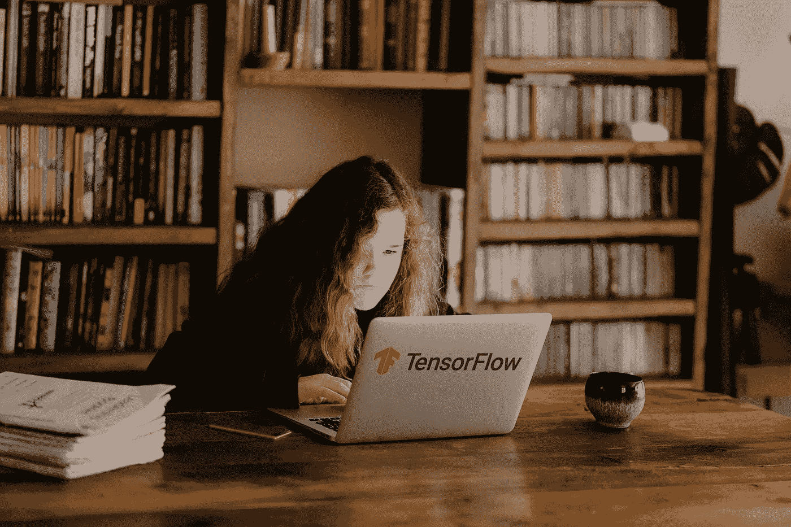

# 想获得 TensorFlow 认证？

> 原文：<https://levelup.gitconnected.com/want-to-get-tensorflow-certified-6c32229792bd>

## 我的通过 TensorFlow 开发者证书考试的技巧

安妮·斯普拉特在 [Unsplash](https://unsplash.com/s/photos/studying?utm_source=unsplash&utm_medium=referral&utm_content=creditCopyText) 上的照片

上周六，我参加了 TensorFlow 开发人员认证考试，我很高兴地告诉大家我通过了。在准备过程中，我使用了几篇来自开发人员的文章，这些文章描述了他们的经历。我想如果我也这样做的话会很公平。

这篇文章描述了我的经验和考试技巧。

# 我为什么要考？

我想学习构建使用机器学习的应用程序。二十多年来，我一直在开发各种应用程序。机器学习一直是我的兴趣所在，但我从未去研究它。

我喜欢在学习一些东西的时候有一个明确的目标。认证或考试迫使我真正地将学习材料内化，而不是仅仅盯着材料看。

我选择学习 TensorFlow 而不是 PyTorch 之类的另一个框架，是因为 TensorFlow 提供这个认证。目前，PyTorch 没有。

# 学习资料

学习的时候喜欢用各种课程和资料。让多个老师解释相同的概念对我有帮助。在研究过程中，我使用了以下资源。

*   [**图书:张量流证书手册(免费)**](https://www.tensorflow.org/extras/cert/TF_Certificate_Candidate_Handbook.pdf)

该 PDF 描述了通过考试所需的所有技能。它非常详细地描述了所有标准。在您注册、确认您的身份并支付考试费用(100 美元)后，您可以下载另一个 PDF 文件，其中更详细地描述了参加考试的说明。那份文件的内容是机密的，因此我不能透露。

*   [**课程:DeepLearning。AI TensorFlow 开发者专业证书(Coursera)(7 天免费试用后 50 美元/月)**](https://www.coursera.org/professional-certificates/tensorflow-in-practice)

课程材料与证书手册中提到的所需技能相对应。劳伦斯·莫罗尼和吴恩达教授这门课程。本课程是备考的最佳资源之一。

如果你买不起，大部分材料也可以在 YouTube 上免费获得。

*   **课程:** [**深度学习 Tensorflow 简介(Udacity)(免费)**](https://www.udacity.com/course/intro-to-tensorflow-for-deep-learning--ud187)

这是 TensorFlow 在 Udacity 上提供的免费课程。我在 Udacity 上又看了几个我觉得更难的话题。主题和 Coursera 上的一样，但没有那么详细。

*   **课程:**[**Python 深度学习入门(data camp)($ 25/月)**](https://www.datacamp.com/courses/introduction-to-deep-learning-in-python)

这个关于 DataCamp 的课程，用例子很好的介绍了深度学习。它用简单易懂的例子解释了向前和向后传播等主题。

*   **练习:** [**Kaggle 竞赛(免费)**](https://www.kaggle.com/)

我用了几个 Kaggle 比赛来测试我的知识，看看我是否可以建立一个模型，让我登上排行榜。在文章后面，我会列举一些我用过的比赛。

*   **课程:** [**杰夫·希顿**](https://www.youtube.com/channel/UCR1-GEpyOPzT2AO4D_eifdw) 的 Youtube 视频

杰夫·希顿是华盛顿大学的数据科学家和兼职讲师。他创建了各种解释深度学习主题的 YouTube 视频。我发现它们很有用，看起来很有趣。

*   **书:** [**用 Scikit-Learn、Keras 和 TensorFlow 进行机器实践学习:构建智能系统的概念、工具和技术第二版**](https://www.amazon.com/Hands-Machine-Learning-Scikit-Learn-TensorFlow-ebook/dp/B06XNKV5TS)

我用来准备的那本书。这确实是一本有很多例子的精彩的书。这本书有 700 多页，但并非所有章节都与考试相关。

相关章节为第 10、11、12、13、14、15 和 16 章。

*   **之前参加考试的开发者的几篇文章**

[我如何通过丹尼尔·伯克](https://towardsdatascience.com/how-i-passed-the-tensorflow-developer-certification-exam-f5672a1eb641)[矩阵](https://medium.com/u/dbc019e228f5#gpu)显示了支持的组合。

## 时间限制

你能花在考试上的最长时间是五个小时。正如我之前所说，五个小时的时间足够完成考试了。

## 识别

在参加考试之前，你必须上传你的身份证明。必须首先验证身份，然后才能开始考试。我在准备考试的前一周上传了身份证明。

## 费用

考试费用为 100 美元

## 考试时有哪些资源可以利用？

您可以使用您在 ML 开发工作中通常使用的任何学习资源。

# 我的应试技巧

如果你打算参加考试，我给你一些建议。

## 首先创建一个基础模型

考试时，先为每道题建立基础模型，后期优化。这是为了确保即使你没有时间了，每个问题都有答案。我在我的笔记本电脑上做了考试，有足够的时间来完成考试。

## 使用这些回调

在训练模型时使用下面的代码片段。它定义了三个可以帮助你考试的回调。

三次复试在考试中帮助你

如果精度不再提高，回调将停止训练您的模型。确保用`monitor`参数测量正确的变量。`Patience`如果没有进展，设置停止前等待的时期数。

`ReduceLROnPlateau`回调如果看不到任何提升，会自动降低学习率。这是我在 Kaggle 上研究共享笔记本时学到的。有一门课没有提到。

`ModelCheckpoint`如果精度提高，在一个时期后自动保存模型。有时，训练结束时的模型不如一个或两个时期前的模型准确。如果使用这个回调，它会保存最准确的一个。

## 测试您的环境

确保您测试了您的开发环境。我使用 Python 3.8.0 和 Tensorflow 2.3.0 训练了各种模型和示例，以确保一切按预期运行。

## 使用 Pycharm 学习

我推荐你在学习期间直接用 Pycharm。大多数课程提供范例，作业使用 Jupyter 笔记本。虽然这对于演示非常有用，但您不会在考试中使用它们。

与其填补课程练习中的代码空白，不如尝试使用 Pycharm 从头开始重新创建它们。

## 参加几个卡格尔比赛

如果你在日常工作中不使用深度学习，但仍然希望获得真实的经验，可以使用 Kaggle。在 Kaggle 上竞争的人是有益的和有建设性的。他们分享各种笔记本和他们的最佳解决方案。有许多介绍比赛，你可以参加，以测试你的知识。虽然这些比赛已经结束，你仍然可以得分你的模型。

例如:

*   [狗 vs 猫](https://www.kaggle.com/c/dogs-vs-cats-redux-kernels-edition)(使用 CNN 和迁移学习的图像识别)
*   [泰坦尼克号幸存](https://www.kaggle.com/c/titanic)(回归)
*   [电影评论情感分析](https://www.kaggle.com/c/sentiment-analysis-on-movie-reviews)(自然语言处理)

# 结论

正如我之前所说，对我来说，真正的学习才刚刚开始。我喜欢学习 TensorFlow 开发人员证书。有一个明确的目标和期限迫使我去学习。使用 Kaggle 帮助我找到了课程中没有涉及到的东西。这些东西在考试的时候真的很有帮助。

由于所有其他认证开发人员都帮助我准备了考试，我希望这篇文章对您有所帮助。如果你打算参加考试，祝你好运并分享你的成绩！

感谢您的阅读！