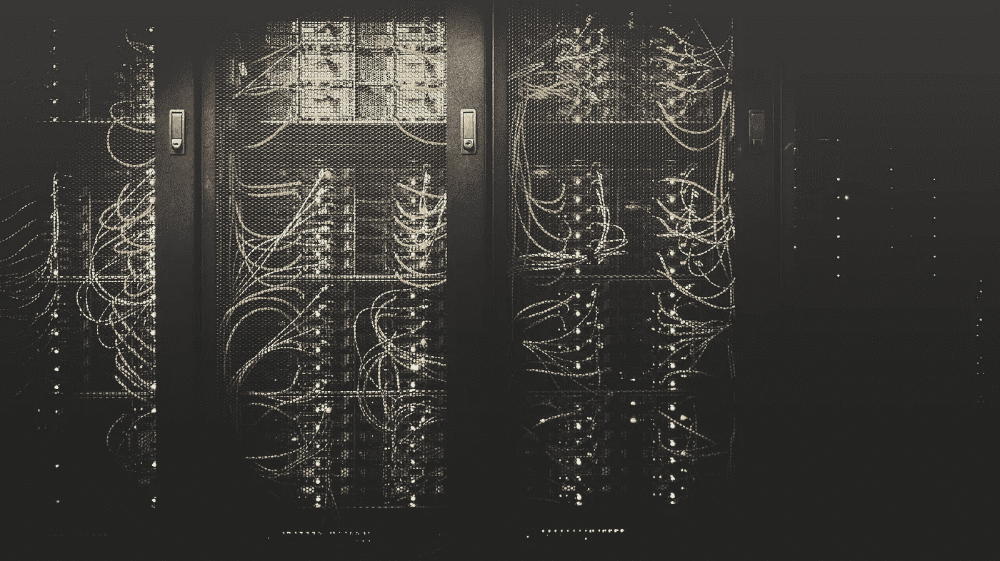

# 想了解计算机科学？学习抽象。

> 原文：<https://levelup.gitconnected.com/want-to-understand-computer-science-study-abstraction-cb785a19bbc5>

## 剥开这些层，成为一个伟大的开发者

大多数初学编码的人(也许是大多数开发人员)对当今复杂应用程序的基础工作了解不多。

在这篇文章中，我想说理解基础是创造新事物的关键。在我最受欢迎(也是最有争议)的文章中，我曾经讨论过这一点。


抽象出细节…

不要误解我。我不是告诉你应该写汇编，构建编译器，或者从头开始设计你自己的操作系统。

但我要说的是，理解计算机的核心概念以及它们是如何工作的，将会比仅仅理解一门语言、web 框架或库更有意义。

> 在云计算、解释语言、web 框架、无服务器和大数据的时代，理解基础知识比以往任何时候都更少，也更有价值。

# 为什么你应该关心

您可能会说“底层工作已经完成了，我为什么要关心呢？别人已经做了所有困难的事情。”

从某种意义上说，你是对的。您可以用 JavaScript 或 Python 编写一个程序，而不需要理解您正在构建的实现和层。

事实上，你可以在软件开发人员的整个职业生涯中从不担心实现细节。

> 这是真的，正是因为在你之前去的人对他们的工作做得非常好，把他们的工作做得非常好。

但问题在于:在你的软件工程师职业生涯中，理解基础知识是 T2 快速学习和 T4 长寿的关键。

语言、框架、库和应用程序来来去去。基本面是首要原则——这一点不会改变。

# 神奇的问题:如果我再深入一层呢？

以 Python 这样的现代解释型编程语言为例。问 10 个 Python 开发者 Python 实际上是如何执行你的代码的，你可能会得到 10 种不同的回答。其中大部分是错误的或不完整的。

关于 CPython 的解释器如何工作的问题，在这里我就不回答了。首先，在这个问题上我根本不是专家。但大多数情况下，我不会回答这个问题来说明一个观点:抽象对于我们作为软件开发人员所做的一切是如此的重要。

如果你是一名软件开发人员，你没有在穿孔卡片上写字节码，那么你要感谢抽象(和其他程序员几十年的工作)。

这种趋势不会很快结束。抽象继续。抽象的当前前沿是无服务器计算、“无代码”软件、单页应用程序，甚至机器学习。

未来，谁知道会抽象出什么？但是如果你想为此做好准备，最好的起点是研究你正在构建的东西下面的抽象层。

问问你自己:

> 我能更深一层理解发生了什么吗？

# 计算机科学中抽象的简要和精选例子

## 程序集字节数


早期的计算机使用穿孔卡给程序员下达指令

为计算机编写二进制或基于字节的指令是非常困难的，但最初就是这么做的。最早的计算机程序(在硬连线程序之后)实际上是一张打了孔的纸。

早期的计算机科学家意识到这是非常低效和令人沮丧的。他们开发了汇编语言来代替穿孔卡片与机器对话:

```
****************************************************************************
;
; AddNumbers
; add number 2 at ds:si to number 1 at es:di of width cx
; 
;
; INPUT:     es:di ==> number1, ds:si ==> number2, cx= max width
; OUTPUT:    CF set on overflow
; DESTROYED: ax, si, di
;
;****************************************************************************
AddNumbers:
 std   ; go from LSB to MSB
 clc   ;
 pushf   ; save carry flag
.top
 mov ax,0f0fh ; convert from ASCII BCD to BCD
 and   al,[si]  ; get next digit of number2 in al
 and ah,[di]  ; get next digit of number1 in ah
 popf   ; recall carry flag
 adc al,ah  ; add these digits
 aaa   ; convert to BCD
 pushf   ;
 add al,'0'  ; convert back to ASCII BCD digit
 stosb   ; save it and increment both counters
 dec si  ;
 loop .top  ; keep going until we've got them all
 popf   ; recall carry flag
 ret   ;
```

## 要编译的程序集

这比打孔卡好多了！但是抽象能进一步帮助我们吗？

如果我们用一种更好的语法来构建一种语言，然后把它放在汇编之上，会怎么样？这样我们就不必使用汇编的复杂语法，我们可以添加保护栏和类型检查来帮助开发。

如果我们为我们的新语法构建一个编译器，我们可以获得更大的灵活性，同时仍然获得低级代码的性能。编译一次，运行无限次！

```
#include <stdio.h>
int main() {
    int t1 = 0, t2 = 1, nextTerm = 0, n;
    printf("Enter a positive number: ");
    scanf("%d", &n);// displays the first two terms which is always 0 and 1
    printf("Fibonacci Series: %d, %d, ", t1, t2);
    nextTerm = t1 + t2; while (nextTerm <= n) {
        printf("%d, ", nextTerm);
        t1 = t2;
        t2 = nextTerm;
        nextTerm = t1 + t2;
    }return 0;
}
```

## 编译到解释

今天，许多应用程序仍然使用编译语言，但是最近解释语言(及其更高层次的抽象)正在兴起。

解释型语言不需要编译，因为它们有一个底层程序可以动态评估代码。这个底层程序通常用编译语言编写，而编译语言又用汇编/字节码编写。

这个新的层为我们快速编写程序提供了更大的灵活性:

```
def fibonacci(n):
    if n < 2:
        return 1
    return fibonacci(n-1) + fibonacci(n-2)
```

## 服务器本地

人们很快就意识到，如果多台计算机可以共享对相同文件的访问，那将非常方便

如果有标准的方法在计算机之间传输文件，那也是很酷的。

所以，我们增加了一个抽象层。文件可以存在于共享驱动器中，但仍可用于您的计算机。

像 NFS 和 FTP 这样的各种技术使这成为可能。都是像你我这样的普通人建造的。

## 个人服务器连接到互联网

互联网只是现有想法的另一种抽象。如果你能创建一个本地网络，那么理论上你应该能创建一个全球网络。

互联网只是链接和共享文件的协议。要共享这些文件，您只需要一个连接和一个服务器来处理传入的请求。

TCP/IP、SMTP/POP 以及更多的技术来帮助文件在连接的互联网上传输。

浏览器开始帮助动态显示超文本标记文档(HTML)和其他媒体文件。我们所知的互联网是全世界处理器、内存和硬盘上的位和字节的一个大抽象！

## 私有到云



今天的大部分互联网生活在亚马逊、谷歌和微软拥有的布满服务器的大楼里

过去，如果你想要一个网站或文件存储，你必须自己购买物理设备。您必须为自己安装硬盘和服务器，并随着需求的增长扩展设备。

然而今天，大多数公司根本没有多少物理 IT 基础设施(除了员工笔记本电脑和 wifi 网络)。这要归功于另一个抽象层:云。

AWS、GCP、Azure、Dropbox 和其他公司已经使得在他们的服务器上存储文件、托管应用程序和做几乎任何事情都比构建和使用自己的基础设施更容易。

按需基础设施让优步、Airbnb 和网飞等初创公司在最初几年以低廉的成本运营，然后随着需求的增长迅速扩张。

# 抽象是计算机科学的过去和未来

如你所见，我们所知的整个软件历史都是关于抽象和它使计算机变得多么强大。

*   构建汇编语言的工作量大得令人难以置信。
*   它用在同样令人费解的 C 编译器中。
*   用于运行复杂、动态的 Python 语言及其所有库。
*   用于创建 Flask，这是一个全功能的 web 服务器。
*   为 Airbnb、优步和网飞等公司的主要应用提供支持。
*   他们将基础架构托管在连接到全球互联网的复杂架构的云服务器上。

太疯狂太爽了！软件的现状要感谢这么多层这么多人！

# 最终拍摄

所以，这是我的热门话题:

> 如果你对抽象层不感兴趣，你就不是在做真正的软件工程——你只是在写一些语法。

写代码并不能让你成为软件工程师。理解并考虑你的代码所在的整个环境和系统是关键。更好的是，构建使未来的问题变得更容易的东西——这是抽象的极致。

这对你意味着什么？两件事:

1.  如果你想成为一名优秀的开发人员，了解你之前的工作，这样你就知道高价值的抽象是什么样子
2.  为了跟上时代的步伐并作为一名开发人员有所收获，无论抽象的下一步走向何方，都要跟随它的趋势

# 关于班尼特

我是一名用 Python 和 JavaScript 构建东西的 web 开发人员。

想要我关于 web 开发和成为更好的程序员的最佳内容吗？

*我在邮件列表中分享我最喜欢的建议——没有垃圾邮件，没有推销内容，只有有用的内容。*

[加入我的电子邮件系列中的其他 500 名开发人员。](https://sunny-architect-5371.ck.page/0a60026a5d)