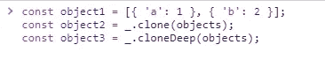

# 在 JavaScript 中克隆对象的方法

> 原文：<https://levelup.gitconnected.com/ways-to-clone-an-object-in-javascript-e1e5beaaf564>

## Java Script 语言

## 使用 ES6、库、JSON.parse/stringify,和本机方法

照片由[思想目录](https://unsplash.com/@thoughtcatalog?utm_source=unsplash&utm_medium=referral&utm_content=creditCopyText)在 [Unsplash](https://unsplash.com/s/photos/coffee?utm_source=unsplash&utm_medium=referral&utm_content=creditCopyText) 上拍摄

在本文中，我将分享一些我所知道的用 JavaScript 克隆对象的解决方案。

1.  ES6
2.  使用库
3.  JSON.parse 和 JSON.stringify
4.  本地方法

*更多类似内容，请查看*[*https://betterfullstack.com*](https://betterfullstack.com)

# ES6 解决方案

ES6 提供了两种浅层复制机制:

*   [Object.assign()](https://developer.mozilla.org/en-US/docs/Web/JavaScript/Reference/Global_Objects/Object/assign)
*   [展开语法](https://developer.mozilla.org/en-US/docs/Web/JavaScript/Reference/Operators/Spread_syntax)

注意:**浅拷贝**是一个对象的逐位拷贝。创建一个新对象，该对象具有原始对象中值的精确副本。如果对象的任何字段是对其他对象的引用，则只复制引用地址。

简单来说，你可以认为浅复制就像编程中的“引用调用”。

## 对象.分配()

`**Object.assign()**`方法将所有[可枚举的](https://developer.mozilla.org/en-US/docs/Web/JavaScript/Reference/Global_Objects/Object/propertyIsEnumerable) [自身属性](https://developer.mozilla.org/en-US/docs/Web/JavaScript/Reference/Global_Objects/Object/hasOwnProperty)从一个或多个*源对象*复制到一个*目标对象*。它返回目标对象。

我将有一个示例状态，目标对象是`{}`和两个源。然后，我把**原始状态**和**新用户名**合并在一起。

使用 Object.assign()克隆对象

下面是在 React 项目(我的个人博客)中使用这种方法的真实例子

使用 Object.assign()更新用户名值

## 扩展语法

当您使用状态管理时，尤其是在 Angular 或 Redux 中，您会经常看到这种语法。

示例:

使用扩展语法克隆对象

在现实生活中，我很少使用这种语法来克隆一个对象。但是，在国家管理中，我运用得很多。

使用 spread 语法从状态克隆对象的示例代码

在上面的例子中，`state.a`、`state.b`和`state.c`是一个对象。它包含了许多内部属性，在请求时，我需要将这些对象信息转换成不同的主体结构，以将请求发送到后端来执行特定的任务。

# 图书馆

就个人而言，我不喜欢在项目中大量使用库。但是，在某些情况下或旧项目中，他们使用 jQuery、Lodash 和下划线等库来实现不同的目的:

*   快速实施以满足最后期限
*   也许 10 年前，唯一的选择就是 **jQuery**
*   由于开发人员的技能。他们根据自己的知识应用东西，这不是最好的解决方案。
*   公司工作流程也是一个原因。我在这里使用“工作流”,因为在一些公司有明确的需求库，可以在新老项目中使用。

现在让我们看看人们喜欢用什么库来克隆 JavaScript 中的对象。

## [jQuery](https://api.jquery.com/)

[jQuery.extend()](https://api.jquery.com/jquery.extend/#jQuery-extend-deep-target-object1-objectN) :将两个或多个对象的内容合并到第一个对象中。

使用 Jquery extend 克隆 2 对象

jQuery 还有一个`[.clone()](https://api.jquery.com/clone/)`方法用于元素的深层复制。

## [洛达什](https://lodash.com/)

您可以使用 lodash 中的`[_.clone()](https://lodash.com/docs#clone)`和`[_.cloneDeep()](https://lodash.com/docs#cloneDeep)`进行浅层复制和深层复制。

使用 lodash 库克隆对象

## [下划线](https://underscorejs.org/)

这个库以前很厉害。我记得我大三的时候，很多项目在 5 年前就使用它了。从 jQuery 换成 Angular 后，我再也很少在前端项目中看到这个库了。

下划线很棒。它为你提供了许多功能上的帮助。包含了对象的`[_.clone()](https://underscorejs.org/#clone)`方法。

此方法将创建所提供的普通对象的浅拷贝克隆。任何嵌套的对象或数组都将通过引用来复制，而不是复制。

## [克隆](https://www.npmjs.com/package/clone)

您可以使用这个库来克隆对象和 JavaScript 中的一切，比如对象、数组、数字、字符串、映射、集合、承诺。

你可以从[这里](https://github.com/pvorb/clone#readme)阅读`README.md`来学习如何使用。安装和使用都很简单。

# JSON.parse 和 JSON.stringify

`[JSON.parse](https://developer.mozilla.org/en-US/docs/Web/JavaScript/Reference/Global_Objects/JSON/parse)()`方法解析 JSON 字符串，构造字符串描述的 JavaScript 值或对象。

`[JSON.stringify()](https://developer.mozilla.org/en-US/docs/Web/JavaScript/Reference/Global_Objects/JSON/stringify)`方法将 JavaScript 对象或值转换成 JSON 字符串。

但是，您可以使用这个语法`JSON.parse(JSON.stringify(object))`使用这个方法对一个对象进行深度克隆。

使用 JSON.parse 和 JSON.stringify 深度克隆对象

这种方法在幕后有一些限制。我建议您将它用于简单类型，或者仅用于字符串类型或 JSON 类型，原因如下:

*   它不克隆函数(所有东西都必须序列化为 JSON 数据类型)
*   日期类型不适用[。`JSON.stringify(new Date())`以 ISO 格式返回日期的字符串表示，而`JSON.parse()`不会将其转换回 date 对象。](https://stackoverflow.com/questions/11491938/issues-with-date-when-using-json-stringify-and-json-parse)
*   缓慢克隆一个具有复杂类型的对象，如`undefined`、`Infinity`、**正则表达式**、**贴图**、**集合**、**斑点**、**文件列表**、**图像、数组**。

# 本地方法

[序列化 API](https://nodejs.org/api/all.html#v8_serialization_api) 提供了以与 HTML 结构化克隆算法兼容的方式序列化 JavaScript 值的方法。

我从来不用这个解决方案在服务器端克隆对象。但是，我从同事和 [stackoverflow](https://stackoverflow.com/) 身上注意到了这一点。

在 Nodejs 中克隆对象的本机方法

# 结论

在本文中，我将开发人员用来在 JavaScript 中克隆对象的所有常见情况进行了分组。

作为一名 JavaScript 工程师，我认为我们会根据上下文的不同情况使用不同的方法。

我希望这篇文章对你有用！你可以在[媒体](https://medium.com/@transonhoang?source=post_page---------------------------)上关注我。我也在[推特](https://twitter.com/transonhoang)上。欢迎在下面的评论中留下任何问题。我很乐意帮忙！

 [## 故事-更好的全栈

### 关于 JavaScript、Python 和 Wordpress 的有用文章，有助于开发人员减少开发时间并提高…

betterfullstack.com](https://betterfullstack.com/stories/)