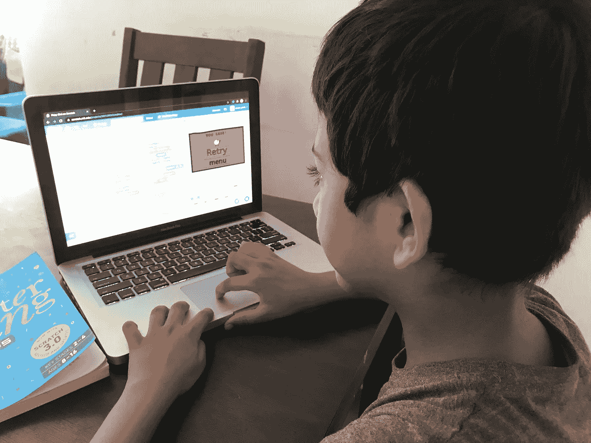
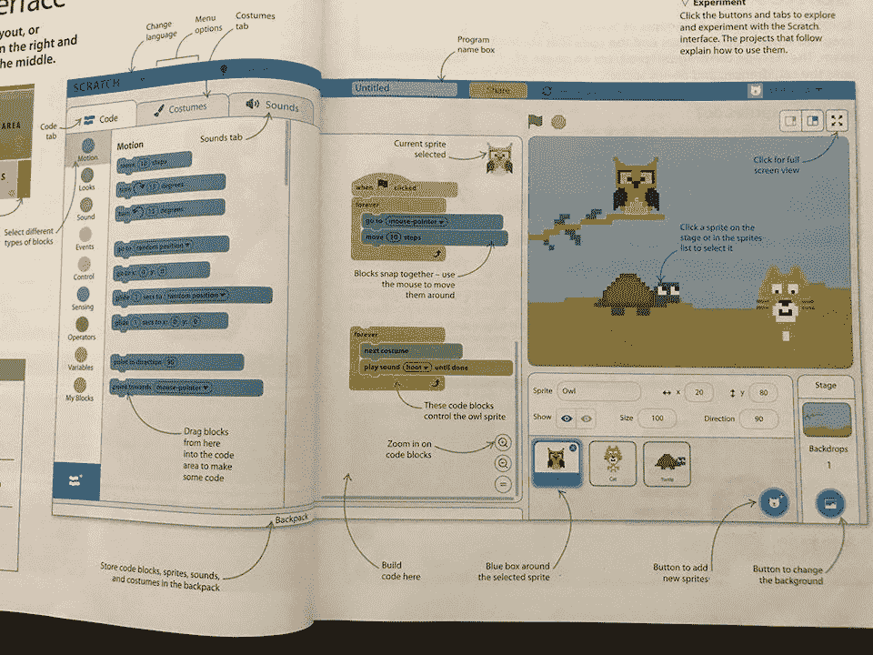

# 向孩子介绍计算机编程的方法

> 原文：<https://levelup.gitconnected.com/ways-to-introduce-computer-programming-to-a-child-120719949ff8>

软件编程是一项充满乐趣和有趣的活动。这也是一个高技能的职业——一个利润丰厚的职业。然而，*这个*永远不应该成为向你的孩子介绍软件编程的理由，但是你应该记住它所提供的智力优势。在今天的数字世界中，编码技能与数学、科学或任何语言技能一样重要，其应用范围从银行到政治！编程为孩子们提供了一个系统地介绍算法的机会，并为他们提供了一个思考我们周围的数字设备(遥控器、移动应用程序、智能电视、微波炉等)的框架。)工作。

有几个平台是专门为向孩子介绍编码而设计的。这些平台大多使用基于块的可视化编程语言，以便小天才可以学习应用逻辑、算法、数学，而不用担心语法。

**一些针对儿童(8 岁以上)的流行平台有:**

[划痕](https://l.facebook.com/l.php?u=https%3A%2F%2Fscratch.mit.edu%2F%3Ffbclid%3DIwAR1gDVsHgoEl7MzREhcxRjSEyaNOzyR8RTqIx6KlfhRN8TxtWEtY8CsLVQ4&h=AT1UQtESnb6gszfm3rnZ04mZeFmSJMaz9d2cd0WGpRgDW1LSwxZ3c7ZUT-LHgwSf6qyyWWOOTPELEG7dUbzun-KUkLn0sSa3ewQ0c_iMDURiV3Km9IvChUWfiOtWvg3QCR1m0Bbh):

*   麻省理工学院媒体实验室的产品，它使用基于块的可视化编程语言。
*   提供基于云和基于桌面的离线编辑器，所以你可以在没有互联网连接的情况下工作。
*   学生可以使用社区中已经发布的项目，并添加到相同的项目中。
*   仅提供基于块的语言接口，不提供基于语法的编码。
*   平台上庞大的学生社区可在出现任何问题时提供帮助。

[Code.org](https://l.facebook.com/l.php?u=https%3A%2F%2Fstudio.code.org%2Fhome%3Ffbclid%3DIwAR3u3VPTrK39draBSX27GUxHOZkx3NbLO6R9fH1D7HAB5KUo1-KXkZkS-lA&h=AT1McgVp37ixAfA21RI_Qabp5fm2Fk_6HujNEG_TmEu_zZS2KD9EuQC4S7VN79vc69DIbWx2PCxYUt0AaGdkVbg2uULW0Dh8yx4zyqNXnlJmp_RrDjA6_fXdPmvsVSJ-TFHQBZSj):

*   这是另一个类似 Scratch 和 Snap 的基于块的可视化编程！
*   没有提供离线编辑器，我们需要通过浏览器访问平台(在 Chromebook 上运行良好)
*   Code.org 也作为计算机科学的基础课程和课程来教授具体的概念。学生学习具体的计算机科学概念(循环、调试等。)通过不插电活动、线上拼图、开放式项目。这意味着当学生进入课程中的下一门课程时，工具会展开(不像 Scratch，所有工具和功能块从一开始就可用)。
*   提供基于块的语言工作区和 JavaScript 工作区。
*   学生可以看到内部发布的项目，并可以重新混合，使他们自己的版本(与 Scratch 的相同)

[嘣！](https://l.facebook.com/l.php?u=https%3A%2F%2Fsnap.berkeley.edu%2F%3Ffbclid%3DIwAR1JKNkjHSc8LiDHlki2HDrkT_pS3QT_MDi0SfIS9t6S_5MIH1GR_Aih9GI&h=AT3gMFaSxyo_7Sn39_ALzk4nug-p2Et4tuAekGwzX7AHMZUM30-8bv92Z57GMLoFBdIQTHFe8-KUo644RhCfxhCCve4vFTY5_MCC575SINVcAVX67WlXwm1t898bAhEeatzlvR68pi5_j3hRGFKjlA):类似于刮擦，啪嗒！虽然它有更强大的功能，应该在掌握了 Scratch 之后再引入。

**为了介绍编程世界，我推荐使用 Scratch，因为:**

*   Scratch 允许学生的创作更加多样化。
*   允许孩子们探索和玩各种模块和功能，这使得编码变得有趣。
*   对孩子来说容易理解。大量的样本代码和例子是可用的，根据这些代码和例子，孩子可以在平台上独立工作。
*   一旦适应了，就很容易迁移到基于语法的编程，如 Python——它更接近于专业领域中使用的语言。
*   提供广泛的逻辑应用、算法和代码流的实践知识。
*   教学生制作简单到相当复杂的游戏。
*   平台上庞大的学生社区可在出现任何问题时提供帮助。

**让我们了解如何鼓励孩子独立探索******。自学增加了一个人的逻辑思维和解释能力。一个没有指令和时间限制的环境给了很多探索和实验的机会，这两个因素构成了一个坚实的基础。****

**第一步:从这些书中任选一本:**

*   **Carol Vorderman 的儿童计算机编码:这本书涵盖了两种编码语言:Scratch Python(一种专业的计算机语言)。作者描述了从零开始到 Python 的一个非常平滑的过渡。**
*   **乔恩·伍德库克的《Scratch 中的游戏编码:一步一步构建你自己的电脑游戏(儿童电脑编码)的可视化指南:这本书是 Scratch 的详细指南，并对如何制作你自己的电脑游戏做了漂亮的解释。**

****

**来自《儿童计算机编码》一书的启示**

**上面提到的两本书都是彩色的，有很多吸引人的照片，可以引起孩子的兴趣。其次，这些书是用非常简单的语言编写的，所以任何孩子都可以自己理解，更重要的是，这些书从一开始就解释了编码，并为读者提供了自己探索的所有工具。**

**第二步:读完这两本书的 Scratch 基础知识，然后尝试复制 Scratch 平台上给出的[示例](https://l.facebook.com/l.php?u=https%3A%2F%2Fscratch.mit.edu%2Fideas%3Ffbclid%3DIwAR3L1_gvgA8J-8v-Juz-geFICbdBle1hw4HLLvqefJm8GYBhILfV3qZ6ZYg&h=AT2gFvdX_uDvRGGRnysWsjyhDfLdESx5LPa4_5kd7MIIvXlJVN9XQqrQMUdx7zeb6u9MvSYIYVkjLQ1DzWTfoy13ra6OuJ86D_mE0Qm9Wvtlsd9ptFQc3KeomUOchI-QpNsug8iS)。**

**第三步:给你的想象一个现实。探索和使用各种工具，前提是孩子们真的喜欢自己调整示例代码，并添加额外的功能。这带来了平台的舒适性。**

**第四步:之后你可以跟着 YouTube 上的复杂作业，比如 [Scratch 3.0 教程:如何在 Scratch 中制作一个 Flappy Bird 游戏](https://www.youtube.com/watch?v=PfQiTBbHHY4&fbclid=IwAR0c8XD20oW-tnf9FXs6Sz-GUIuDWmRHL4kNaqHl37ARbFxn-l74Q0A-uQ8)， [Scratch 教程:如何制作一个射击游戏](https://www.youtube.com/watch?v=QXru0rSV2ZQ&fbclid=IwAR1Nhoh6qWHL3MW5b0GGKqMwH8c_4nrt8JTupgF7HJ3v_CcMP1VYT3U_6Vg)。这样的项目让年轻人对 Scratch 的复杂应用有了深入的了解，同时也让事情变得有趣。他们可能会开始欣赏他们在手机、PSP 上玩的游戏背后的努力。**

****抓伤后怎么办？****

**方案一:从 Snap 开始！它类似于 Scratch，但设计了一些更强大和有趣的功能。**

**选项 2:从 Python 开始。Python 是一种基于文本的高级编程语言。它与 Scratch 非常相似，一旦在 Scratch 上训练，孩子们很容易适应。**

**现在没什么最后的想法了。作为父母，我们的工作就是让软件编程入门变得有趣。和所有活动一样，应该培养对这个领域的内在兴趣，否则，这个活动可能一点也不令人愉快，在这种情况下,“编码恐惧”可能会悄悄出现。如果孩子没有表现出足够的兴趣，就不要管它，3-4 个月后再回来。所有的孩子都是独一无二的，有些孩子很早就能接受，而另一些孩子可能会有自己的甜蜜时光——这两种情况都是绝对正常的。但是，是的，目标是让他们对软件编程的基础有一个明确的了解。上面的书和例子应该可以很好地做到这一点。**

**所以，编码快乐！！**

**(如果你在编写代码时遇到困难，有许多论坛可以接近，其中一个论坛是 [this](https://l.facebook.com/l.php?u=https%3A%2F%2Fscratch.mit.edu%2Fstudios%2F2953555%2F%3Ffbclid%3DIwAR0BQ7Q3TX-n6lr6CgHgn_tXXHa4rlT5EfTVYZP-sOcncvK2g7GFcWVkl4M&h=AT1iIi82nI4uDXaHT4klhbUzTygW7a7QyyiJ_QTYoEIoNn12T1OMEjw6LAxi2v7OzJlPGS9Cy6LQ3PVJn9m4QTyE7hTFLoK5gOzA4C4YofsQMQrswwFWcc05atMvdSe9Tl3S1AMX) 。或者，我将非常乐意帮助解决您的疑问。请随时给我留言，或者在我的脸书主页[上留下评论，我会尽快回复你。)](https://www.facebook.com/ParentageHeureux/)**

**注意:**

*   **[这里](https://l.facebook.com/l.php?u=https%3A%2F%2Fthecodingfun.com%2F2019%2F08%2F28%2Fthe-difference-between-scratch-and-sprite-lab-from-code-org%2F%3Ffbclid%3DIwAR2x28Vnf8H7Bnt1MLmq6QhHYJkp1ucklsxdiLEFGfph2gq-zXLLsFT6dwE&h=AT03_u-Zd0JHtXpC9upCpDna4X_H3yVzLg2DeNw3T2VNMPl0bpJFFaBI7RlKPdt6LnVi7G82xgfdVVuk6HuBSmQSToqqvACFiJwfsSqGzKQH9tCvFO6-szcyhLplJKTA5iFNycXr)是 Code.org 和 Scratch 的详细对比。**
*   **对于喜欢通过观看视频学习的孩子，可以参加一些在线课程，如[Kids Code with Scratch](https://l.facebook.com/l.php?u=https%3A%2F%2Fwww.udemy.com%2Fcourse%2Fscratch-programming-for-kids%2F%3Ffbclid%3DIwAR2gx5lRcfyNlUJqCa8Fxt6kNDI3JQDxWWx57MHdLlS6ycUnLDgqXRmNQU4&h=AT2h93s5OqY3W4CtYdSRl2iPRfgbpRJkC-jtDFb3L0jWXpeX-QUN5bA9Uut5XEeoj5Enu0EqtAB2_tqZDsLFRARUzXptLmxiKFwRk6ubUKmjuo9kXRw7llJVlxWIdiqBosuhwEjt)on[Udemy](https://l.facebook.com/l.php?u=https%3A%2F%2Fwww.udemy.com%2F%3Ffbclid%3DIwAR0I9IBl83d9jOzzrpU8DVSl3CiexQ2fM5_yAdD3C2TO0h8gVcmsGYpQqRg&h=AT1XD1r0Q_URWtVKEhSaPan2Zng-5rn-umBzYgQkDfCHwCUcp9eBlcWpqJk--TkHyUysiEe3clTdeI7TYjbvdMTlcB4P04umoTKUhnnMBsRgc1xqJ8RSs-k0v7-Fd6rWJGELJ1nI)， [Code Yourself！](https://l.facebook.com/l.php?u=https%3A%2F%2Fwww.coursera.org%2Flearn%2Fintro-programming%3Ffbclid%3DIwAR0_9wQ6aT-oTAvsRT_R8FPtA-BKQuKqpq30wBq3sAYkrYi4a2ebCA-TomM&h=AT0UGhrhJwdPaIE4ZJ4Rs927sCMTjiQyH1Ukf8RwoNUm9-cQpCN3zdXLrSTS-1Zvhvy_HmIdKbQ7dLJgT9sUhap4_mU87krtLtjqHBPNpy_bBhKpQnqXyZclsvELRPEAiQLC8K7h) [Coursera](https://l.facebook.com/l.php?u=https%3A%2F%2Fwww.coursera.org%2F%3Ffbclid%3DIwAR1CC-mzM9tX7Kcj6kfiQeTmr8YYHusEGeDs9Ww_b3qmjbnD5OphLCzEolg&h=AT1oSlqGWLPlHbWEmL5Ex9ZP3lfK6HwcTqKSj-E4tss_1Khw-y64ooXZ9nJ5Ak5y4WaelnfIeCCAPKbsRaM2mKnEJN7IyOi2JCPJ_TsYrkV5-tHLmsP7SQLsRiXOxvGn0eqEcxrp) 上的编程介绍**

***披露:这篇文章中的一些链接是附属链接，如果你点击购买，我可能会赚取佣金。老实说，我把这些产品联系在一起仅仅是因为它们的质量和提供的产品，仅此而已。***