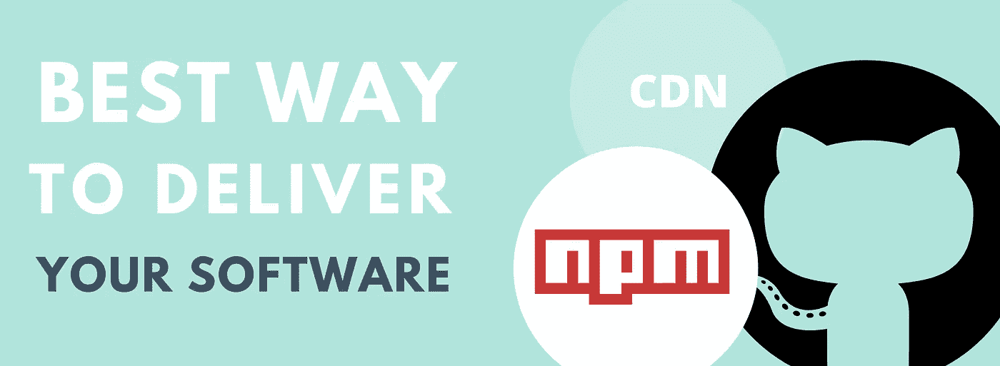

# 发布 JavaScript 库的方法:CDN、NPM、GitHub

> 原文：<https://levelup.gitconnected.com/ways-to-publish-your-javascript-library-cdn-npm-github-12537021b0eb>

软件生产涉及很多阶段，比如软件设计、软件开发等等。软件分发也是这一过程的重要组成部分。它就像是开发的逻辑延续，决定了你的最终用户将在哪里以及如何获得产品。

有很多平台和商店提供自己作为你的软件的位置。要决定是否使用这个或另一个平台作为分发工具，你当然应该知道谁是你的目标受众，以及它使用最多的平台。

如果您是 JavaScript 开发人员，您应该研究 JS 库通常是如何分发的。你应该适应客户并做好一切，这样他们就能以他们通常为他们的项目得到这样的软件的方式得到你的库。

所以，作为一个对扩展库感兴趣的人，你应该采取两个步骤:

*   尽可能多地收集关于 JS 软件交付的最流行平台的信息。
*   采取适当的措施，使该库在这些平台上可用。

为了帮助你完成第一步，我们收集了最流行的 JavaScript 模块发布方式。

开始吧！

# 1.内容交付网络(CDN)

CDN 旨在提供加载网页内容所需资源的快速传输:样式表、图像和 javascript 文件。cdn 变得越来越受欢迎，很大一部分网络流量是通过它们提供的。

考虑到 cdn 的可用性和易用性，我们对它们的广泛好评并不感到惊讶。

通过 CDN 访问您的 JS 模块不会增加您的负担，但会为您的库的用户带来许多好处。

您可以开始使用 CDN，了解更多关于 CDN 提供商的信息，如 [Cloudflare](https://www.cloudflare.com/) 、[亚马逊 CloudFront](https://aws.amazon.com/cloudfront/?nc1=h_ls) 和 [Akamai](https://www.akamai.com/) 。他们以服务的可靠性和质量而闻名。

CDN 如何为最终用户带来便利:

*   不需要下载和复制文件到服务器，也不需要使用一些额外的软件，如软件包管理器。
*   在加载脚本方面的高可用性和高性能。
*   用户的应用程序将自动使用库的最新版本。

# 2.开源代码库

首先， [GitHub](https://github.com/%EF%BB%BF) 是开源项目的完美解决方案。使用 GitHub 作为存储库，可以为项目提供一个社区。因此，除了一个额外的软件分发平台之外，你还可以让一群人聚集在你的图书馆周围。

这些人是一个活跃的网络，他们可以报告错误，通过拉请求来修复错误，建议新的令人敬畏的功能，等等。这听起来对你们图书馆的发展是一个很好的促进，不是吗？

但是即使你的 JavaScript 软件是商业化的，GitHub 也是值得使用的。这是宣传图书馆的一个很好的选择。

你的库与其他库、框架和技术有任何集成吗？

将这种集成的不同示例添加到您的存储库中是一个好主意。由于这些例子，人们可能会在谷歌搜索一些相关主题时发现你的软件。

需要记住的一点是:GitHub 足够受欢迎，可以排在谷歌搜索结果的最前面，所以你不应该低估它的力量。

最终用户如何通过 GitHub 使用您的库:

*   轻松下载和更新软件。
*   在开源项目的情况下，最终用户可以获得源代码并根据他们的需要进行调整。
*   GitHub 是分享不同库使用示例的好地方。

# 3.国家预防机制登记处

public [npm registry](https://www.npmjs.com/) 是一个数据库，包含用于不同开发目的的不同 JavaScript 包。当你使用 [npm](https://www.npmjs.com/package/npm) 或者 [yarn](https://yarnpkg.com/) 的时候，你下载的包会直接从那个注册表中取出。

由于 npm 及其类似物在 web 开发中非常流行，在 npm 注册中心上发布您的 JS 库可能会为该库带来最大份额的用户。

最终用户如何通过 npm 注册中心获得您的库:

*   允许使用 npm、yarn 和其他类似的包管理器安装软件。
*   简单的软件更新，以及坚持使用精确的次要版本的选项。

# 4.努杰画廊

NuGet Gallery 保存了超过 200 000 个独特的包。网络发展。像 npm 的 npm 注册表一样，它是 NuGet 包管理器在下载您需要的库时使用的存储。因此，如果您认为您的库可以用于。NET 开发者，你当然应该为它创建一个 NuGet 包。

最终用户如何通过 NuGet gallery 使用您的库:

*   允许使用 NuGet 包管理器安装软件，使用起来非常方便。
*   轻松的软件包更新和坚持使用所需软件版本的选项。

尽管我们提到了许多软件交付选项，但是不应该忘记传统的下载链接。下载链接，连同所有提到的平台，是软件交付的最终集合。

在本文中，我们描述了最流行的软件分发方式，我们希望它们能帮助您推广您的 JavaScript 库。所以，继续前进，与世界分享你的软件吧！

💡要找到更多的编码教程，你可以去[**【gitconnected.com】**。](https://gitconnected.com/)

【https://www.webdatarocks.com】最初发表于**。**