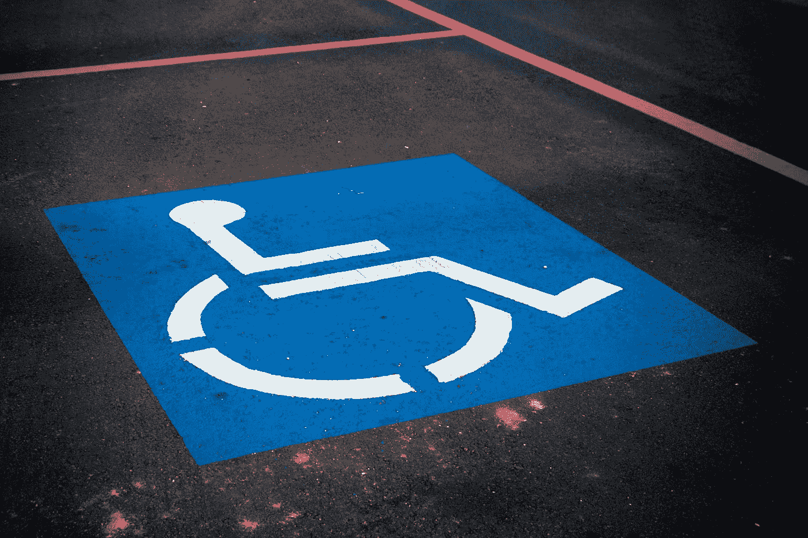

# WCAG 2.1，简化版:如何使你的网站易于访问

> 原文：<https://levelup.gitconnected.com/wcag-2-1-simplified-how-to-make-your-website-accessible-1cfadd03d20d>

## 网页可访问性原则、指南、测试工具等等

由 [Unsplash](https://unsplash.com?utm_source=medium&utm_medium=referral) 上的[absolute vision](https://unsplash.com/@freegraphictoday?utm_source=medium&utm_medium=referral)拍摄

在开发网站或 Web 应用程序时，web 可访问性是一个非常重要的考虑因素，然而许多公司要么忽视了可访问性指导原则，要么不知道如何正确地实施它们。

有些人认为让你的网站无障碍是一种道德义务。所有人，无论能力或残疾，都应该能够使用互联网，并获得可以在那里找到的知识财富。

其他人采取了更务实的方法，认为可访问性可以被视为一个财务问题:使你的网站可访问的投资回报值得吗？如果不遵循可访问性指导原则，您可能会疏远残疾用户并失去他们的业务。那么，工程成本值得潜在的市场份额损失吗？

我个人属于第一个阵营。我认为我们都应该感到道德上有义务使我们的网站尽可能地易于访问。不一定是因为这是最明智的做法，而是因为这是正确的做法。

(尤其是如果你的企业在教育领域或提供基本服务。通过不创建可访问的内容，你在某种意义上说，“那些有残疾的人不值得教育。你不值得我们浪费时间或关注。”)

我认为，在内心深处，我们作为开发者想要做正确的事情。这个问题很大程度上源于这样一个事实，即许多开发者没有任何使他们的站点可访问的经验，或者不知道如何访问。

例如，你曾经尝试过在你的网站上使用屏幕阅读器吗？或者你知道如何使用屏幕阅读器吗？你知道有什么工具可以帮助审计你的网站的可访问性问题吗？你知道并理解你应该遵循的指导方针吗？

# 网页内容可访问性指南(WCAG)

[网站内容可访问性指南](https://www.w3.org/TR/WCAG21/)，通常简称为 WCAG，是一套关于如何让你的网站内容更易访问的指南和建议。在撰写本文时，该文档的当前版本是 WCAG 2.1。

《WCAG》是由万维网联盟(W3C)的成员之一，网络无障碍倡议(WAI)组织发布的。

像大多数来自 W3C 的东西一样，这个文档相当有内容。这是一份技术性很强的文件，非常长，读起来可能会很累。

WCAG 2.1 为如何提高网站的可访问性提供了 4 条原则和 13 条指导方针。在本文中，我们将简要地讨论每一点。

在阅读完这篇文章后，你应该有一个很好的想法，你应该遵循什么样的指导方针，并能够看到一些“低挂水果”的领域，这将是你在自己的网站上实现的速赢。

# WCAG 2.1 原则

由[莎拉·谢弗](https://unsplash.com/@sarah_elizabeth?utm_source=medium&utm_medium=referral)在 [Unsplash](https://unsplash.com?utm_source=medium&utm_medium=referral) 上拍摄的照片

WCAG 2.1 概述了可访问性的四个原则。网站必须 **P** 可接收， **O** 可操作， **U** 可理解， **R** obust ( **倒**)。

为了使内容能够被**感知**，用户必须能够感知内容的存在。对于不能使用所有感官的用户来说，这是无法隐藏的。

对于一个可操作的用户界面来说，用户必须能够操作和浏览网站，不管他们使用的是鼠标、键盘还是屏幕阅读器。

为了让信息能够被 T21 理解，用户必须能够理解页面上的内容，并且知道如何操作页面。

对于一个健壮的网站来说，用户必须能够在各种设备、屏幕尺寸和浏览器上使用网站，包括在使用辅助技术时。

既然我们已经在高层次上理解了网页可访问性的指导原则是什么，那么让我们深入了解每一个原则的细节。这就是 13 条指导原则的由来。

# 1.可知觉的

照片由 [Yassine Khalfalli](https://unsplash.com/@yassine_khalfalli?utm_source=medium&utm_medium=referral) 在 [Unsplash](https://unsplash.com?utm_source=medium&utm_medium=referral) 上拍摄

为了让你的内容易于理解，这里有一些准则可以遵循:

*   准则 1.1 文本替换:为页面上的任何非文本内容提供文本替换。例如，非装饰性图像应该有一个描述图像的`alt`属性。(像背景图像这样的装饰图像可以只有一个值为空字符串的`alt`属性。)
*   **准则 1.2 时基媒体**:音频和视频剪辑应包含字幕或文字记录，以帮助盲人和聋人。
*   **准则 1.3 适应性**:内容应该能够以不同的方式和不同的布局显示，而不会丢失信息。例如，如果你要去掉所有的 CSS，你的网站的 HTML 结构应该以合理的顺序阅读。当用户在移动设备或平板电脑上浏览你的站点时，视图方向不应该被限制为横向或纵向。
*   **准则 1.4 可区分性**:当用户在填写表格时呈现错误等信息时，使用颜色和图标的组合，以便色盲用户仍能理解你的信息。颜色不应该是显示信息的唯一视觉手段。前景和背景之间的颜色对比应该适当(一般来说，至少 4.5 的对比度是你应该拍摄的)。如果音频在你的网站上播放超过三秒钟，用户应该有能力停止音频或改变音量。用户应该能够改变屏幕上的字体大小，而不破坏网站布局。用户不需要同时垂直和水平滚动才能看到页面上的内容。按钮和输入应该有悬停和焦点指示器，让用户知道什么元素是当前活动的。(这个指南涵盖了一大堆东西！)

# 2.可操作的

照片由 [Nhu Nguyen](https://unsplash.com/@nguyendqnhu?utm_source=medium&utm_medium=referral) 在 [Unsplash](https://unsplash.com?utm_source=medium&utm_medium=referral) 上拍摄

为了让你的用户界面具有可操作性，下面是一些需要遵循的准则:

*   **指南 2.1 键盘可访问**:用户应该能够只用键盘来使用和浏览你的网站。在访问自己的站点时，只需使用键盘上的 Tab、Enter、Space、Escape 和箭头键，就可以很容易地测试这一点。你能接触到页面上的每个按钮和输入吗？你能用回车键或空格键点击页面上的每个按钮吗？(请不要做给 div 和 spans 添加点击监听器之类的傻事！)你有没有陷入任何焦点陷阱，无法走出页面的某个特定区域？请记住，不是每个人都使用鼠标。
*   **准则 2.2 足够的时间**:用户需要足够的时间来阅读页面上的内容和响应通知。如果你的应用程序中出现了祝酒词，不要让它们在几秒钟后消失；让它们停留在页面上，直到用户将它们删除。如果用户的会话即将过期，请提前警告他们，并给他们一个延长会话的方法。除非基于时间的功能对你的应用程序绝对重要(例如，一个订票网站，只允许你在买票前持有这么长时间)，否则根本不要使用定时器或时间限制。
*   **准则 2.3 癫痫发作和身体反应**:这一条应该相当简单。不要在你的网站上做已知会导致癫痫发作的事情。不要有闪烁三次以上的内容。不要只是为了好玩而收录轻浮的动画。页面上的任何移动都应该是有目的的，应该仔细考虑。
*   **指南 2.4 可导航**:让用户轻松导航你的网站。为键盘用户添加一个“跳到内容”按钮，允许他们跳过导航链接，直接进入主页内容。使用正确的标题级别，不要跳过标题级别！(在没有`h2`元素的情况下，`h3`元素不应该跟在`h1`元素之后。)标题对于屏幕阅读器用户来说非常重要。确保在浏览你的网站时，焦点顺序是合理的。如前所述，焦点指示器应该是可见的，以便用户知道他们当前关注的是什么元素。你的页面应该有一个标题。应该使用面包屑，让用户知道他们在你的网站中的位置，以及他们是如何到达那里的。
*   **准则 2.5 输入模式**:用户应该能够使用台式机/笔记本电脑上的键盘以及移动设备或平板电脑上的触摸屏来操作输入。不要把移动设备屏幕上的按钮做得太小，这样就很难按下正确的按钮。触摸目标的最佳最小尺寸至少是 44 x 44 像素。

# 3.可理解的

[布鲁斯·马尔斯](https://unsplash.com/@brucemars?utm_source=medium&utm_medium=referral)在 [Unsplash](https://unsplash.com?utm_source=medium&utm_medium=referral) 上的照片

为了让你的信息易于理解，这里有一些准则可以遵循:

*   **准则 3.1 可读性**:你的目标受众应该能够阅读并理解页面上的文字。避免没有解释的行话。在你的`html`标签上使用一个合适的`lang`属性来定义你写的语言。缩写使用`abbr`标签。
*   准则 3.2 可预测的:确保你的网站以可预测的方式运行。保持按钮和链接的外观一致。如果您有一个显示在每个页面上的全局导航组件，请确保链接总是以相同的顺序出现在相同的位置。如果组件看起来一样，它们的行为也应该一样。
*   **准则 3.3 输入辅助**:你应该帮助用户在使用你的应用时避免和纠正错误。在你所有的输入上使用标签。在适当的地方使用占位符文本，但是不要用占位符文本代替标签！当用户填写表单时，尽快提供有用的反馈信息。准确识别哪个输入有错误，以及用户如何纠正错误。对于长表单或多页表单，允许用户在最终提交步骤之前检查他们的数据。

# 4.粗野的

[哈尔·盖特伍德](https://unsplash.com/@halgatewood?utm_source=medium&utm_medium=referral)在 [Unsplash](https://unsplash.com?utm_source=medium&utm_medium=referral) 上拍摄的照片

为了让你的网站更强大，这里有一些指导方针可以遵循:

*   **准则 4.1 兼容**:你的网站应该兼容广泛的用户代理，并且应该尽可能地面向未来。使用正确的 HTML 以便正确解析您的内容。使用语义 HTML 元素，以便屏幕阅读器可以更好地理解您的页面结构。使用带有`role=status`和`role=alert`的元素，当用户与你的应用程序交互时，向屏幕阅读器提供动作成功或失败的更新。

# 额外收获:如何测试可访问性

至此，您已经了解了 WCAG 2.1 中包含的所有原则和指导方针。但是现在呢？你从哪里开始？你如何评估你在网站无障碍化方面做得如何？

以下是一些我认为有用的想法、工具和扩展:

## 纯键盘导航的手动测试

如前所述，想象你没有鼠标。试着只用键盘来浏览你的网站。对于键盘用户来说，这应该可以让他们快速了解网站的哪些区域是不可导航或不可操作的。

## 使用屏幕阅读器进行手动测试

如果你不知道如何使用屏幕阅读器，那就去熟悉一个。流行的选择包括 iOS 版的[大白鲨](https://www.freedomscientific.com/products/software/jaws/)、[画外音](https://www.apple.com/voiceover/info/guide/_1124.html)，Windows 版的 [NVDA](https://www.nvaccess.org/) 。一开始学习如何正确使用屏幕阅读器可能会很困难，但这是非常值得的。

一旦你理解了你选择的屏幕阅读器的基本命令，试着在你的站点上使用它。你很快就会知道，作为一个互联网的盲人用户是多么令人沮丧。

## Chrome 扩展

axe Chrome 扩展可以提供对任何页面的分析，并帮助捕捉许多可访问性问题。他们的规则的完整列表可以在他们的 GitHub repo 中找到。

Web Chrome 扩展的[Accessibility Insights](https://chrome.google.com/webstore/detail/accessibility-insights-fo/pbjjkligggfmakdaogkfomddhfmpjeni)是一个类似的扩展，它也可以分析你的站点的可访问性问题。

## eslint-plugin-jsx-a11y

您可以使用 ESLint 插件`eslint-plugin-jsx-a11y`来 Lint 您的 JSX 的可访问性问题。只需将`eslint`和这个插件添加到您的包的开发依赖项中，以及您通常使用的任何其他插件，您就万事俱备了。像所有其他 ESLint 插件一样，这个插件可以被配置为根据您选择遵循的可访问性规则产生警告或错误。

# 结论

如果你已经做到这一步，感谢你的阅读！我希望现在你已经理解了让你的网站具有可访问性的动机，你应该遵循的原则和指导方针，以及如何进行一些可访问性测试。

现在走出去，让世界变得更美好，更容易接近！