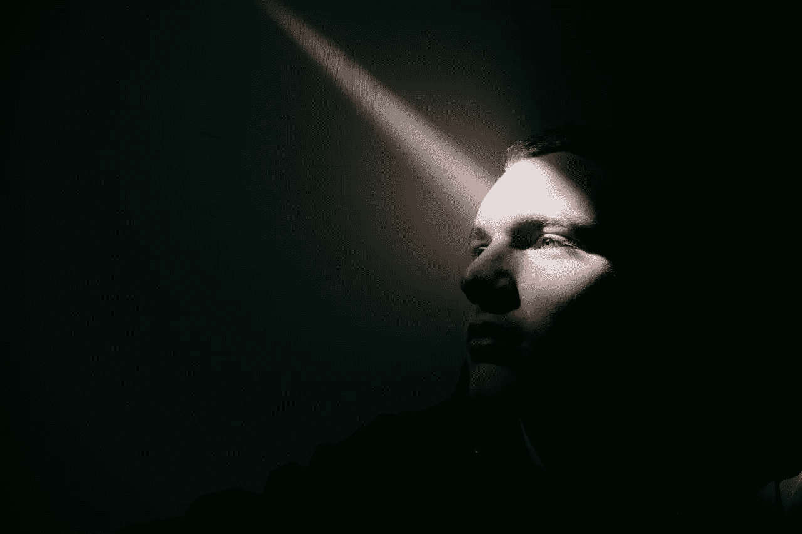

# 我们无法摆脱我们的激情

> 原文：<https://levelup.gitconnected.com/we-are-not-free-from-our-passion-2a65a9cacef1>

## 充满激情可能代价高昂，但却值得

照片由来自 [Pexels](https://www.pexels.com/photo/unemotional-man-in-dark-room-in-sunbeam-5604081/?utm_content=attributionCopyText&utm_medium=referral&utm_source=pexels) 的 [Sinitta Leunen](https://www.pexels.com/@sinileunen?utm_content=attributionCopyText&utm_medium=referral&utm_source=pexels) 拍摄

激情是好是坏？也许答案取决于人和情况。但是对我来说，充满激情是非常重要的。

激情是我们无法选择的。激情是我们生活的目标。我活着是为了。我不是说激情不能改变。是的，可以。但是我们的激情是由我们的潜意识选择的。

我们的潜意识比我们的意识强大得多。我们不是看到一个人，就深深相爱。爱上任何事或任何人都需要时间。

我们的潜意识会做出这些惊人的事情。我们不会仅仅因为第一次看到就选择自己喜欢的颜色、宠物或足球俱乐部。“一见钟情”是短暂的激情或迷恋。

对于工作的激情，我也有同感。我不认为有人告诉我选择职业，我可以选择。如果人们对自己的工作没有热爱，我们就不会有如此有才华的艺术家、作家或创作者。

我母亲总是鼓励我成为一名医生。我 8 岁的时候，要在学校写作文，名字叫《人生目标》。我写了我的人生目标是成为一名医生，得了十分。

但我不知道我的激情和梦想是如何或何时从一名医生变成一名企业家的。我不知道我的潜意识是如何建立这个基础的，但我能感觉到我对它有多么热情。

我想这颗种子是在我第一次开始使用互联网的时候种下的，然后在我参与一些志愿者工作的过程中得到滋养。

# 十几岁的梦想变得严重

2009 年，我第一次开始使用脸书。我 14 岁，我爸爸在我生日那天送给我第一部手机。我的一些朋友那时有电脑，但我没有。我父亲买不起电脑给我。

但是我不后悔。我用脸书在我的按钮诺基亚电话。脸书是最受欢迎的应用。“喜欢”按钮那时刚刚推出。

我是“救助儿童会”经营的一个儿童组织的主席。我选区的所有成员都由脸书联系在一起。我们阻止了几起童婚。我们自己创办了一所非营利性学校。

> 我在很小的时候就明白了一个社区能做什么，以及互联网能如何改变世界。

我明白，我必须学会在互联网上编写代码。所以我决定在我国最好的大学之一成为一名计算机科学工程师。

很难有机会被大学的计算机科学系录取。我不是一个非常好的学生。但只是为了得到这个机会，

我夜以继日地学习为了被录取，我得到了在那里学习的机会。尽管有了机会，我的成绩并不好，但我很好地学会了编码。

我的大学生活让我的激情更上一层楼。

# 我的第一次创业

在我的大学生活中，我开始从事一些专业工作来增加我的编码技能。我(和我的同学)从两个项目中赚了 1 万美元。这给了我巨大的信心和一些种子资金来开办自己的公司。和三个朋友一起，2019 年正式开了第一家公司。

我们在很短的时间内制作了我们应用程序的第一个版本。但是种子资金是不够的。我们开始寻求投资，但并不容易。然而，我们在很短的时间内就有了两个天使投资人。他们给了我们一个设备齐全的办公室。这是一个新的开始！我一生中完成了许多事情，但那天是我一生中最美好的一天！

我的人生目标不是成为亿万富翁，而是想赚到足够的钱，在消费或买东西之前不需要考虑自己的经济状况。金钱可以满足我的需求，却不能满足我的灵魂。我想为社区，为我的国家，为世界做些好事！

## 我的偶像和愿景

我的两个偶像是比尔·盖茨和法兹尔·哈桑·阿布蒂爵士。他们的商业道德和风格是不同的。比尔·盖茨创建了一个帝国，现在他经营着最大的非营利组织之一，T2·盖茨基金会。法兹勒·哈桑·阿贝德爵士创建了世界上最大的非政府组织 BRAC。

我不是比尔·盖茨，也不是法兹尔·哈桑·阿布蒂爵士。但是我喜欢他们的故事。我从他们身上获得动力。我也想对这个地球产生影响。我很小，但我有梦想。

但是有时候，我害怕我的梦想大于我的能力。但我的激情是如此强烈，以至于恐惧无法阻止我。我不能阻止自己，因为我不想。

我对当前创业的愿景是为房主、居民和在住宅楼工作的服务人员创建一个社区。我们希望在住宅公寓中提供顺畅的居住体验，并通过赋予员工权力来改善他们的生活。

> 我意识到，对这个世界来说，最好的生意是能从富人那里赚钱，赋予穷人和中产阶级权力，并在社会中产生影响的生意。我想这么做。

我一生中做了许多艰难的事情，但我从未想过建立一家公司会是我一生中最艰难的事情。但是说实话，如果很容易的话，也不会有多过瘾！

# 我意识到对我来说不仅仅是工作

2020 年，Covid 在我的生意上打击很大。我们的政府发布了长期**封锁**。我的公司在 2019 年取得的大部分进步都在 2020 年被 Covid 暴走了。我们将在 2021 年重新站起来。

当我看到我们在 2020 年做不了多少生意时，我决定从我的公司为 Covid 受影响的人筹集资金。我从朋友、校友、家人和员工那里筹集了近 1.5 万美元。我们当时帮助了 500 多个受灾家庭。

我们的创业公司因为当时所做的慈善工作获得了奖励和认可。我们从来不希望这些任务得到任何回报或认可。因为作为人类，这是我们的道德义务。但是我从那份工作中得到的满足，是无法形容的，是天堂般的。

但作为一名企业家，当你的公司很小的时候，很难平衡你的生活。你必须做很多工作。你不得不在不确定中生活。这里什么都有可能发生。成功不是保证。

我无法给你的家人、朋友或爱人足够的时间。我破产了好几次，许多夜晚我独自哭泣。但我无法想象离开我的梦想或我的激情，因为这让我更加沮丧。没有我的激情，我看不出有什么可做的。

因为我相信我有天赋，我有责任不浪费它。很多人因为害怕失败而不去追逐自己的激情。我不害怕。不去尝试的话我会恨自己的。当我年老时，我想说，就像 T2 的法兹勒·哈桑·阿布蒂爵士说的，“我很高兴我的生命没有虚度”。