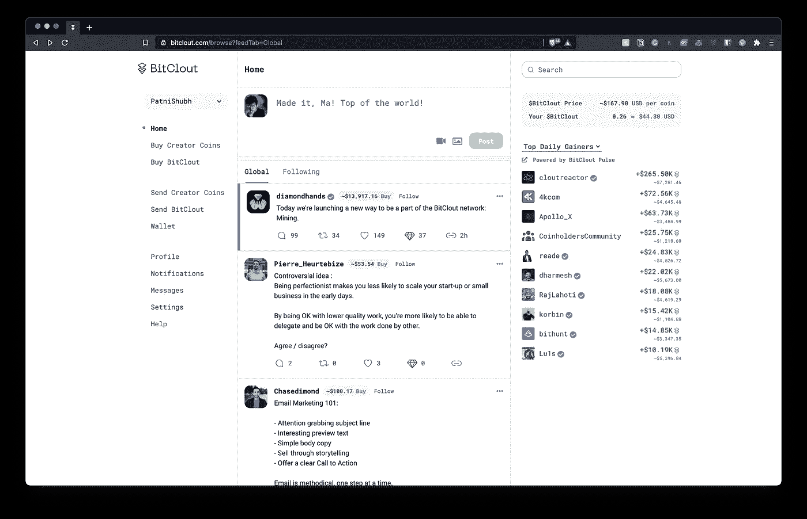

# 我们终于有了一个去中心化的 Twitter

> 原文：<https://levelup.gitconnected.com/we-finally-have-a-decentralized-twitter-dd550dee86db>

## 去中心化社交媒体的时代开始了

鸣谢:作者和[亚历山大·沙托夫](https://unsplash.com/@alexbemore?utm_source=unsplash&utm_medium=referral&utm_content=creditCopyText)在 [Unsplash](https://unsplash.com/s/photos/twitter?utm_source=unsplash&utm_medium=referral&utm_content=creditCopyText)

很明显，现有的社交媒体平台很糟糕。因此，我们需要一些由社区控制的东西，一些与用户需求一致的东西。如果你不相信，下面是当前社交媒体平台问题的简要概述。

十多年来，集中式社交媒体已经控制了我们的数字生活方式；Twitter 可以封杀任何它喜欢的账户，脸书可以把我们的数据卖给任何它想卖的人，YouTube 可以在它认为合适的时候改变货币化的规则。

> 从隐私到我们数字生活的经济方面，社交媒体平台可以制定/改变规则

现有社交媒体平台的动机与用户的动机形成鲜明对比。

*   社交媒体平台的收入严重依赖广告(用户讨厌广告)
*   为了吸引广告客户，社交媒体平台创建了每个人的数字副本，以预测他们对更多广告点击的需求。(用户想要隐私)

你可能会问，*为什么不离开这个平台，去另一个平台呢？*

**人脉效应—** 如果转战另一个平台，需要从零开始；你需要在一个用户更少的全新平台上聚集你的追随者、喜欢和声誉。没有人想在一个完全没有朋友的鬼城里。

进入壁垒— 进入壁垒是巨大的。任何新的想法都很快被巨头们复制或收购。你可能知道脸书收购了 Instagram，但没有人记得 Snapchat 引入了故事的概念，这个概念很快被 Instagram 和几乎所有的社交媒体平台复制。

因此，只有少数社交媒体平台存在，少数控制着市场。让我们看看去中心化的社交媒体是否更好。

# BitClout:去中心化的 Twitter

屏幕上显示程序运行的图片

BitClout 是第一个流行的分散式社交媒体，外观和感觉都和 Twitter 一样。它的目标是给社区尽可能多的权力，少数个人，甚至是创造者自己，不能单独影响这个平台。

> 在我们开始加密之前，让我告诉你我不是财务顾问，这篇文章的内容不应该被认为是财务建议，它们仅仅是我的观点。请自担风险进行任何投资。

BitClout 拥有自己的本地加密货币$BitClout，用于在名为 **Creator Coins 的平台上购买二级货币。**如果你不仅仅是“*喜欢”*创作者的内容，还有一个钻石按钮可以轻松支付给他们。

# **什么是创造者币**

平台上的每个账户都有自己的货币，叫做创造者币，以创造者的名字来代表。这种货币的价值是由指数函数决定的。我们稍后将讨论这一点。首先，让我们来解决一个显而易见的问题——*‘为什么我会买任何创造者硬币，或者为什么有人会买我的硬币？’*

从理论上讲，创造者硬币旨在代表个人的可信度或声誉。这意味着，如果一个创造者、风险投资者、企业家或任何用户正在为其追随者创造价值，他们的货币价值应该会上升，因为更多的人愿意押注于他们。你甚至可以购买自己的货币，以表明你是长期投资该平台，并为代币持有者提供价值。

> 再次，以上是造物主硬币的预期目的。这个平台非常新，所以没有人知道人们会如何找到方法使任何代币的价值暴跌或暴涨。

**创造者币的现有用途:**

*   人们正在开发软件产品，要求用户持有特定的创造者币才能使用服务
*   创造者硬币作为一种营销策略来获得追随者，以换取钻石
*   推测创作者的成功
*   向最新/最多/最久的代币持有者赠送 NFT 或任何东西

**潜在使用案例**

*   创建者可以通过只允许来自具有最多令牌的个人的消息来清理他们的收件箱
*   创作者可以为最大的代币持有者举行 AMA 会议
*   代币可以用作转发、帖子等的赞助费
*   创造者硬币可以为新项目提供资金

## 你承担的风险

在你把每一美元都投入到这个平台之前，有几件事你需要考虑-

*   BitClout 的创始人是匿名的。
*   你不能把 BitClout 套现成比特币，出平台，所以这是一个闭环。
*   围绕 BitClout 及其运作方式存在一些法律问题。

说了这么多，我个人有一个 [BitClout 账户](https://bitclout.com/u/PatniShubh)，还买了一些创造者币。这是因为有人像巴拉吉(前首席技术官比特币基地)，弗雷德威尔逊(VC)查马斯 P(首席执行官社会资本)投资了这个平台，并正在使用它。在做任何决定之前，请做好自己的调查。

## 创造者硬币的价值

来源: [BitClout](https://docs.bitclout.com/)

创造者硬币的价值由公式确定—`*price*_*in*_*bitclout*=.003×*creator*_*coins*_*in*_*circulation2*`*<——【2 的平方】*

从图表和公式中可以看出，随着钱包中的硬币越来越多，创造者硬币的价值呈指数增长。最初，所有帐户都没有硬币，更多的硬币是用户或创建者购买时铸造的。如上图所示，硬币的价值取决于数量。

当用户购买 creator coins 时，该值被锁定在该配置文件中，而 sell 操作会将该值从该配置文件中取出。所有这些都按照曲线发生，因此硬币的价值上升或下降。

> 创造者硬币创造了一个正和游戏，对创造者和支持并相信他们工作的追随者都有好处

**创始人奖励**

创建者奖励与创建者硬币的账户相关联。当任何用户购买创造者硬币时，一定比例的硬币将归创造者所有。这叫做创始人奖励。如果你对一项服务收费，你可以将创始人奖励设置为 100%，这样总购买金额就会归你所有，或者你可以将其设置为 8%左右，以鼓励人们购买你的硬币。

这只是冰山一角。BitClout 是分散的，其代码是公开的。任何人都可以访问 BitClout 中的所有数据，以创建更多的产品、功能或数据分析。在传统的社交媒体平台中，中央权力机构单独控制所有这些信息，并可能为了个人利益滥用这些信息。

有更多的可能性，我们不能在这里讨论。这实际上是一种与个人相关的数字货币。他们可以决定它如何运行以及用户如何使用它。

*您可以在*[*gum road*](https://shubhpatni.gumroad.com/)*查看我的免费策划资源列表，了解更多关于加密货币的信息，或者访问我的*[*socials*](https://y.at/%F0%9F%92%BB%F0%9F%8E%A5%E2%9C%8D%E2%98%95)*。*