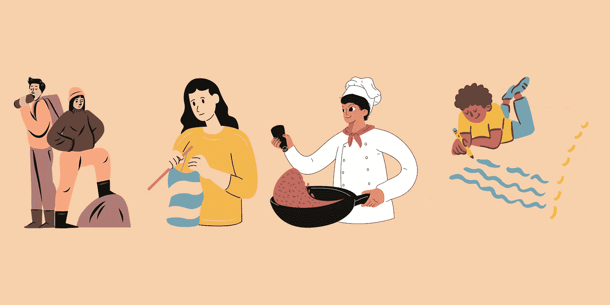

# 我们需要谈谈软件工程师的工作文化

> 原文：<https://levelup.gitconnected.com/we-need-to-talk-about-the-software-engineer-grind-culture-801f3c3613aa>

当我在大学时，我发现自己一直在努力寻找收入最高的工作或最难以捉摸的角色。这让我得到了将近一百次面试的机会，工作量太大了，我不得不辞去兼职去面试。面试的时候，我在大学里一共修了四个学分，我不得不放弃在世界上最大的银行之一每周工作 20 小时的承诺。

相信我，我明白。软件工程师面试是真实的。但这种折磨似乎也存在于我的工作中。诚然，在大型科技公司工作有其优势。有些日子感觉很慢，我甚至可能不会写一行代码。另一方面，有些日子我不吃午饭(是的，即使是远程工作，我也不吃午饭，这样我就可以帮助调试代码、参加会议等等。)这样我才能工作！

世界上没有一份工作能让任何人不吃我们需要吃的饭。我的男朋友是一名军官，有很多天他下班回家时午饭都没动过。他告诉我他一天有多忙，没有人被释放去吃午饭，所以他的排里没有人吃午饭。我心想，有什么事如此重要，以至于你不能停下来吃点东西？

当我开始全职工作时，我意识到我也养成了不吃午饭的习惯。我在德克萨斯州的太平洋海岸工作几个小时，有时一个会议会直接占用我的午餐时间，然后我会连续开会，突然，到了下午 6 点，该吃晚饭了。

SWE 文化可能非常有害。总的来说，我发现在软件工程领域获得奖励的人是那些为了他们的项目/工作牺牲个人时间的人。我们奖励在 24 小时内完成整个项目的人(我的意思是，想想黑客马拉松的受欢迎程度)。我记得看过一位技术创造者的抖音，他说美国软件工程师的收入如此之高，不是因为他们在工作时间做了什么，而是因为他们在工作时间之外做了所有额外的工作。问问你自己:你的薪水足够牺牲工作之外的生活吗？

我们很多人都习惯于这种激烈的竞争。我意识到这种折磨已经让我失去了编码之外的任何爱好。有很多软件工程师同时也是技术创造者。无论他们有一个致力于编码的 twitch 频道，制作关于编码的 Youtube 视频，还是抖音上的技术内容创作者，通常都与软件工程的这种专业化有关。*这些频道如此成功的原因是，作为软件工程师，我们已经接受了这种说法。*

# 离开地面

问美国人如何描述自己，他们会先告诉你他们的职业(我是律师、医生、工程师等等。).虽然我同意我们的工作对我们是谁有影响，但我不同意这是我们描述自己的方式。

我想成为一个多面的人。是的，对于我的职业来说，我是一名软件工程师，但那不是我。目前，我为 Medium 写文章(你好！)，我钩针，我去健身房。我想成为一名自称的健身房老鼠，成为一名更好的厨师。我想要完全远离编程的爱好。

此外，我已经开始让自己更好地平衡工作和生活。虽然我的公司以工作生活平衡著称，我的团队也鼓励这种做法，但有时我发现自己在不需要的时候也在工作。这是一种自我强迫的，我需要完成这件事的心态，而实际上，根本没有完成这件事的紧迫性。我们在工作中设定的界限将延续到我们做的其他事情上，所以我认为我们都需要在工作和生活之间设定清晰、健康的界限。因为说到底，你的工作只是你的工作，你只有一次生命。