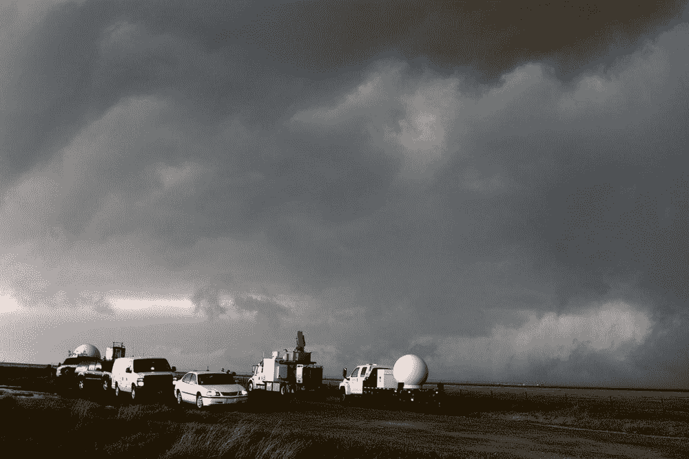
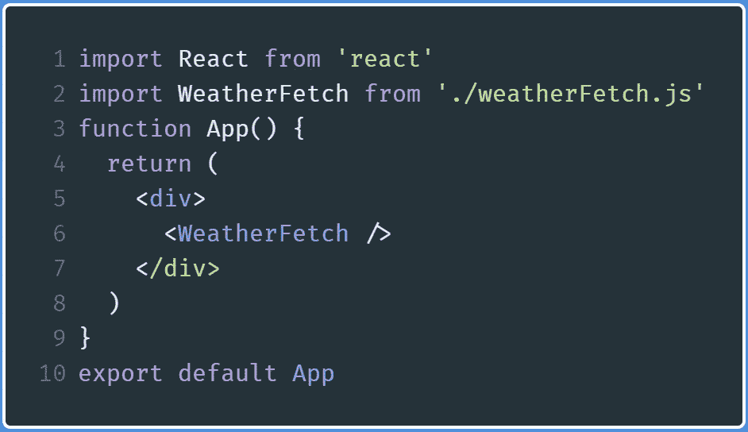
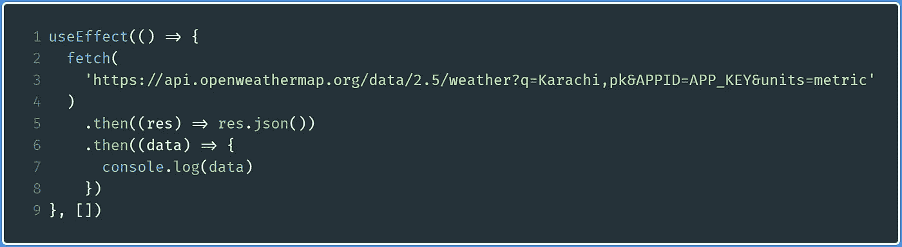
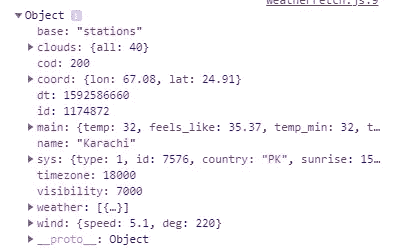
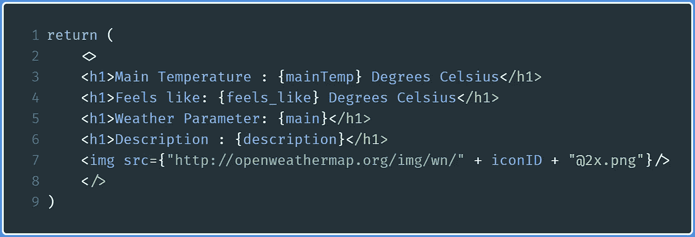
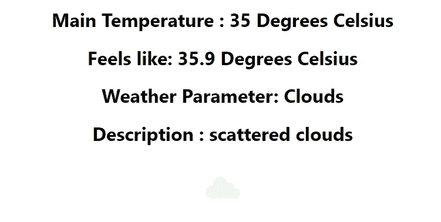

# 如何在 React 中创建天气 App？射流研究…

> 原文：<https://levelup.gitconnected.com/weather-app-in-react-js-ca668ae86b14>

## 关于在 React 中创建简单天气应用程序以及如何使用 fetch 方法的教程



图片来源:[Unsplash 的 NOAA](https://unsplash.com/photos/-urO88VoCRE)

在任何编程语言中，最简单、最有用的项目之一就是构建一个简单显示你家乡天气的应用程序。

在本帖中，我们将用最少的设计构建一个极其简单的天气应用程序。因为这将是你的程序，你也可以定制代码，允许你改变你的程序的外观和感觉。让我们开始吧！

## 入门指南

首先使用`create-react-app`来构建你的 app 的模板。我的 app 名字叫`weatherfrontend`

```
npx create-react-app weatherfrontend
```

现在，你需要登录到 [OpenWeatherMap](https://openweathermap.org) 网站并获得你的 API 密匙。此 API 键允许您访问 OpenWeatherMap 的数据库，以便您可以使用从其服务器返回的数据在网页上显示相关信息。

**记住**:不要把你的 API 密匙暴露给公众，否则，这会带来[严重的后果](https://www.approov.io/api-key-protection.html#:~:text=By removing API keys from,easier to control and manage.)。因此，这里我将把我的 API 键表示为`**API_KEY**`

当你完成了上面的所有步骤，是时候开始了！

# 获取天气信息

## App.js 中的更改

开始之前，我们需要先换`App.js`。它将简单地呈现`WeatherFetch`组件(见下图)。



对 App.js 的更改

*   `line 2` :从指定文件导入`WeatherFetch` 组件
*   `line 6` :渲染`WeatherFetch`组件

现在已经完成了，让我们继续创建`weatherFetch`组件。

## 从 weatherFetch.js 开始:创建钩子

我们将创建一个名为`weatherFetch`的 React 组件，它将从 OpenWeatherMap 服务器获取数据，然后相应地显示到网页上。

首先，创建一个名为`weatherFetch.js`的文件，然后编写以下代码:

*   `Line 5–9`:声明钩子，当我们从 OpenWeatherMap 服务器获取数据时，将为这些钩子分配适当的值。
*   `Line 10`:运行`useEffect`函数，该函数将在组件第一次挂载到网页上时运行。稍后将在该函数中添加更多代码。如果你使用类组件重写这段代码，把它想象成`componentDidMount`。
*   `Line 17`:导出`WeatherFetch`组件，该组件将被导入并在其他文件中使用。

## 从 OpenWeatherMap 获取 API 数据

在这样做之前，建议你去查阅 [OpenWeatherMap 文档](https://openweathermap.org/current)。在我的例子中，我将获得一个名为卡拉奇的城市的天气。因此，我的 API 调用将如下所示:

```
api.openweathermap.org/data/2.5/weather?q={Karachi}&appid=APP_KEY
```

在`useEffect`函数中，编写以下代码:



从 OpenWeatherMap 获取 API 数据

*   `Line 2–7`:使用`fetch`方法，将发送的数据转换成 JSON，然后注销。从`fetch`获取的所有数据将被分配给`data`变量。

运行代码后，这将是浏览器控制台中的输出:



JSON 数据为我们提供了我们刚刚请求的数据。

如您所见，我们已经获得了使用`fetch()`方法请求的数据。我们现在可以使用这些数据，然后将数据中的一些值赋给我们的钩子。

以下是我们将从中提取的内容:

*   **“感觉像”值**。这可以从`main.feels_like`中得到
*   **实际温度值**。这可以取自`main.temp`
*   天气状况。由于`weather`属性是一个数组，我们将这样提取它:`weather[0].description`
*   **天气参数**。这也是`weather`数组的一部分。那么它将会这样获得这个属性:`weather[0].main`
*   **图标 ID。这是为了直观地向客户显示天气。这纯粹是为了长相。它也是`weather`数组的一部分。图标 ID 可以通过`weather[0].icon`提取**

**最后，代码看起来是这样的**:

现在让我们继续将数据中的适当值分配给这些钩子。

# 给挂钩赋值

现在在`weatherFetch` `fetch()`函数中编写以下代码:

*   `Lines 5–9`:将来自`data` JSON 数组的数据分配给适当的钩子。例如，`mainTemp`变量被赋予了`main.temp`值，以此类推。

我们现在已经从`data`变量中提取了所需的值。剩下的就是展示了。

# 显示所需的数据

向 DOM 显示钩子值非常容易。如需复习，点击此处的。我们还想显示通过`iconID`钩子得到的图标。

在`weatherFetch`函数中，在`useEffect()`方法之外，在`return`括号中，编写以下代码:



显示挂钩的所需值

代码是不言自明的。我们只是通过 JSX 展示挂钩价值。

*   `Line 7`:将图像源设置为 OpenWeatherMap 数据库中具有指定 iconID 的图像。欲了解更多信息，请点击[此处](https://openweathermap.org/weather-conditions)。

这将是浏览器中的输出:



显示天气数据的输出

所有的天气数据都显示在相应的图标上(虽然图标很模糊，但是很明显)。

这是一个相当简单的应用程序，我们完全鼓励你扩展它，或者显示更多的属性。

# 概述

## weatherFetch.js

## App.js

除此之外，还有更多方法可以定制 React 应用程序。

# 改进此应用程序的提示:

*   **自动设置与天气对应的应用背景图片:**您可以使用 [Unsplash API](http://api.unsplash.com) 来完成此操作。
*   **查看风速和云量百分比**。这可以通过 OpenWeatherMap 请求的 JSON 数据提供的属性来实现。
*   **根据用户位置查看天气**。这使得您的应用程序在全球各地都有用，因此您的应用程序不仅限于一个城市。

# 外部链接:

*   [OpenWeatherMap API](https://openweathermap.org/current)
*   [为`fetch`反应 API 和 AJAX](https://reactjs.org/docs/faq-ajax.html)

# 结论

我给你的建议是，试着自己写代码，解构程序，全面深入地理解应用。不要放弃！谢谢你坚持到最后，祝你有美好的一天！

上篇:[如何在 React 中创建表单？](https://medium.com/weekly-webtips/how-to-create-forms-in-react-120dce58538c)

下篇:[节点里的聊天 App。JS](https://medium.com/better-programming/build-a-chat-app-in-node-js-with-room-functionality-6ebbd4b19133)

[](https://skilled.dev) [## 编写面试问题

### 一个完整的平台，在这里我会教你找到下一份工作所需的一切，以及…

技术开发](https://skilled.dev)