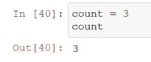
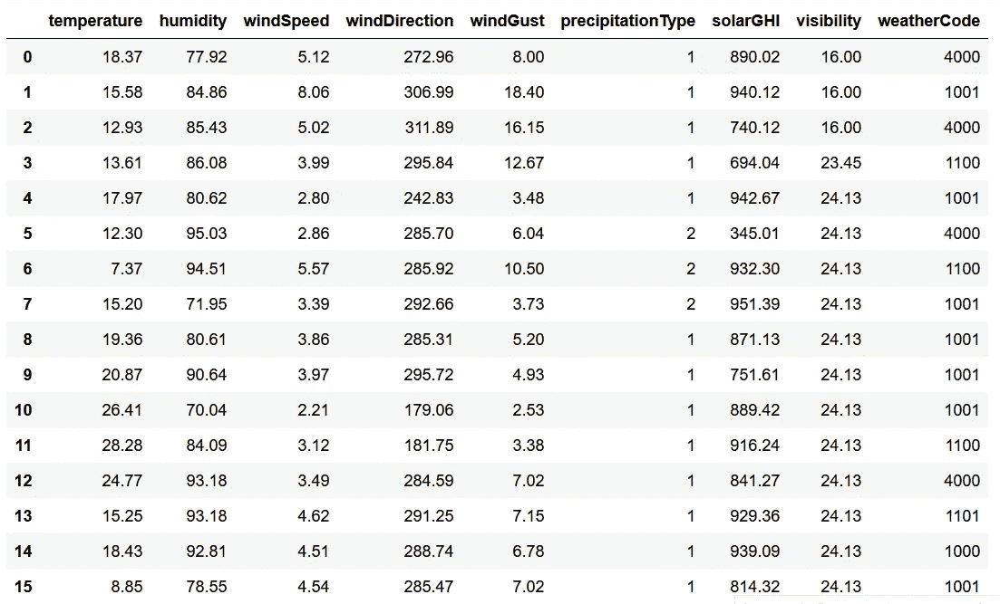
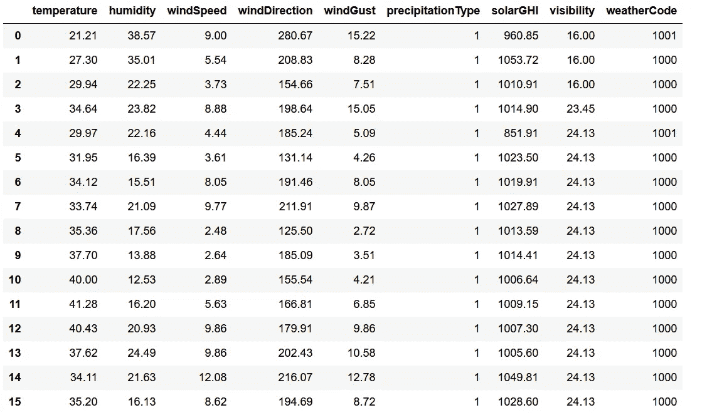
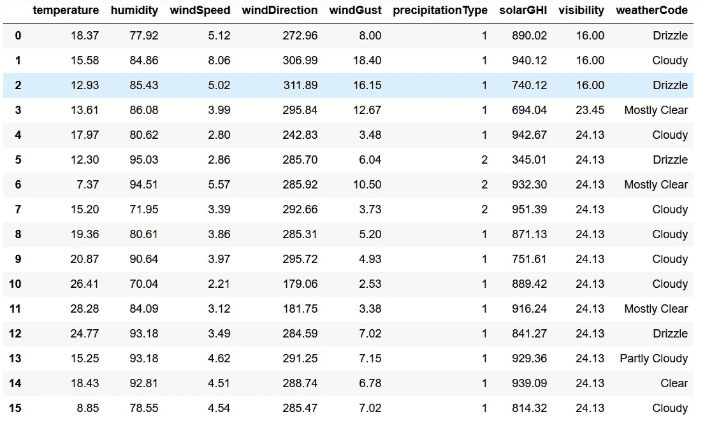
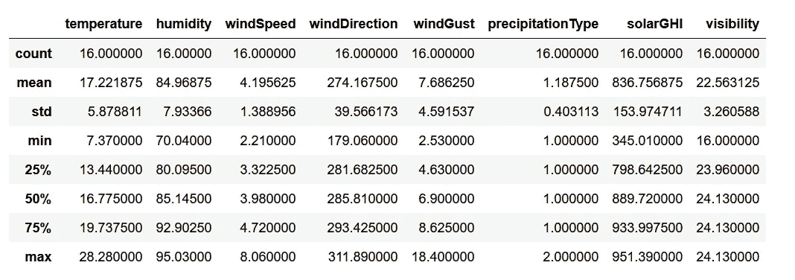
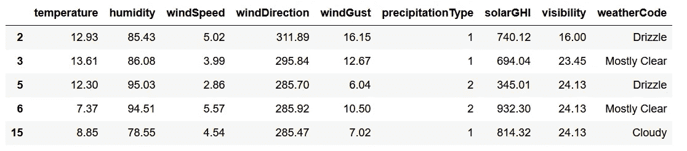
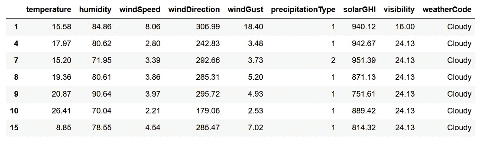
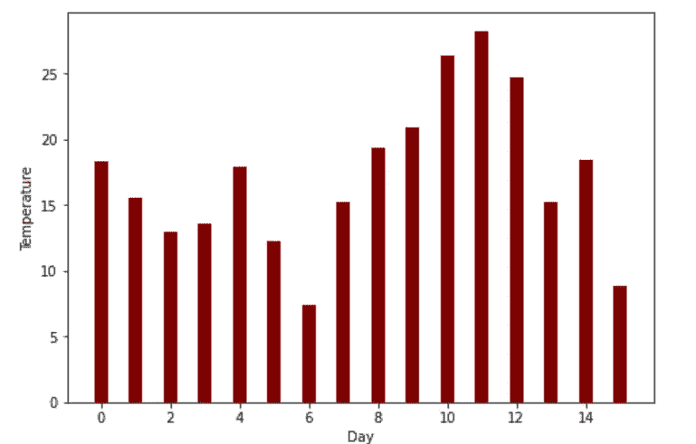
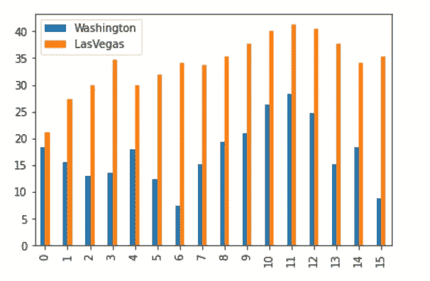
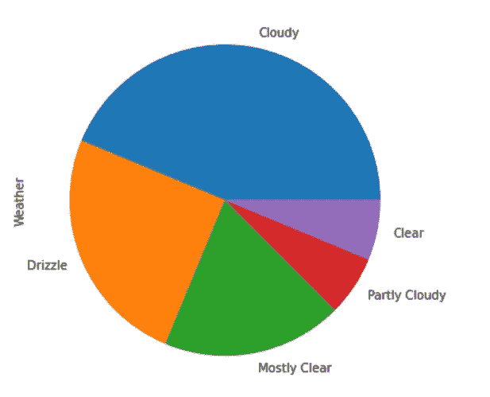

# 熊猫的天气数据分析和可视化

> 原文：<https://levelup.gitconnected.com/weather-data-analysis-and-visualization-with-pandas-dec9c6078065>


由 [Max LaRochelle](https://unsplash.com/@maxlarochelle?utm_source=unsplash&utm_medium=referral&utm_content=creditCopyText) 在 [Unsplash](https://unsplash.com/s/photos/weather?utm_source=unsplash&utm_medium=referral&utm_content=creditCopyText) 上拍摄

这是一个关于如何使用一个著名的数据分析库 Pandas 进行数据分析和可视化的介绍性教程。以下是本教程内容的快速总结:

*   Python 包的安装(请求、熊猫、jupyter)
*   天气数据收集(使用 [Tomorrow.io 天气 API](https://www.tomorrow.io/)
*   数据分析(平均值、最小值、最大值、标准值等。)
*   数据可视化(条形图、饼图)

让我们继续下一节，开始安装必要的软件包。

# 设置

强烈建议您在继续之前创建一个虚拟环境。激活它并运行以下命令来安装所有必需的依赖项:

## 请求(可选)

我们使用`requests`调用天气端点进行数据收集。运行以下命令进行安装:

```
pip install requests
```

## 熊猫

Pandas 是数据科学项目中最有用和最核心的库之一。按照以下方式安装:

```
pip install pandas
```

## 朱皮特

这个包为数据科学和机器学习项目提供了一个基于 web 的交互式开发环境。本教程涵盖了一个叫做`Jupyter Notebook`的特性，它允许你创建交互式的实时代码。

```
pip install jupyter
```

# 数据收集

本教程中使用的数据集来自 Tomorrow.io 天气 API v4，这是最可靠的免费天气 API 之一。最新版本带有一体化端点，您只需对端点进行一次调用，即可轻松检索所需的所有数据。

此外，最新版本还包括一些有用的功能，例如:

*   `Polygon/polyline locations` —基于边界框的位置，而不仅仅是经纬度。
*   `Monitoring and alert via webhooks` —设置您自己的规则，以便在满足特定条件时接收警报。
*   `Dynamic routes` —将数据字段映射到旅行路线。
*   `Dashboard` —洞察与互动天气图。

## 样本数据集

您可以在以下 Github 要点中找到本项目中使用的样本数据集:

*   [lasvegas.txt](https://gist.github.com/wfng92/440df3cbb35b46f9ba0f30a84da501c5)
*   [washington.txt](https://gist.github.com/wfng92/b5020b592520a984fa0cf4b0d3903587)

它包含华盛顿和拉斯维加斯 15 天的天气数据。

## 天气 API

如果你正在寻找更多的数据，明天注册一个新的账户。免费计划最多允许:

*   每天 500 个电话
*   **每小时 25 次呼叫/**
*   **每秒 3 次呼叫/**

完成后，点击`Development`菜单，您应该会看到以下用户界面。


作者图片

记下`Secret Key`，因为稍后调用天气 API 时会用到它。API 接受以下输入参数:

*   `location` —预定义位置或经纬度字符串的 ID。
*   `fields` —代表数据层的字段列表。
*   `units` —单位制。接受`metric`或`imperial`。
*   `timestep` —时间线的时间步长。默认值 it `1h`。接受`best`、`1m`、`5m`、`15m`、`30m`、`1h`、`1d`或`current`。
*   `startTime`—ISO 8601 格式的开始时间。如`2019–03–20T14:09:50Z`。
*   `endTime`—ISO 8601 格式的结束时间。如`2019–03–20T14:09:50Z`。
*   `timezone` —日期时间的时区。默认为`UTC`。

创建一个新的 Python 文件，并在其中添加以下代码。

它将调用 Tomorrow.io 天气 API 并将数据保存在一个文本文件中。查看[官方文档](https://docs.tomorrow.io/reference/get-timelines)以了解更多可用数据。

# 数据分析

运行 Jupyter Notebook 就像在命令行中调用以下命令一样简单:

```
jupyter notebook
```

它将使用以下 URL 在您的默认浏览器中启动一个新选项卡

```
[http://localhost:8888](http://localhost:8888)
```

点击`File > New Notebook > Python3`创建新笔记本。

## 导入

将下面的 import 语句添加到第一个单元格，点击`Shift-Enter`执行代码，并跳转到下一个单元格。

```
import pandas as pd
import json
```

在 Jupyter Notebook 中，基于单元格执行代码。这很方便，因为您可以将数据加载代码放在一个单元格中，将数据分析代码放在另一个单元格中。这允许您一次加载数据集，多次执行数据分析代码。

## 加载数据集

在下一个单元格中，追加以下代码并执行它以加载数据集:

```
with open('washington.txt', 'r', encoding='utf8') as f:
    washington = json.load(f)
with open('lasvegas.txt', 'r', encoding='utf8') as f:
    lasvegas = json.load(f)
```

## 打印

请注意，Jupyter Notebook 会自动将最后一次评估的结果打印到控制台的一个单元格中。举个例子，



作者图片

在这种情况下，不需要将变量包装在`print()`函数中。如果您希望打印出所有变量，只需显式地打印出来，或者在笔记本的开头执行以下代码:

```
from IPython.core.interactiveshell import InteractiveShell
InteractiveShell.ast_node_interactivity = "all"
```

## 创建新的数据框架

接下来，运行下面的代码来创建一个新的`DataFrame`对象:

```
intervals = washington['data']['timelines'][0]['intervals']washington_df = pd.DataFrame([x['values'] for x in intervals])
washington_df
```

您应该会在控制台上看到以下输出:



作者图片

同样，对拉斯维加斯的数据重复相同的步骤。

```
intervals = lasvegas['data']['timelines'][0]['intervals']lasvegas_df = pd.DataFrame([x['values'] for x in intervals])
lasvegas_df
```

以下结果将显示在您的控制台上。



作者图片

## 修改数据帧

如你所见，`weatherCode`是基于一个 4 位数的整数，这并不直观。让我们覆盖该列，并将代码映射到[对应的值](https://docs.tomorrow.io/reference/data-layers-core)。

您应该会得到下面的输出，其中的代码被相应的天气所取代。



作者图片

## 获取统计数据

为了获得每一列的最大值，可以运行下面的代码:

```
washington_df.max()
```

输出如下所示:

```
temperature                  28.28
humidity                     95.03
windSpeed                     8.06
windDirection               311.89
windGust                      18.4
precipitationType                2
solarGHI                    951.39
visibility                   24.13
weatherCode          Partly Cloudy
dtype: object
```

或者，您可以获取单个列的最小值，如下所示:

```
washington_df['temperature'].min()
# 7.37
```

您可能更喜欢使用`describe()`,因为它提供了您需要的所有信息:

```
washington_df.describe()
```

结果如下:



作者图片

## 基于特定条件过滤数据帧

假设您只想获取温度低于 15 摄氏度的地方的数据。您可以通过以下代码来实现:

```
washington_df[washington_df['temperature'] <= 15]
```



作者图片

除此之外，您还可以使用它进行字符串比较。例如，要获得所有被认为是`Cloudy`的地方的数据，使用下面的代码:

```
washington_df[washington_df['weatherCode'] == 'Cloudy']
```



## 数数

假设给你一个任务来确定第几天是`Cloudy`，最好的方法是使用下面的代码:

```
lasvegas_df['weatherCode'].value_counts()
```

输出将根据频率排列:

```
Cloudy           7
Drizzle          4
Mostly Clear     3
Partly Cloudy    1
Clear            1
Name: weatherCode, dtype: int64
```

# 数据可视化

传统上，数据科学家使用`matplotlib`包进行数据可视化。例如，要创建简单的条形图来显示每天的温度，请执行以下操作:

```
import matplotlib
import matplotlib.pyplot as pltfig = plt.figure()
ax = fig.add_axes([0,0,1,1])
ax.bar(indexes, washington_df['temperature'], color ='maroon', width = 0.4)
plt.xlabel("Day")
plt.ylabel("Temperature")
plt.show()
```



作者图片

现在，你可以使用`DataFrame`对象直接绘制它们。通过以下代码可以获得相同的条形图:

```
washington_df['temperature'].plot.bar(xlabel='Day', ylabel='Temperature', color ='maroon', width = 0.4)
```

这比传统方法方便多了。

事实上，您可以结合拉斯维加斯和华盛顿的数据，更好地了解这两个城市之间的差异。

```
barplot = pd.DataFrame({'Washington': washington_df['temperature'], 'LasVegas': lasvegas_df['temperature']}, index=indexes)barplot.plot.bar(width = 0.4)
```



作者图片

让我们画一个`Pie Chart`来表示被视为`Cloudy`、`Drizzle`等的天数。

```
weather = dict(washington_df['weatherCode'].value_counts())
series = pd.Series(weather.values(), index=weather.keys(), name="Weather")series.plot.pie(figsize=(6, 6))
```

您应该在控制台上获得以下输出:



作者图片

查看[以下文档](https://pandas.pydata.org/pandas-docs/stable/user_guide/visualization.html)了解更多关于所有可用可视化的信息。

# 结论

让我们回顾一下你今天所学的内容。

本教程从安装 Python 包开始，比如`Pandas`和`Jupyter`。

然后，它讲述了如何从明天的天气 API 中获取额外的天气数据。

在随后的部分，重点转移到数据分析。这包括加载数据集、创建新的`DataFrame`、获取统计数据以及基于特定条件的数据过滤。

最后，对`Pandas`包中内置的数据可视化特性进行了解释。你可以用它来创建条形图，饼图等。

感谢你阅读这篇文章。祝你有美好的一天！

# 参考

1.  [明天—签到](https://app.tomorrow.io/signin)
2.  [明天—文档](https://docs.tomorrow.io/reference/welcome)
3.  [熊猫——可视化](https://pandas.pydata.org/pandas-docs/stable/user_guide/visualization.html)