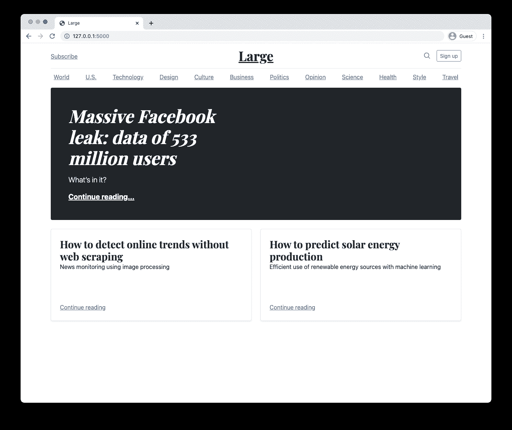
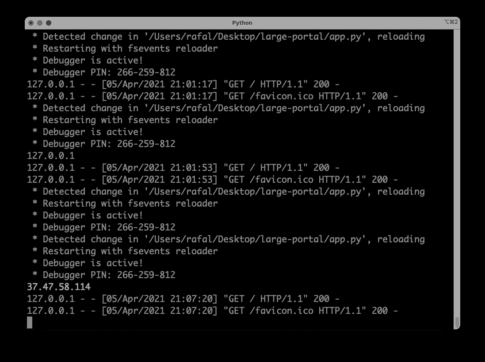
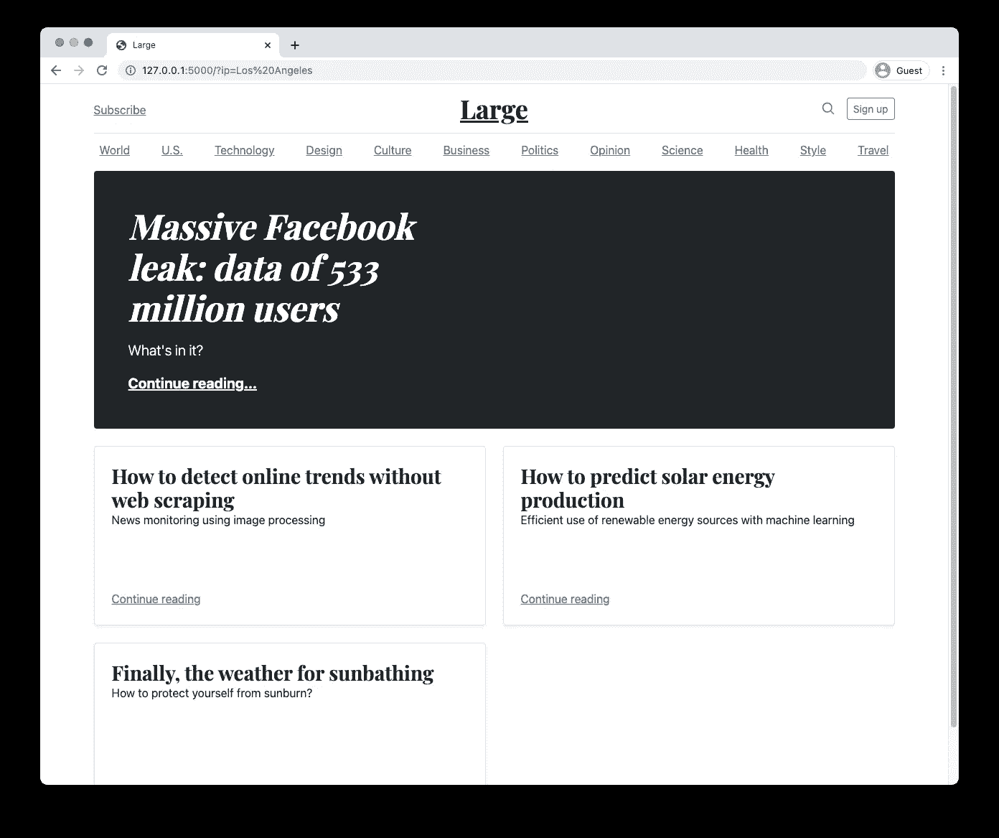
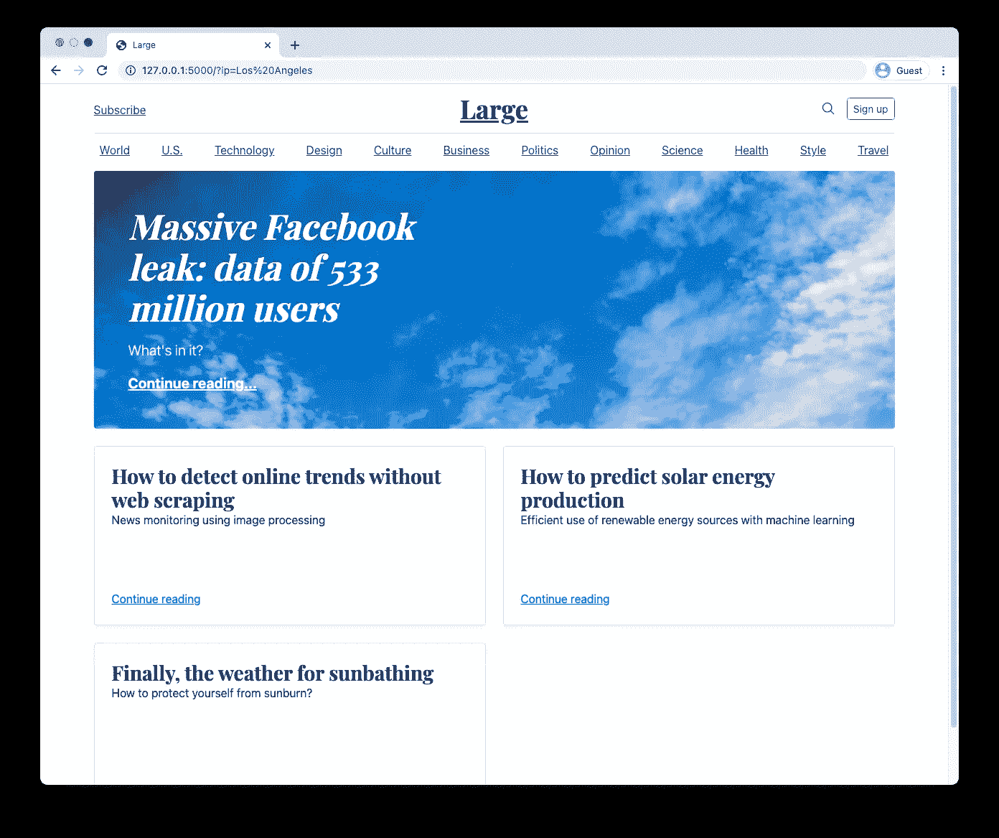
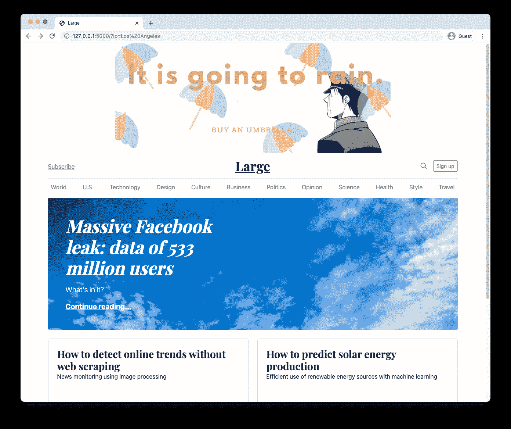

# 天气触发的内容:如何定制用户体验

> 原文：<https://levelup.gitconnected.com/weather-triggered-content-how-to-customize-users-experience-98c868ca0e21>

## 不仅是天气营销…

毫无疑问，天气状况会影响消费者的行为。不断变化的天气会引发我们购买的衣服、家居设计和聆听的音乐的变化。这一点已经被营销人员注意到了，导致了天气营销的出现。使用天气数据，您可以控制何时何地显示您的广告。


除非另有说明，文中所有图片均为作者。

例如，如果你想为游乐园做广告，你最好考虑到天气预报，因为消费者在策划这种活动时往往会考虑到这一点。通过结合当今广告平台和实时天气 API 的功能，可以嵌入与受众当地天气相关的信息。

在本文中，我将向您展示如何构建一个基于当地天气显示消息(如横幅广告或推荐文章)的系统。我们将使用 Python (Flask)和天气 API。

[🔔想要更多这样的文章？在这里签名。](https://fischerbach.medium.com/membership)

# 让静态变成动态

让我们假设你经营一家在线杂志。主页上出现的大部分内容都是由编辑团队挑选的，完全是静态的——每个用户看到的都是完全一样的东西。



随着贵国天气变化无常的季节即将到来，您希望自定义门户，以显示与每个用户在窗外看到的天气一致的内容。

因此，您的任务是扩展 CMS 的功能:

*   根据用户区域的当前天气显示特定的文章，
*   根据天气状况修改消息，
*   根据未来几天的天气预报显示广告活动。

# 门户架构

您的门户基于 Flask 框架及其内置的模板系统工作。

> 注意，由于 web 开发不是本文的主题，我们在这里使用一个模型。然而，大多数知识可以很容易地转移到其他框架和编程语言中使用。

文章的存储库:

[](https://github.com/fischerbach/large-portal) [## 财政预算/大门户

### 在 GitHub 上创建一个帐户，为 fischer Bach/大型门户网站的开发做出贡献。

github.com](https://github.com/fischerbach/large-portal) 

项目的初始状态可以在`initial`分支中找到。整个事情非常简单，通过使用`Articles().get_all()`方法，文章从数据库中取出并按顺序插入到主页面中。

由于预期的天气变化，记者们准备了两篇文章:一篇关于晒伤，另一篇关于下雨时该怎么办。

把一篇晒伤的文章展示给所在城镇大雨的用户，意义不大吧？因此，首先我们需要获得用户所在地区的天气状况信息。

# 天气 API

承蒙[WeatherAPI.com](https://weatherapi.com)，我被允许访问他们的 API。他们为实时和预报天气和地理定位 API 提供免费计划。出于我们的目的，他们在同一个请求中提供实时天气数据和 IP 地理位置是很重要的。

下载给定 IP 地址的当前天气非常简单:

```
[http://api.weatherapi.com/v1/current.json?key=81afd70710744cc380d213803210404&q=89.64.73.93&aqi=no](http://api.weatherapi.com/v1/current.json?key=81afd70710744cc380d213803210404&q=89.64.73.93&aqi=no)`
```

我们将在我们的解决方案中使用它。

# 获取用户 IP

首先，我们需要获取门户用户连接的 IP 地址，并将其传递给 Weather API。

注意，如果您在本地环境中工作，那么当您刷新页面时，您将获得`127.0.0.1`。为了测试方便，我们创建一个函数:

现在，我们可以通过在 URL 参数中指定不同的 IP 地址来轻松测试它们:

```
http://127.0.0.1:5000/?ip=37.47.58.114
```



# 获取当地天气

为了有效地检索数据，我画了一个简单的 API 客户机:

所有结果都被缓存。由于这是实时数据，我们不能无限期地存储它而不更新它，所以生存时间(TTL)很短— 15 分钟。但是，这将有助于提高性能和降低成本。现在，我们准备在应用程序中使用来自 API 的数据。

# 精确到天气的文章推荐

好了，我们的显示策略是用一个额外的字段来修改文章模型，该字段存储显示它们的条件:

然后将它们与用户所在地的天气条件进行比较:

当然，需要做一些小的技术更改，这超出了本文的范围。参考存储库(分支“步骤 1”)。

让我们看看我们的门户对洛杉矶用户来说是什么样的:

```
[http://127.0.0.1:5000/?ip=Los%20Angeles](http://127.0.0.1:5000/?ip=Los%20Angeles)
```



在撰写本文时，那里的天气晴朗，所以对防晒的关注似乎很到位:)

# 针对天气的内容

现在让我们根据天气来调整网站的外观。让主页元素的背景反映窗外的天气:

两处微小的代码更改，结果如下:



请注意，对于这个覆盖所有天气现象的解决方案，您需要上传带有相应名称的背景。[天气 API 中所有天气状况的列表。](https://www.weatherapi.com/docs/weather_conditions.json)

# 天气引发的广告

最后一个变化将总结我们到目前为止所学的一切。一个雨伞制造商找到我们，他希望他的广告只在第二天会下雨的时候才会出现。


首先，我们需要将预测下载添加到天气 API 客户端:

然后我们创建一个`Ads`模型:

> 注意使用`eval`功能是不安全的，应该小心操作。此处使用它是为了简洁。在生产环境中，最好使用具有代码净化功能的更强大的解析器。

我们将数据传递给模板:

给包含广告的`<div>`添加一个随机类可能无法抵御广告拦截器，但值得一试。

瞧:



尽管今天天气很好，但洛杉矶明天会下雨。项目的最终版本可以在资源库的`master`分支中找到。

# 外卖食品

当然，我们的门户只是一个玩具，但是通过一点点代码和对天气 API 的访问，它已经有了自己的惊人的生命。如果您在门户的不同点构建附加条件，用户可以真正感觉到它是为他们而构建的。


# 参考

【https://flask.palletsprojects.com/en/1.1.x/】烧瓶:
T5

**韦瑟 API:** [https://www.weatherapi.com/](https://www.weatherapi.com/)

[https://www . dynamic field . com/lesson/weather-based-targeting/](https://www.dynamicyield.com/lesson/weather-based-targeting/)
[https://netlabe . com/how-to-forecast-website-traffic-e 8 BC 5 f 0 c 34 c 8](https://netlabe.com/how-to-forecast-website-traffic-e8bc5f0c34c8)