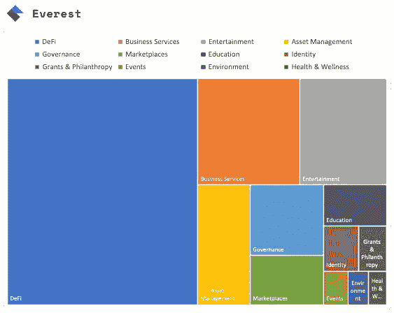
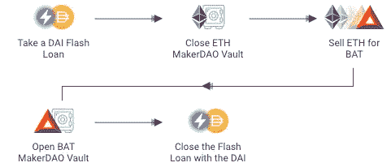
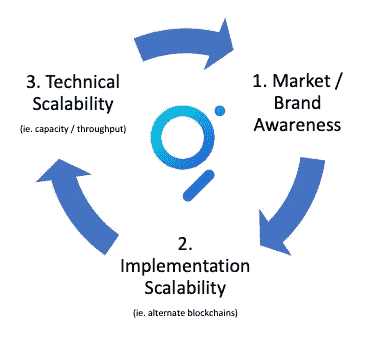

# Web 3.0 值得拥有一个 Web 3.0 数据访问协议

> 原文：<https://levelup.gitconnected.com/web-3-0-deserves-a-web-3-0-data-access-protocol-d442a64ca6a>

用[图](http://www.thegraph.com)进化 Web 3.0

[面向充满活力的分散式未来的 APIs】](http://www.thegraph.com)

数据库、搜索引擎或查询 API 等数据访问技术无处不在，以至于我们在设计软件解决方案时很少想到它们。随着由区块链技术支持的 Web 3.0、去中心化应用的发展，数据访问等基础设施将变得更加重要。

该图是一个分散的协议，能够通过“子图”索引和查询数据。该图优化了从任何支持的来源获取数据，首先是[以太坊](http://www.ethereum.org)(一个用于分散化应用的全球开源平台)生态系统，使高效查询区块链数据成为可能，而无需依赖集中式服务提供商。

> 可以把它想象成区块链+互联网(也称为 Web 3.0)交汇处的去中心化“谷歌”

一个健壮的 Web 3.0 数据访问协议需要某些功能:

1.能够访问数据(就像数据集中存储一样)

2.能够根据记录的必要属性查询记录

3.能够根据特定标准高效浏览区块链数据

4.分散运营/治理

虽然这些挑战中的一些已经通过独立的技术得到解决，但我们不得不等待图表在单个堆栈/协议中提供所有这些功能。

## 哪些类型的数据和应用程序正在迁移到 Web 3.0？

为了能够预见 Web 3.0 的未来，重要的是要认识到推动向 Web 3.0 转变的数据和应用类别。

对于这个主题的参考点，我们只需要看看分散的 Web 3.0 项目注册中心，即众所周知的珠穆朗玛峰。对其项目分类的快速分析突出了正在构建的分散化应用(DApps)中一些明显的领导者。

目前列出的项目/应用中有 50%被认定为分散式金融(DeFi)类别，近期目标显然是集中金融服务和解决方案的广泛重新构想。

我们已经意识到新发现的分散化解决方案的价值，如[‘闪贷’](https://aave.com/flash-loans/)(无抵押贷款，在同一交易中执行和结算)及其对跨市场资本套利的影响。在下面提供的例子中，该交易依赖于多个分散应用程序(DApps)的可组合性，例如 [AAVE](http://www.aave.com) 、[马克尔道](http://www.makerdao.com)和 [Uniswap](http://www.uniswap.io) 。所有这些 DApps 都为图中的公共消费提供了“子图”,以支持这一用例以及分散金融(DeFi)中的许多其他用例。

快速贷款用例:马克尔道金库的抵押品互换

虽然 DeFi 目前仍占主导地位，但 Web 3.0 DApps 的六大类别还包括:商业服务、娱乐、资产管理、治理和市场(按此顺序)。

## 图表上应该索引哪种类型的数据？

> 据世界经济论坛称，到 2025 年，高达 10%的全球 GDP 将被储存在区块链

这可能包括从[产品标识符](https://evrythng.com/our-work/)、[医疗记录](https://openledger.info/insights/blockchain-healthcare-use-cases/)到土地注册、学术[学位](https://www.smartdegrees.es/en/home-en/)和保险[合同](https://www.axa.ch/en/unternehmenskunden/blog/start-ups-and-innovation/blockchain-insurance-switzerland.html)的数据类型。

由于可信的 Web 3.0 数据生态系统(部分通过图表实现)和降低的交易欺诈风险，未来的企业将受益于更可预测和更富有成效的收入周期。

由于 Web 3.0 承诺不亚于 21 世纪社会公地[复兴的技术支柱，将权力还给人民，我们可以期待看到图表索引的数据类型随着 Web 3.0 采用率的增长呈指数增长——想象一下到 2050 年全球 GDP 的 50%而不是 10%在区块链的可能性。](https://www.huffingtonpost.com/entry/blockchain-and-a-renaissance-of-the-social-commons_us_5a4462c2e4b0d86c803c74f0)

## 我如何看待图协议和子图在未来的发展？

我的想法分为三个主要方面:

1.  **市场/品牌认知度**关于开发者的思想份额——为了保持在 Web 3.0 数据访问的前沿，需要在社区/品牌建设方面进行持续投资。这将确保开发人员了解利用图形作为数据共享资源的好处，而不是构建/维护他们自己的数据索引解决方案。
2.  **可扩展性**在技术实现方面——正如我预期的那样，我们将进入一个多链 Web 3.0 世界，该图将需要在其他新兴区块链解决方案(即 Tezos，Polkadot …)来满足 Web 3.0 数据访问协议的定义
3.  **在技术容量/吞吐量方面的可扩展性**—随着需求的增加，图形网络将需要扩展，以继续满足其作为高需求公共事业/社会公共事业的成功

假设图表可以在这三个关键领域取得成功，我相信它们将为开发者、令牌持有者和更广泛的 Web 3.0 生态系统产生一个自我延续的价值生成飞轮。

## 结论

这张图表吸引了 Web 3.0 开发人员、索引器、策展人和爱好者的想象力。Web 3.0 的愿景与图中定义的 Web 3.0 数据访问协议的解决方案交织在一起。分散化的未来看起来一片光明。

## 附加参考

 [## 图表

### 加密数据即将推出所有数据都以可验证的完整性在开放网络上存储和处理。这张图表使…

thegraph.com](https://thegraph.com/)  [## 图表博客

### 我们的分权之旅

thegraph.com](https://thegraph.com/blog/)  [## 图表文档

### 开始在图表上运行。建立自己的子图，开始索引以太坊和 IPFS 的数据，并使它…

thegraph.com](https://thegraph.com/docs/) 

[https://twitter.com/graphprotocol](https://twitter.com/graphprotocol)

# 分级编码

感谢您成为我们社区的一员！ [**订阅我们的 YouTube 频道**](https://www.youtube.com/channel/UC3v9kBR_ab4UHXXdknz8Fbg?sub_confirmation=1) 或者加入 [**Skilled.dev 编码面试课程**](https://skilled.dev/) 。

 [## 编写面试问题+获得开发工作

### 掌握编码面试的过程

技术开发](https://skilled.dev)