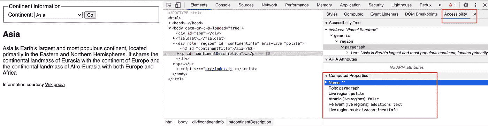
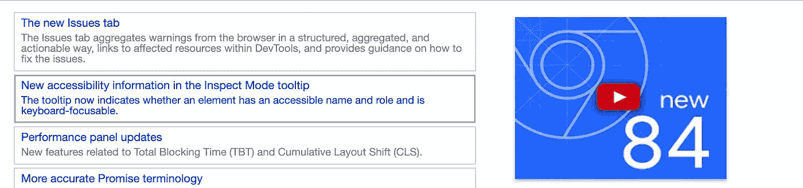
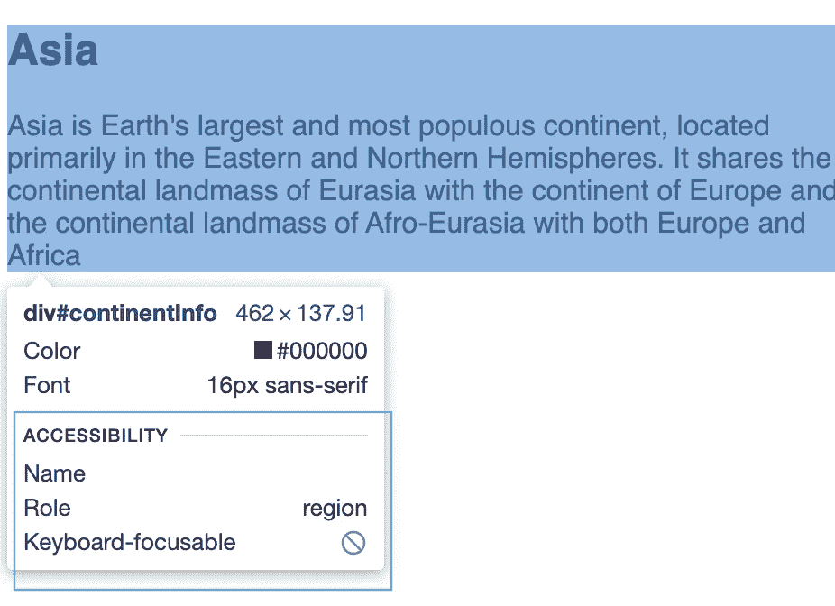
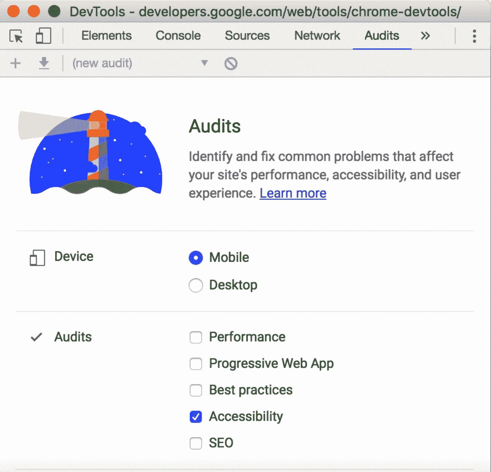

# 网页可访问性(A11y): WAI-ARIA 属性

> 原文：<https://levelup.gitconnected.com/web-accessibility-a11y-wai-aria-attributes-53d54da8627e>

# 介绍

在[之前的故事](https://medium.com/@harshkurra21/web-accessibility-a11y-right-to-web-content-equality-951bfd2ebdfb?sk=ba953c8f0c32329640bdbdc980d25cc7)中，我们了解了网页可访问性的重要性，以及我们如何使用标准的 HTML、CSS 和 JS 来实现这一点。我们已经了解到 **WAI-ARIA** 定义了一组附加的 **HTML** 属性，这些属性可以应用于元素，以提供附加的语义，并提高辅助技术(使用 OS APIs)所缺乏的开放性。

从 HTML 的角度来看， **WAI-ARIA** 提供了适用于所有 HTML 元素的额外属性。关于 **WAI-ARIA**

在前面的故事中，我们还了解到，可访问性不仅仅指“带屏幕阅读器的盲人用户”，还包括视力正常的键盘用户、色盲/色弱用户、聋人/重听用户、有认知障碍的用户。然而，ARIA(几乎)完全是关于**如何确保网络内容被正确地传达给辅助技术**(屏幕阅读器、具有屏幕阅读能力的屏幕放大器等)

# **辅助技术**

帮助不同能力的人像普通用户一样使用 web/其他应用程序的软件或应用程序是辅助技术。

*   口
*   ZoomText
*   NVDA(免费)
*   画外音(免费)
*   对讲(免费)
*   ChromeVox 扩展

所有这些工具和应用程序的可访问性都依赖于特定于操作系统的 API，它们帮助不同能力的人像普通用户一样使用 web 应用程序

基于网络的辅助技术依赖于 **WAI-ARIA** 属性和语义正确的 HTML 元素来为不同能力的人无缝工作，基本上，它们充当 b/w 操作系统可访问性 API 和 **WAI-ARIA** 属性指令的桥梁。

# WAI-ARIA 类别

规范中为这些 WAI-ARIA 属性定义了三个主要特性/类别:

*   **角色:**它定义了一个元素是什么或者做什么。它只提供了一个属性，即**角色**，如`role="banner"`、`role="search"`、`role="tabgroup"`、`role="tab"`角色的完整列表，请访问 [MDN 参考这里的](https://developer.mozilla.org/en-US/docs/Web/Accessibility/ARIA/ARIA_Techniques)。每个角色还有不同的 **WAI-ARIA 属性**适用于特定的角色，例如`aria-pressed` wai-aria 属性将在您在元素上指定`button`角色时可用。(角色分为**抽象角色、小部件角色、文档结构角色、地标角色、活动区域角色、窗口角色。**请在上述 MDN 参考中找到他们的详细信息)

*   **属性:**这些定义了元素的属性，可以用来赋予它们额外的意义或者语义。作为一个例子，`aria-required="true"`指定一个输入表单需要被填充才有效。

*   **状态:**定义元素当前条件的特殊属性，如`aria-disabled="true"`

# 什么时候应该使用 WAI-ARIA？

我们在[之前的故事](https://medium.com/@harshkurra21/web-accessibility-a11y-right-to-web-content-equality-951bfd2ebdfb?sk=ba953c8f0c32329640bdbdc980d25cc7)中讨论了促使 **WAI-ARIA** 更早被创建的自定义按钮问题

使用 div 标签实现假按钮

基本上，WAI-ARIA 在四个主要领域是有用的:

*   **界标:**使用角色属性指定网页**上的界标/部分，例如，指定 ***搜索*** *角色*来搜索部分，如上所述**
*   **live-updates:** 静态文本可以很容易地被 screenreader 访问，但是现代的网页动态地加载大部分内容，并且 ***aria-live*** 属性帮助我们指定区域的可访问性，该区域的内容将使用 web APIs 动态地加载到 DOM 中。将此属性应用于元素会导致屏幕阅读器读出更新的内容，读出内容的紧急程度取决于属性值:
*   `polite`:只有当用户空闲时才应该通知更新。
*   `assertive`:更新应该尽快通知用户。
*   `off:`默认。不应公布更新。

下面是理解 aria-live 如何帮助屏幕阅读器读取动态可用内容的示例代码。

解释使用 aria-live 属性的好处的示例

以上代码片段的完整工作代码可以在 code-sandbox 中找到

您可以看到 aria-live 将如何帮助 voiceOver 阅读动态内容

**键盘可访问性:**正如本文其他几个地方所讨论的， **HTML** 在可访问性方面的主要优势之一是内置的键盘可访问性( **tabbable** )，对于像按钮这样的元素，但对于复杂的控件，这在默认情况下是不可用的，但为了使它们可以通过键盘访问(特别是使用 tab 键在控件之间移动)，WAI-ARIA 用一些新值扩展了`tabindex`属性:

*   `tabindex="-1"` —这允许通常不可制表的元素以编程方式接收焦点，例如通过 JavaScript，或者作为链接的目标。
    **非语义控件**
*   `tabindex="0"` —该值允许通常**不可制表**的元素变为**可制表**。这是`tabindex`最有用的价值。

# 艾瑞亚不做的是…

ARIA 不是魔法:它只是改变了 T21 辅助技术解读内容的方式。具体来说，**咏叹调没有**:

*   使元素可聚焦
*   提供适当的键盘绑定
*   改变浏览器行为
*   自动维护/更新属性
*   更改可见外观

所有这些仍然是你的责任…

> 没有咏叹调比糟糕的咏叹调更好

*   ARIA 角色/属性是对用户/辅助技术的“承诺”(例如，“这个组件实际上是一个按钮……”)——您必须确保它的行为正确
*   如果你不确定如何表示一个特定的复杂部件或控件，不要在你的标记中加入 ARIA 角色和属性——对于辅助技术用户来说，你很可能会使事情变得更糟/更混乱/不起作用

## 流行/重要 ARIA 属性列表

*   aria-必需的
*   作用
*   咏叹调标签
*   [咏叹调——由](https://www.w3.org/TR/wai-aria-1.1/#aria-labelledby)标注
*   [咏叹调-禁用](https://www.w3.org/TR/wai-aria-1.1/#aria-disabled)
*   [咏叹调选择](https://www.w3.org/TR/wai-aria-1.1/#aria-selected):标签选择
*   隐藏的咏叹调
*   艾瑞亚-检查过了
*   咏叹调-扩展
*   aria-setsize
*   aria-posinset

所有属性和基于状态的 ARIA 属性的完整列表可以在[这里](https://www.w3.org/TR/wai-aria-1.1/#state_prop_def)找到

# 工具

有很多工具可以用来测试 web 应用程序或网站的可访问性。W3.org 在这里列出了所有的[可访问性评估工具](https://www.w3.org/WAI/ER/tools/)，我没有全部尝试过，但是检查了其中的一些，也发现其中一些已经过时了。
我亲自使用

*   [ChromeVox 经典扩展](https://chrome.google.com/webstore/detail/chromevox-classic-extensi/kgejglhpjiefppelpmljglcjbhoiplfn?hl=en)测试我的应用程序基于屏幕阅读器的可访问性
*   默认情况下，mac 上的 VoiceOver 屏幕阅读器可用
*   还使用 [a11y-checker](https://github.com/Muhnad/a11y-checker) 开源自动化工具来测试 HTML 标记中的可访问性问题。我发现这在 w3.org 上市。这很好，支持所有现代的前端框架，如 React T10。
*   从 VSCode 开始，所有主要文本编辑器都有可用的扩展和插件(到目前为止，我还没有尝试过)
*   所有主流浏览器都支持可访问选项卡/窗格来查看**可访问性树**、 **ARIA 属性**和**DOM 节点的计算可访问性属性**。

Chrome 辅助功能窗格的屏幕截图

*   从 Chrome V84 开始，元素的可访问性信息也作为工具提示出现在 inspect 模式下的悬停元素上

*   使用 Chrome 审计面板来确定页面是否为屏幕阅读器正确标记。( [Chrome 无障碍测试参考](https://developers.google.com/web/tools/chrome-devtools/accessibility/reference))

*   其他人也将斧子或 T21 的 pa11y 整合到他们的构建步骤中

如果你有更好的工具或工具链，你可以在评论区分享。

# 可访问性树

[可访问性树](https://developers.google.com/web/fundamentals/accessibility/semantics-builtin/the-accessibility-tree)是 DOM 树的子集。它只包含 DOM 树中与在屏幕阅读器或辅助技术中显示页面内容相关且有用的元素。

# 结论

和前面的故事一样，这个故事是基于我从互联网上的不同资源(主要是 MDN)中学习的经验。

在这个故事中，我尽力提供了 WAI-ARIA 属性的使用细节，以及它们如何帮助基于辅助技术的应用程序(如屏幕阅读器)为不同能力的人提供 web 内容可访问性。

在某些部分，我提供了 MDN 资源的详细参考，我更愿意浏览它们。在此之前，我将尝试提供一个详细的案例研究“在 Calendar & ProgressBar 这样的复杂小部件中启用 Asseccabilty ”!别忘了在评论区提供反馈。

**编码快乐！**