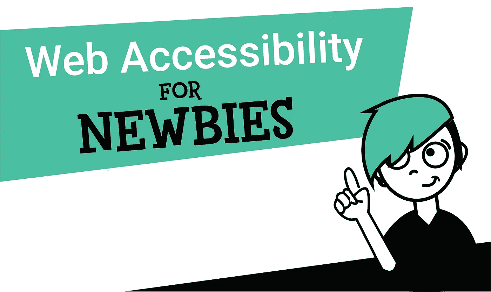
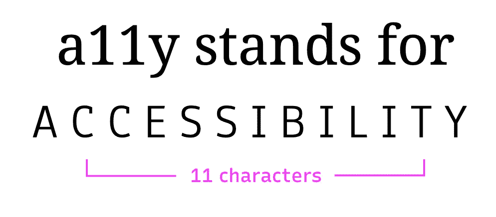
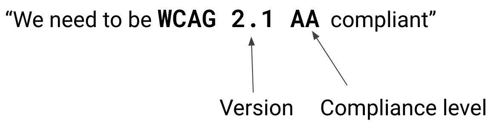

# 新手的网页可访问性

> 原文：<https://levelup.gitconnected.com/web-accessibility-for-newbies-1098fa15f9f0>

## 关于如何考虑和实现网页可访问性的介绍性信息和建议

不喜欢阅读，宁愿看演示文稿？[观看本文视频改编。](https://www.youtube.com/watch?v=X_LNmMz3ufQ)

在当前无处不在的计算世界和全行业改善公司和产品多样性和包容性的愿望中，不再有不投资于网页可访问性的借口。也就是说，开始网页可访问性可能是一项艰巨的任务。很难知道从哪里开始，你现在可以做些什么来改进你的产品！

当我刚开始的时候，我非常困惑，感觉自己一直在谷歌上搜索定义。幸运的是，我有一个非常博学的同事，他毫不留情地回答了我的许多问题。现在，如果你允许的话，我想成为*你的*同事，给你一个全面的关于网页可访问性的介绍。

如果你从事产品工作，想要支持网页可访问性，但是不知道从哪里开始，这是给你的指南！

 [## 你或者你的领导不相信你应该关心网页可访问性吗？

### 请继续阅读，了解为什么无障碍不仅仅是一种时尚，而是对商业有益的一些原因！

uxdesign.cc](https://uxdesign.cc/why-should-i-care-about-web-accessibility-a-guide-to-convincing-management-to-care-d8cc372c12fa) 

# 什么是网页可访问性？

无障碍意味着网站、工具和技术的设计和开发是为了让残疾人能够使用它们。我们说它应该是可感知的、可操作的、可理解的和健壮的。我们稍后将更深入地讨论这一切的含义！

## 什么是 a11y？

单词**a**accessibilit**y**中的 **a** 和 **y** 之间有 11 个字母，所以人们开始将其缩写为 a11y。它有一个额外的好处，看起来像单词 ally，所以人们有时也这样使用它。大多数时候，我听到人们大声说出“a-eleven-y”，但在这一点上，你还不如说“accessibility”！

来源:[A11Y 项目](https://www.a11yproject.com/)

## 谁来定义什么是可访问的，什么是不可访问的？

在衡量你的网络产品的可访问性时，[网络内容可访问性指南](https://www.w3.org/WAI/standards-guidelines/wcag/) (WCAG)是你的北极星。该指南是由万维网联盟(W3C)创建的，该组织定义了我们所有的网络标准，包括交互性、国际化、安全性、移动计算等等。这些是我们所有的网络浏览器都遵循的国际标准。

如果你收到一个 ADA 的诉讼，它通常会引用你的网站不符合 WCAG 作为缺乏可访问性的客观证据。

## 我们如何衡量可访问性？

正如随着医疗保健行业和互联网的发展，HIPAA 合规性是一个不断变化的标准一样，WCAG 合规性也是不断发展的，并不局限于一个小的一劳永逸的 todo 列表。一个团队不能在一个公司“解决”可访问性；相反，他们必须承诺不断解决这个问题。

> 一个团队不能在一个公司“解决”可访问性；相反，他们必须承诺不断解决这个问题。

最新的 WCAG 标准(2021 年撰写本文时)是 WCAG 2.1。WCAG 用三个一致性级别来衡量，从 A(最低)、AA 到 AAA(最高)。要衡量您的网站的可访问性，您需要衡量它与这些 WCAG 级别的符合程度。

你应该这样用一句话来表达你希望达到的合规水平。

例如，[对于基于时间的媒体](https://www.w3.org/TR/WCAG21/#time-based-media)，以下是合规性级别之间差异的一些示例:

*   A —“最低限度的合规性”—为**预先录制的**视频/音频提供字幕，为预先录制的视频/音频提供替代方案(如转录)
*   AA —“可接受的合规性”—在**直播**视频/音频的*和*字幕中的一切，在预先录制的视频中提供额外的叙述
*   AAA —“最佳合规性”—AA 中的一切内容*和*视频手语翻译，在预先录制的视频暂停期间提供更详细的叙述，现场转录

当制定可访问性目标时，明智的做法是定义您希望达到的遵从性级别，这样项目中的每个人都可以朝着同一个目标努力。

如果你不知道该遵从哪个级别，那么 **WCAG 2.1 AA** 遵从被认为是可接受的，并且将涵盖绝大多数用例。

# 人们会如何尝试与我的网站互动？

当设计你的网络产品时，你可能总是想象一个有键盘和鼠标的人。然而，不同类型的残疾禁止人们以这种传统方式与你的产品互动。

## 残疾有哪些不同的类型？

最常见的残疾是视觉残疾，但还有许多其他类别，在使您的产品具有辅助功能时，您应该考虑所有这些类别:

*   **视觉—** 失明、色盲、低视力、青光眼
*   **听力—** 耳聋，听力困难
*   **电机—** 有限精细电机控制
*   **认知—** 难以集中注意力，学习障碍
*   **癫痫发作**

## 人们可以用什么工具上网？

不同类型的残疾决定了您访问网站和与网站互动的方式。以下是一些流行的方式:

*   **键盘** 有些人不用鼠标，只用键盘。这在不能操作鼠标所需的精细动作的运动障碍患者中很常见。
*   **屏幕阅读器** 阅读屏幕内容的辅助技术，最常用于盲人或弱视人群。通常只用键盘操作。
*   **浏览器缩放**(理想情况下支持高达 200%)
    视力低下的人可以使用浏览器中的缩放功能来更好地阅读文本和查看图像。
*   [**自定义样式**](https://webaim.org/techniques/css/)弱视或色盲的人可能有自己的自定义样式表来调整字体大小和颜色等样式
*   [**可刷新盲文显示器**](https://www.afb.org/node/16207/refreshable-braille-displays)
*   [**放大软件**](https://abilitynet.org.uk/factsheets/screen-magnification)
*   其他的

## 在测试我的 web 产品时，我应该如何考虑这些？

当您评估网站的可访问性时，您可以先问自己几个问题:

*   我能用键盘做鼠标能做的所有事情吗？这既影响只使用键盘的用户，也影响屏幕阅读器用户。用户应该能够访问每个链接，打开和操作模式，打开和关闭下拉菜单，一切！
*   屏幕阅读器给了我所有相关的信息吗？如果你能直观地看到你的产品，有很多信息是你认为理所当然的。屏幕阅读器用户应该能够操作你的网站，理解图片描述的是什么，模态是打开的还是关闭的，切换是打开的还是关闭的——所有复杂的状态、角色或非视觉信息都应该是可以理解和发现的。
*   **当我们将浏览器缩放比例设置为 200%时会发生什么？随着浏览器缩放比例的增加，你会惊讶地发现有多少网站崩溃了！用户应该能够找到他们所需要的一切，并且仍然可以通过 200%的浏览器缩放来浏览你的网站。**
*   人们能读懂我的文字吗？
    阅读文本有很多因素，从字体的粗细到文本的颜色。至于低挂水果去，网络目标有一个伟大的[颜色对比检查](https://webaim.org/resources/contrastchecker/)，使前景和背景检查非常容易。趣味练习:你能使用那个工具来找出这篇文章的封面照片是否可读吗？

## 我如何学习如何使用屏幕阅读器？

许多人看到“可访问性”就立刻把它等同于“屏幕阅读器的使用”。事实是，你实际上不需要学习如何使用屏幕阅读器来使你的产品具有可访问性。WCAG 指南足够详细，你可以简单地遵循它们，并使用键盘导航来测试大多数东西。而且，正如我们在上面了解到的，除了使用屏幕阅读器，用户还有很多方式可以使用你的网站。

也就是说，我个人认为学习如何使用屏幕阅读器是有帮助的，因为它可以帮助培养你对使用它们的用户所经历的事情的同情心，并且它可以帮助识别不良的产品流。这些指南可以教你如何正确标记 HTML，并就如何在设计中考虑可访问性给出了很好的建议，但没有什么比听到你的内容以无意义的顺序大声朗读更能真正说明你的产品有多混乱了。为此，我建议人们至少尝试学习基础知识。

网上有很多简洁的工具可以教你基本的屏幕阅读器熟练程度。我推荐这本 [Codecademy](https://www.codecademy.com/articles/how-to-setup-screen-reader) 关于第一次启动屏幕阅读器的指南。根据你使用的屏幕阅读器，每一个都有单独的指南。Mac OSX 的[画外音](https://www.apple.com/voiceover/info/guide/_1121.html)有很多文档，还有这个很好的[命令词汇表](https://dequeuniversity.com/screenreaders/voiceover-keyboard-shortcuts)很有帮助。 [JAWS](https://www.freedomscientific.com/products/software/jaws/) 是一款非常受欢迎的 Windows 操作系统，也有一个漂亮的[命令清单](https://support.freedomscientific.com/Content/Documents/Manuals/JAWS/Keystrokes.pdf)。

一旦你掌握了一些技巧，你就可以在这个有趣的[屏幕阅读器练习小故障](https://screenreader-practice.glitch.me/#)上练习你的东西。

# 网站应该是 P.O.U.R

让我们回到最初的陈述。根据 WCAG，每个产品都应该遵守四个可及性原则:

1.  **可感知的** —信息需要至少能被一种感官(视觉、听觉、触觉)获得
2.  **可操作** —用户必须能够执行所有的界面动作(例如，使用键盘)
3.  可理解的——用户应该理解页面上的语言以及如何操作它
4.  **健壮** —不同的用户代理，包括辅助技术，内容应该能够访问所有内容

无障碍倡导者的最高目标是为所有类型的残疾和输入设备实现所有这四个目标。如前所述，有许多类型的残疾和更多的输入设备正在不断被发明，所以这是一个终身的使命，而不是一个单一的目标。

我希望你不要被网页可访问性的世界吓倒。我要感谢詹娜·李，是她教会了我几乎所有的知识。

请继续关注未来关于如何将可访问性工作整合到产品生命周期中的文章，以及关于在代码库中做什么的更具可操作性的指导。我祝你好运，并感谢你有兴趣成为无障碍倡导者！

## 额外资源

想要了解更多信息吗？这里有一些很好的资源:

*   [谷歌的 a11y 视频](https://www.youtube.com/playlist?list=PL7Bjl0Cb4SboBHNihVBRd-AdctfXcmClc)，一系列来自谷歌网站开发团队的 a11y 基础教学视频
*   [WCAG 2.1 准则](https://www.w3.org/TR/WCAG21/)，实际准则在肉体上
*   [WebAIM](https://webaim.org/) ，大量 a11y 信息，甚至认证培训
*   [ANDI](https://www.ssa.gov/accessibility/andi/help/install.html) ，一个在你的网页上运行的自动化可访问性测试工具
*   灯塔，一个搜索引擎优化、可访问性和性能的自动化工具
*   [WebAIM 的色彩对比检查器](https://webaim.org/resources/contrastchecker/)，查看你的文本是否可读
*   [A11y 项目](https://www.a11yproject.com/)，围绕无障碍设计的教育
*   [Mozilla 的 a11y 文档](https://developer.mozilla.org/en-US/docs/Web/Accessibility)，易于理解的 a11y 文档

作为一个无障碍新手，我错过了你想知道的任何事情吗？请在评论中告诉我！

 [## 喜欢这篇文章？考虑给我买杯茶吧！

### 我过去常常把我的文章放在中等收费的墙后面，但当谈到教育时，我完全关注可访问性，所以现在它们都是免费的。如果你觉得你从这篇文章中得到了一些东西，并且有一些闲钱，请考虑给我买杯茶来表示你的支持！🫖

www.buymeacoffee.com](https://www.buymeacoffee.com/karomancer)