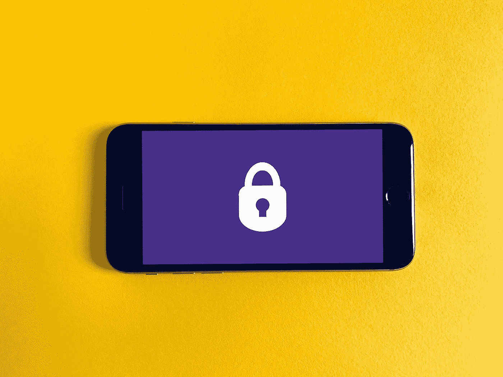

# Web API 最佳实践

> 原文：<https://levelup.gitconnected.com/web-api-best-practices-9e37162c70c8>

克里斯托夫·高尔在 [Unsplash](https://unsplash.com/s/photos/laptop-code?utm_source=unsplash&utm_medium=referral&utm_content=creditCopyText) 上拍摄的照片

如今，拥有一个可靠的 API 是成功的关键。API 不仅与连接外部系统相关，它们也是内部系统软件架构的关键(例如，如果你决定使用[微服务](https://en.wikipedia.org/wiki/Microservices))。
在这篇文章中，我想重点介绍 Web API 最佳实践的三个关键方面:

*   版本控制
*   证明
*   错误处理

我努力保持 it 平台/技术的独立性。如果您正在寻找可能技术的概述，请查看以下内容:

*   [REST API](https://docs.microsoft.com/en-us/aspnet/core/tutorials/first-web-api?view=aspnetcore-5.0&tabs=visual-studio)
*   [GraphQL API](https://github.com/graphql-dotnet/graphql-dotnet)

# 版本控制

您的 API 将是另一个应用程序的一部分，另一个应用程序让它成为外部应用程序，或者您的某个项目在某种程度上依赖于您的 API。
像任何依赖关系一样，消费应用程序应该能够定义一个测试版本。
这是否意味着您不能更新您的 API，并且需要通知所有客户并就所有变更达成一致？当然，你可以这样做，或者在你的 API 中增加一个版本控制的概念。
根据您最终的 API 技术，您可以选择不同的归档方式，以下链接将为您提供大量内容:

*   [REST API 版本控制。网络](https://github.com/microsoft/api-guidelines/blob/vNext/Guidelines.md#12-versioning#)
*   [微软 Web API 实施指南](https://docs.microsoft.com/en-us/azure/architecture/best-practices/api-implementation)

如果您使用的是 [GraphQL](https://graphql.org/learn/) ，那么您并不像上面的链接那样直接需要版本控制。你应该[尽量避免破坏性的改变](https://graphql.org/learn/best-practices/#versioning)(比如删除一个字段)并在顶部添加新的东西。

照片由[弗兰克](https://unsplash.com/@franckinjapan?utm_source=unsplash&utm_medium=referral&utm_content=creditCopyText)在 [Unsplash](https://unsplash.com/s/photos/phone-yellow-lock?utm_source=unsplash&utm_medium=referral&utm_content=creditCopyText) 上拍摄

# 证明

你发布的任何软件都必须考虑安全问题，对于一个好的 API 概念来说也是如此。
虽然我想从总体上谈论身份验证，但也要考虑到这样一个事实，即您必须[处理潜在的长时间运行的批量请求](https://docs.microsoft.com/en-us/azure/architecture/best-practices/api-implementation#handling-large-requests-and-responses)，这可能会导致应用程序无响应。
身份验证的经验法则是不要自己构建东西，采用久经考验的市场标准库(基本的 HTTP 身份验证不应该是您的答案)。

# JWT

JSON Web Token 于 2010 年首次发布(经过了实战检验)。核心概念包含带有可选签名和/或可选加密的基于声明的 JSON 结构。签名可以用公钥/私钥进行。许多框架将支持 JWT 开箱即用，前往 [JWT 文档了解更多](https://jwt.io/introduction)

# OAuth2

OAuth 是访问授权的开放标准(如 JWT)。Simple 表示，您的用户通过第三方验证了您的身份。他们永远不会向你透露密码。眼下，[各大平台都提供 OAuth2 认证](https://oauth.net/code/)。

# 安全声明标记语言（Security Assertion Markup Language 的缩写）

像上面两个一样，安全断言标记语言也是一个开放标准。SAML 允许单点登录，并且基于基于 XML 的消息协议。像 OAuth2 一样，您必须与身份验证提供者打交道。

# 我的 5 美分

从我个人的经验来看，如果你有一个简单的服务器到服务器或客户端到服务器的设置，我会推荐使用 JWT。如果您的 API 涉及多个端点和设备，OAuth2 将为您提供更好的服务，提供对知名(可信)认证提供商的访问，如 Google、Microsoft 或 Apple。

[西格蒙德](https://unsplash.com/@sigmund?utm_source=unsplash&utm_medium=referral&utm_content=creditCopyText)在 [Unsplash](https://unsplash.com/s/photos/game-over-pixel?utm_source=unsplash&utm_medium=referral&utm_content=creditCopyText) 上拍照

# 错误处理

每个应用程序都会遇到错误，在 API 上甚至可能是调用者的错误。拥有一个可靠的错误处理和通信模型将使您的 API 和依赖产品更加健壮。像身份验证一样，依赖市场标准不要创建定制的解决方案向客户传达错误。一个好的错误响应应该总是包含:

# HTTP 状态代码

(当然，这取决于你的技术水平)
让呼叫者快速查看请求是否成功。

# 内部参考 ID

这将帮助您记录您的自定义错误场景，并确保错误处理配得上处理这个术语。沟通和记录是关键，在结束语中会有更多的介绍。

# 人类可读的信息

开发人员也是人，有一个人可读的信息，其中包含背景、原因和可能的解决方案或文档链接的摘要，可以拯救别人的一天。

照片由[戴恩·托普金](https://unsplash.com/@dtopkin1?utm_source=unsplash&utm_medium=referral&utm_content=creditCopyText)在 [Unsplash](https://unsplash.com/s/photos/start?utm_source=unsplash&utm_medium=referral&utm_content=creditCopyText) 拍摄

# 摘要

创建一个好的 API 不是一件容易的事情，你必须考虑正确的技术、认证和请求处理。最重要的是，你需要记录你的工作，并向每个应该使用你的 API 的人提供例子和细节。
有一个工具可以帮你完成部分工作，它是开源的，甚至提供了一种为你的 API 自动生成客户端代码的方法，那就是 [Swagger](https://swagger.io/) 。
旋转一下，实现你的 API 梦想。