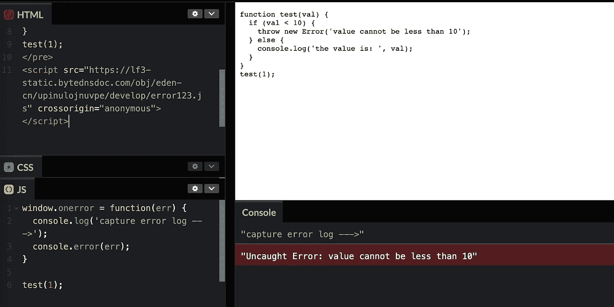

# Web 应用程序页面崩溃，但未报告异常

> 原文：<https://levelup.gitconnected.com/web-app-page-crashed-but-no-exception-was-reported-f9fa14c294b7>

## 未设置脚本标记的 crossorigin 属性，无法获取异常信息的详细信息。


# 介绍

一个新的模块被添加到 web 应用程序页面，只做了很小的改动。但上线后，有用户反映页面崩溃。经过长时间的调试，发现页面崩溃是因为数据格式不正确，导致了 JavaScript 的执行。

当事后回顾这个问题时，它影响了许多用户，但是监控系统没有相应的错误日志。这让我非常焦虑，我们无法确定 web app 页面是否正常工作。

# 为什么没有报告错误日志

项目中错误日志报告的流程步骤为:
1。捕捉 JavaScript 运行时异常
2。过滤无效的异常日志
3。上报异常日志
调试代码时发现可以捕获异常日志，但是过滤掉了。当日志内容为“脚本错误”时，它将被过滤。

一旦你知道了原因，解决问题就更容易了。发现[的哨兵](https://sentry.io/answers/script-error/)已经通过谷歌解决了:

> 这不是一个错误——出于安全原因，浏览器有意隐藏来自不同来源的脚本文件的错误。这是为了避免脚本无意中向不受其控制的 onerror 回调泄露潜在的敏感信息。出于这个原因，浏览器只让 window.onerror 了解来自同一个域的错误。我们只知道发生了一个错误—没有别的了！


脚本错误演示。

# 解决方案

如果引用的 Javascript 文件是 CDN 资源，为了获取异常日志的细节，只需要添加一个 crossorigin 属性。

```
<script src="example.js" crossorigin="anonymous"></script>
```



脚本增加了 crossorigin 属性，我们可以捕捉错误的细节。

如果您有一个静态服务器，您的服务器应该添加一个响应头

```
Access-Control-Allow-Origin: *
```

如果您使用 Webpack 来编译您的项目，您可以使用[script-ext-html-web pack-plugin](https://www.npmjs.com/package/script-ext-html-webpack-plugin)来添加 crossorigin 属性。

# 参考

1.  [什么是“脚本错误”？](https://sentry.io/answers/script-error/)
2.  [script-ext-html-web pack-plugin](https://www.npmjs.com/package/script-ext-html-webpack-plugin)
3.  [codepen . io 上的演示](https://codepen.io/bitbug/pen/WNzeyGb?editors=1011)

# 分级编码

感谢您成为我们社区的一员！更多内容见[级编码出版物](https://levelup.gitconnected.com/)。
跟随:[推特](https://twitter.com/gitconnected)，[领英](https://www.linkedin.com/company/gitconnected)，[通迅](https://newsletter.levelup.dev/)
**升一级正在改造理工大招聘➡️** [**加入我们的人才集体**](https://jobs.levelup.dev/talent/welcome?referral=true)