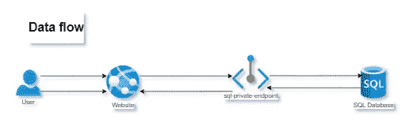
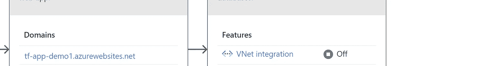
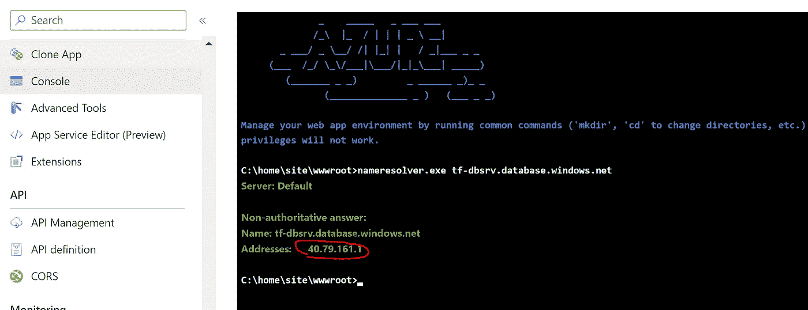
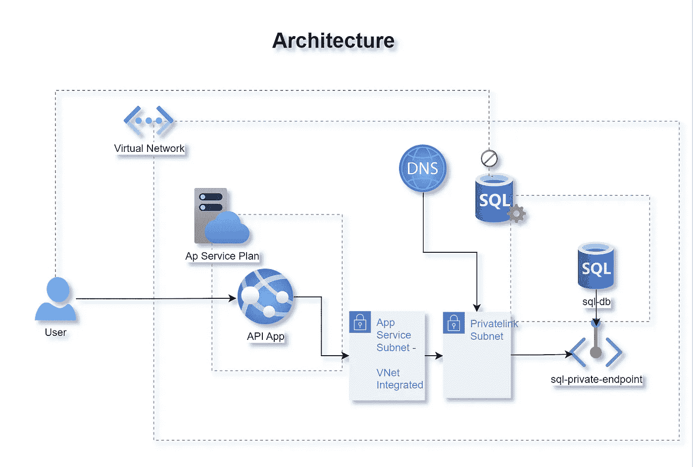
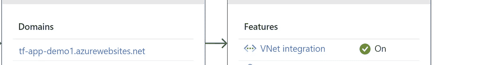
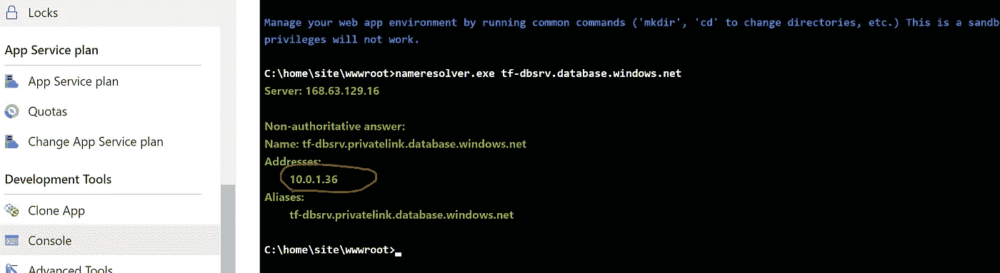
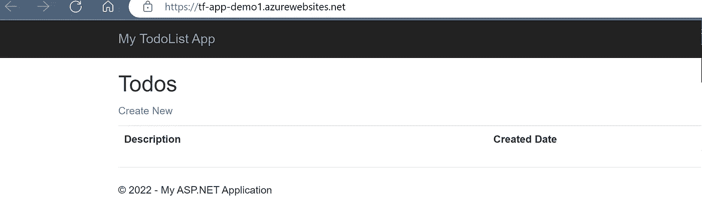

# Azure 私有链接—Azure 服务与 Terraform 之间的安全网络

> 原文：<https://levelup.gitconnected.com/web-app-private-connectivity-to-azure-sql-database-with-terraform-92f0a0f885fd>

如何在私有网络中使用私有端点将 Azure Web 应用连接到 SQL 数据库。


在 [Unsplash](https://unsplash.com?utm_source=medium&utm_medium=referral) 上由[猎人哈利](https://unsplash.com/@hnhmarketing?utm_source=medium&utm_medium=referral)拍摄的照片

让我们假设你有一个托管在 Linux/Windows Azure WebApp 上的 AspNetCore3.1 应用。一切都像魔咒一样管用。现在你需要做一些数据库交互，而数据库*没有公共访问*。因此，您创建了一个虚拟网络和子网，还在您的数据库上启用了私有端点、[托管身份](https://learn.microsoft.com/en-us/azure/active-directory/managed-identities-azure-resources/overview) (MI)或用于 web 应用程序访问数据库的 SQL auth，等等。但是，您在连接数据库时遇到错误:

> 由于“拒绝公共网络访问”设置为“是”，连接被拒绝([https://learn . Microsoft . com/azure/azure-SQL/database/connectivity-settings # Deny-Public-Network-Access](https://learn.microsoft.com/azure/azure-sql/database/connectivity-settings#deny-public-network-access))。若要连接到此服务器，请从虚拟网络内部使用专用端点

您已经创建了私有端点、身份、RBAC 角色等。，但还是。**这里少了什么？**

我们将尝试使用 Terraform 对此进行分类，但在深入研究之前，让我们记住一些要点。

A 假设

我希望你已经有了一个应用服务&一个 SQL 数据库，但是在私有网络中连接应用时会遇到问题。



应用程序数据流

希望你了解一些 Azure 和 Terraform，但是如果没有，我写了一篇关于这两者的简单文章，并在这里阅读了[基础设施作为 Terraform 的代码](https://medium.com/aws-tip/infrastructure-as-code-with-terraform-ba4a9a4d8373)

要记住的要点

**联网**

> 你可以为你的 Azure Web 应用使用私有端点，以允许位于你的私有网络中的客户端通过私有链接安全地访问应用

*   私有端点仅用于传入 Azure 资源的流量。
*   传出流不会使用这个私有端点，但是您可以通过 **VNet 集成**功能将传出流注入到不同子网中的网络。点击此处了解更多信息[为您的网络应用集成虚拟网络](https://learn.microsoft.com/en-us/azure/app-service/web-sites-integrate-with-vnet#regional-vnet-integration)
*   [**服务端点**](https://docs.microsoft.com/en-us/azure/virtual-network/virtual-network-service-endpoints-overview) 允许虚拟网络资源使用**私有 IP 地址** es 连接到 Azure 服务的**公共端点**
*   服务端点需要一个网络规则来允许 Azure 服务(例如:SQL server)和虚拟网络的子网之间的流量。
*   私有端点和服务端点使用微软的主干网络进行通信。
*   Linux 和 Windows 系统的应用程序设置会略有不同。
*   最重要的是，确保*私有 DNS 区域有一个到 VNet 的链接*，因为 Azure 不会自动添加这些链接。

解决方案

> 让我们深入研究我们的**错误**，它清楚地表明我们试图从应用程序通过公共网络访问 SQL Server。因此，我们需要限制 VNet 中 web 应用程序的传出流量，这样只有我们可以通过私有端点访问 SQL server。

让我们测试一下 web 应用程序是否可以连接到 SQL server，为了测试这一点，Azure Portal 本身有一个很好的方法。在应用服务→控制台中使用命令`nameresolver.exe <server-name>.database.windows.net`。执行后，SQL DNS 应该解析为私有 IP 地址，但这里不是！



DNS 解析到公共 IP

如果 DNS 解析到公共 IP 地址，某个地方就少了什么。

我们的解决方案将坚持下面的架构，它定义了服务应该如何相互通信。



Azure SQL 数据库的专用连接

> GitHub 资源库:你可以在这里查看这个项目的完整资源库

让我们试着解释一下架构中使用的每个术语。

**虚拟网络整合**

您需要在同一个 VNet 下的另一个新的**子网**中为您的 web 应用程序启用 [VNet 集成，在该子网中创建您的 SQL 私有端点(*但不是同一个子网，在该子网中托管您的私有端点*)。因此，只有您可以通过私有链接在私有网络中访问 Azure web app to SQL server。如果您有多个应用服务插槽，请启用相同的功能。](https://learn.microsoft.com/en-us/azure/app-service/web-sites-integrate-with-vnet#regional-vnet-integration)

```
resource "azurerm_app_service_virtual_network_swift_connection" "app" {
  app_service_id = azurerm_windows_web_app.app.id
  subnet_id      = var.subnet_id
}
```

**私有 DNS 区域**

下一步是为`"privatelink.database.windows.net"` 创建一个私有 DNS，并将其与您的 VNET 集成。还需要创建一个私有 DNS A 记录来解析您的 SQL Server 的私有 IP，这是在您创建 SQL 私有端点时分配的。

```
resource "azurerm_private_dns_zone" "private_dns_zone" {
  name                = "privatelink.database.windows.net"
  resource_group_name = var.resource_group_name

  tags = {
    environment = var.environment_tag
  }
}
```

**私有端点**

我们将为 SQL server & a DNS A 记录创建一个私有端点来解析 SQL fqdn &其私有 IP。

```
# Add a private endpoint for the SQL server database
resource "azurerm_private_endpoint" "private_endpoint_sqlserver" {
  name                = "demo-sqlserver-privatelink"
  location            = var.resource_location
  resource_group_name = var.resource_group_name
  subnet_id           = var.plink_subnet_id

  private_service_connection {
    name                           = "sqlconnection"
    private_connection_resource_id = azurerm_mssql_server.server.id
    subresource_names              = ["sqlServer"]
    is_manual_connection           = false
  }
}

# DNS A Record to resolve the Private DNS fqdn
resource "azurerm_private_dns_a_record" "dns_a_sql" {
  name                = azurerm_mssql_server.server.name
  zone_name           = "privatelink.database.windows.net"
  resource_group_name = var.resource_group_name
  ttl                 = 300
  records             =  azurerm_private_endpoint.private_endpoint_sqlserver.custom_dns_configs.0.ip_addresses
}
```

**DNS 区域链接**

创建一个 DNS 区域链接到 VNet，因为 Azure 不会自动添加这些。

```
resource "azurerm_private_dns_zone_virtual_network_link" "vnet_link" {
  name                  = "demo-vnet-link"
  resource_group_name   = var.resource_group_name
  private_dns_zone_name = "privatelink.database.windows.net"
  virtual_network_id    = azurerm_virtual_network.demo_vnet.id

  tags = {
    environment = var.environment_tag
  }

    depends_on = [
    azurerm_private_dns_zone.private_dns_zone
  ]
}
```

**SQL Server 认证**

有多种方法来验证 SQL 数据库和应用程序，这与您的网络连接不同。SQL Server Managed Identity 将帮助您实现更简洁的实现，并且需要一些额外的步骤来使您的 web 应用程序\数据库相互通信。这里不解释这些步骤，但是您可以参考下面的文章来为您的 web 应用程序配置 MI。

[教程:使用托管身份访问数据—Azure App Service | Microsoft Learn](https://learn.microsoft.com/en-us/azure/app-service/tutorial-connect-msi-sql-database?tabs=windowsclient%2Cef%2Cdotnet)

完成托管身份步骤后，您的 SQL 连接字符串将如下所示。

```
 connection_string {
    name  = "MyDbConnection"
    type  = "SQLAzure"
    value = "Data Source=tf-dbsrv.database.windows.net; Initial Catalog=tf-db; Authentication=Active Directory Managed Identity; Encrypt=True"
  }
```

> 在连接字符串中使用 SQL 数据库的常规主机名(例如，`*contoso.database.windows.net*`)，而不是特定于`*privatelink*`的主机名。

**应用部署**

一旦创建了基础设施，您就可以使用您的 [Visual Studio deploy](https://learn.microsoft.com/en-us/visualstudio/deployment/quickstart-deploy-aspnet-web-app?view=vs-2022&tabs=azure) 部署 [web 应用程序](https://github.com/rollendxavier/azure_privatelinks_demo/tree/master/api-src)

> 默认情况下，您的 **Linux** 应用将无法与 Azure DNS 私有区域配合使用，您需要添加以下应用设置:

```
WEBSITE_DNS_SERVER with value 168.63.129.16
WEBSITE_VNET_ROUTE_ALL with value 1
```

**测试**

由于我们启用了私有链接、私有 DNS 和 VNet 集成，如果我们尝试在应用服务→控制台中使用`nameresolver.exe <server-name>.database.windows.net`,我们的 SQL DNS 应该解析为私有 IP 地址&,而不是公共 IP。



DNS 解析为私有 IP

但是，如果 VNET 集成被关闭，DNS 将再次解析到一个公共 IP 地址。



您的 Web 应用:)

**结论**

我打算演示 Azure private links 如何与 Web & SQL Server 一起工作，并通过一个工作的 Web 应用程序和一个带有 Terraform 的 Azure 基础设施进行演示，欢迎任何建议和改进！快乐的云:)

**参考文献**

*   [Web 应用与 Azure SQL 数据库的私有连接](https://learn.microsoft.com/en-us/azure/architecture/example-scenario/private-web-app/private-web-app)
*   [使用私有端点私有连接到 Azure Web 应用](https://learn.microsoft.com/en-us/azure/app-service/networking/private-endpoint)
*   [教程:使用 Azure 私有端点连接到 Azure SQL server](https://learn.microsoft.com/en-us/azure/private-link/tutorial-private-endpoint-sql-portal)
*   [教程:带有 Azure SQL 数据库的 ASP.NET App—Azure App 服务](https://learn.microsoft.com/en-us/azure/app-service/app-service-web-tutorial-dotnet-sqldatabase)
*   [Azure 专用链接— Azure SQL 数据库和 Azure Synapse 分析](https://learn.microsoft.com/en-us/azure/azure-sql/database/private-endpoint-overview?view=azuresql)
*   [Azure 资源的托管身份](https://learn.microsoft.com/en-us/azure/active-directory/managed-identities-azure-resources/overview)
*   [教程:使用托管身份访问数据](https://learn.microsoft.com/en-us/azure/app-service/tutorial-connect-msi-sql-database?tabs=windowsclient%2Cef%2Cdotnet)

# 分级编码

感谢您成为我们社区的一员！在你离开之前:

*   👏为故事鼓掌，跟着作者走👉
*   📰查看更多内容请参见[升级编码刊物](https://levelup.gitconnected.com/?utm_source=pub&utm_medium=post)
*   💰免费编码面试课程[查看课程](https://skilled.dev/?utm_source=luc&utm_medium=article)
*   🔔关注我们:[Twitter](https://twitter.com/gitconnected)|[LinkedIn](https://www.linkedin.com/company/gitconnected)|[时事通讯](https://newsletter.levelup.dev)

🚀👉 [**加入升级达人集体，找到一份惊艳的工作**](https://jobs.levelup.dev/talent/welcome?referral=true)