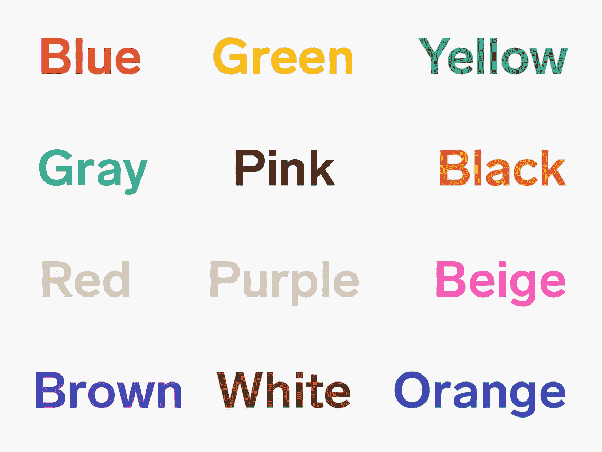
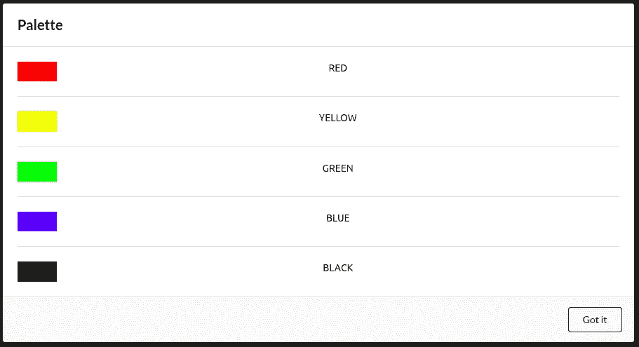
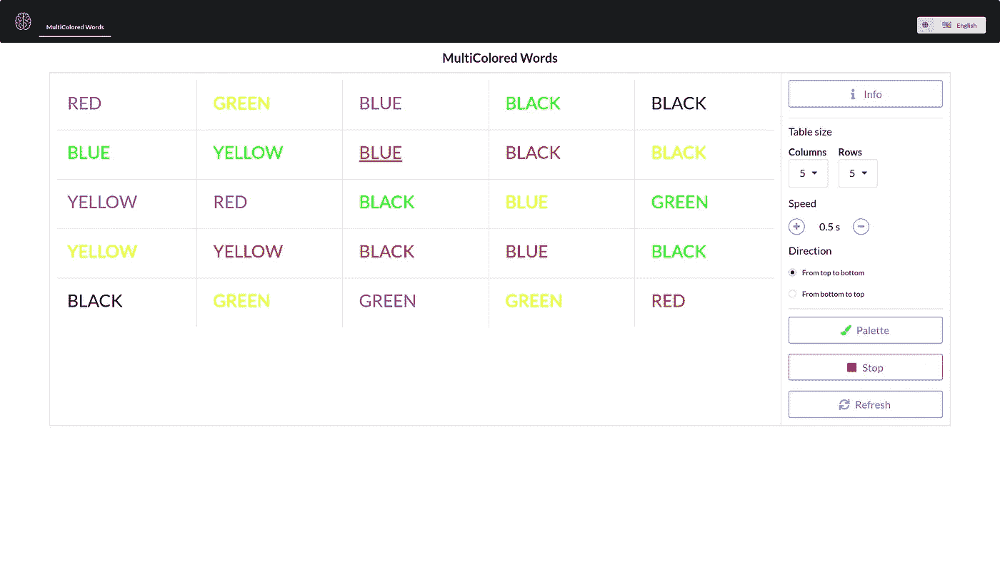
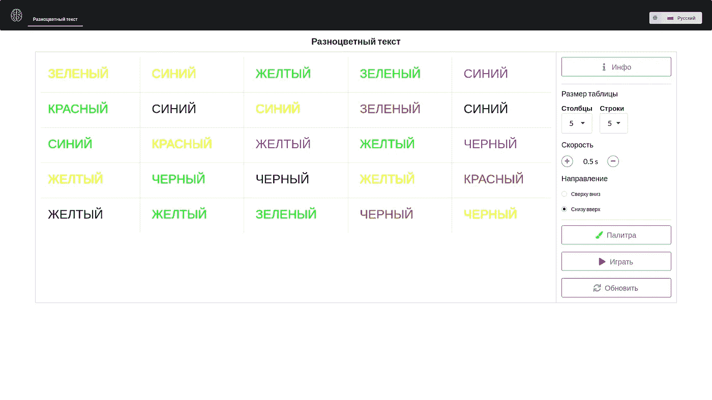

# 如何使用 React 创建用于大脑训练的 Web 应用程序？第一部分。

> 原文：<https://levelup.gitconnected.com/web-application-for-a-brain-training-23dc567f0315>

> 我很久以前就开始研究这个了。这是给我母亲的，但她没怎么用，她去年因新冠肺炎去世了。但是我仍然希望我的工作能对许多人有所帮助。

先引用联合国文件:

> 根据[世界人口前景:2019 年修订版](https://population.un.org/wpp/)的数据，到 2050 年，世界上六分之一的人将超过 65 岁(16%)，高于 2019 年的十一分之一(9%)。到 2050 年，生活在欧洲和北美的每四个人中就有一个人的年龄可能达到或超过 65 岁。2018 年，全球 65 岁及以上人口首次超过五岁以下儿童。80 岁或以上的人口数量预计将增加两倍，从 2019 年的 1 . 43 亿增至 2050 年的 4 . 26 亿。

这对我们意味着什么？我们必须准备活得更长，工作更努力(因为可用的人力会更少，所以国家会从工人身上榨取每一分钱，让经济保持浮动)，并更频繁地目睹精神衰退的人。不幸的是，最后一个问题等待着我们所有人，但我们仍然可以做很多事情，至少阻止它的发展——健康饮食，定期锻炼和大脑训练。大脑训练可以以游戏的形式进行。游戏 web 应用！这就是我们来这里的原因，不是吗？

让我们一步一步来，只实施一个练习。暂时如此。

来源:[https://gi phy . com/gifs/Koch strasse-hannover-agency life-agenturleben-lxn 6 uqrkziktujpanh](https://giphy.com/gifs/kochstrasse-hannover-agencylife-agenturleben-lxN6uqrkziktujpAnH)

# 文字和颜色的游戏

看下图。

[](https://www.insider.com/game-shows-words-in-different-colors-stroop-effect-it-2019-7)

单击以转到来源

现在试着读出单词的**颜色**，而不是单词本身。尽量快一点。任务不容易，是吧？你在这里看到的被称为 [Stroop 效应](https://en.wikipedia.org/wiki/Stroop_effect)。它主要用于各种测试和心理研究，但根据各种互联网来源，它也可以保持思维敏捷，减缓阿尔茨海默氏病的影响。无论如何，让我们用它创造一个游戏吧！

那么，让我们言归正传——我们将如何做？通过在主要思想上增加四个关键点:

1.  随意
2.  可配置性
3.  挑战
4.  相互作用的

所以，这将是一个可玩的可定制的表格，有随机的单词和颜色，你需要读出所选单词的颜色，它会随着时间的推移而变化。所有其他的都是华而不实的。代码时间到了！

我将用 typescript 和语义 UI React CSS 框架在 React 中编写这个项目。当然，您可以自由使用任何工具、语言和框架。

首先，创建项目

```
npx create-react-app brain-train --template typescript
```

如果你允许的话，我不会描述每一个用过的包，因为这会把已经很无聊的文本变成不可读的东西。您可以在资源库的 **package.json** 中查看所需包的列表。每个模块也是如此——[你可以在 GitHub](https://github.com/al3xsus/brain-train) 上看到完整的代码。

这是我的调色板:

```
const Palette = [
    {
        'name': 'red',
        'code': '#ff0000'
    },
    {
        'name': 'yellow',
        'code': '#FFFF00'
    },
    {
        'name': 'green',
        'code': '#00ff00'
    },
    {
        'name': 'blue',
        'code': '#0000FF'
    },
    {
        'name': 'black',
        'code': "#000000"
    }
]
```



调色板模式

我用钩子构建了一切，所以这是我的“状态”:

```
const [rowNum, setRowNum] = React.*useState*(4)
const [colNum, setColNum] = React.*useState*(4)
const [speed, setSpeed] = React.*useState*(0.5)
const [tableData, setTableData] = React.*useState*<any>(null)
const [direction, setDirection] = React.*useState*("start-to-end")
const [activeCell, setActiveCell] = React.*useState*<null | number>(null)
const [gameStatus, setGameStatus] = React.*useState*(false)
```

*rowNum 和 colNum 是表格的行和列，speed 是游戏速度，tableData 是随机生成的表格数据，direction 是游戏方向，activeCell 是当前活动的单元格，gameStatus 是播放/停止。我尽量让它保持明显，因为* [*接吻原则*](https://en.wikipedia.org/wiki/KISS_principle) *是必备的东西。*

我是这样为一个表生成随机数据的:

```
const prepareData = () => {
    let data: [number, number][][] = []
    let word = 0
    let color = 0
    for (let i = 0; i < rowNum; i++) {
        let row: [number, number][] = []
        for (let k = 0; k < colNum; k++) {
            word = Math.floor(Math.random() * Palette.length)
            color = Math.floor(Math.random() * Palette.length)
            row.push([word, color])
        }
        data.push(row)
    }
    return data
}
```

*多维数组，由行和列组成，里面的每个* ***单元格*** *由两个数字组成，一个代表颜色名称，一个代表颜色代码*

我是这样生成和填充表格的:

```
const generateTable = () => {
    if (tableData) {
        return tableData.map((row: [number, number][], rowIndex: number) => <Table.Row key={`tr-key-${rowIndex}`}>
            {row.map((cell: [number, number], index: number) => {
                return <Table.Cell key={`td-key-${rowIndex}-${index}`}>
                    <svg viewBox="0 0 100 20" style={{
                        width: "100%",
                        padding: "1vh 1vw",
                        fill: Palette[cell[1]].code
                    }}>
                        <text
                            x="0"
                            y="15"
                            id={`text-${rowIndex}-${index}`}
                        >
                            {t(`colors.${Palette[cell[0]].name}`).toUpperCase()}
                        </text>
                    </svg>
                </Table.Cell>
            })}
        </Table.Row>)
    }
    return null
}
...
<Table basic={"very"} size={"large"} celled={true}>
    <Table.Body>
        {generateTable()}
    </Table.Body>
</Table>
```

我们只是用调色板[y]填充列和行中的单元格。名称 SVG 文本画在调色板[x].代码。为什么是 SVG？因为这是将 [*文本放入*](https://css-tricks.com/fitting-text-to-a-container/) *容器的最简单方法。*

这是这个游戏的核心:

```
React.*useEffect*(() => {
    let interval: (any) = null
    if (gameStatus) {
        if (activeCell === null) {
            interval = *setInterval*(() => {
                if (direction === "start-to-end") {
                    setActiveCell(0)
                    underlineSVG(0, true)
                } else {
                    setActiveCell((rowNum * colNum) - 1)
                    underlineSVG((rowNum * colNum) - 1, true)
                }
            }, speed * 1000)
        } else {
            const cleanUp = () => {
                setActiveCell(null)
                setGameStatus(false)
                underlineSVG(activeCell, false)
            }
            if (direction === "start-to-end") {
                if (activeCell < (rowNum * colNum) - 1) {
                    interval = *setInterval*(() => {
                        setActiveCell(activeCell + 1)
                        underlineSVG(activeCell + 1, true)
                        underlineSVG(activeCell, false)
                    }, speed * 1000)
                } else {
                    cleanUp()
                }
            } else {
                if (activeCell >= 0) {
                    interval = *setInterval*(() => {
                        setActiveCell(activeCell - 1)
                        underlineSVG(activeCell - 1, true)
                        underlineSVG(activeCell, false)
                    }, speed * 1000)
                } else {
                    cleanUp()
                }
            }
        }
    } else if (!gameStatus && activeCell !== null) {
        *clearInterval*(interval);
    }
    return () => *clearInterval*(interval);
}, [gameStatus, activeCell]);
```

这是一个在 useEffect 钩子里面的定时器。如果游戏是活动的，我们将在表格中设置一个新的活动单元格，高亮显示它，并根据方向和设定的速度删除前一个的高亮显示。

这就是我操纵 SVG 的方式:

```
const underlineSVG = (address: number, highlight: boolean) => {
    let [row, col] = [0, 0]
    if (address !== 0) {
        row = Math.floor(address / colNum)
        col = address - (row * colNum)
    }
    let elem: null | HTMLElement = document.getElementById(`text-${row}-${col}`)
    if (elem) {
        if (highlight) {
            elem.setAttribute("style", "text-decoration: underline")
        } else {
            elem.setAttribute("style", "")
        }
    }
}
```

*我们将一维数字转换为多维数组地址，然后突出显示或删除文本中的突出显示。这整个方法比我们在动态创建的单元格中设置条件样式要快得多。或者，至少，我是这样认为的。*

这是它的样子:



英语五彩单词表



英语五彩单词表

我的应用程序还有更多的功能——简单的路由、信息模式、翻译等等。完整的代码可以在[这里](https://github.com/al3xsus/brain-train)找到。这里的工作示例是[和](https://al3xsus.github.io/brain-train/)。

这还不是一个成品，我会对它进行一点重构，并在未来添加新的游戏和练习。如果你想看就和我在一起！

来源:[https://giphy . com/gifs/阿诺德-施瓦辛格-终结者-genisys-the-YjfAfZyzEoOZi](https://giphy.com/gifs/arnold-schwarzenegger-terminator-genisys-the-YjfAfZyzEoOZi)

**好了，感谢你的阅读！请在评论中分享你的观点，并关注我。如果有不清楚的地方，不要害怕提问。**