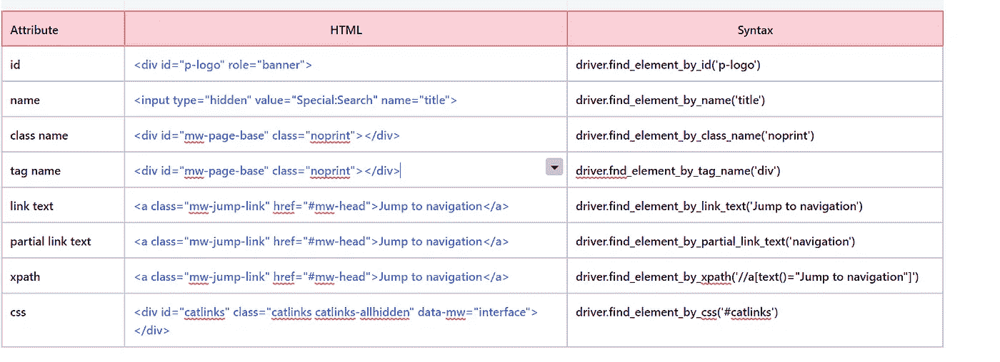
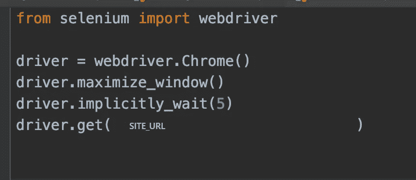

# Web 自动化？如果你掌握了基础知识，这很容易

> 原文：<https://levelup.gitconnected.com/web-automation-its-easy-if-you-get-the-basics-e35227247162>


与 Raj 在 [Unsplash](https://unsplash.com?utm_source=medium&utm_medium=referral) 的[公路旅行照片](https://unsplash.com/@roadtripwithraj?utm_source=medium&utm_medium=referral)

在本文中，我们将尝试理解 web 自动化的构建模块。让我们从一大类需要了解的事情开始:

1.  Selenium 支持的任何编程语言，在我的例子中是 Python。
2.  selenium web 驱动程序 API——有很好的文档记录。像任何图书馆一样，我们从这里寻找我们需要的东西并使用它们。
3.  框架开发——这包括结构化测试、抽象以简化测试脚本的编写、检测和运行测试、报告结果等。

在本文中，我们将深入讨论第二个 selenium web 驱动程序 API 的细节。

## WebDriver 的体系结构

selenium web 驱动程序基本上是一个与特定于浏览器的驱动程序对话的 API。这些驱动程序实际上向各自的浏览器发送命令。


## 装置

我提到了用于我的设置的版本，但任何兼容的版本都可以使用。

1.  安装 Python(版本 3.7)

`Download and run the installer from [https://www.python.org/downloads/](https://www.python.org/downloads/)`

2.安装 selenium 库(版本 3.141.0)

```
- Open Terminal
- Run the command : pip3 install selenium
- Run the command : pip3 freeze and verify that the library is installed.
```

3.从[https://chromedriver.chromium.org/downloads](https://chromedriver.chromium.org/downloads)安装 chrome 驱动程序。确保这与 Chrome 浏览器版本(版本 80.0.3987.162)匹配。在 path 环境变量中添加驱动程序的路径。

4.安装 PyCharm。这在这个阶段是可选的，因为我们可以从 IDE 中运行框架开发所需的所有 selenium 命令。

## 实例化 web 驱动程序

像 Chrome/IE/Firefox 这样的每个浏览器都有不同的行为，因为它们是功能相似的不同程序。因此，对于每个浏览器来说，都有一个单独的 WebDriver 类，使用不同的`__init__`方法进行初始化。


webdriver.py

在我们的代码中，当我们写:

```
driver = Webdriver.Chrome()
```

它实际上会从 chrome/webdriver.py 模块中调用`__init__`方法。

## 分类 webdriver API

本质上，selenium 库是关于与网页和不同的 web 元素进行交互的。我们可以将该库大致分为以下几组功能

*   导航—转到一个页面，向后或向前移动，等等
*   定位—通过唯一识别网页元素来获取网页元素。
*   更新—与定位的 web 元素进行交互。点击按钮、在文本框中输入文本、选择/清除字段等。
*   synchronize——想象一下，试图与页面上的一个元素交互，但它是不可交互的，这可能意味着几件事，我们将看到这些交互如何使用*等待来同步。*

## 航行

这是最简单的。转到一页，后退，前进，就这样。

## 确定…的位置，发现…的位置

> 在我们开始定位 web 元素之前，我们需要知道什么是 DOM？

HTML (HyperTextMarkupLanguage)是一种表示网页内容和格式的标记语言。DOM(文档对象模型)是一个独立于语言的 API，它将 HTML 文档视为一个树形结构，其中**的每个节点代表文档**中的一个对象。


DOM 表示允许外部程序访问和操作 web 页面上的元素，selenium webdriver 使用它与 web 元素进行交互。

DOM 元素的类型:

1.  文档:整个网页就是一个文档。
2.  元素:HTML 中的所有标签——包括打开标签和相应的关闭标签。
3.  文本:标签中的所有文本
4.  属性:特定 HTML 元素的属性。例如:类别/id 等。

Selenium 中有两种定位 web 元素的基本方法: *find_element* 和 *find_elements* 。两者都接受定位器策略的参数，后跟定位器策略的值，并分别返回 WebElement 类型的对象或 web 元素列表。find_element_by_* *形式的所有其他方法实际上是* *在内部调用 find_element 函数。*如果不匹配，则引发 NoSuchElementFound 异常。

```
**Tip**: to look at the method definition of Selenium functions from PyCharm, point cursor at the method name and do a CTRL+click. 
```

> 什么是定位器策略？它是 web 元素的一个属性，可以用来标识它。示例:对于雇员实体，我们可以使用雇员 id 作为唯一标识符。在没有唯一标识符的情况下，我们可以使用像姓名和部门这样的属性组合。类似地，web 元素可以有惟一的 id，在缺少惟一标识符的情况下，我们可以使用属性的组合来惟一地标识 web 元素。这些属性可以是 id、类、标记名、链接文本、部分链接文本、XPath 或 CSS。

## locate-find _ element _ by _ *方法的示例



查找元素依据*方法

```
**Note**: All these methods have a corresponding *find_elements_by_** method as well. These methods return a list of matched web elements or an empty list if no match is found.
```

## **定位—选择定位器策略**

*   如果元素具有唯一的属性，请使用 find_element_by_*方法及其相应的属性。例如:如果 id 是唯一标识符，那么使用 find_element_by_id 方法。
*   如果没有唯一的属性，那么使用紧凑的 CSS 选择器。
*   标签名称会有多个匹配项，因此不建议使用。
*   搜索 DOM 代价很高，所以为了减少时间，选择紧凑的 xpaths，这在很大程度上缩小了搜索范围。

## **定位—理解 find_element 方法语法**

这是 find_element 方法的签名:


find_element 方法签名

这就是我们在脚本中调用 find_element 方法的方式

```
input_username = driver.find_element(By.ID, 'userSignInFormEmail')
```

> 这是什么意思？我指的是？它只是字符串“id”。如果我们查看 By 类，我们可以看到它将定位器策略作为类的属性，因此可以使用 class_name.attribute 语法轻松访问它们。


按类

我们也可以像下面这样写上面的语句，但是我们使用 By.attribute，因为这是推荐的方法。

```
input_username = driver.find_element(id, 'userSignInFormEm
```

让我们简单看看如何使用 CSS 后跟 Xpaths 来标识元素。

**定位— CSS/级联样式表**

这是一种控制网页如何显示/呈现的语言。CSS 规则是一组与选择器相关联的属性。利用这一点，网页的不同部分可以被格式化成节。网站有几个 CSS 规则。

CSS 规则的示例:

```
/* The selector "p" indicates that all paragraphs in the document will be affected by that rule */
p {
  /* The "color" property defines the text color, in this case yellow. */
  color: yellow;

  /* The "background-color" property defines the background color, in this case black. */
  background-color: black
}
```

我们只需要知道 CSS 选择器，而不是规则。

在开始 CSS 选择器之前，让我们看一个样本 HTML 并澄清一些术语。


元素和属性

## Locate —简单 CSS 选择器的示例


简单的 CSS 选择器

## 定位—带属性的选择器示例


具有属性的选择器

## 定位—组合子/定义元素间关系的示例

为此，我们将使用下面的 HTML 示例:


CSS 组合器的 HTML 示例


组合器 CSS 选择器

## **定位——第 n 个匹配的例子**


第 n 个匹配 CSS 选择器

## 定位 XPATH 定位器的示例

XPath/XML 路径语言可用于定位 XML 等分层结构中的元素。因为 DOM(文档对象模型)也是分层的，所以我们可以使用 xpaths 来定位 web 元素。

Xpaths 可以是绝对的，这意味着它将从 DOM 的根开始，也可以是相对的，这意味着它可以从 DOM 中的任何地方开始。

## **定位 XPath 的主要组件示例**


Xpath 组件


Xpath 组件续。

## **Locate—Xpath 定位器中的轴/关系示例**


XPath 轴

## 更新—与不同元素交互

现在我们知道了如何定位 web 元素，是时候看看如何与它们交互了。一大类 web 元素包括文本框、按钮、下拉列表、单选按钮和滚动条。


与 web 元素交互

## 同步—等待

想象一下，当她不在听的时候和一个人说话，无论说什么我们都不会得到预期的结果，因为没有被听到。为了解决这个问题，我们需要同步，这样我们只有在别人听的时候才说话。类似地，如果我们不注意自动化，我们可能会在按钮未启用时单击它们，或者在不可见的文本框中输入内容。这将导致代码因异常而停止。我们可以通过使用等待来避免这种情况。

Selenium 中有两种类型的等待:隐式和显式。

隐式等待是一种 webdriver 方法。可以为整个 webdriver 会话设置等待时间。它不特定于任何 web 元素。不建议对自动化使用这种等待。



隐式等待

可以为不同的 web 元素定制显式等待。显式等待将等待指定的时间，直到条件评估为真(预期条件)。

为了实现显式等待，除了 webdriver 之外，还应该导入两个类:WebDriverWait 和 expected_conditions。

首先，我们需要创建一个 WebDriverWait 对象并初始化它。接下来，对此对象调用 WebdriverWait 类的 until 方法。until 方法检查作为其参数传递的条件。如果条件为真，它返回相应的返回值，如果在等待时间结束时评估为假，则抛出 TimeOutException。


解释了显式等待语法

就这样，我们到了这篇文章的结尾。这不是一个包罗万象的列表，而是一个简要的概述。为了更好地了解这个库，总是建议阅读源代码和文档。

## 资源

1.  [https://developer . Mozilla . org/en-/docs/Learn/HTML/Introduction _ to _ HTML](https://developer.mozilla.org/en-US/docs/Web/HTML)
2.  https://www.selenium.dev/docs/site/en/
3.  [https://www . Amazon . in/Learning-Selenium-Testing-Tools-Python-ebook/DP/b 00 RP 13d 10](https://www.amazon.in/Learning-Selenium-Testing-Tools-Python-ebook/dp/B00RP13D10)
4.  [http://elementalselenium.com/tips](http://elementalselenium.com/tips)
5.  [https://www.red-gate.com/simple-talk/dotnet/.net-framework/xpath，-css，-DOM-and-selenium-the-Rosetta-stone/](https://www.red-gate.com/simple-talk/dotnet/.net-framework/xpath,-css,-dom-and-selenium-the-rosetta-stone/)