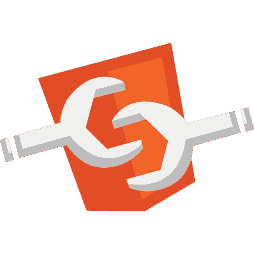
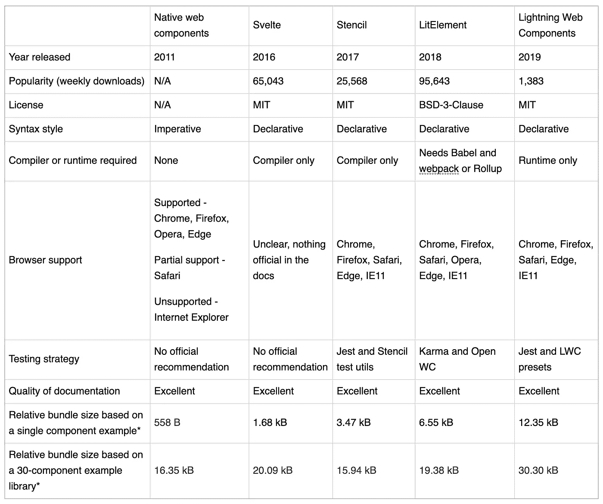

# Web 组件解决方案:比较

> 原文：<https://levelup.gitconnected.com/web-component-solutions-a-comparison-e2fa25c34730>

Web 组件徽标

“不要重复自己。”每个程序员在第一次学习编码时都有这个概念。任何时候你发现自己的代码在几个地方重复，是时候把代码抽象成一个类或函数了。但是这如何应用于用户界面呢？如何避免一遍又一遍的重写同一个 HTML 和 CSS？

如果您使用的是 Angular 这样的 UI 框架或 React 这样的 UI 库，答案很简单:构建一个组件。组件是 HTML、CSS 和 JavaScript 的一部分，以一种易于重用的方式组合在一起。

但是如果你没有使用 Angular，React，Vue，或者其他什么最新最好的 JavaScript 框架呢？如果你写的是普通的 HTML、CSS 和 JavaScript 呢？或者，如果您想编写一个与框架无关的组件，并且可以在任何 web 应用程序中使用，而不管它是用什么语言编写的，该怎么办？

# Web 组件

输入 [web 组件](https://developer.mozilla.org/en-US/docs/Web/Web_Components)。Web 组件允许您创建具有封装功能的自定义元素，这些元素可以在任何地方重用。它们是使用[模板](https://developer.mozilla.org/en-US/docs/Web/HTML/Element/template)和[槽](https://developer.mozilla.org/en-US/docs/Web/HTML/Element/slot)创建的，并在[影子 DOM](https://developer.mozilla.org/en-US/docs/Web/Web_Components/Using_shadow_DOM) 中定义，影子 DOM 将元素的样式和脚本与 DOM 的其余部分隔离开来，以避免冲突。

Web 组件可以使用大多数主流浏览器提供的本机浏览器 API 来构建，也可以使用所谓的 web 组件库来创建:作为浏览器 API 之上的抽象的解决方案，有助于简化 web 组件的编写。

在本文中，我们将比较几种不同的 web 组件解决方案:native [web 组件](https://developer.mozilla.org/en-US/docs/Web/Web_Components)、 [Svelte](https://svelte.dev/) 、 [Stencil](https://stenciljs.com/) 、 [LitELement](https://lit-element.polymer-project.org/) 和 [Lightning Web 组件(LWC)](https://developer.salesforce.com/docs/component-library/documentation/lwc) 。

# 标准

在评估这些解决方案时，有一套明确的标准是很有帮助的。我们将研究每个解决方案，同时关注以下内容:

*   发布年份
*   流行
*   许可证
*   语法风格(声明式与命令式)
*   需要编译器或运行时
*   浏览器支持
*   测试策略
*   文件质量
*   相对束尺寸

# 本机 Web 组件

让我们首先从[本地 web 组件](https://developer.mozilla.org/en-US/docs/Web/Web_Components)开始——即使用浏览器 API 构建的 web 组件，没有额外的框架或库。

Web 组件于 2011 年首次推出。与每项新技术一样，web 浏览器需要时间来跟上和实现新提出的 API 和标准，因此 web 组件需要一段时间来获得牵引力。今天，大多数 evergreen 浏览器都支持 web 组件。Chrome、Firefox、Edge 和 Opera 都支持 web 组件。Safari 提供部分支持。在 Internet Explorer 中，不支持 web 组件(惊喜，惊喜)。

因为这是我们正在谈论的本地 web 功能，所以文档非常好。你可以在 MDN 上找到关于如何构建和实现 web 组件的规范和教程的[资源。](https://developer.mozilla.org/en-US/docs/Web/Web_Components)

使用普通 web 组件的另一个好处是，你不需要引入另一个库、编译器、运行时或任何其他构建工具。Web 组件只是工作(只要浏览器支持)。

除了缺乏完整的浏览器支持，原生 web 组件的一个缺点是它们是使用命令式风格编写的。换句话说，您必须告诉组件如何执行每个步骤，包括重新呈现或更新 DOM 中的内容。那些喜欢声明式编写 React 组件的人可能会对本地 web 组件感到失望。

为了减轻这种痛苦，出现了许多 web 组件库来提供对本地浏览器 API 的抽象。这些库在创建新的 web 组件时提供了更好的开发人员体验，并且通常包括允许 web 组件在不支持开箱即用的浏览器中工作的 polyfills。我们将在本文接下来的几节中考虑其中的一些 web 组件库。

您可以在这里找到一个本地 web 组件实现的[示例](https://webcomponents.dev/edit/ssbYKxUnqWP2AdOWvV1O)。该守则全文转载如下:

首先，通过扩展`HTMLElement`类来定义一个定制的 web 组件。HTML 和 CSS 在类体中内联定义，然后通过修改`shadowRoot`的 HTML 内容插入到影子 DOM 中。因为代码是命令式编写的，所以可以看到定义了一个`update`方法，用于在必要时处理 DOM 内容的更新。生命周期回调方法也可用于安装和拆卸，这可以在附加和移除`connectedCallback`和`disconnectedCallback`方法中的事件监听器时看到。最后，使用`customElements.define`方法将组件注册到应用程序的其余部分，这允许您提供一个 HTML 标记名并将其链接到您的类。

# 苗条的

[Svelte](https://svelte.dev/) 于 2016 年发布，作为一种简单优雅的 web 组件编写方式。它允许您以声明性的方式编写组件，并为您处理更新 DOM 的命令性的一步一步的指令。苗条的组件写在以`.svelte`扩展名结尾的文件中，这是一种定制的文件类型，允许你在同一个文件中包含 HTML、CSS 和 JavaScript。Svelte 没有运行时，这意味着它在编译时将组件编译成浏览器可以理解的代码。这样做的好处是很少或没有增加应用包大小的开销。

在撰写本文时，Svelte 拥有来自 NPM 的 65，043 次每周下载，使其成为目前最受欢迎的 web 组件库之一。它的文档也很优秀，包括[互动教程](https://svelte.dev/tutorial/basics)，带你了解你想知道的一切。Svelte 甚至自带动画工具！

Svelte 有一个不断增长的社区，这意味着有很多人学习 Svelte，并创建第三方组件和插件供他人使用。你可以在这里找到[苗条开源项目的列表](https://svelte-community.netlify.app/code/)。

尽管有这么多好处，苗条身材确实有一些需要克服的弱点，这在他们的[常见问题](https://svelte.dev/faq)中有所涉及。在你的 IDE 中用`. svelte `文件进行语法高亮显示仍然不是完美的。他们也没有提供推荐的测试策略——当前的方法是编译每个组件，然后使用您选择的测试库将其安装到 DOM。另外， [Svelte 并没有宣传它支持什么浏览器](https://github.com/sveltejs/svelte/issues/558)。看来您需要自己解决这个问题，并提供您最终需要的任何 polyfills，尤其是如果您计划支持 IE11 的话。

你可以在这里找到一个 web 组件实现的例子。该守则全文转载如下:

如前所述，所有的 HTML、CSS 和 JavaScript 都包含在同一个`.svelte`文件中，看起来非常像普通的 HTML，而不是 JSX 式的语法。元件标签名称在第一行定义。使用`on:event-name`语法将事件处理程序附加到 HTML 元素上，并且当状态改变时，UI 会反应性地更新——很好，而且是声明性的！

# 蜡纸

[Stencil](https://getstencil.com/) 是 UI/UX 设计师常用的在线图形设计工具。2017 年， [Ionic Framework](https://ionicframework.com/) 团队发布了面向开发者的工具`@stencil/core`。像 Svelte 一样，Stencil 只是一个编译器，所以不需要运行时。编译器创建浏览器可以理解的 web 组件，甚至根据需要包括 polyfills，以便您的代码可以在所有主流浏览器中运行，包括 IE11。

模板组件是用 TypeScript 编写的，这可能会让你兴奋，也可能会让你大倒胃口，这取决于你对在 JavaScript 中添加类型的看法。它们也是使用 JSX 和声明式风格编写的，所以感觉非常像在 React 中编写组件。

Stencil 目前显示 NPM 每周有 25，568 次下载，虽然不如 Svelte 受欢迎，但仍然是一个受欢迎的选择。Stencil 吹嘘它被苹果、亚马逊和微软等公司使用，暗示它是一个久经考验的解决方案。 [Stencil 的文档](https://stenciljs.com/docs/introduction)也非常优秀，甚至提供了如何将 Stencil 生成的组件整合到 Angular、React 或 Vue 应用程序中的说明。

为了[测试模板组件](https://stenciljs.com/docs/unit-testing)，他们的文档推荐使用`@stencil/core/testing`包中的 Jest 和模板测试工具方法。

你可以在这里找到一个[模板 web 组件实现的例子。该守则全文转载如下:](https://webcomponents.dev/edit/1beAhuWbhB2THaFGLI7q)

web 元素是通过一个类定义的，但它不像本机 web 组件实现那样扩展任何基类。取而代之的是使用一个`@Component`装饰器，它提供标签名、可以找到样式的位置，以及组件是否应该放在影子 DOM 中。组件状态使用`@State`装饰器实现，HTML 内容写在`render`方法中。

# 文学元素

接下来，让我们看看 [LitElement](https://lit-element.polymer-project.org/) ，谷歌[聚合物项目](https://www.polymer-project.org/)的一个产品。LitElement 于 2018 年发布，目前每周从 NPM 下载 95，643 次-对于一个只有两年历史的产品来说，这是一个令人印象深刻的统计数据-使其比 Svelte 和 Stencil 加起来使用得更广泛。

LitElement 提供了许多我们之前讨论过的好处，比如使用声明性语法，向下编译到符合 web 组件标准的代码，以及在包括 IE11 在内的所有主流浏览器中工作。

LitElement 是根据 BSD-3-Clause 许可证授权的，这是一个相当宽松的许可证(不要与 BSD+Patents 许可证混淆，BSD+Patents 许可证引起了关于 React 的[争议，直到脸书在 2017 年将 React 的许可证改为 MIT 许可证)。](https://www.freecodecamp.org/news/facebook-just-changed-the-license-on-react-heres-a-2-minute-explanation-why-5878478913b2/)

同样需要注意的是，与 Svelte 和 Stencil 不同，LitElement 本身不是编译器。文档将 LitElement 描述为使用 lit-html 模板构建 web 组件的库( [lit-html](https://lit-html.polymer-project.org/guide) 是 Polymer Project 的另一个产品，用作 html 模板库)。所以为了使用 LitElement 创建的 web 组件，你首先需要用 Babel 和 Rollup 或者 Webpack 编译它们。

对于测试，LitElement 文档推荐使用 [Open WC 测试库](https://open-wc.org/testing/testing.html)，这是一个用于测试 web 组件的通用库。

你可以在这里找到一个 LitElement web 组件实现的例子。该守则全文转载如下:

这里的代码风格看起来像是本地 web 组件和模板组件的结合。定义了一个扩展基本`LitElement`类的类。HTML 内容在一个`render`方法中提供，并被包装在一个由`lit-html`包使用的模板文本中。使用`@event-name`语法附加事件处理程序。最后，就像本地 web 组件一样，新组件通过`customElements.define`方法注册。

# 闪电网络组件(LWC)

最后，让我们考虑闪电网络组件，或 LWC。LWC 是这个模块上的新成员，这是 [Salesforce 在 2019 年](https://www.salesforce.com/company/news-press/press-releases/2019/05/192915-e/)开源的产品。作为较新的解决方案，LWC 每周只有 1383 次来自 NPM 的下载，远远少于我们目前考虑的其他 web 组件解决方案。

LWC 看起来与我们探索的其他解决方案相似，因为代码是以声明方式编写的。它还支持所有主流浏览器的最新版本，包括 IE11。

与其他库的一个不同之处是，LWC 包括一个运行时，这意味着你有一个额外的脚本在页面上运行，以帮助你的应用程序工作，类似于你需要在浏览器中的 React 应用程序旁边包括 React 库。这意味着您的用户需要下载额外的代码，但是只有 7kB，LWC 运行时非常小。

[他们的文档](https://lwc.dev/guide/introduction)提供了一些很好的解释，并明确说明了如何[测试你的 LWC 应用](https://lwc.dev/guide/test)，这非常有用。它们还包括一个关于可访问性的[指南。](https://lwc.dev/guide/accessibility)虽然不是必需的，但很高兴看到 LWC 开发团队重视可访问性，并认为值得在他们的文档中注明。总的来说，对于寻求稳定的 web 组件库的组织来说，LWC 看起来是个不错的选择。随着时间的推移，看看采用率以及 LWC 是否能赶上其他 web 组件解决方案的普及程度将会很有趣。

你可以在这里找到一个 LWC web 组件实现的例子。该守则全文转载如下:

请注意，HTML、CSS 和 JavaScript 使用了三个独立的文件。这些文件在任何地方都不会显式地相互引用。取而代之的是，LWC 有一个隐含的契约，即文件名相同但扩展名不同的文件被一起使用。HTML 被包装在一个`template`标签中，事件处理程序使用您在普通 HTML 中看到的全部小写的`oneventname`语法编写。JavaScript 定义了一个扩展`LightningElement`的类，然后实现状态和任何方法。有趣的是，没有`render`方法，因为 HTML 被神奇地链接到 JavaScript。就像本地 web 组件和 LitElement 一样，LWC web 组件然后使用文件底部的`customElements.define`方法注册。

# 结论

那么您应该使用哪种 web 组件解决方案呢？根据您组织的需求来评估这些解决方案是非常重要的。

在比较这些 web 组件库时， **Svelte** 感觉现在更像是一个实验性的库，可能还没有为企业应用做好准备。Stencil、LitElement 和 LWC 都将自己表现为更适合企业的解决方案，重点是跨浏览器支持和编写单元测试时推荐的测试策略。

LitElement 看起来是个不错的选择，除了年轻之外没有明显的缺点。

**Stencil** 似乎与 LitElement 不相上下，是一个很好的选择，尤其是如果你已经在使用 Stencil 进行设计或者喜欢使用 TypeScript 的话。

最后，如果您正在使用或可能在未来使用 Salesforce， **LWC** 是显而易见的选择，因为它可以轻松地与其他 Salesforce 工作流和框架集成，例如使用 Lightning App Builder 构建 ui 或使用 Lightning Locker 实现安全性。对于企业来说，LWC 也是一个很好的选择，因为它是开源的，而且有大公司的支持。如果您喜欢成为新的 web 组件技术趋势的早期采用者，不喜欢 JSX 语法，或者喜欢将 HTML、CSS 和 JavaScript 代码保存在单独的文件中，您也可以考虑 LWC。

有一点似乎很清楚:使用 web 组件库而不是原生浏览器 API 将提供更好的开发体验以及更健壮和跨浏览器友好的解决方案。

# 最后一点

在研究每一个解决方案时，我都尽可能不偏不倚，使用预先定义的标准来评估每一个解决方案。为了快速参考，我在下面附上了一张总结我的发现的图表。

如果你想探索更多的 web 组件解决方案，[这篇博客文章](https://webcomponents.dev/blog/all-the-ways-to-make-a-web-component-april2020/)提供了对 30 个 web 组件实现的深入研究。

感谢阅读！

# Web 组件解决方案比较

Web 组件解决方案比较表

*捆绑包大小基准比较可以在这里找到:[https://web components . dev/blog/all-The-ways-to-make-a-web-component-April 2020/](https://webcomponents.dev/blog/all-the-ways-to-make-a-web-component-april2020/)