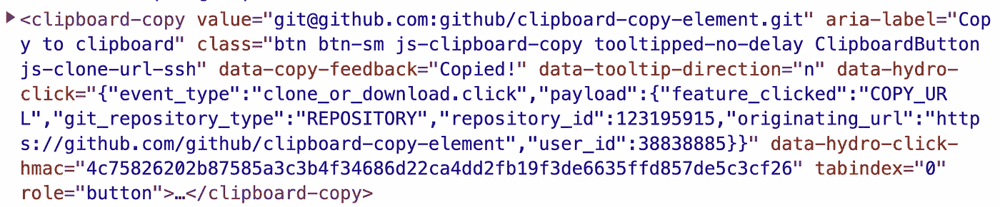

# 大型科技公司的网络组件:Github

> 原文：<https://levelup.gitconnected.com/web-components-at-big-tech-companies-github-812e632e1650>

## 如果企业可以部署 web 组件，那么您也可以！


今天，我不想讨论[Web 组件是否会取代前端框架](https://medium.com/@mariusbongarts/will-web-components-replace-frontend-frameworks-535891d779ba)。此外，我并不急于讨论前端框架是否是 Web 开发的未来，正如我不想讨论 Web 组件是否已经死亡的[。在接下来的文章中，我将重点关注已经涉足 Web 组件领域的大型科技公司。](/are-web-components-dead-12e404e0f4b0)

接下来的文章我会看不同的公司: [**Salesforce**](https://medium.com/@mariusbongarts/web-components-at-big-tech-companies-salesforce-89a8a4c97d04) **，**[**Youtube**](/web-components-at-big-tech-companies-youtube-84266bb507fd)**，Github，SAP，**和其他*。他们都决定以不同的方式依赖 Web 组件，有些更多，有些更少。我们将发现为什么这些公司依赖 Web 组件，以及他们是如何实现它的。在这篇文章中，我们将深入研究 Github 来分析他们在现有的整体代码库中使用 Web 组件的方法。我想强调的是，我不为 Github 工作，不了解他们的内部基础设施。所以，如果你碰巧在那里工作，如果提到的事情适用，请随时给我反馈。*

如果你是第一次接触 **Web 组件**这个话题，我建议你先阅读[这篇文章](https://medium.com/@mariusbongarts/will-web-components-replace-frontend-frameworks-535891d779ba)来了解什么是 Web 组件。如果您想更深入地了解技术细节，可以关注我的系列文章之一:

*   [完整的 Web 组件指南](https://medium.com/@mariusbongarts/the-complete-web-component-guide-part-1-custom-elements-a627af805df8)
*   [使用 Web 组件构建自己的博客组合](https://medium.com/@mariusbongarts/showcase-your-medium-articles-with-web-components-part-1-basics-d2c6618e9482)

[](https://medium.com/@mariusbongarts/web-components-at-big-tech-companies-salesforce-89a8a4c97d04) [## 大型科技公司的 Web 组件:Salesforce

### 如果企业可以部署 web 组件，那么您也可以！

medium.com](https://medium.com/@mariusbongarts/web-components-at-big-tech-companies-salesforce-89a8a4c97d04) 

# **Github**

> *“我们在 GitHub 大量使用 Web 组件”——*[*GitHub . blog*](https://github.blog/2021-05-04-how-we-use-web-components-at-github/)

当 Github 在十多年前推出时，它有一个主要使用 jQuery 的前端代码库。多年来，他们的 GitHub monolith 规模越来越大，他们发现有必要在前端变得难以管理之前实现更好的封装。他们选择了 **Web 组件**,因为他们的代码库已经被结构化为类似组件的行为。此外，他们可以在现有的前端基础设施上试验 Web 组件，因为这不会产生任何前期成本或“买入”特定的框架。

但是，当使用 Web 组件导航到前端基础设施时，Github 也面临许多问题。有一些[常见的痛点](/are-web-components-dead-12e404e0f4b0)，比如**服务器端呈现**、 [**可访问性**](https://medium.com/@mariusbongarts/4-simple-steps-to-make-your-website-accessible-a29ec305da1e) ，以及所有开发人员在 Web 组件的当前状态下面临的其他问题。

## Web 组件库

面对这些问题，Github 决定构建自己的 Web 组件库[**Catalyst**](https://github.com/github/catalyst)**来让他们的生活变得更轻松。Github 根据其开发者的特定需求设计了这个库，并从谷歌的 [**Lit**](https://medium.com/@mariusbongarts/build-your-own-blog-portfolio-with-web-components-lit-library-2701dffc735f) 库和[刺激](https://stimulusjs.org/)中获得了灵感。此外，他们使用 [ViewComponent](https://github.blog/2020-12-15-encapsulating-ruby-on-rails-views/) 转换部分 Rails 代码，这是一个在 Rails 中构建可重用组件的框架。**

> ***Catalyst，我们的开源库，让编写 web 组件更容易—*[*github . blog*](https://github.blog/2021-05-04-how-we-use-web-components-at-github/)**

**将单片前端架构迁移到松散耦合的微前端架构不是一朝一夕可以完成的事情。相反，Github 定期分析其代码库，并寻找好的组件候选进行提取。这些组件被归纳成一个健壮的、严格行为的、独立的 Web 组件。**

> **从一开始就利用 **Catalyst** 的好处是，该库抽象出了编写 Web 组件的一些常见陷阱，并实施了最佳实践。— [github.blog](https://github.blog/2021-05-04-how-we-use-web-components-at-github/)**

**关于他们的过程最有趣的是，他们开始在单片结构内使用他们的**催化剂**库**。然后，在产品中测试之后，他们**将元素放入自己的存储库**。不过，提取的组件可能会添加一些特定于应用程序的代码，因为它们会在不同的上下文中使用。这使得组件耦合到单片应用程序。要使一个组件在其他环境中工作，它必须是灵活的和通用的。****

**线索来了:在提取 Catalyst 组件之前，他们使定制元素可配置，删除**Catalyst 特定的功能，**并将其转换为没有任何依赖关系的普通 Web 组件。你可能会问:**

> ****为什么要删除这个团队声称可以让编写 Web 组件更容易的库呢？** — [github.blog](https://github.blog/2021-05-04-how-we-use-web-components-at-github/)**
> 
> **虽然 Catalyst 对开发人员有益，但我们希望我们的组件没有依赖性。要求 GitHub 组织之外的开发人员在将代码贡献回组件之前理解 Catalyst 是我们不想招致的额外摩擦。**

**其次，移除依赖关系和样板代码总是有利于提高组件的性能和缩小组件的大小。**

## **开源组件**

**目前，Github 提取了 17 个定制元素到他们的开源 [Github-Elements 库](https://github.com/github/github-elements)。那么，在 Github 宇宙中哪里可以找到 Web 组件呢？让我们检查一个 Github 页面，寻找定制元素。乍一看，Github 似乎很少使用 Web 组件。**

**让我们看看 Github 的开源存储库，看看我们必须具体搜索哪里。我们可以看到 Github 创建了一个[剪贴板复制元素](https://github.com/github/clipboard-copy-element)。很可能，每个开发人员都在某个时候使用过这个按钮来复制链接以克隆一个存储库:**

****

**在检查源代码时，我们可以看到 Github 使用一个[自定义元素](https://medium.com/@mariusbongarts/the-complete-web-component-guide-part-1-custom-elements-a627af805df8)来分发组件:**

****

**自定义元素:剪贴板-复制**

**Github 将被复制的值、对用户的成功反馈以及一些其他属性传递给组件。我们可以看到这个元素被归纳成一个健壮的、严格行为化的 Web 组件。该组件非常灵活，因此任何人都可以在他们的 web 应用程序中重用它。**

**此外，当分析[元素的](https://github.com/github/clipboard-copy-element/blob/main/package.json) `[package.json](https://github.com/github/clipboard-copy-element/blob/main/package.json)`文件时，我们可以看到它是完全独立的:**

****

**package.json**

**Github 仅包括开发依赖项，以正确测试组件，并使用 Typescript、eslint 等提供更好的开发人员体验。**

> **注册一个 Web 组件可能会产生一些样板文件，但是我们通过命名约定和少量的 TypeScript 装饰器使它变得更容易。— [github.blog](https://github.blog/2021-05-04-how-we-use-web-components-at-github/)**

**您可以通过运行以下命令将此组件添加为依赖项，从而轻松使用它:**

```
$ npm install --save @github/clipboard-copy-element
```

**并将其作为 ES 模块导入到您的代码库中:**

```
import '@github/clipboard-copy-element'
```

**分析`node_modules`中对应的文件夹，可以看到依赖关系只有 **3.000 字节**。如果 Github 使用库进行创作，这是不可能的。**

**[](/web-components-at-big-tech-companies-youtube-84266bb507fd) [## 大型科技公司的网络组件:Youtube

### 今天，我不想讨论 Web 组件是否会取代前端框架。还有，我不急于讨论…

levelup.gitconnected.com](/web-components-at-big-tech-companies-youtube-84266bb507fd)** 

# **最后的想法**

**像许多其他公司一样，Github 决定越来越关注网络标准。将他们现有代码库的一部分封装到更小的、通用的、灵活的 Web 组件中，使得他们现有的代码库耦合性更低。最重要的是，这些组件可以在任何 web 环境中重用，独立于任何前端框架。这确保了提取的组件对任何基础设施变化都有弹性。到那时，Github 已经为长期发展做好了准备，不管 Web 组件是否会成为未来，或者前端框架是否会继续存在。**

**我总是乐于回答问题，并乐于接受批评。随时欢迎联系我！通过**[**LinkedIn**](https://www.linkedin.com/in/marius-bongarts-6b3638171/)**，**关注我**[**Twitter**](https://twitter.com/MariusBongarts)或 [**订阅**](https://medium.com/subscribe/@mariusbongarts) 通过电子邮件获取我的故事。******

****[**这里是无限制访问**](https://medium.com/@mariusbongarts/membership) 媒体上每一个内容的链接。如果你注册使用这个链接，我会赚一小笔钱，不需要你额外付费。****

****[](https://medium.com/@mariusbongarts/membership) [## 通过我的推荐链接加入 Medium-Marius bong arts

### 作为一个媒体会员，你的会员费的一部分会给你阅读的作家，你可以完全接触到每一个故事…

medium.com](https://medium.com/@mariusbongarts/membership)**** 

# ****关于作者****

****我是埃森哲软件工程分析师宋。最驱动我的是我想创造一些可能对他人有帮助并改变他人生活的东西的冲动。比如你是否厌倦了浏览自己的历史来寻找前几天看到的信息？我的 [**网站重点介绍 Chrome 扩展**](https://chrome.google.com/webstore/detail/web-highlights-%20-bookmark/hldjnlbobkdkghfidgoecgmklcemanhm) 覆盖了你，并将通过以结构化和高效的方式组织你的研究来提高你的生产力。就像你在书和文章上做的那样，突出显示任何网页或 PDF 上的文本。你的精彩片段会直接同步到 web-highlights.com 的网络应用上，你可以在任何地方找到它们。****

****[](https://chrome.google.com/webstore/detail/web-highlights-pdf-web-hi/hldjnlbobkdkghfidgoecgmklcemanhm) [## Web 亮点— PDF 和 Web 荧光笔

### 在每个网站或 PDF 上创建亮点、书签、标签和文件夹。以结构化的方式组织您的想法和研究…

chrome.google.com](https://chrome.google.com/webstore/detail/web-highlights-pdf-web-hi/hldjnlbobkdkghfidgoecgmklcemanhm)**** 

# ****进一步阅读****

****[](https://medium.com/@mariusbongarts/will-web-components-replace-frontend-frameworks-535891d779ba) [## Web 组件会取代前端框架吗？

### 它们是为解决不同的问题而构建的。

medium.com](https://medium.com/@mariusbongarts/will-web-components-replace-frontend-frameworks-535891d779ba) [](/are-web-components-dead-12e404e0f4b0) [## Web 组件死了吗？

### 最近，我发表了一篇关于类似主题的不同问题的文章:Web 组件会取代前端吗…

levelup.gitconnected.com](/are-web-components-dead-12e404e0f4b0) [](https://medium.com/@mariusbongarts11/my-journey-to-the-first-9-99-with-my-side-project-3edc13dd1f2d) [## 我的第一个 9.99 美元之旅与我的副业

### Chrome 扩展带来的被动收入

medium.com](https://medium.com/@mariusbongarts11/my-journey-to-the-first-9-99-with-my-side-project-3edc13dd1f2d) 

# 分级编码

感谢您成为我们社区的一员！更多内容见[级编码出版物](https://levelup.gitconnected.com/)。
跟随:[推特](https://twitter.com/gitconnected)，[领英](https://www.linkedin.com/company/gitconnected)，[通迅](https://newsletter.levelup.dev/)
**升一级正在改造理工大招聘➡️** [**加入我们的人才集体**](https://jobs.levelup.dev/talent/welcome?referral=true)****