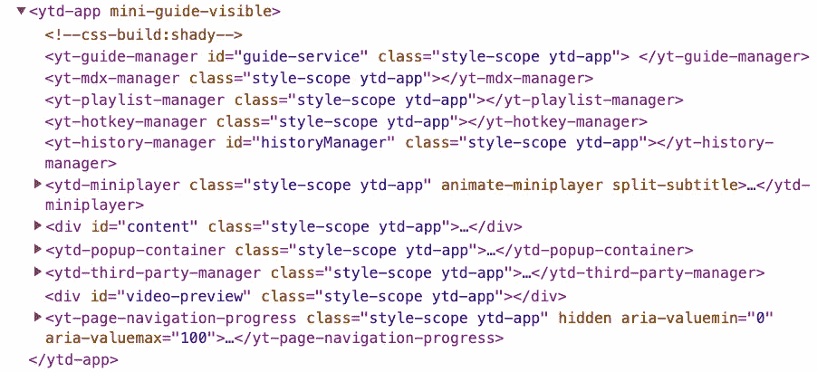
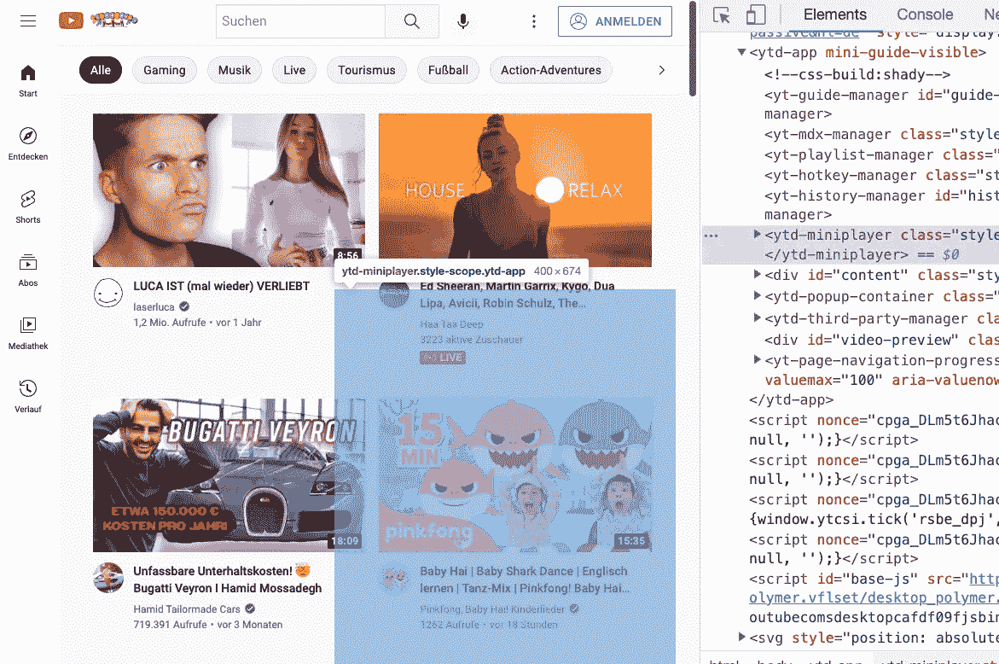
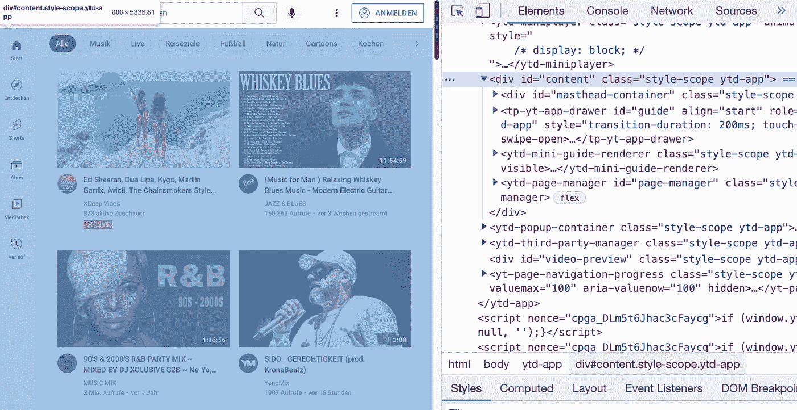
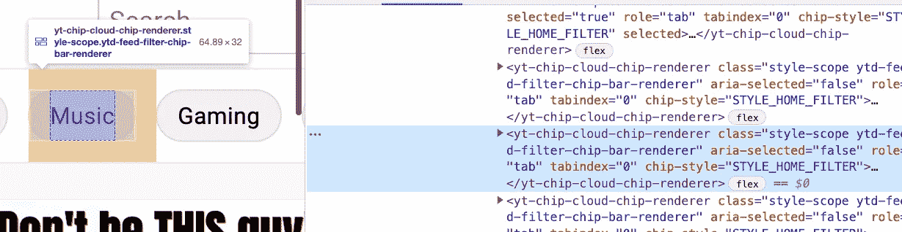
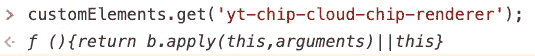
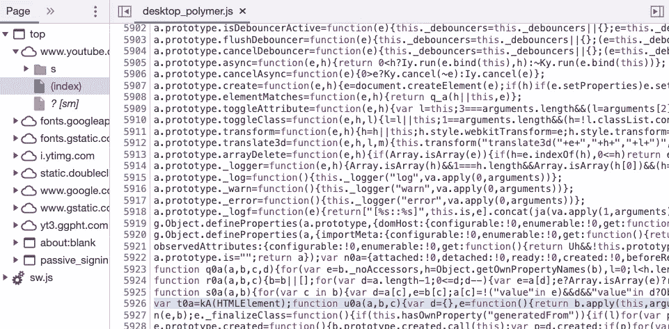
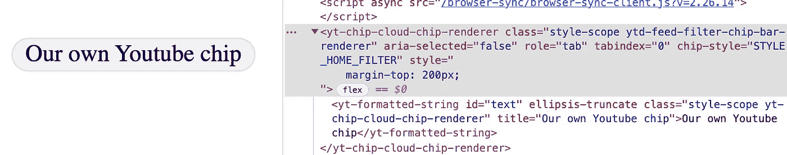

# 大型科技公司的网络组件:Youtube

> 原文：<https://levelup.gitconnected.com/web-components-at-big-tech-companies-youtube-84266bb507fd>


今天不想讨论[Web 组件是否会取代前端框架](https://medium.com/@mariusbongarts/will-web-components-replace-frontend-frameworks-535891d779ba)。此外，我并不急于讨论前端框架是否是 Web 开发的未来，正如我不想讨论 Web 组件是否已经死亡的。在接下来的文章中，我将重点关注已经涉足 Web 组件领域的大型科技公司。

我们已经了解了[Github 如何使用 Web 组件](https://medium.com/p/812e632e1650)和【Salesforce 如何编写组件以使其代码库更加健壮和灵活*。两家公司和更多的公司都决定以不同的方式依赖 Web 组件，有些更多，有些更少。本文将深入研究 Youtube，分析其使用 Web 组件的方法。我想强调的是，我不为 **Youtube** 或 **Google** 工作，也不了解他们的内部架构。所以，如果你碰巧在那里工作，如果我正确理解和再现了 Youtube 的技术现实，请随时给我反馈。*

如果你是第一次接触 **Web 组件**这个话题，我建议你先阅读[这篇文章](https://medium.com/@mariusbongarts/will-web-components-replace-frontend-frameworks-535891d779ba)，了解什么是 Web 组件。如果您想更深入地了解技术细节，可以关注我的系列文章之一:

*   [完整的 Web 组件指南](https://medium.com/@mariusbongarts/the-complete-web-component-guide-part-1-custom-elements-a627af805df8)
*   [使用 Web 组件构建自己的博客组合](https://medium.com/@mariusbongarts/showcase-your-medium-articles-with-web-components-part-1-basics-d2c6618e9482)

[](https://javascript.plainenglish.io/web-components-at-big-tech-companies-salesforce-89a8a4c97d04) [## 大型科技公司的 Web 组件:Salesforce

### 如果企业可以部署 web 组件，那么您也可以！

javascript.plainenglish.io](https://javascript.plainenglish.io/web-components-at-big-tech-companies-salesforce-89a8a4c97d04) 

# 油管（国外视频网站）

毫无疑问，Youtube 是世界上最重要的视频平台。该平台于 2005 年 2 月 14 日推出，自 2006 年 10 月起归谷歌所有。根据维基百科，它每月有 25 亿用户，甚至是仅次于谷歌搜索的第二大访问量网站。

显然，拥有数十亿用户的平台也需要高度可扩展的前端架构。自从 2005 年 Youtube 革命性地推出 Flash 播放器以来，网络技术发生了很大的变化。2010 年，谷歌开发者发布了 Angular 框架的第一个版本——**Angular js**。六年后，谷歌发布了 **Angular** (Angular 2+)框架。

这可能会让一些人感到惊讶，谷歌现在正在用 **Web 组件**构建 Youtube，因为它也对它们的 **Angular** 框架感兴趣。但是，谷歌不仅发布了 Angular，还在 2015 年推出了**聚合物项目**。

[](https://medium.com/@mariusbongarts/will-web-components-replace-frontend-frameworks-535891d779ba) [## Web 组件会取代前端框架吗？

### 它们是为解决不同的问题而构建的。

medium.com](https://medium.com/@mariusbongarts/will-web-components-replace-frontend-frameworks-535891d779ba) 

**聚合物库**

Polymer 项目旨在使使用 Web 组件构建可扩展的应用程序变得更加容易。结果就是开源的 JavaScript 库聚合体。该图书馆由谷歌开发，并被许多谷歌服务使用，包括 Youtube。它提供了一组创建 [**自定义元素**](https://medium.com/@mariusbongarts/the-complete-web-component-guide-part-1-custom-elements-a627af805df8) 的特性，并解决了许多开发人员在使用普通 JavaScript 构建 Web 组件时面临的一些[常见问题和棘手问题](/are-web-components-dead-12e404e0f4b0)。

> 其他著名的用户包括网飞，电子艺界，康卡斯特，Nuxeo，荷兰国际集团，可口可乐，麦当劳，BBVA，IBM 和通用电气。——[wikipedia.org](https://en.wikipedia.org/wiki/Polymer_(library))

Polymer 支持您构建封装的、可重用的 Web 组件，以便更快、更容易地开发定制元素。在底层，它使用 web 组件基类 lit-element，它是 [Lit 库](https://medium.com/@mariusbongarts/build-your-own-blog-portfolio-with-web-components-lit-library-2701dffc735f)的一部分。Google 甚至在 Polymers 文档中建议直接使用 [**LitElement**](https://medium.com/@mariusbongarts/build-your-own-blog-portfolio-with-web-components-lit-library-2701dffc735f) 作为库已经成为更成功的选择。

> 如果你正在开始一个新项目，我们建议你考虑使用 **LitElement** 来代替。——[https://github.com/Polymer/polymer](https://github.com/Polymer/polymer)

下面是一个使用聚合物的定制元素的迷你示例:

## Youtube 上使用的 Web 组件

你们都非常了解 Youtube 平台，让我们更深入地了解它，并寻找其中使用的一些 Web 组件。不像 [Github 的网站](/web-components-at-big-tech-companies-github-812e632e1650)，当查看源代码时，你可以直接看到 Youtube 是建立在 [**自定义元素**](https://medium.com/@mariusbongarts/the-complete-web-component-guide-part-1-custom-elements-a627af805df8) 之上的。我们很容易找到它们，因为它们总是用连字符(`-`)隔开。



源代码 Youtube.com

Youtube 将整个应用程序封装在一个名为`ytd-app`的自定义元素中。许多元素在被用户使用之前是隐藏的。你可能在 Youtube 上看视频的时候看过`ytd-miniplayer`。我们可以看到，这个元素已经呈现出来，但是对用户是隐藏的。



一个有趣的现象是，一些定制元素，如`yt-guide-manager`、`yt-mdx-manager`、`yt-playlist-manager`和`yt-hotkey-manager`没有任何子元素。似乎 Youtube 正在使用这些自定义元素来为网站添加一些功能。

现在，让我们看看可见的元素。为此，我们需要用 id“*内容”*扩展`div`。同样，像`tp-yt-app-drawer`、`ytd-mini-guide-renderer`和`ytd-page-manager`这样的新定制元素也出现了。



## 逆向工程

让我们更仔细地看一下`yt-chip-cloud-chip-renderer`,它代表搜索栏下方类别中的一个芯片。



Youtube 芯片渲染器

现在，让我们做一些**逆向工程**。通过在控制台中使用`customElements.get`,我们可以很容易地获得任何命名的定制元素的构造函数:

```
customElements.get('yt-chip-cloud-chip-renderer');
```



customElements.get

构造函数被返回，当点击它时，我们将被重定向到 DevTool 的 source 选项卡中的自定义元素的构造函数:



我们可以看到`yt-chip-cloud-chip-renderer`是在 Youtube 从这个 [URL](https://www.youtube.com/s/desktop/cafdf09f/jsbin/desktop_polymer.vflset/desktop_polymer.js) 加载的 *desktop_polymer.js* 文件中定义的。因此，我们应该能够将这个脚本加载到一个简单的 HTML 文件中，并创建我们自己的芯片:

瞧啊。我们创造了自己的 Youtube 芯片:



Youtube 芯片

下面是一个[代码笔](https://codepen.io/marius2502/pen/MWVbPob)中的例子:

# 最后的想法

像许多其他公司一样，Youtube 决定越来越关注网络标准。将他们现有代码库的一部分封装到更小的、通用的、灵活的 Web 组件中，使得他们现有的代码库耦合性更低。最重要的是，这些组件可以在任何 web 环境中重用，独立于任何前端框架。这确保了提取的组件对任何基础设施变化都有弹性。到那时，不管 Web 组件是否会成为未来，或者前端框架是否会继续存在，Youtube 都为长期发展做好了准备。

我总是乐于回答问题，并乐于接受批评。随时欢迎联系我！通过**[**LinkedIn**](https://www.linkedin.com/in/marius-bongarts-6b3638171/)**，**关注我**[**Twitter**](https://twitter.com/MariusBongarts)或 [**订阅**](https://medium.com/subscribe/@mariusbongarts) 通过电子邮件获取我的故事。****

****[**这里是无限制访问介质**](https://medium.com/@mariusbongarts/membership) 上所有内容的链接。如果你注册使用这个链接，我会赚一小笔钱，不需要你额外付费。****

****[](https://medium.com/@mariusbongarts/membership) [## 通过我的推荐链接加入 Medium-Marius bong arts

### 作为一个媒体会员，你的会员费的一部分会给你阅读的作家，你可以完全接触到每一个故事…

medium.com](https://medium.com/@mariusbongarts/membership)**** 

# ****关于作者****

****我是埃森哲软件工程分析师宋。我们一直在寻找最好的开发人员，所以如果你有兴趣加入我们，请随时联系我们！****

****最驱动我的是我想创造一些对他人有帮助和改变生活的东西的冲动🙌比如你是否厌倦了浏览自己的历史来寻找前几天看到的信息？我的 [**网站重点介绍 Chrome 扩展**](https://chrome.google.com/webstore/detail/web-highlights-%20-bookmark/hldjnlbobkdkghfidgoecgmklcemanhm) 覆盖了你，并将通过以结构化和高效的方式组织你的研究来提高你的生产力。就像你在书和文章上做的那样，突出显示任何网页或 PDF 上的文本。你的精彩片段会直接同步到 web-highlights.com[的网络应用上，你可以在任何地方找到它们。](https://web-highlights.com/)****

****[](https://chrome.google.com/webstore/detail/web-highlights-pdf-web-hi/hldjnlbobkdkghfidgoecgmklcemanhm) [## Web 亮点— PDF 和 Web 荧光笔

### 在每个网站或 PDF 上创建亮点、书签、标签和文件夹。以结构化的方式组织您的想法和研究…

chrome.google.com](https://chrome.google.com/webstore/detail/web-highlights-pdf-web-hi/hldjnlbobkdkghfidgoecgmklcemanhm)**** 

# ****进一步阅读****

****[](https://medium.com/@mariusbongarts/will-web-components-replace-frontend-frameworks-535891d779ba) [## Web 组件会取代前端框架吗？

### 它们是为解决不同的问题而构建的。

medium.com](https://medium.com/@mariusbongarts/will-web-components-replace-frontend-frameworks-535891d779ba) [](/are-web-components-dead-12e404e0f4b0) [## Web 组件死了吗？

### 最近，我发表了一篇关于类似主题的不同问题的文章:Web 组件会取代前端吗…

levelup.gitconnected.com](/are-web-components-dead-12e404e0f4b0) [](https://medium.com/@mariusbongarts11/my-journey-to-the-first-9-99-with-my-side-project-3edc13dd1f2d) [## 我的第一个 9.99 美元之旅与我的副业

### Chrome 扩展带来的被动收入

medium.com](https://medium.com/@mariusbongarts11/my-journey-to-the-first-9-99-with-my-side-project-3edc13dd1f2d) 

# 分级编码

感谢您成为我们社区的一员！更多内容请参见[升级编码出版物](https://levelup.gitconnected.com/)。
跟随: [Twitter](https://twitter.com/gitconnected) ， [LinkedIn](https://www.linkedin.com/company/gitconnected) ，[时事通讯](https://newsletter.levelup.dev/)
向上一级是转型科技招聘👉 [**加入我们的人才集体**](https://jobs.levelup.dev/talent/welcome?referral=true)****