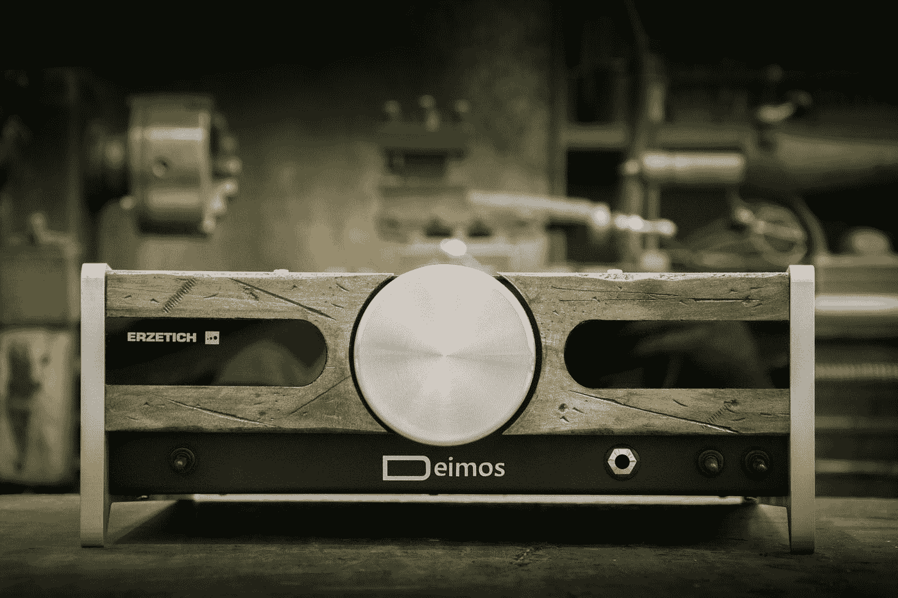
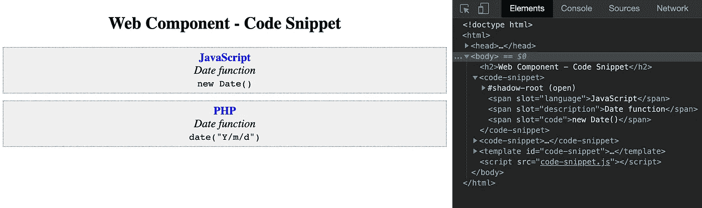

# Web 组件简介

> 原文：<https://levelup.gitconnected.com/web-components-ca2b6727faad>



照片由 [Blaz Erzetic](https://unsplash.com/@www_erzetich_com?utm_source=medium&utm_medium=referral) 在 [Unsplash](https://unsplash.com?utm_source=medium&utm_medium=referral) 上拍摄

# **什么是 Web 组件？**

代码重用是开发的咒语。我们努力创建一个代码片段来封装它的功能，作为一个单一问题或用例的解决方案。在 web 开发中，我们可能希望创建一个自定义元素，它有自己的样式、脚本和标记。这个自定义元素应该可以在 web 上重用。即网站和网络应用。
Web 组件帮助我们实现这一切以及更多！它们是一组 web 平台 API，帮助我们创建带有相关样式和脚本的定制 HTML 标签。它们可以跨浏览器工作，可以与任何支持 HTML 的 JavaScript 库或框架一起使用。

# **积木**

Web 组件是使用三个主要构件定义的:

1.  **定制元素**:一组 JavaScript APIs，帮助我们设计具有相关行为的定制 DOM 元素。
2.  **影子 DOM** :一组 JavaScript APIs，用于将封装的“影子”DOM 树附加到元素上。该标记与主文档 DOM 分开呈现。这有助于将元素特性定义为私有特性，因此元素样式或脚本不会与主文档上的脚本和样式发生冲突。
3.  **HTML 模板**:帮助我们编写不显示在页面中的标记。该标记可用于定义自定义元素的结构。它是使用`<template>`和`<slot>`元素定义的。

# **自定义元素**

自定义元素有两种类型:

1.  **自主定制元素**:它们是独立的元素，也就是说，它们**不是**从标准 HTML 元素继承而来。它们继承自泛型 HTMLElement 类。比如:`<word-count>`或者`document.createElement(‘word-count’)`。
2.  定制的内置元素:它们继承了基本的 HTML 元素。它们继承自特定元素类，如 HTMLUListElement 或 HTMLImageElement。您可以通过指定自定义元素的名称来使用它们，因为 ***的值是*** 属性。比如:`<ul is=”styled-list”>`或者`document.createElement(‘ul’, {is: “styled-list” })`。

## 生命周期回调

有几个生命周期回调函数可以在定制元素生命周期的不同点触发。我们可以在定义定制元素时利用这些。一些可用的回调包括:

1.  ***connectedCallback***:每次将自定义元素追加到文档连接元素中时调用。这将在每次移动节点时发生，并且可能在元素的内容被完全解析之前发生。
2.  ***disconnected callback***:每次自定义元素从文档的 DOM 断开时调用
3.  ***adopted callback***:每次自定义元素移动到 newdocument 时调用。
4.  ***attributeChangedCallback***:每次添加、删除或更改自定义元素的属性时调用。在静态 get *observedAttributes* 方法中指定了哪些属性需要注意变化。

# **暗影 DOM**

影子 DOM 允许将隐藏的 DOM 树附加到常规 DOM 树中的元素上。影子 DOM 树从一个影子根开始，在它下面可以附加任何想要的元素，就像普通 DOM 一样。

**术语**

1.  **影子主机**:影子 DOM 附加的常规 DOM 节点。
2.  **阴影树**:阴影 DOM 里面的 DOM 树。
3.  **阴影边界**:阴影 DOM 结束的地方，常规 DOM 开始。
4.  **阴影根**:阴影树的根节点。

使用 *attachShadow* 方法将阴影根连接到任何元素。

```
const shadow = elementReference.attachShadow({mode: 'open'});
      /* OR */ 
const shadow = elementReference.attachShadow({mode: 'closed'}); 
```

这里，如果模式设置为**打开**，我们可以使用主页面中编写的 JavaScript 访问影子 DOM，否则不能。

# HTML 模板

HTML 模板帮助我们定义自定义元素的结构。

# 例子

让我们创建一个*自治* *自定义元素* `*<code-snippet>*` *。*这个元素将接受一个语言名称、功能描述和一个代码片段，并用一些预定义的样式来显示它。您可以在新项目的文档页面中使用它！
这里将使用`<slot>`元素。`<slot>`帮助我们定义`<template>`中的*占位符*。当在文档中使用元素时，我们可以传递任何标记，用实际的标记替换`<slot>`。我们需要给我们的标记的槽属性赋予我们想要在模板中替换的槽的 ***名称*** 。

```
<template id="code-snippet">
  <style>
   div {
      border: 1px dotted #867f7f;
      background-color: #efefef;
      padding: 5px;
      text-align: center;
      margin-top: 10px;
    }
   p {
      margin: 0;
      padding: 0; 
    }
   strong {
    font-weight: bold;
    color: blue;   
   }
   </style>
   <div>
    <p>
     <strong><slot name="language">language</slot></strong>
    </p>
    <p>
     <em><slot name="description">function description</slot></em>    
    </p>
    <p>
     <code><slot name="code">code snippet</slot></code>
    </p>
  </div>
</template>
```

在自定义元素定义中引用此模板。

```
/* code-snippet.js */class CodeSnippet extends HTMLElement {
  constructor() {
    super();
    var template = document.getElementById('code-snippet');
    const shadowRoot = this.attachShadow({ mode: 'open' });
    var templateContent = template.content;
    shadowRoot.appendChild(templateContent.cloneNode(true));
  }
}/* register your element with the CustomElementRegistry using the define method. Pass the name to be used as tag (here code-snippet) and the class name(here CodeSnippet)*/customElements.define('code-snippet', CodeSnippet);
```

现在，您可以在 HTML 文档中使用自定义元素。

**注意**:注册定制元素的脚本必须在 DOM 解析后加载。因此，要么使用**延迟**来加载脚本，要么在 html 文档内的`<body>`标签底部添加脚本标签。

```
/* index.html */
<head>
 <script src="code-snippet.js" defer></script>
</head>
<body>
  <h2>Web Component - Code Snippet</h2>
  <code-snippet>
   <span slot="language">JavaScript</span>
   <span slot="description">Date function</span>
   <span slot="code">new Date()</span>
  </code-snippet>
  <code-snippet>
   <span slot="language">PHP</span>
   <span slot="description">Date function</span>
   <span slot="code">date("Y/m/d")</span>
  </code-snippet>
 <template id="code-snippet">
    ...
 </template>
</body>
```

就是这样！我们已经创建了一个非常简单的 web 组件。



# 利益

因为 web 组件是建立在 Web 标准之上的，所以它们有一些很大的好处。

1.  互操作性:他们可以使用不同的技术栈处理多个项目。因为它们不依赖任何框架或库，所以可以使用各种技术栈。
2.  寿命**:因为它们是基于网络标准的，所以很少或者没有重写来适应更新的技术。因此寿命更长。**
3.  **生产力:迭代已经编写好的组件可以帮助我们节省时间和精力。您可以在它们的基础上更快地开发更多功能。**
4.  ****品牌一致性**:根据您的需求管理组件，并让它们在团队中使用，而不考虑技术堆栈，这有助于您在整个应用程序中保持一致的外观和感觉。**
5.  ****代码共享**:你可以在团队之间和不同的项目中共享相同的逻辑和一致的外观。**

***简而言之，Web 组件——WORA——编写一次就可以在任何地方运行。***