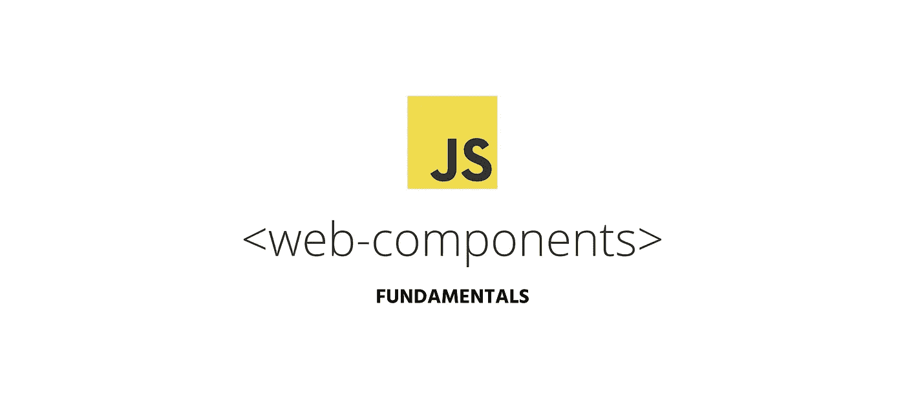

# 简而言之，Web 组件

> 原文：<https://levelup.gitconnected.com/web-components-in-a-nutshell-1e114aa971b9>

## 本机浏览器 Web 组件的基础知识以及如何创建它们



在 web 开发中，代码的可重用性已经成为一个焦点。作为一名开发人员，我们可能经历过这样的场景:我们不得不在多个地方使用代表自定义 UI 控件的代码段。如果我们不能仔细地编写它们，可能会使我们的整个代码结构变得难以管理。Web 组件提供了一个本地 API 来构建可重用的 UI 块。

# 什么是 Web 组件？

Web 组件是一个**低级浏览器 API 的集合，帮助我们创建可重用的、封装的定制 HTML UI 元素**。Web 组件被认为好得多，因为它们可以通过使用任何库或框架来创建，并且您可以立即开始使用普通 JavaScript 编写自己的 web 组件。

使用 web 组件的一个好处是，它们可用于除 Microsoft Edge 之外的所有浏览器，但我们不需要担心这一点，因为我们有 [Polyfills](https://github.com/webcomponents/webcomponentsjs) 来解决这个问题。

Web 组件由三种主要技术组成。它们是可以用作 API 来构建 web 组件的主要支柱。

*   **自定义元素**
*   **模板**
*   **阴影 DOM**

让我们深入了解这些技术。

## 1.自定义元素

这些是一套 JavaScript APIs，帮助你创建你自己的 HTML 元素，控制你的 DOM 及其行为。我们可以建立他们的等级制度，并规定他们如何应对行为的变化。例如，您可以创建一个像这样的元素`<my-element></my-element>`。

## 2.模板

模板是用户定义的标记，仅在页面加载时呈现。稍后，通过创建组件的实例，可以多次重用这些组件。

## 3.阴影 DOM

影子 DOM 是 JavaScript APIs 的组合，用于连接封装的 DOM。这将与主文档对象模型分开呈现，并且它们的行为特征将保持私有，以便代码段不会与代码结构的其他部分冲突。使用 Shadow DOM，CSS 和 JavaScript 可以像一个`<iframe>`标签一样被隔离。

## 生命周期回调

生命周期回调是在自定义元素的类定义中定义的函数。他们有自己独特的目的。它们用于操纵我们的自定义元素的行为。

*   `connectedCallback`:当我们的自定义元素最初连接到 DOM 时，这个特定的函数将被调用。
*   `adoptedCallback`:当我们的自定义元素被移动到一个新的文档中时，这个函数将被调用。
*   如果我们的定制元素的属性发生了变化，比如一个属性被更改、添加或删除，这个特定的函数将被调用。
*   `disconnectedCallback`:当我们的定制元素与 DOM 断开连接时，这个特定的函数被调用。

现在让我们看看如何使用普通的 JavaScript 创建一个 web 组件。通过这样做，你将对 web 组件有一个清晰的了解。

# 我们要建造什么？

我们将构建一个包含当前趋势 gif 图像的 web 组件。我们将使用 Giphy API 来获取 gif。在实现结束时，您的代码结构将如下所示。

```
--index.html
--card.js
--services.js
```

# 我们开始吧！

学分:Giphy.com

首先，我们必须创建一个包含我们将要构建的 web 组件的行为的类。创建一个名为`card.js`的文件，并创建一个如下所示的类。

```
class CardComponent extends HTMLElement {
    constructor (){
        super();

        //Your implementaion goes here

    }
}
```

在类的构造函数中，需要使用`Element.attachShadow()`方法将影子 DOM 的影子根附加到文档的当前 HTML 元素上。然后我们需要在我们的`index.html`文件中使用`<template>` 标签创建一个 HTML 模板。该模板看起来会像这样

```
<template id="card-view">
   <h1>Web Component</h1>
   <p id="card-title">Example</p>
   
</template>
```

将它添加到我们的`index.html`文件后，我们可以使用 DOM 方法克隆上面的模板，并将其附加到我们的影子 DOM。这应该写在构造函数内部。

```
class CardComponent extends HTMLElement {
    constructor (){
        super();
        const shadow = *this*.attachShadow({mode: 'open'});

        *// Clone the template so that it can be attched to the 
        shadowroot*                     
        const template = document.getElementById('card-view');
        const templateInstance = template.content.cloneNode(true);
        shadow.appendChild(templateInstance);
    }}
```

正如我前面提到的，我们还应该编写一个函数来从 Giphy API 获取 gif。从 API 中，我们将获得一个当前的趋势 gif 及其标题，该标题由特定 gif 的上传者提供。在我们开始编写函数之前，创建一个名为`services.js`的单独文件来放置 URL 和 API 键。创建该文件，并使用来自 Giphy API 的 API 密钥添加以下代码

```
const API_KEY = '*YOUR_API_KEY*';const url = `http://api.giphy.com/v1/gifs/trending?api_key=` + API_KEY + `&limit=1`;export {API_KEY, url}; // *export the url so that i can be used extrnally.*
```

创建完`services.js`文件后，将下面的代码添加到`card.js`文件的顶部，这样您就可以使用 URL 来获取 gif。

```
import { url } from './services.js';
```

> 要获得您自己的 API 密钥，请访问以下站点。[https://developers.giphy.com/](https://developers.giphy.com/)

让我们跳回我们的`card.js`文件并添加以下函数。

```
render(shadowElem, data){
    const shadowRoot = shadowElem.shadowRoot;
    shadowRoot.getElementById('card-title').innerHTML = data.name;
    shadowRoot.getElementById('gif-view').src = data.url;
} async fetchFromGiphy (){
  const res = await fetch(url);
  const json = await res.json(); const gifUrl = json['data']['0'].images['fixed_height_small'].url;
  const gifName = json['data']['0'].title; const gifObject = {
     name: gifName,
     url: gifUrl
  }
  return gifObject;
}
```

我来解释一下这些功能。

`fetchFromGiphy()`:这个函数获取趋势 gif 和特定 gif 的标题，并使用 async/await 将它们作为一个对象返回。

`render()`:这个函数用于在影子 DOM 的元素中注入值。

接下来，让我们在生命周期回调中调用这些函数。实际上，当我们的定制元素连接到 DOM 时，我们需要调用上面的两个函数。我们有`connectedCallback()` 函数来实现这一点。

```
async connectedCallback (){
    *this*.gifObj = await *this*.fetchFromGiphy();
    *this*.render(*this*, *this*.gifObj);
}
```

最后，让我们使用`customElements.define()` 函数来定义我们的定制元素。当定义一个定制元素时，我们应该记住一些基本规则。`define()` 函数的第一个参数应该是一个代表我们自定义元素名称的字符串。它们不能是一个单词，所以应该包含一个`-`字符。第二个参数是我们的类对象，它定义了元素的行为。

```
customElements.define(‘card-component’, CardComponent);
```

现在您已经定义了您的组件，将您的`card.js`文件添加到您的`index.html`文件中。您可以在 HTML 文档的任何地方使用下面的元素`<card-component>`。在这段旅程的最后，你的`index.html` 文件会是下面这样的。

```
<!DOCTYPE html>
<html lang="en"><head>
<title>Web Component</title>
</head><body>

<template id="card-view">
    <h1>Web Component</h1>
    <p id="card-title">Example</p>
    
</template>

<card-component></card-component><script src="./card.js" type="module"></script>
</body>
</html>
```

要运行这个，你需要一个服务器。从命令行工具全局安装`static-server`

```
npm install -g static-server
```

从 web 组件项目的工作区运行`static-server` 命令。

```
static-server
```

恭喜你。你现在有自己的成分了。

学分:Giphy.com

# **结论**

本文总结了 web 组件的基础知识。这就是 web 组件的理论和实现。Web 组件非常有用，因为它们有助于代码的重用。你可以在这里查看这个小项目的全部代码。

[](https://gitconnected.com/learn/javascript) [## 学习 JavaScript -最佳 JavaScript 教程(2019) | gitconnected

### 50 大 JavaScript 教程-免费学习 JavaScript。课程由开发人员提交并投票，从而实现…

gitconnected.com](https://gitconnected.com/learn/javascript)