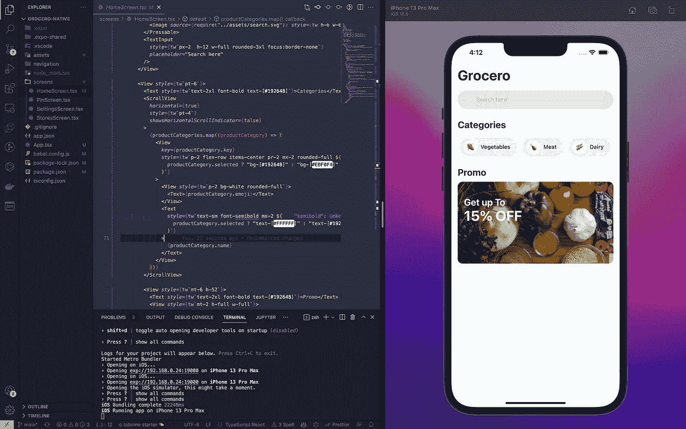
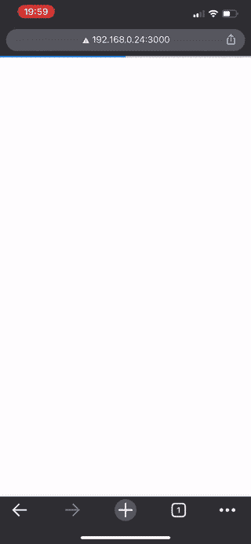
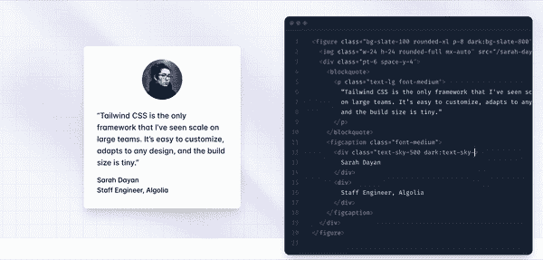

# 在 2022 年成为一名网络开发者:你不必变得不知所措

> 原文：<https://levelup.gitconnected.com/web-dev-a49d50483537>

## 自我发展

## 当我们周围有成千上万的视频、教程、文章、训练营和课程时，变得不知所措是不可避免的。在这篇文章中，我想分享一下我花了近 5 年时间从事网络开发后的建议。


# TL；速度三角形定位法(dead reckoning)

*   从什么开始并不重要，只是开始
*   挑选你喜欢的东西
*   与教程一起编码是好的
*   自顶向下优于自底向上
*   某人的代码
*   分享你的作品


使用 React.js 翻拍的苹果 iPhone 主页

# 从什么开始并不重要，只是开始

因为你可能开始四处寻找，你发现自己被教程、让你购买课程/新兵训练营的广告和流行语淹没了。

别担心，我也经历过，有时候还是这种情况。

在这个阶段，你不需要理解任何在后面工作的东西，你只需要尽可能多的时间(和代码行)来兑现。这会给你一个机会湿湿脚趾头，开心一下，记住:

> 你不必把它做对，你必须开始做。



我最近使用 React native 开发的一个杂货交付应用程序。

# 挑选你喜欢的东西:

正如上一段提到的，*你必须* *开始*:挑选一个能激发你兴趣的东西的教程，然后编码。你可以找一个教程，在那里你可以创建一个亚马逊克隆、Airbnb、优步或者任何你喜欢的东西——其他的都无所谓！

你在编码时可能会遇到的一个常见情况是，你得到了一个你完全不知道如何解决的错误，这可能会令人沮丧，但没关系，你是一个初学者。

如果发生这种情况，请保存您的工作，找到另一个教程并重新开始。


特斯拉主页的克隆(图片来自作者)。

这种方法将帮助您理解常见的模式，而无需绞尽脑汁，并且在另一个教程中，您可能会得到如何管理以前遇到的错误的线索。

有时，当跟随教程时，甚至创建者也碰巧遇到了错误，他们通常会向你展示修复它们的解决方案。

所以，乐观一点，只关注数量而不是质量。

# 自顶向下优于自底向上

在学校里，我们被告知，为了积累知识和成长，我们需要从基础开始:但这对编码不起作用。



我前段时间做的一个杂货配送 app。

不要疯狂地学习 CSS，从 Material UI 这样的东西开始吧:你会喜欢你只用一行代码就能创造出如此美丽的东西，这将使你的工作非常愉快。

总而言之，比起复杂的解决方案，更喜欢高级工具。

例如，如果你正在学习前端开发，可以在普通 CSS 上使用 Tailwind CSS。如果您正在为您的应用程序构建后端，请尝试 AWS Amplify、Firebase 或 nhost。



顺风 CSS 是一个伟大的替代样式 HTML 和节省时间！(来源:tailwindcss.com)。

这些平台包含高层次的抽象，让您有机会只关注重要的事情:交付产品和编写代码。

一旦你在这些方面变得熟练，你就可以挖掘更多，最终写出你自己的后端代码，你的 CSS 等等。

> 完美是好的敌人，做了比完美更好

# 某人的代码

跟随教程、课程或新兵训练营会变得很无聊。井字游戏、待办事项等等都是过时的教学方法。每个人一想到要做那样的事情都会立刻变得恼火！

在过去的学习中，我有一个在 Shopify 上经营业务的朋友，从一开始我就帮助他处理商店的方方面面:有时他想添加一些自定义 CSS，有时他想为他的网站找到一些漂亮的图形等等。

这段经历极大地影响了我的学习道路。


TakeMeAnywhere.club 我的一个失败的创业项目。更多细节在另一个故事。

如果你有一个“真正的”任务要做，比如为朋友、客户或其他人做一个项目，这将是你前进的巨大动力。

当然，开始时你可能认为你甚至不能用两个按钮组成一个简单的页面，或者一个 hello world Express 端点，这是真的，现在向上滚动到第一点😉

学习的最佳地点是有一个不太容易也不太难的任务:与拉斐尔·纳达尔打网球，可能不会教给我们很多人太多，而与网球教练打球，这可以使他的游戏适应略高于我们的水平，是一个很好的学习机会！

# 分享你的作品

分享你的工作，公开你的任务，写博客是帮助你保持专注和投入的诀窍。

如果你和别人分享你正在做的事情，你会自动为你分享的事情产生一种责任感:你将更难辞职(你将如何向公众解释你辞职的原因？你已经分享了你的计划？)

我目前正在开发的一个应用程序的 Figma 原型。

此外，分享你的工作可以打开反馈、建议和灵感的大门。

最后但同样重要的是，我想以一些大师般的东西来结束，但我相信这一点:想想你自己，因为你是你想成为的人(即“我是一名软件开发人员”)，这将帮助你引导你的行为向学习和编码更多:

> 我是一名开发人员，因此*我编码*。

*我真的很高兴你看到了这篇文章的结尾，我真诚地希望你在这里度过的时光能在未来对你有所帮助！*

```
**I have a newsletter 📩.** Every week I’ll send you a brief findings of articles, links, tutorials, and cool things that caught my attention. If this sounds cool to you subscribe. *That means* ***a lot*** *for me.*
```

 [## 5-子弹技术、网络开发和数据科学📡

无情-创造者-2481.ck.page](https://relentless-creator-2481.ck.page/68d9def351) 

或者，也许你会喜欢看看我刚刚开通的 YouTube 频道！