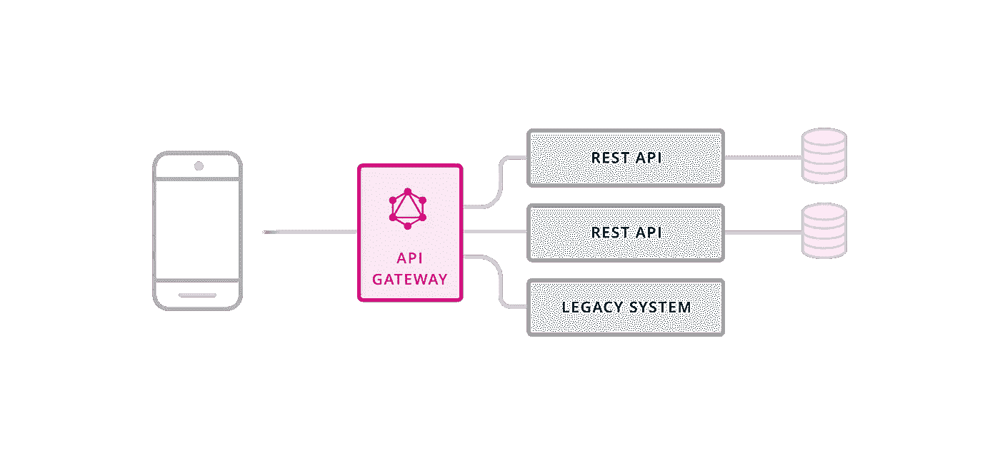

# 2018 年 Web 开发的数据库选项

> 原文：<https://levelup.gitconnected.com/web-development-data-1aa4080bc852>

## 作为一名 web 开发人员，学习如何管理数据和调用 API

由帕特里克·林登伯格在 [Unsplash](https://unsplash.com?utm_source=medium&utm_medium=referral) 上拍摄的“打开的硬盘的磁头特写”

*本文是 9 篇系列文章***的第 3 篇。**

*数据可以说是任何应用程序或网站中最重要的部分。数据是原始信息；未加工未定型。这就是您想要的数据，以确保您作为开发人员能够完全控制数据的处理和样式。这意味着存储数据的方式对开发至关重要。幸运的是，有很多选择，下面列出了其中的两个。*

*同样需要注意的是，要拥有一个可以在整个应用程序中访问的数据库，您需要将这个数据库托管在一个服务器上。良好的实践建议将此数据库与您的应用程序放在同一服务器上，或者至少放在同一区域，以防止延迟问题(请求和接收数据之间的延迟时间)。*

# *结构化查询语言*

*[存储数据最常用的方式](https://insights.stackoverflow.com/survey/2018/#technology-databases)是通过 SQL 数据库，SQL 代表结构化查询语言，本质上，这意味着您的数据以结构化的方式存储，但仍然可以以原始形式访问。SQL 数据库以其与表的关系结构而闻名。将这些表视为数据“类型”(将用户和购买视为两个独立的表)，它们之间的关系是有多少用户购买了某个商品。该表中的每一行都是一个数据点，也称为“记录”，每一列都是该数据点的一个属性。*

**

*MySQL 徽标:版权归 [MySQL](https://www.mysql.com/) 所有*

*许多数据库都支持 SQL 基础设施，每种都有各自的优点和缺点。其中最值得注意的是典型的开源数据库 MySQL T1。MySQL 可以说是目前使用的最著名的 SQL 数据库，它提供了大量的教程和示例。另一个类似的选项是 [Postgres](https://www.postgresql.org/) ，它比 MySQL 稍微复杂一些，但是提供了更广泛的功能。 [MariaDB](https://mariadb.org/) 是 MySQL 的一个分支(替代版本),重点是保持免费使用。[另一方面，CouchDB](http://couchdb.apache.org/) 是一个专门的 SQL 数据库，易于使用，具有可扩展的架构，适用于大量数据，通常用于“大数据”需求。*

# *NoSQL*

*NoSQL 数据库出现的时间稍晚，但正迅速受到欢迎。NoSQL 数据库看起来非常类似于 JSON 文件结构:一个大树或数据列表，两个数据点或实体之间没有任何真正的关系。这些数据库超级高效，速度非常快。以请求用户数据为例，对于 SQL 数据库，它需要请求并接收用户实体的每个关系，然后才能用数据进行响应，而对于 NoSQL 数据库，它可以简单地获取列表中的数据点，然后用它们进行响应。NoSQL 在速度上的收获，是在建立数据关系上的权衡。*

**

*MongoDB 徽标:版权归[所有](https://mongodb.com)*

*目前最流行的 NoSQL 数据库是 T2 的 MongoDB T3。MongoDB 明显比 SQL 数据库快，它们使用带有模式的类似 JSON 的平面文档，而不是成熟的表。这些使得数据的检索非常有效，并保持数据结构相当简单。MongoDB 也经常与基于节点的环境配对。另一个流行的 NoSQL 数据库是 [Redis](https://redis.io/) ，这是可用的最快的数据库之一。Redis 甚至比 MongoDB 数据库更简单，因为 Redis 只允许键-值对(一个 id 名和它的值)。MongoDB 主要用作存储用户数据、项目存储等的常规数据库。，而 Redis 擅长存储较小的值，如会话、聊天和交易。*

*您应该适当考虑选择数据库的适当用途，对于小型应用程序，一个数据库通常就足够了，因为您不会同时拥有太多的数据或太多的用户，这样您会遇到速度和效率问题。然而，在您的初始基础设施中保持对未来的关注可以在未来为您省去很多麻烦。*

# *处理数据*

*处理数据和存储数据一样重要，在本节中，我们将介绍两种最常用的从数据库中检索数据的方法。*

# *休息*

*在[API](https://medium.com/@jordanmauricio/39ed3544e95c#77c6)的上下文中， [REST](https://en.wikipedia.org/wiki/Representational_state_transfer) 已经成为 web APIs 之间最流行的通信方式。REST 代表具象状态传输，允许您通过 [XMLHttpRequest](https://www.w3schools.com/xml/ajax_xmlhttprequest_create.asp) 通过[协议](https://searchnetworking.techtarget.com/definition/protocol)(例如 [HTTP](https://developer.mozilla.org/en-US/docs/Web/HTTP) ( [S](https://www.instantssl.com/https-tutorials/what-is-https.html) 或(S) [FTP](https://developer.mozilla.org/en-US/docs/Glossary/FTP) )连接传输和操作数据，通常在您的 JavaScript 代码中使用 [AJAX](https://www.w3schools.com/xml/ajax_intro.asp) ，或者在您的[堆栈](https://medium.com/@jordanmauricio/39ed3544e95c#cbc5)中使用同等的协议。*

**

*REST API 基础知识:版权归 Linux 基金会所有*

*这个过程相对简单:通过服务器上的一个链接(例如/server/users)将您想要公开的数据公开(共享或对 API 可见)。然后，当用户将其 AJAX 请求指向该链接并传递适当的参数或凭证时，他们将能够在应用程序中接收该数据。当使用 HTTP(S)连接时，通过使用四个基本命令来实现这些步骤:检索数据(“GET”请求)、提供或创建数据(“POST”请求)、更新或替换现有数据(“PUT”请求)以及删除数据(“delete”命令)。这些通常缩写为 CRUD，代表创建、读取、更新和删除。*

# *GraphQL 或 Falcor*

*随着 JavaScript 框架越来越流行，前端开发人员越来越希望对数据进行更好的控制，并加快获取各种关系数据点的过程。为了解决这个问题，脸书构建并于最近开源了他们的查询语言 [GraphQL](https://graphql.org/) ，而网飞用他们的解决方案 [Falcor](https://netflix.github.io/falcor/) 做了同样的事情。*

**

*GraphQL API 层:版权所有 [Prisma](https://blog.graph.cool/graphql-api-gateway-graphql-native-1e46e4f179f7)*

*这两种语言都解决了能够以编程方式获取数据的相同问题。GraphQL 比 Falcor 高级一点，但这也意味着它有一个更陡峭的学习曲线[。这些语言所做的是，不是为各种数据点 ping 多个端点(考虑/api/users/和/api/products/来获取所有用户和产品，以便匹配用户拥有的产品)，这些语言允许您只 ping 一个端点(例如/api/data/)，并能够准确地告诉它您想要什么(这称为查询)。您的查询可以是向您提供用户列表的简单请求，也可以是更复杂的请求，例如前三名用户，他们最近购买的十件商品，以及他们互动最多的前三名朋友。所有这些都可以通过询问单个端点您需要什么来实现。](https://www.howtographql.com/)*

*这有很多好处，但真正的好处是前端开发人员可以改变应用程序客户端的一切，而不需要后端开发人员的帮助。这个特性本身就为每个开发人员提供了更大的自主权，并加快了产品的迭代速度。*

# *[下一篇文章:框架→](https://medium.com/@jordanmauricio/web-development-frameworks-475e06016093)*

**