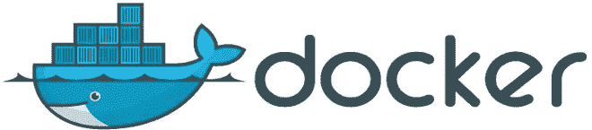

# 了解 2018 年 Web 开发部署

> 原文：<https://levelup.gitconnected.com/web-development-deployment-b4d8b7f44f3e>

## 使用这些现代部署渠道快速启动 web 应用

SpaceX 在 [Unsplash](https://unsplash.com?utm_source=medium&utm_medium=referral) 上拍摄的

*本文是 9 篇系列文章***的第 7 篇。**

*有各种平台和工具可以帮助您进行部署，这是将您的网站或应用程序提供给外部访问的过程。这些在 [SyntaxFM](https://syntax.fm/) 的[这一集](https://syntax.fm/show/029/hosting-and-servers-heroku-now-galaxy-digital-ocean-linode-docker-netlify-and-more)中得到全面的介绍和比较。下面是标准选项的快速总结。*

*然而，在我们进入选项之前，您需要了解您可能遇到的不同类型的服务器，以及它们的区别。*

**

*数据中心:版权归 [TechDonut](https://www.techdonut.co.uk/computer-hardware/network-servers/managed-server-hosting-your-server-in-the-cloud) 所有*

# *常规服务器*

*共享主机是指与多个用户共享一台服务器。主要缺点是，如果另一个用户的网站意外崩溃，整个服务器可能会瘫痪。这些产品一开始就很容易获得，价格也很合理，但是它们缺乏真正的服务器控制和性能。这些服务器通常预装了一些软件，比如 Apache，它会为你创建一个 HTTP 服务器并提供你的文件。对于最基本的、最基本的网站，有[000 网络主机](https://www.000webhost.com/)。这项服务为你提供了一个免费的共享服务器空间，可以为你的应用程序添加一个数据库，免费的域名，一键式安装 Wordpress 和 Joomla 等服务。*

*对于[专用主机](https://www.rackspace.com/en-nl/library/cloud-vs-dedicated)，您可以为自己租赁或购买整个服务器。这些都是相对昂贵的，通常是保留给企业有大量的交通，也需要最高数量的定制为他们的服务器。这些也往往需要专门的 IT 人员来管理服务器。本文不会太深入地比较不同的专用服务器，因为这些通常可以归结为非常小的个体差异。然而，两个流行的专用托管服务是 [Leaseweb](https://www.leaseweb.com/) 和 [Rackspace](https://www.rackspace.com/) 。*

**

*云服务器图:版权归[自动化 ICT](http://www.automation.nl/) 所有*

# *云服务器*

*云服务器是在某种程度上充当专用服务器的服务器，但通常也是共享的。云是一个需要适当讨论的大话题，因此如果您需要更深入的信息，请参考本文。*

*实现这一点的一个困扰的方法是通过虚拟专用服务器(VPS)。在 VPS 中，有几个虚拟区间，您可以根据自己的需求进行配置，每个应用程序或网站都包含在其区间中，这是一个额外的好处(这被称为“[容器化](https://searchitoperations.techtarget.com/definition/application-containerization-app-containerization)”)。*

*这些服务器允许根据您的需求进行大量定制，并提供对您的服务器的管理员(root)访问权限，但它们的价格适中，并且可能需要一些服务器管理方面的专业知识才能入门。这些可以是空的虚拟隔间，你需要自己安装所有东西，就像 [DigitalOcean](https://www.digitalocean.com/) 只为你提供一台 [Ubuntu](https://www.ubuntu.com/) 机器，其他一切都由你决定。*

**

*主要云提供商:版权归 [Wodby](https://wodby.com/pricing-plans) 所有*

*云托管是这一类别中最新的服务器类型，也是最著名的应用程序(Snapchat、脸书、谷歌)的主要服务提供商。您可以配置您喜欢的任何类型的服务器——无论是用于托管数据库、提供静态内容(如图像)还是托管您的应用程序本身。这些服务理论上非常便宜，因为你只需为你使用的东西付费，但是在你掌握它之前，它们确实有相当长的学习曲线。*

*周围最突出的云服务器厂商是[亚马逊网络服务](https://aws.amazon.com/)(AWS)[谷歌云服务](https://cloud.google.com/) (GCS)，以及微软的 [Azure](https://azure.microsoft.com/) 。您可能会注意到，所有这些服务都有多个可用选项。如前所述，这些是可用的不同类型的服务器。与其他服务器相比，特定服务器针对特定任务进行了更好的优化。有关这些云服务的更多信息，请参考本文。*

**

*无服务器:版权归 [glitch](https://medium.com/@glicht/serverless-framework-defining-per-function-iam-roles-c678fa09f46d) 所有*

# *无服务器*

*无服务器是一种应用程序架构设置。这曾经有一个不同的名字“后端即服务”(“BaaS”)。这些是指严重依赖第三方服务来处理其后端需求的应用程序。关于无服务器的详细解释，请参考本文。这些服务依赖于上一节中提到的云计算服务，但是它们通过提供一个简单的界面更进一步。*

*这些服务非常有益，因为它解决了许多管理服务器的难题。Zeit 是一种新的流行的无服务器服务，它有一个免费层。Zeit 是专门针对程序员的，它通过你的[终端](https://medium.com/@jordanmauricio/3e9117c5141a#7749)来管理一切(如果你不知道终端是什么，那将在下一节讨论)。安装 Zeit 后，你需要做的只是设置一些简单的配置，你可以在你的应用程序文件夹中通过他们的[“现在”](https://zeit.co/now)命令部署你的应用程序。然而，值得注意的是，Zeit 目前并不提供数据库连接，而是推荐使用第三方数据库管理器，如 [mLabs](https://mlab.com/) 。*

**

*Firebase 徽标:版权归 [Rx2Firebase](https://proandroiddev.com/rx2firebase-firebase-rxjava-android-bde8158fb4cf) 所有*

*另一个受欢迎的选择是 [Firebase](https://firebase.google.com/) ，它提供了数据库、认证、托管等多项服务(它还有一个免费层！). [Netlify](https://www.netlify.com/) 通过静态站点生成器提供快速简单的部署，并支持 HTTPS 域。 [Github Pages](https://pages.github.com/) 对于已经托管在 Github 上需要登陆页面的项目来说非常理想。它允许你托管你的应用，但是代码是公开的。*

*还有其他服务，比如 Heroku，它提供了一个非常相似的产品，但是提供了更多的服务，比如自动化、平滑扩展、易于部署、插件等等。Heroku 有一个免费层，可以选择在需要的时候升级你的服务。最后，还有一些服务，如运行在 AWS 服务器上的 AWS Lambda，它通过自动扩展(根据有多少用户使用你的网站或应用程序来扩展你的服务器)来为你解决管理上的麻烦。*

**

*Docker 标志:版权归[罗明·伊拉尼的博客](https://rominirani.com/learning-docker-move-to-the-cloud-3326369300ad)所有*

# *额外的*

*还有许多其他的解决方案，特别是对于那些对开发或管理服务器感兴趣的人。向开发者提供的一项服务是 [Docker](https://www.docker.com/) ，对 Docker 的全面概述不在本报告的范围之内(参见[这篇文章](https://www.docker.com/what-docker))。Docker 创建指定特定配置(操作系统、库、运行时版本等)的虚拟容器。).让开发人员在他们的计算机上模拟服务器环境，从而解决“它在我的 pc 上也能工作”的老问题 Docker 有一个众所周知的陡峭的学习曲线，但它绝对值得麻烦。*

# *[下一篇文章:工具→](https://medium.com/@jordanmauricio/3e9117c5141a)*

*

[https://levelup.gitconnected.com/](https://levelup.gitconnected.com/)*