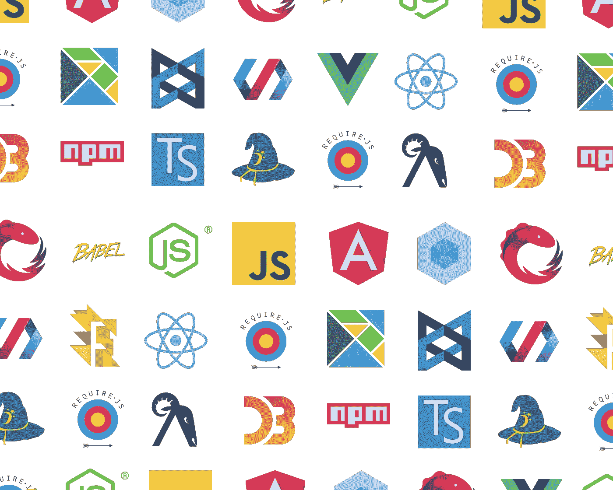

# 了解 2018 年的 Web 开发框架

> 原文：<https://levelup.gitconnected.com/web-development-frameworks-475e06016093>

## 作为一个 web 开发人员应该知道的最重要的前端库

JavaScript 框架集:版权所有[何塞·阿吉纳加](https://hackernoon.com/how-it-feels-to-learn-javascript-in-2016-d3a717dd577f)

*本文是 9 篇系列文章**[*的第 4 篇。*](https://medium.com/@jordanmauricio/the-non-developers-guide-to-development-in-2018-7f023a2ff5e1)*

开发框架是其他开发人员创建的工具和库，用于实现特定的技术目标或简化特定语言的开发。近年来，针对 web 开发的前端框架越来越多。这些框架大多有一个共同的目标:促进开发。他们如何实现这个目标是他们与众不同的地方。请注意，这里讨论的框架是针对 web 应用程序的，通常不是简单的网站。这意味着当有大量数据需要移动时，它们会表现出色。

在本文中，我们将介绍 web 开发人员使用的主要前端和后端框架。

# 前端框架

React:版权归 [FreeCodeCamp](https://medium.freecodecamp.org/where-do-i-belong-a-guide-to-saving-react-component-data-in-state-store-static-and-this-c49b335e2a00) 所有

# 反应

目前最流行的框架是脸书的 React 库。React 的目标是帮助创建用户界面并拥有“反应式”数据——无需刷新或更新整个页面即可更新的数据。它从动画库中获得灵感，使用一种名为`render()`的“绘制”功能，系统地检查应用程序的每个不同部分，如果检测到变化，它将只更新需要更新的特定部分。

React 已经成为最受欢迎的前端库大约 3-4 年了，因为它有丰富的开发经验，能够在保持性能的同时扩展大型生产应用程序。它引领了使用组件构建 web 应用程序的方式。它还引入了虚拟 DOM 的概念，虚拟 DOM 在内存中维护应用程序的副本，允许非常快速地检查更改。

除了 React，你还会发现另一个专门为使用 React 为 iOS 和 Android 创建原生应用而开发的脸书库 [React Native](https://facebook.github.io/react-native/) 。为了实现这一点，它允许开发人员在 React(和 [JSX](https://reactjs.org/docs/introducing-jsx.html) )中编写他们的代码，一旦完成，他们可以使用本地引擎导出他们的应用程序。然后，这些代码被分别转换成 Java 和 Swift，用于 Android 和 iOS，并输出到 Android 中的应用程序。apk 和 iOS。ipa 文件类型。此外，在 React Native 的基础上还有另一个名为 [Expo](https://expo.io/) 的库，它允许你使用智能手机 API 并与之交互，如相机、图库和无数传感器。

VueJS:版权所有 [Lukasz Tkacz](https://tkacz.pro/kategoria/vue-js/)

# vue . j

前端框架界的另一颗新星是 [Vue.js](https://vuejs.org/) ，通常被称为 Vue(读作“view”)。事实上，Vue 最近在 GitHub 上通过了 React。众所周知，Vue 比 React 更容易理解，难以置信的轻量级，并且不那么固执己见。本质上，你可以把 Vue 完全集成到你的应用中，让它成为你自己的。

Vue 提供了与 React 相同的开发体验:一个为方便用户界面的构建而构建的库。Vue 本身的初始功能比 React 少得多，但这一功能可以通过官方支持的软件包快速添加到 Vue 应用程序中。它还提供了自己的 HTML 模板解决方案，但是作为一名开发人员，你可以选择其他选项，比如 JSX。与 React 和其他公司相比，编写 Vue 应用程序的风格是 Vue 与众不同的另一个方面。Vue 允许您编写常规的 HTML 文件(而不仅仅是 JSX)，然后可以与您的 JavaScript 处理程序绑定来执行更新，而不需要刷新。

Angular 2.0:版权归[矢量区域](https://www.vectorlogo.zone/logos/angular/index.html)所有

# 有角的

几年前，谷歌开发了 [Angular](https://angular.io/) ，当时是群雄逐鹿的领头羊，很快超过了它的前辈。Angular 在保持代码的简单性和组织性方面是革命性的，即使当你需要大规模扩展时也是如此。Angular 允许任何来自其他语言的程序员使用 JavaScript，并很快开始构建应用程序。

仅仅为了得到谷歌的支持，它很快就赢得了社区的信任，但在其大获成功的 [Angular 1.0](https://angularjs.org/) 发布后，每次更新都彻底改变了一切，以至于开发人员不得不[重新学习大量的库](https://hackernoon.com/why-learning-angular-2-was-excruciating-d50dc28acc8a)以保持最新，此外每次更新都会破坏应用程序。

Angular 是一个非常固执己见的前端 MVC 框架。它控制整个应用程序，而不仅仅是视图层，视图层是 React 和 Vue 管理的。它迫使你以“棱角分明的方式”做事，使你更难适应个人需求。此外，它使用了一个被称为双向数据绑定的概念，这个概念强制视图和模型层总是同步的。这种数据管理方法，尤其是在版本 1 中，没有随着应用程序的复杂性而扩展，并且严重降低了性能。固执己见的哲学加上它的发布周期导致不断的突破性变化，这使得 Angular 在更大的 web 开发社区中失去了一些人气。

# 其他人

恩伯:版权归[自由代码营](https://medium.freecodecamp.org/setting-up-a-basic-ember-js-app-c9323760c675)所有

在这三个之前，当然还有启发他们的 web 开发框架。这些例子包括，但不限于，[主干](http://backbonejs.org/)与[回退](http://kmalakoff.github.io/knockback/)，以及[余数](https://www.emberjs.com/)。这些框架解决了大致相同的问题:如何促进 web 应用程序的创建。它们至今仍在使用，尤其是 Ember，因为它们既简单又稳定。为什么这些框架在 React、Vue 或 Angular 流行期间失宠了？我首先要说，它们并没有完全失宠，因为今天仍有许多开发人员在这些框架中构建应用程序。然而，由于 React 和 Vue 的地位，它们受到了更多的炒作。只有时间能告诉我们哪个框架会胜出。

# 后端框架

流星标志:版权归[流星](https://meteor.com)所有

# 流星报

[Meteor](https://www.meteor.com/) 是一个流行的开源 web 框架，以其[同构 JavaScript 设计模式](https://the-pastry-box-project.net/charlie-robbins/2014-november-5)而闻名。由于其同构的性质，Meteor 是这个列表中的一个特殊项目，这意味着 Meteor 打算同时在客户机和服务器上运行。对于全栈开发人员来说，Meteor 是一个优秀的框架，因为它建立在 Node.js 之上，为开发人员创建后端开发环境，并且您还可以用 Meteor 的 [Blaze 框架](http://blazejs.org/)替换另一个 UI 库，如 React 或 Angular。Meteor 还有一个名为 [Vulcan.js](http://vulcanjs.org/) 的专有工具，它允许你将 Meteor 与 React 和 GraphQL 结合使用。

快递标志:版权归[快递](https://expressjs.com/)所有

# ExpressJS

对于想要创建 web 应用程序的 Node.js 开发人员来说， [Express](https://expressjs.com/) 是一个显而易见的工具，它是 Node 最流行的 web 应用程序库之一。Express 附带了几个现成的工具，可以轻松地用 JavaScript 创建带有路由、中间件等的 HTTP 服务器。它还拥有大量的扩展，可以根据每个应用程序的独特要求和需求进行定制。

Laravel 徽标:版权所有 [Pineco.de](https://pineco.de/vue-components-laravel-based-apis/)

# 拉勒韦尔 Symfony 公司

PHP 开发者也有几个框架，目前最流行的一个是 [Laravel](https://laravel.com/) 。Laravel 是一个免费的 PHP 开源框架，它为开发者提供了几个工具，专注于依赖管理、数据库连接、应用程序维护和部署。Laravel 基于另一个流行的 PHP 框架，名为 [Symfony](https://symfony.com/) ，它将可重用组件和库的概念引入了 PHP。

Django 徽标:版权所有 [BrandsOfTheWorld](http://www.brandsoftheworld.com/logo/django)

# 姜戈&弗拉斯克

对于想要创建 web 应用程序的传统 Python 开发者来说，有 [Django](https://www.djangoproject.com/) 。Django 遵循 PHP 的简单原则，但让 Python 开发者能够创建复杂的数据库驱动的网站。如果您的应用程序需要更小、更包容，另一个流行的 Python 框架是 [Flask](http://flask.pocoo.org/) 。Flask 是一个微框架，它不附带常见的 Django 工具，如表单验证和数据库连接。然而，有一些扩展可以将这些实用程序添加到 Flask 中，同时为开发人员提供了对其代码库中确切内容的更多控制。

Ruby on Rails Logo:版权所有 [RoR](https://rubyonrails.org/)

# Ruby on Rails

也许这个列表中最著名的框架是 [Ruby on Rails](http://rubyonrails.org/) (RoR)。这是面向 Ruby 开发者的 web 框架。RoR 影响了这个列表中的大多数框架，包括但不限于 Django、Laravel、Ember 和 Sails.js for Node。在 RoR 的早期，它引入了一些便利的工具，如无缝数据库管理、脚手架、迁移和其他工具，这些工具今天仍在用于快速应用程序开发。

此外，RoR 将常见的编程设计模式和范例引入了 web 开发社区，如[约定优于配置](https://facilethings.com/blog/en/convention-over-configuration) (CoC)和[不要重复自己](http://deviq.com/don-t-repeat-yourself/) (DRY)，这启发了其他著名的框架，如 React 和 Angular。Ruby on Rails 是至今仍在使用的最古老的框架之一。它经过了彻底的测试，经受住了时间的考验，这使得它在今天仍然是创建新的 web 应用程序的有效选择。

# 羧甲基淀粉钠

CMS 代表“内容管理系统”,因为这就是 CMS 的作用:它允许你在应用程序的前端快速创建和管理所有的数据和内容。CMS 框架主要由为客户工作的机构使用，客户需要在不具备任何技术背景的情况下编辑页面内容的能力。有几种不同类型的 CMS 可供使用，从最小到整个平台。我们将讨论三种最常见的类型。

WordPress 标志:版权归[所有](https://wordpress.org/about/logos/)

# 平台

Wordpress 是目前为止使用最广泛的网站内容管理系统，占所有网站的 30%以上，占内容管理系统市场近 60%的份额。自从 Wordpress 的第 4 版以来，它的受欢迎程度已经上升，第 4 版包含了一个 API，可以通过后端结合灵活的前端进行通信。还有其他选择，比如针对内容的 [Joomla](https://www.joomla.org/) 或者针对网络应用的 [Drupal](https://www.drupal.org/) (通常更多是在企业环境中)。 [CraftCMS](https://craftcms.com/) 是另一个流行的 CMS，它专注于简单而不牺牲功能。

Shopify 徽标:版权归 [ReferralCandy](https://www.referralcandy.com/blog/shopify-success-stories/) 所有

# 电子商务

这些 CMS 专门用于创建电子商务网站。在这个类别中 [Shopify 最近已经超过了 Wordpress 的 WooCommerce](https://trends.builtwith.com/shop) 插件，使 [Shopify](https://www.shopify.com/) 成为世界上使用最多的电子商务 CMS，并占所有电子商务网站的 10%。 [WooCommerce](https://woocommerce.com/) 占 8%的市场份额，但紧随其后的是值得关注的电商 CMS [Magento](https://magento.com/) 占 7%。

杰基尔标志:版权归[戴夫·文策尔有限责任公司](http://davewentzel.com/content/Jekyll/)

# 静电发电机

最后，还有静电发电机。这些 CMS 用于使更新网站内容变得非常容易，几乎不需要编程。这些通常是对传统后端的补充，提供一个数据库(或类似的)和完全可定制的前端。有些甚至提供低成本或免费的托管和部署。静态站点生成器最近因其易用性获得了极大的关注，特别是对于像博客或登录页面这样的 web 应用程序。

GitHub Pages 本身并不是一个生成器，但是由于它作为一个托管服务提供商很受欢迎，所以被用于这个目的。 [Jekyll](https://jekyllrb.com/) 已经变得非常受欢迎，因为它可以与 GitHub 页面一起开箱即用，并且是最早可用的静态站点生成器之一(更不用说它是免费的)。其他流行的替代方案包括开源项目[雨果](https://gohugo.io/)、[盖茨比](https://gatsbyjs.org/)和 [React Static](https://github.com/nozzle/react-static) 。

# [下一篇文章:实用程序→](https://medium.com/@jordanmauricio/web-development-utilities-8b812e92184d)

