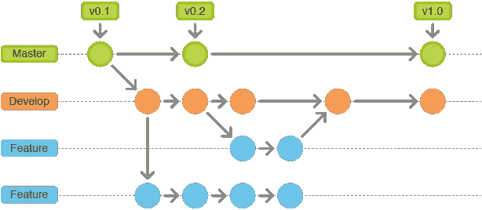
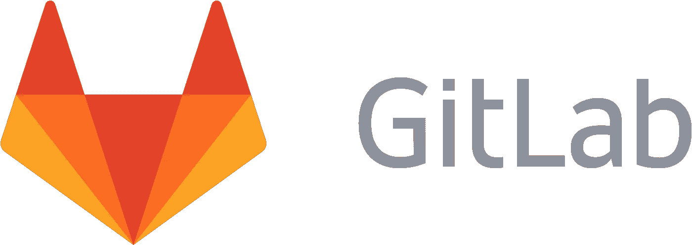
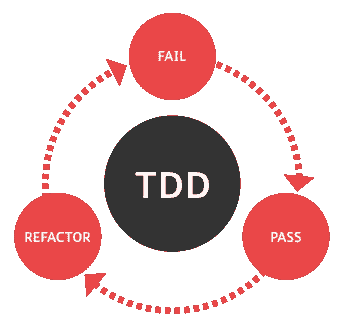

# 2018 年面向 Web 开发的 Git 和测试

> 原文：<https://levelup.gitconnected.com/web-development-git-testing-1d475d2fb7bc>

## 通过本测试和版本控制教程，保持代码的整洁和可伸缩性

Git 流:版权归 Leanpub 所有

*本文是 9 篇系列文章* *中的* [*的第 6 篇。*](https://medium.com/@jordanmauricio/the-non-developers-guide-to-development-in-2018-7f023a2ff5e1)

无论你是一个网页开发者还是一个普通的程序员，版本控制系统(VCS)都是必不可少的。这些系统在您开发时跟踪您代码中的所有更改，因此您可以看到您采取的所有步骤，并允许您在您进行了不需要的更新时恢复到应用程序的先前状态。

目前使用的最著名的 VCS 是由 Linux 创造者 Linus Torvalds 开发的 Git。Git 对于跟踪整个组设置的变化非常有用。它允许每个人创建他们的“主”版本(当前接受的正在使用的应用程序)，通过提交将他们的更改添加到它，然后创建“拉请求”，请求将您的更改添加回应用程序的主分支的权限。

GitHub 徽标:版权归[developez](https://www.developpez.net/forums/attachments/p358946d1/a/a/a)所有

# 开源代码库

可以说是目前最受欢迎的 Git 资源库， [GitHub](https://github.com/) 托管了一些迄今为止[最知名的项目](https://github.com/search?o=desc&q=stars%3A%3E1&s=stars&type=Repositories)([React](https://github.com/facebook/react)、 [Node](https://github.com/nodejs/node) 、 [MomentJS](https://github.com/moment/moment) 、 [Bootstrap](https://github.com/twbs/bootstrap) (CSS 库)、 [TensorFlow](https://github.com/tensorflow/tensorflow) (AI 工具)、 [Linux](https://github.com/torvalds/linux) (OS 内核)。它提供了一个免费层，是一个很好的起点。此外，它为学生开发者提供了一个免费的、慷慨的[包](https://education.github.com/pack)，里面装满了工具和折扣。GitHub 是开源项目最大的回购。

GitLab 徽标:版权归 [GitLab 论坛](https://forum.gitlab.com)所有

# GitLab

对于更加面向业务的存储库，有 [GitLab](https://about.gitlab.com/) ，除了他们的 Git 存储库之外，还专注于 [CI/CD](https://medium.com/@jordanmauricio/39ed3544e95c#ced6) 服务。GitLab 也有一个免费层，但大多数都有封闭的存储库，这使它成为企业内部项目的理想选择。

测试驱动开发(“TDD”)图:版权归 [SoapUI](https://www.soapui.org/learn/functional-testing/test-first.html) 所有

# **测试**

虽然测试是开发的一部分，但却是最常被忽视的一部分。这是指在你的应用程序中创建不同层次和程度的自动测试。自动测试是至关重要的，因为当你的应用程序扩展并变得更加突出时，尤其是有多个开发人员在其上工作时。这使得测试每一个细节以确保每一件事都按预期运行变得至关重要。下面列出了这些不同类型的测试和工具。

# 测试类型

你可以将[测试](https://codeutopia.net/blog/2015/04/11/what-are-unit-testing-integration-testing-and-functional-testing/)分成[许多](https://stackoverflow.com/questions/520064/what-is-unit-test-integration-test-smoke-test-regression-test) [类别](https://www.sitepoint.com/javascript-testing-unit-functional-integration/)。然而，为了保持这份报告的简短，我们针对三个最常见的，所谓的:单元测试、集成测试和功能测试。

单元测试是三种测试中最简单的。它们的本质是将各种类型的输入插入到单个函数或类中，并监视输出以获得预期的答案。集成测试更进了一步，通过验证它们的行为以及任何潜在的副作用来测试整个组件或一组流程。在应用程序本身中，功能测试，也称为 UI 测试，是通过操纵浏览器或网站来执行的测试，而不管内部如何接收预期的行为。

Jest Logo:版权所有 [Henrique Limas](https://medium.com/henrique_limas/jest-is-awesome-and-you-should-use-it-581b2afbf9e3)

# 工具

有各种各样的工具可以帮助你，每种工具都有各自的优点和缺点。脸书的[笑话](https://facebook.github.io/jest/)就是一个工具。Jest 为您提供了断言函数、测试架构、代码覆盖率和更多功能。对于更专业的方法，您可以考虑使用 [Mocha](https://mochajs.org/) 来测试结构并观察测试结果，或者使用 [Enzyme](https://github.com/airbnb/enzyme) 来测试是否加载了 React 组件的适当版本。

此外，还有 [Casper](http://casperjs.org/) 或 [Phantom](http://phantomjs.org/) 来执行浏览器级别的测试。

对于 PHP 开发者来说， [Behat](http://behat.org/en/latest/) 是必须的，而 Python 和 Ruby 分别有 [Behave](https://github.com/behave/behave) 和 [Rspec](http://rspec.info/) 。要了解更多关于这些方法的信息，以及大量的其他选择，你可以随意参考关于这个主题的[这篇文章](https://medium.com/welldone-software/an-overview-of-javascript-testing-in-2018-f68950900bc3)。

# [下一篇文章:部署→](https://medium.com/@jordanmauricio/deployment-b4d8b7f44f3e)

