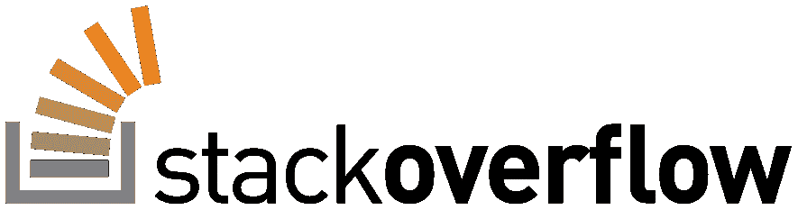
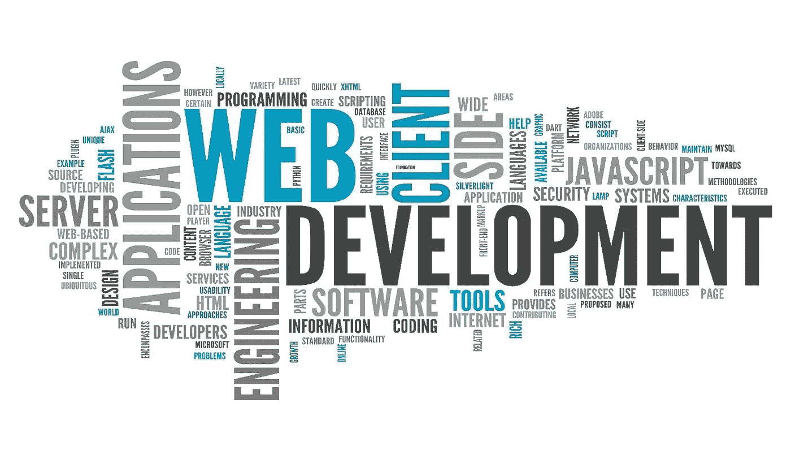
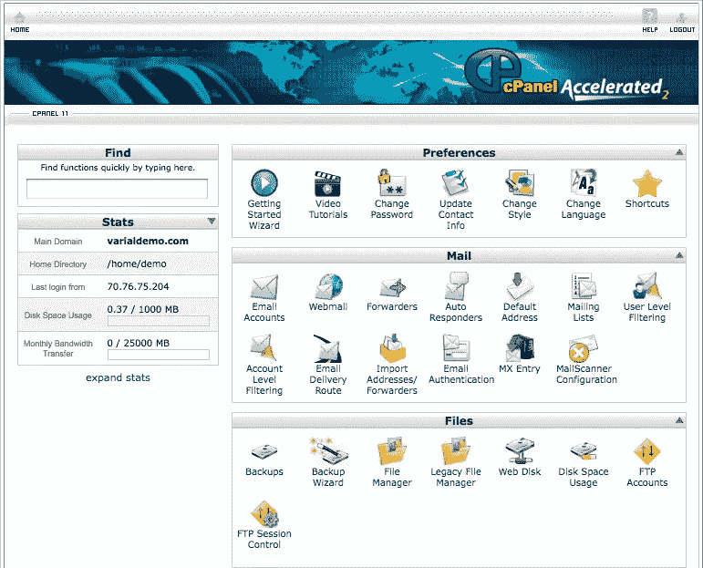

# 2018 年网页开发简介

> 原文：<https://levelup.gitconnected.com/web-development-introduction-39ed3544e95c>

## web 开发概述以及如何理解不断变化的环境

照片由 [Goh Rhy Yan](https://unsplash.com/@gohrhyyan?utm_source=medium&utm_medium=referral) 在 [Unsplash](https://unsplash.com?utm_source=medium&utm_medium=referral) 上拍摄

*本文是 9 篇系列文章***的第 1 篇。**

*这份报告更多的是给潜在的 web 开发者的指南，因此没有必要阅读全部内容。你可以只阅读与你要解决的问题相关的章节。请记住这一点。*

*本报告涵盖的主题可分为三类:*

*   ***核心**能力*(语言、数据)**
*   ***中级**能力*(测试，git)**
*   ***软**技能*(编辑、调配)**

*与开发人员相关的主题比这份报告涵盖的要多，但是在我看来，这些是一个好的开发人员需要知道的所有能力和技能，不管他们的堆栈如何。web 开发领域(主要针对 JavaScript 和节点开发人员)正处于一个非常混乱的状态，每天都有新的框架和工具出现，这一点我们将在后面深入探讨。由于这种混乱，这份报告将试图把重点放在当前的“标准”上，尽管这些标准在未来可能会改变。尽管如此，这些工具和技能背后的原理和原因将会持续更长时间。*

**

*StackOverflow，发展的圣经*

*在整个报告中还提供了单独的链接，以便在必要时对不同主题进行更深入的阅读。此外，这份报告将稍微更多地关注 JavaScript，而不是 PHP 等其他著名的 web 开发语言，因为 JavaScript 是 [StackOverflow 2018 开发者调查](https://insights.stackoverflow.com/survey/2018/)中[最受欢迎的语言](https://insights.stackoverflow.com/survey/2018/#technology-programming-scripting-and-markup-languages)，以及[排名前三的 JavaScript 库和框架](https://insights.stackoverflow.com/survey/2018/#technology-frameworks-libraries-and-tools)。更不用说 JavaScript 是[第二最想要的语言](https://insights.stackoverflow.com/survey/2018/#technology-most-loved-dreaded-and-wanted-languages)，React 和 Node 是[最想要的两个库或框架](https://insights.stackoverflow.com/survey/2018/#technology-most-loved-dreaded-and-wanted-frameworks-libraries-and-tools)。*

*这份报告的目的是让你更好地理解 web 开发人员在谈论什么，他们使用什么工具，以及成为一名 web 开发人员需要做些什么。乍一看，这个列表可能令人望而生畏，但是它已经被分解成一个易于管理的 3 步指南，指导如何设置、构建和部署一个网站或 web 应用程序。*

# *词汇表:连珠炮似的流行语*

**

*Web 开发世界云:版权归 QLTech 所有*

*快速列表来帮助你理解[行话](https://developer.mozilla.org/en-US/docs/Glossary)。*

*   ***App，应用程序:**应用程序是一种运行在计算机上的程序，它被构建来执行特定的任务以使用户受益。*
*   ***Web 应用程序:**Web 应用程序与常规应用程序相同，但运行在服务器上。这样做的好处是，任何人都可以通过 web 浏览器访问您的应用程序，而不必将它下载到自己的计算机上。*
*   ***前端，客户端:**应用程序的用户界面或客户端是用户与之交互的部分，也称为“前端”，因为它与应用程序的外观、体验和界面有很大关系。*
*   ***后端，服务器端:**应用程序的服务器端是所有业务逻辑和认证逻辑发生的地方。“服务器端”也被称为应用程序的“后端”,因此不需要任何界面来进行交互。*
*   ***堆栈:**这些是我们用来运行应用程序的语言、工具、实用程序、框架、网络和服务。*
*   ***全栈:**全栈开发者是指既能编写应用前端程序又能编写后端程序的开发者。这是一项相当复杂的技能，需要掌握，因为前端编程与后端编程有很大的不同，每种编程都需要独特的思维方式。*
*   ***HTTP(S)，SSL，TLS:** HTTP 是一种通过使用网络浏览器传输数据的协议，SSL 和 TLS 是在 HTTP 之上使用的两种流行协议，使 HTTP 成为 HTTPS，因此是一种安全的数据传输协议。*
*   ***API:** API 是一组允许创建应用程序的功能和过程。API 支持访问操作系统、应用程序或其他服务的功能或数据。*
*   ***AJAX:** 使用 [AJAX](https://books.google.nl/books/about/Beginning_Ajax.html?id=6WD6hPJGJm8C&redir_esc=y&hl=en) ，web 应用程序可以异步地(在后台)向服务器发送和检索数据，而不会干扰现有页面的显示和行为。*
*   ***JSON:** [JSON](http://javascript-coder.com/tutorials/re-introduction-to-ajax.phtml) 是一种开放标准的文件格式，它使用人类可读的文本来传输由键值对和数组数据类型组成的数据对象。*
*   *YAML 是一种人类可读的数据序列化语言。它通常用于配置文件，但也可以用于存储或传输数据的许多应用程序中。它也是 JSON 自 [YAML 1.2](http://yaml.org/spec/history/2001-12-10.html) 以来的超集。*
*   *环境变量是一个动态命名的值，它可以影响正在运行的进程在计算机上的行为。这用于例如存储秘密访问密钥和密码。*
*   ***节点模块(node_modules):** 这是大多数现代 web 应用程序中的一个文件夹，其中存放着各种迷你框架和实用工具。在后面的节点章节中会有更多的介绍。*
*   ***Package.json:** 这是大多数现代 web 应用程序根目录下的一个文件。它详细介绍了应用程序中使用的依赖项以及开始运行它的步骤。*
*   ***CI/CD:** 这指的是*持续集成*(每天至少一次将团队应用程序副本中的每个开发人员合并到一个主项目中)和*持续交付*(以非常小的增量工作的实践，您可以持续地发布，而不是每隔几个月发布一个大的版本)。*
*   ***函数式编程:**一种[编程范式](https://medium.com/@cscalfani/so-you-want-to-be-a-functional-programmer-part-1-1f15e387e536)(构建程序的风格)，将数据的处理视为绝对的，避免改变状态和可变数据。这现在变得非常流行。*
*   ***静态或动态类型:**这可能是一篇独立的文章，[所以这里有一篇很好的文章](https://www.sitepoint.com/typing-versus-dynamic-typing/)。这指的是用类型(即字符串、布尔值等)，或者允许在执行过程中对其进行更改。*
*   ***Markup 和 Markdown:** Markup 是一个通用术语，用于描述描述文档格式的语言，而 Markdown 是这些特定语言中的一种。*
*   ***跨平台:**这些应用和程序可以在不同的操作系统(MacOS、Windows、Linux)上运行，而无需编写特定于平台的代码。*
*   ***原生与 PWA 与混合:**这些是不同类型的智能手机应用。原生应用程序是专门为一个平台编写的，最常见的分别是 Android 平台的 Java 和 iOS 平台的 Swift。渐进式网络应用程序 (PWAs)是一种非常新的创建智能手机应用程序的方法，其中网络应用程序在智能手机上运行，无需任何安装。最后，混合应用程序是为 web 编写的应用程序，但随后通过一个使用该代码并输出本机代码的程序(例如 [Cordova](https://cordova.apache.org/) )。*

# ***即插即用***

*这是一个非常简短的部分，适合那些不愿意做太多(或很少)开发和设置，而希望在短短几分钟或几小时内完成并运行的人。*

**

*Squarespace 徽标:版权归 Squarespace 所有*

## *方形空间*

*这家软件即服务公司允许你创建一个网站，编辑所有内容，为你设计，处理你所有的域名需求和托管需求，每月收取少量费用。目前，对于开箱即用的网站，这是你最好的选择。在网上快速搜索也会发现你头几个月的折扣代码。*

## *网站建设者*

*虽然这些服务相对便宜，但同样的价格你可以得到更好的服务。如果你正在寻找一个博客， [Wordpress](https://wordpress.com/) 自己提供了一个优秀的(可选免费的，[计划](https://wordpress.com/pricing/)从€48/y 开始)最低限度的托管服务，或者你可以使用 [Siteground](https://www.siteground.com/) 来满足更高的需求。此外，还有一个免费的托管版 cPanel 服务，允许你在 Apache 服务器上提供文件。这个也免费。但是，您将拥有一台共享主机(例如，多人使用同一台服务器)，这意味着如果一个人的应用程序宕机，整个服务器也会宕机，因此请务必记住这一点。*

**

*cPanel 接口示例:版权归 [Varial Hosting](https://varialhosting.com/about/software/cpanel/) 所有*

*其他几家公司也通过使用 cPanel 提供廉价的托管服务: [Hostgator](https://www.hostgator.com/) 、 [BlueHost](https://www.bluehost.com/) 、 [Hostinger、](https://www.hostinger.com/)和 [GoDaddy](https://www.godaddy.com/) 是一些著名的公司。这些服务为您提供共享的服务器空间和 FTP(文件传输协议)接口，用户只需将他们的网站文件转储到其中，主机通过将这些文件提供到您相应的 IP 地址来完成剩下的工作。这些服务有时还集成了所谓的“网站构建器”，为用户提供一键安装。这通常由不同的服务或插件执行，通常是 [Installatron](https://installatron.com/) 。*

*在本系列的下一篇文章中，我们将涵盖 2018 年推动 web 开发的许多语言，包括对 JavaScript 的深入研究，以及关于 PHP、Ruby、Python 和 Golang 的高级信息。*

# *[下一篇文章:语言→](https://medium.com/@jordanmauricio/36241b046a81)*

**