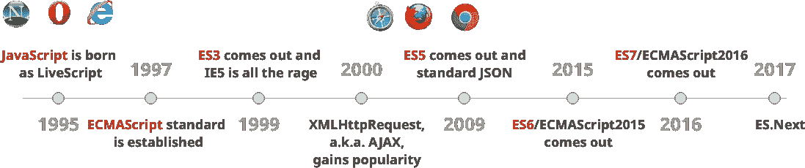
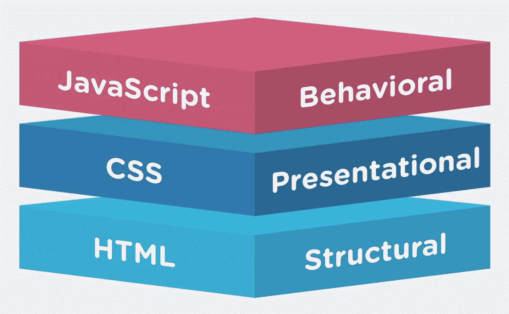

# 了解 2018 年 Web 开发编程语言

> 原文：<https://levelup.gitconnected.com/web-development-languages-36241b046a81>

## web 开发人员需要学习的顶级编码语言概述

*本文是 9 篇系列文章***的第 2 篇。**

*一般来说，语言是任何应用程序、网站或软件的基石。本节将为您提供当前流行语言的简要概述，它们在 web 开发环境中的有用性，以及它们是否在 web 开发之外使用。*

**

*由 [Kobu 机构](https://unsplash.com/@kobuagency?utm_source=medium&utm_medium=referral)在 [Unsplash](https://unsplash.com?utm_source=medium&utm_medium=referral) 上拍摄的照片*

# *Java Script 语言*

*近年来，JavaScript 已经成为构建网站时事实上的首选语言，也是构建 web 应用程序最流行的语言之一。这背后有许多原因，包括它对对象的处理和快速构建应用程序的能力。有些人认为它的流行是不公平的，因为与更传统的编程语言相比，JavaScript 有很多明显的缺点。JavaScript 有一些奇怪的怪癖和行为困扰着一些工程师。每个人都同意的一件事是，JavaScript 是当今使用最多的语言之一，并且不管出于什么目的，它似乎都将保持这种状态。了解 JavaScript 对于任何 web 开发人员来说都是必不可少的*

*为了弥补 JavaScript 的缺点，开发人员创建了大量的库，每个库都试图解决自己的问题，或者很多库试图以略微不同的方式解决相同的问题。熟悉这些库已经变得至关重要，即使仅仅是意识到您可以使用它们来简化您的开发过程。最广泛使用的一些库如下: [Lodash](https://lodash.com/) (实用程序、计算)、 [Ramda](http://ramdajs.com/) (将[函数式编程](https://medium.com/@jordanmauricio/39ed3544e95c#0bad)引入 JavaScript)、 [TypeScript](https://www.typescriptlang.org/) (引入在 JavaScript 中显式定义你的变量类型)。*

*JavaScript 语言的维护者当然意识到了这些需求，并将这些受欢迎的特性添加到核心 JavaScript 标准久而久之中。但是，有一个区别需要说明:ECMAScript 和 JavaScript 之间的区别。*

**

*阿德里安·梅希亚版权所有的伟大时间线*

## *ECMAScript/ES6/ES8*

*[ECMAScript](https://en.wikipedia.org/wiki/ECMAScript) 是定义脚本语言应该做什么的标准，JavaScript 是 ECMAScript 的实现。ActionScript 是另一个近年来很少使用的例子(关于原因的解释，请参考 [this Quora 评论部分](https://www.quora.com/Adobe-Creative-Suite-Is-there-still-any-reason-to-learn-Flash-and-or-ActionScript))，但它遵循与 JavaScript 相同的 ECMA 标准。网络浏览器有各种各样的引擎来编译、理解和运行 JavaScript 代码，但是这些引擎通常运行 ECMAScript 标准。*

*因为 ECMAScript 每年都会发布一个新版本，所以这些引擎有时很难跟上语言的变化。这就是为什么我们在 ES6/ES2015 和任何新版本(如 ES9/ES2018)之间建立了[区别。为了使用 ES9 的新功能，像](https://en.wikipedia.org/wiki/ECMAScript#Conformance) [Babel](https://babeljs.io/) 这样的工具已经被创建，它们将你的代码转换回旧版本的 JavaScript(通常是 ES5 或 ES6)以确保它能在所有浏览器上运行。[这篇文章](https://medium.freecodecamp.org/whats-the-difference-between-javascript-and-ecmascript-cba48c73a2b5)深入探究了进一步阅读的区别。*

## *节点. js*

*[Node.js](https://nodejs.org/) 是基于 [Chrome 的 V8 JavaScript 引擎](https://developers.google.com/v8/)构建的 JavaScript 运行时，用于在浏览器外执行 JavaScript。这使得 JavaScript 既可以用作前端语言，也可以用作服务器(后端)语言。事实上，Node.js 由于其易用性和直观的行为，已经成为后端开发人员最常用的选择[。因为你在客户端和服务器端使用相同的语言，这也允许更小更干净的技术栈。](https://insights.stackoverflow.com/survey/2018/#technology-frameworks-libraries-and-tools)*

*Node.js 构建在事件驱动的非阻塞 IO 范例之上。这个模型允许同时运行几个不同的进程，这使得它变得轻量级和高效。Node 也成为了一个很好的工具，可以与诸如 Arduino 或 Raspberry Pi 等设备进行通信。*

## *图书馆*

*虽然普通的 JavaScript 非常优秀(即没有任何库或依赖项)，但是利用许多用 JavaScript 编写的开源库可以使您的工作更易于管理。库可以服务于多种角色，比如实用程序(Lodash，jQuery)或者让开发人员的生活更轻松的工具( [Webpack](https://webpack.js.org/) ，i18n)。*

*一些著名的开源库是:*

*   *[i18n](https://www.npmjs.com/package/i18n) —读作[“国际化”](https://en.wikipedia.org/wiki/Internationalization_and_localization)，这简化了本地化并使您的应用程序多语言化*
*   *jQuery——可以说是最著名的 JavaScript 库，但是现在它的大部分特性都集成到了 JavaScript 的核心中*
*   *[时刻](https://momentjs.com/) —简化日期和时间的处理*
*   *ThreeJS —允许你在浏览器中创建、显示和动画 3D 图形*

**

*Python 代码:照片由[克里斯里德](https://unsplash.com/@cdr6934?utm_source=medium&utm_medium=referral)在 [Unsplash](https://unsplash.com?utm_source=medium&utm_medium=referral) 上拍摄*

# *服务器端编程语言（Professional Hypertext Preprocessor 的缩写）*

*[PHP](http://www.php.net/) ，超文本预处理器，是一种服务器端脚本语言，经常与 JavaScript 而不是 Node.js 搭配使用。PHP 由于其易用性、可用性和兼容性(它仍然驱动着大多数服务器)，今天仍被广泛使用。PHP 已经发展到现在被用作 web 上的通用编程语言，而不仅仅是一种脚本语言。它仍在不断更新，并为任何愿意开始使用它的人提供了各种教程。随着 PHP 第 7 版的正式发布，PHP 也有了巨大的飞跃，增加了一些重要的改进，如更新的引擎、两倍的速度、更好的错误处理、[和更多的](https://www.quora.com/What-are-the-major-difference-between-PHP-5-and-PHP-7)。*

# *红宝石*

*Ruby 是一种动态的、面向对象的通用编程语言。Ruby 因其广泛的用途和稳定的版本而成为广受欢迎的选择。在 web 上，自从 Ruby on Rails 出现以来，Ruby 就一直很流行，我们将在本系列文章的框架部分对此进行讨论。*

# *计算机编程语言*

*[Python](https://www.python.org/) 是一种解释型通用编程语言。就像 Ruby 一样，Python 以其多样的用例以及简单的编程输入风格而闻名。Python 也在大学计算机科学课程中被大量使用，使得学生进入该领域时，该语言在整个劳动力中非常有名。Python 也有一个流行的 web 框架(Django ),我们将在讨论框架时讨论它，但重要的是要知道，如果你对人工智能、机器学习或大数据领域感兴趣，你将需要它。Python 是不可替代的，因为它在教程和示例中经常使用，主要是在处理大量数据时。*

# *戈朗*

*Golang(或 Go) 是 web 开发中较新的语言之一，但它的流行程度已经爆炸了。它是一种类型化的编译语言，以其简约的方法和对开发者体验的关注而闻名。这种语言是由谷歌创造的，并迅速在顶级科技公司中流行起来，成为他们最喜欢的构建微服务的语言。*

**

*网站的层次:版权归 [Stidolph Media](http://www.stidolph.nl/invloed-html-css-javascript-seo/) 所有*

# *HTML/CSS*

*这两种语言都是他们自己的，独立的语言，但是考虑到他们之间的依赖关系，他们也结合在了一起。HTML 描述了页面的结构，而 CSS 描述了页面的外观。HTML(超文本标记语言的缩写)是一种降价语言，用于描述文档所需的内容类型，并将所有交互和数据集中到一个地方。CSS(层叠样式表的缩写)是一种样式表语言，用于描述文档的风格，包括颜色、排版、位置等。这些对于任何 web 开发人员来说都是至关重要的。*

## *HTML5/CSS3*

*[HTML5](https://developer.mozilla.org/en-US/docs/Web/Guide/HTML/HTML5) 和 [CSS3](https://developer.mozilla.org/en/docs/Web/CSS/CSS3) 分别是 HTML 和 CSS 的最新版本，都为场景引入了开创性的功能。新的更新和发布仍在以这些名字进行，但浏览器采用这些特性可能会很慢。因此，咨询像[can use](https://caniuse.com/)这样的资源来了解你是否可以在某些浏览器中使用某些功能总是有用的。*

## *预处理程序和模板引擎*

*预处理器和模板引擎的区别主要在于语义。许多语言都有预处理程序，允许你用它们的语法编写代码，然后预处理程序将代码转换成 HTML 或 CSS(在 web 开发的情况下)。这被称为“模板化”React 中使用的 [JSX](https://reactjs.org/docs/introducing-jsx.html) 就是一个例子，在 JavaScript 中编写 HTML 的 [Pug](https://pugjs.org/) 也是一个例子。还有 CSS 的预处理器，便于自动化浏览器兼容性(例如， [autoprefixer](https://autoprefixer.github.io/) )，添加浏览器中尚未实现的 CSS 特性( [cssnext](http://cssnext.io/) )，协助编写更干净、更易维护的 CSS 代码( [Sass](https://sass-lang.com/) 、 [Less](http://lesscss.org/) 、 [PostCSS](http://postcss.org/) 、 [Stylus](http://stylus-lang.com/) )。*

**

*由亚历克斯·科特利亚斯基在 [Unsplash](https://unsplash.com?utm_source=medium&utm_medium=referral)*

# *其他人*

*下面的语言主要不是 web 开发语言，也没有被广泛使用，但是它们确实有足够的应用来讨论(特别是在特定的公司领域)。*

## *ASP。网*

*ASP.NET 是微软在 2002 年为了创建动态页面而设计的一种服务器端编程语言。。NET 从那以后不断发展，现在仍然在使用，例如在 Sitecore 上。*

## *C#*

*[C#](https://docs.microsoft.com/en-us/dotnet/csharp/) (读作 C-sharp)是一种由微软设计的 C 语言衍生的通用编程语言，它将 C++面向对象的特性进一步发扬光大。这种语言可以在线用于服务器端，但通常用于基于 Windows 的编程，尤其是游戏。C#最广为人知的用途之一是在游戏引擎 [Unity 3D](https://unity3d.com/) 中。*

## *Java 语言(一种计算机语言，尤用于创建网站)*

*[Java](https://www.java.com/) 是一种流行的面向对象的通用编程语言，在 web 开发社区中[相对不太出名](https://softwareengineering.stackexchange.com/questions/102090/why-isnt-java-used-for-modern-web-application-development)。原因有两个:首先，Java 对于大多数 web 应用程序来说是多余的，与前面提到的许多语言相比，实现改变所需的时间要长得多。Java 在 web 开发社区中仍然被广泛使用，一个著名的例子是 Twitter，它最初运行 Ruby on Rails，然后切换到 Java 来满足他们的扩展需求。*

# *[下一篇文章:数据→](https://medium.com/@jordanmauricio/web-development-data-1aa4080bc852)*

**