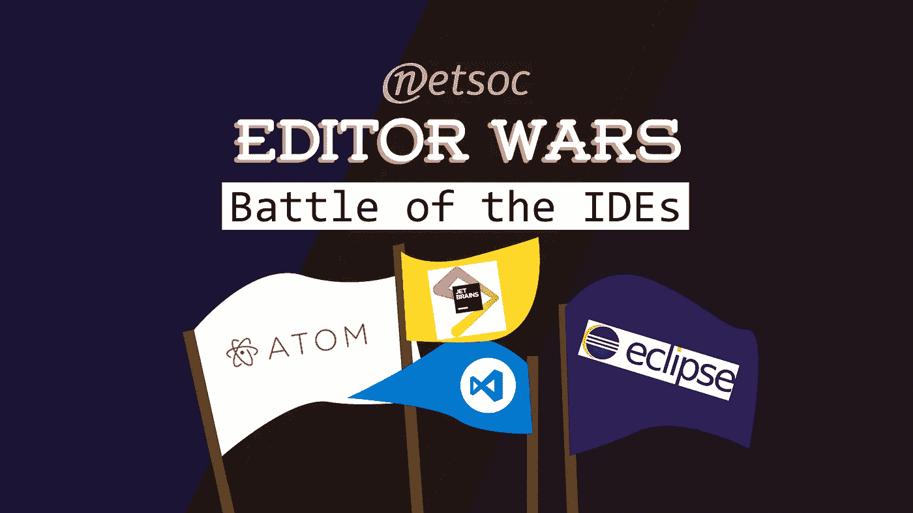

# 了解 2018 年的 Web 开发工具

> 原文：<https://levelup.gitconnected.com/web-development-tools-3e9117c5141a>

## 使用这些工具改善您的开发人员体验和生产力

终端监控系统:版权归 [ayuth](https://medium.com/ayuth/iterm2-zsh-oh-my-zsh-the-most-power-full-of-terminal-on-macos-bdb2823fb04c) 所有

*本文是 9 篇系列文章* *中的第 8 篇* [*。*](https://medium.com/@jordanmauricio/the-non-developers-guide-to-development-in-2018-7f023a2ff5e1)

开发人员需要知道使用许多附加的基本工具来使他们的生活更轻松。除了对语言、框架和库的理解之外，这些都是必需的技能。

# 末端的

在 Windows 上也称为“CMD”或“命令提示符”,在某些服务器环境中称为“控制台”。终端始终是您的伴侣。使用终端，您将能够登录到服务器，管理您的 SSH 密钥(一种更安全的密码形式)，处理您的所有 git 命令，运行您的所有脚本，并执行您的所有命令。终端对任何开发者来说都是必不可少的，因此拥有一个好的终端是必不可少的。

哦我的 zsh 装置:版权归 [Ivo 的博客](https://medium.com/ayuth/iterm2-zsh-oh-my-zsh-the-most-power-full-of-terminal-on-macos-bdb2823fb04c)

对于基于 Unix 的用户(GNOME 发行版，MacOS 等。)您的默认终端已经足够了，尽管在顶部添加 [agnoster 主题](https://github.com/agnoster/agnoster-zsh-theme)以及 [Zsh](https://gist.github.com/derhuerst/12a1558a4b408b3b2b6e) 和 [Oh-my-zsh](https://github.com/robbyrussell/oh-my-zsh) 是一个很好的补充。不在 MacOS 上的 Unix 用户可以使用[这个要点](https://gist.github.com/leemour/5749839)，而 MacOS 用户可以遵循[这个指南](https://medium.com/@genealabs/agnoster-theme-on-os-x-391d60effaf6)。对于 Windows 10 用户来说，幸运的是，你现在可以在你的操作系统中使用 Linux 终端，而不必使用 Linux 子系统将 Ubuntu 安装为一个分区，为此，你会想要遵循[本指南](https://www.howtogeek.com/249966/how-to-install-and-use-the-linux-bash-shell-on-windows-10/)然后[本指南](https://medium.com/@Andreas_cmj/how-to-setup-a-nice-looking-terminal-with-wsl-in-windows-10-creators-update-2b468ed7c326)以使它看起来像样。

编辑战争:版权归 [Netsoc](https://www.netsoc.tcd.ie/news/2017/10/editor-wars-ides/) 所有

# 编辑

当涉及到编辑时，每个开发人员都有自己的偏好，并会与任何持反对意见的人进行斗争。最初的战争是在几十年前开始的 [Emacs 和 Vim](https://en.wikipedia.org/wiki/Editor_war) 之间，至今仍未解决。你现在必须在 web 开发领域做出选择。有两大阵营——轻量级编辑器或成熟的 IDE。

不同之处在于，IDE(集成开发环境)集成了一些出色的技术，如自动完成、内容感知重构、IntelliJ 建议、调试器、集成终端、集成问题面板、Git 管理以及许多其他功能。这是你可能需要的编辑器的所有东西，尽管它们被认为是大而笨重的。这一类别中的一些优秀选项包括 [JetBrain 的](https://www.jetbrains.com/) [PHPStorm](https://www.jetbrains.com/phpstorm/) 或 [WebStorm](https://www.jetbrains.com/webstorm/) ，微软的 [Visual Studio](https://www.visualstudio.com/) ，苹果的 [XCode](https://developer.apple.com/xcode/) 或老派经典的 [NetBeans](https://netbeans.org/) 或 [Eclipse](https://www.eclipse.org/) 。

另一方面，你有更多的轻量级编辑器。这对于用多种语言编程、快速启动、干净的界面和速度来说是理想的。编辑者通过插件添加功能，并由他们背后的社区提供插件支持。这一类别中的一个老派经典是 [Notepad++](https://notepad-plus-plus.org/) ，虽然 [SublimeText](https://www.sublimetext.com/) 和 [Atom](https://atom.io/) 在过去受到青睐，但微软的 [Visual Studio 代码](https://code.visualstudio.com/)(不要与 Visual Studio 混淆)最近由[领先](https://syntax.fm/show/012/why-is-everyone-switching-to-vs-code)。这是由于它的易用性，出色的界面设计，卓越的速度以及包括调试器和 Git 管理器面板。请注意，与 IDE 不同，轻量级编辑器几乎总是可以免费使用的。

最后，您可以用您可能需要的任何东西来定制一个轻量级编辑器，最终根据您的偏好和您更喜欢使用的东西来做出决定。想了解更多信息，请听 SyntaxFM 的这一集。

CleanCoders 徽标:版权归 [CleanCoders](https://cleancoders.com) 所有

# 密码

鉴于开发人员的大部分工作是编写代码，做好这一点似乎是显而易见的。一旦你开始在团队中工作，你将会想要要求指导方针，比如样式，以便代码有一个流线型的外观。关于如何编写代码有许多观点，但是几乎每个人都同意的一个资源是叔叔的 Bob fantastic [CleanCoder 系列视频](https://cleancoders.com/)或[书](https://www.amazon.com/Clean-Code-Handbook-Software-Craftsmanship/dp/0132350882)。这些侧重于编程的基础，而不是编程本身。它涵盖了最佳实践、坚实的原则、测试、设计模式和大量其他有用的主题。

由 [Steemit](https://steemit.com/development/@luschn/eslint-and-the-beauty-of-javascript-linting) 制作的 ESLint 徽标

此外，关于在团队工作时在代码库中强制执行代码标准，或者甚至在单独工作时改进代码礼仪，你应该介绍林挺。众所周知，JavaScript 有 [ESLint](https://eslint.org/) ，但是每种语言都有一个 linter，而且通常每个编辑器都不同。这些是编辑器遵循的简单规则集，如果代码不遵循这些准则，就会抛出错误。作为快速入门指南， [Airbnb 的 JavaScript 风格指南](https://github.com/airbnb/javascript)是一个极好的资源。

# [下一篇:总结→](https://medium.com/@jordanmauricio/summary-450eefa347f)

