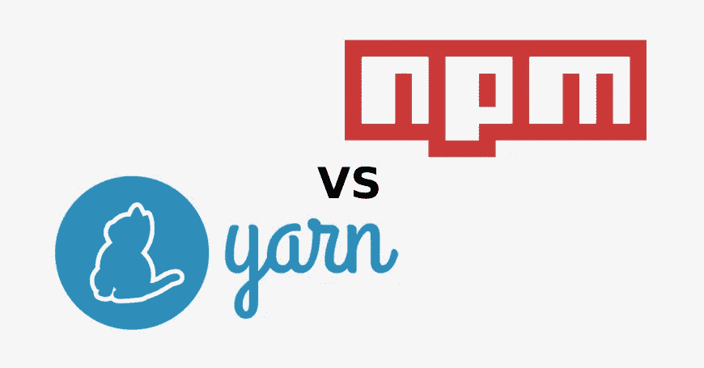
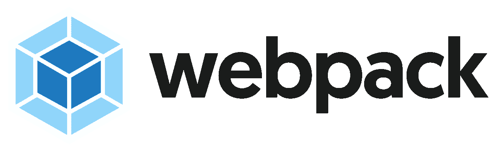

# 2018 年顶级 Web 开发工具

> 原文：<https://levelup.gitconnected.com/web-development-utilities-8b812e92184d>

## 了解如何使用这些工具来管理 web 开发生态系统的混乱

工具由[托德·夸肯布什](https://unsplash.com/@toddquackenbush?utm_source=medium&utm_medium=referral)在 [Unsplash](https://unsplash.com?utm_source=medium&utm_medium=referral)

*本文是 9 篇系列文章* *的第 5 篇* [*。*](https://medium.com/@jordanmauricio/the-non-developers-guide-to-development-in-2018-7f023a2ff5e1)

包管理器对于大多数 web 开发栈来说是必不可少的，因为它们处理所有的依赖项和库，确保它们是最新的，并从适当的来源下载。许多包管理器同时也是你的脚本的任务运行者，这些脚本可以用来启动和停止你的应用程序，编译你的代码，等等。

npm vs yarn:版权归 [FreeCodeCamp](https://www.google.com/url?sa=i&source=images&cd=&cad=rja&uact=8&ved=2ahUKEwi5mNSrq4zbAhUSyKQKHV4UBGYQjxx6BAgBEAI&url=https%3A%2F%2Fmedium.freecodecamp.org%2Fnpm-vs-yarn-benchmark-9b456de4aa96&psig=AOvVaw0z5CvHQpvtgDw3yxy3EaQu&ust=1526632463424815) 所有

# NPM、纱线和涡轮

JavaScript 有三个主要的包管理器，但是最初的和最流行的 [npm](https://www.npmjs.com/) (节点包管理器)。默认情况下，这个包管理器是 Node 自带的，同时也是脚本的任务运行器。然而，npm 也引入了其早期版本的问题，如启动应用程序时重新安装所有的依赖项，这是乏味而艰巨的。

作为对此的回应， [yarn](https://yarnpkg.com/) 被创建，[引入了`lockfile`的概念](https://scotch.io/tutorials/yarn-package-manager-an-improvement-over-npm)(在其他概念中)，它声明这个锁文件中的每个依赖项不需要在每次重启时更新，而是被缓存，因为它们是“锁定的”Yarn 很快获得了关注，npm 的回应是从 npm 第 5 版开始将这些概念引入到自己的生态系统中。在这个版本发布之后，有人质疑 Yarn 是否仍然是必要的，然而在我写这篇文章的时候，这个问题[仍然在争论](https://hackernoon.com/its-ok-to-not-use-yarn-f28dc766ef32)，而像 React 这样的框架已经默认使用 Yarn。

Turbo 声称其安装包的速度比 npm 或 Yarn 快 5 倍，并拥有其他优势。它发展缓慢，但提供了显著的优势，可以进一步改善包管理竞赛。

作曲家标志:版权归 [GetComposer](https://getcomposer.org/) 所有

# 作曲家，皮普，和宝石

其他语言也有自己的包管理器。PHP 最常用的管理器被称为[作曲家](https://getcomposer.org/)，并且兼容 Laravel 和 Symphony。此外，还有分别针对 Python 和 Ruby 的 [pip](https://pypi.org/project/pip/) 和 [gem](https://rubygems.org/) 。

webpack 徽标:版权归 [VanillaIO](https://blog.vanila.io/webpack-what-is-it-and-is-it-better-than-gulp-375db8011d22) 所有

# Bundlers

一个[捆绑器](https://medium.com/fusebox/beginner-web-developers-use-a-bundler-31ab0c91d2f5)的目的是将你所有的工具、依赖、文件组合成一个小数量的文件。目前最流行的捆绑器是 [Webpack](https://webpack.js.org/) ，尽管众所周知它很难上手。包裹是网络包的一种流行替代品。其他语言也有这些，比如 Ruby 的 [Bundler](https://bundler.io/) 。

# 开发环境和生成器

开发环境和生成器提供了创建预配置工作区的工具。只需几个命令，您就能拥有开始构建应用程序所需的一切。它们消除了自己做所有设置的需要。对于大多数语言来说，这些都相当简单，但是可能有些冗长。这里有一些关于如何开始使用一些流行环境的文章:针对 [React](https://github.com/facebook/create-react-app) ，针对[节点](https://developer.mozilla.org/en-US/docs/Learn/Server-side/Express_Nodejs/development_environment)，以及针对 [PHP](https://www.jetbrains.com/help/phpstorm/configuring-php-development-environment.html) 。

# [下一篇文章:Git &测试→](https://medium.com/@jordanmauricio/web-development-git-testing-1d475d2fb7bc)

