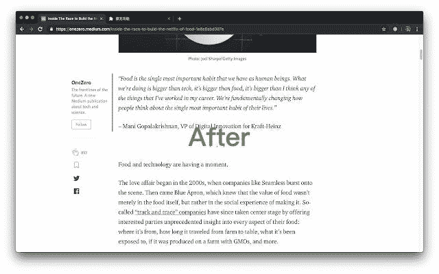
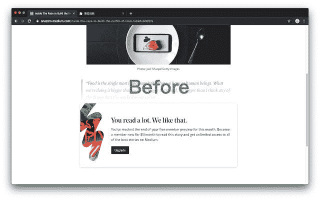
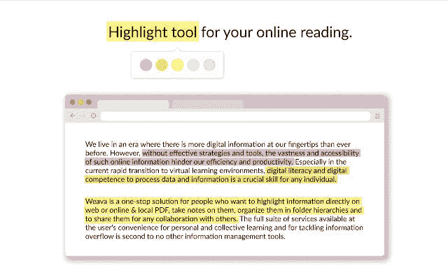
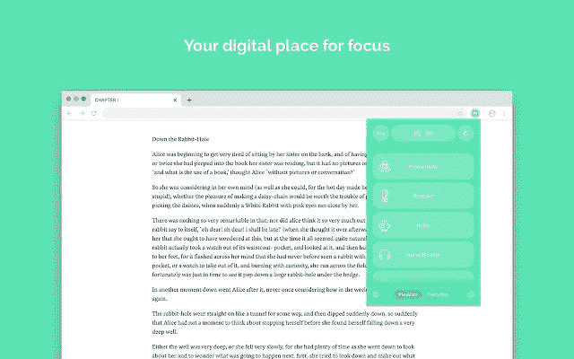
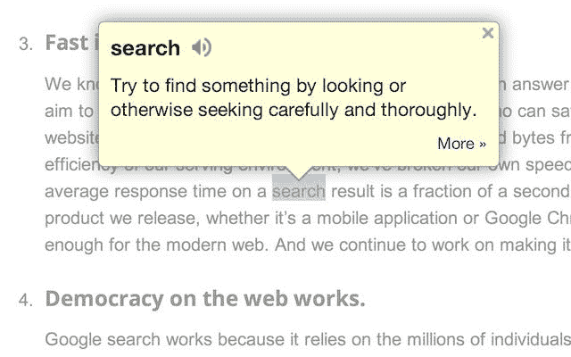

# 增强我的阅读/写作体验的网络扩展

> 原文：<https://levelup.gitconnected.com/web-extensions-to-enhance-my-reading-writing-experience-858a62178a6a>

## 有一些扩展只是在让我们的生活变得更好方面做得更好

当然，标题只是说“中等体验”，但下面的大部分也可以用于任何东西，从 substack 到 YouTube。我要说的扩展不仅能帮助我阅读媒体上的内容，还能帮助我写文章，了解我的分析，标记我的成就检查点，以及无数只有我能看到的优点。让我们开始扩展吧。

# Ubersuggest

不像它那容易引起误解的名字，这个扩展可以让你得到任何东西的统计数据。字面上…我想知道有多少人访问我的 YouTube 频道个人资料或我的 Medium 个人资料。我只是使用这个扩展来获得我所在网站的完整图形。它可以是任何东西，从谷歌搜索结果，到软件流量，等等。这有助于我写作，了解我的文章获得的流量。另外，在阅读别人的文章时，我已经有了他们的统计数据！

还需要注意的是，流量图和统计数据并不精确。尽管它们是相当近似的，你可以得到实际图形的概念。

# 中等增强统计

这有助于我一次性查看我的统计数据和更多信息。图表中显示的点击量、粉丝数、我发布的文章数、阅读率等等都可以在图表中看到，并以表格的形式显示出来。

写文章时拥有它简单又好，而且不会给你带来任何损失。

# 中等无限读取

如果你不付钱给 Medium 来阅读文章，你可能会遇到几种不同的情况。

*   你负担不起
*   你未满 18 岁，不像我一样拥有国际交易的合法权利
*   “精品”对你来说并不重要
*   或者我遗漏了一些其他的情况

如果你正处于其中任何一种情况下，介质无限读取是一个很好的扩展。现在我知道…我知道如果我建议这样做，我基本上是在打击我自己，因为如果你使用这个扩展来阅读文章，就不会给写作者钱/货币化来做他/她的工作。这很可悲，但却是事实。现在，就我个人而言，我不会向大多数阅读这篇文章的人推荐这一点，因为给作者他/她应得的东西是读者的义务，但在某些情况下，像我这样的情况，Medium 不支持 18 岁以下的交易，也不通过 Stripe 的支付支持印度本身(在印度，Medium 不支持 Stripe)。我尝试了各种可能的方法，甚至试图创建一个美国银行账户，但它有太多的步骤，我就放弃了。

# RSS 阅读器

你们中的许多人可能从多个平台阅读，如 substack Medium、ghost 等。这是一个扩展，可以帮助你在一个地方阅读更多内容(你关注的作家)。就这么简单。它总是呆在角落里，以下拉菜单的形式打开，阅读你所关注的内容。

# Weava

这允许您将文本保存到不同的文件夹中，并用不同的颜色组织它们，绘制引用等等。最好突出注释、代码(如果你是开发人员)和书签。这是一种可能完全无用但完全有用的扩展。取决于你的阅读流程。

# 努瓦斯利

假设你正在读一篇太长的文章。当然，再怎么骗自己，也会走神。在这种情况下，noisli 会有所帮助。它遵循“半集中方法”(我不知道确切的词，但它类似于这个)，我实际上对此很着迷，我可能会在这里或在未来的 substack 上写一篇文章。简而言之，为了让你沉浸在一个话题中，你需要让这个话题把你从其他事情上转移开。这是 noisli 播放平静的环境声音的地方，这在某种程度上有助于你在阅读时集中注意力。

这是 OperaGX 中的可选特性，但适用于所有浏览器！

# 谷歌词典

作为一个人，我知道大多数阅读的人不可能知道每个单词的意思。考虑到你不可能知道作者给你的每个单词的意思，你可能想用谷歌字典。它可以让你选择任何单词，并在几秒钟内知道你所阅读的任何东西的意思。

# 嗯…你有什么吗？

我的浏览器里安装了很多扩展……太多了，以至于我甚至不经常使用它们，也不在乎删除它们。我还有一些对你们很有帮助的。将来我一定会在 substack 或者 YouTube 上与你们分享。让我知道你对此的看法。希望你们喜欢这篇文章，我会在下一篇文章中见到你们。

**你真棒**

> 法丁吉克