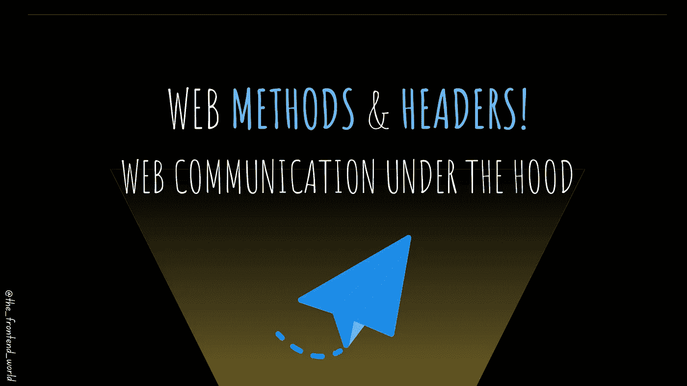
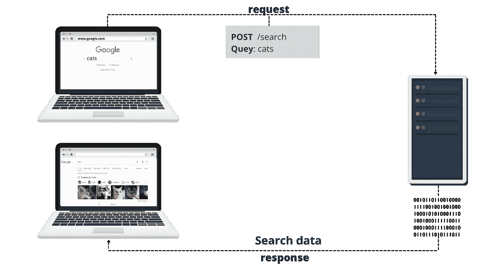
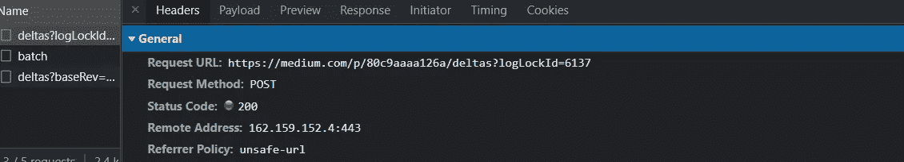
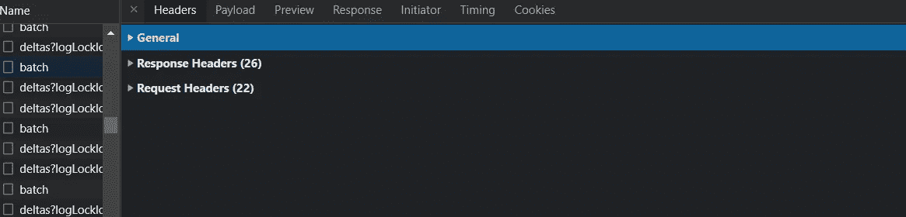
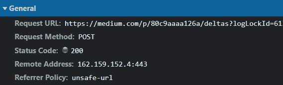
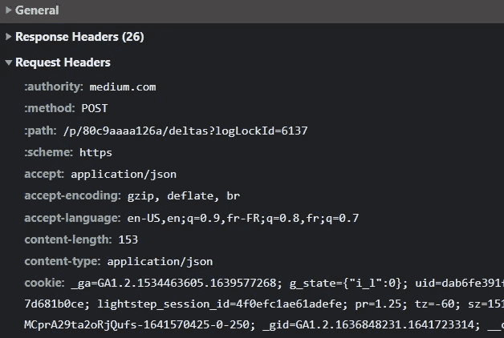
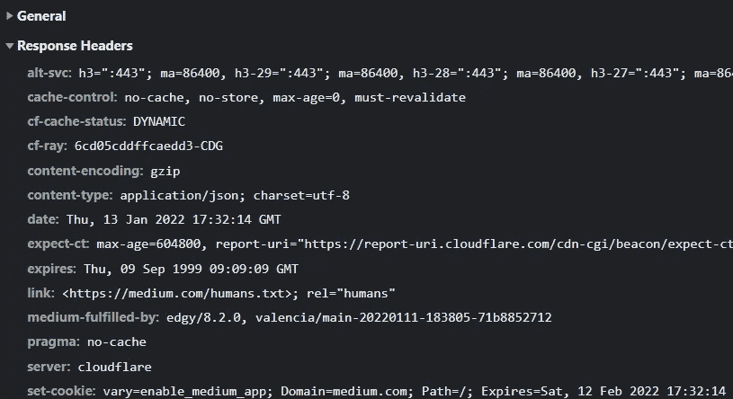

# Web 方法和头！

> 原文：<https://levelup.gitconnected.com/web-methods-and-headers-80c9aaaa126a>

## 幕后的网络交流

作者:FAM

本文是 **2022 网络计划**的一部分。

 [## 2022 网络计划启动！

### 改变来自心态和习惯

medium.com](https://medium.com/geekculture/2022-web-program-is-launched-f38a3280af1a) 

在了解了[网络口语](https://javascript.plainenglish.io/the-world-wideweb-spoken-language-70856478dc6b?source=your_stories_page----------------------------------------)之后，我们需要学习这种口语的诀窍和窍门。HTTP 协议在进行通信以获取资源和数据时，使用基于网页需求的方法。

让我们用上一步学到的知识来回忆一下。

*   **浏览器(客户端)向 web 发送 HTTP 请求。**
*   **网络服务器接收请求。**
*   **服务器运行应用程序来处理请求。**
*   **服务器向浏览器返回 HTTP 响应(作为输出)。**
*   **浏览器收到响应。**
*   **接收到的数据显示在浏览器中。**

HTTP 为每个作业指定了一些方法。

# HTTP 的方法:

主要有:

*   `**GET**`方法:检索数据/资源。
*   `**POST**`方法:更新数据/资源。
*   `**PUT**` :替换特定资源的所有当前表示。
*   `**PATCH**` :用于对资源进行部分修改。
*   `**DELETE**`:用于删除指定的资源。
*   …

`**GET**`**`**POST**`**是最受欢迎和使用最多的。你很少用这些来和他们比较。所以我重点讲这两种方法。****

## ****获取方法****

****方法:这个方法请求指定资源的表示。仅用于检索数据。****

*   *******用例:*** 你要加载所有的用户、员工、书籍、可用场所、……等。****

****这个方法在每个 web app 中都是必不可少的。它用在显示媒体主页，谷歌页面的时候，每当你想得到什么的时候，那么它就是一个`**GET**`。****

## ****过帐方法****

****方法:这个方法请求一个指定资源的表示，用来发送数据以保存它们或者在服务器端进行搜索。****

*   *******用例:*** 你想保存一个用户，为登录的用户保存一个订单，……等等。****

****这种情况的一个具体例子是在 Google 上搜索:****

********

****作者:FAM****

****如上图所示，我们需要在请求的 ***查询*** 中给出信息( *cats* )。服务器处理请求。搜索'*猫'*并发回数据(搜索结果)。****

********

****另一个例子，如果你已经是一个媒体作家，当你写或编辑一篇文章时，你会注意到。草稿会自动保存。不一定非要自己救。****

****你认为 Medium 用什么来保存我刚刚输入的内容？****

****是个`**POST**` **。**它将您最后的修改作为输入，并更新草稿。如果您刷新页面，除非出现问题，否则您的修改不会丢失，在这种情况下，Medium 会管理该问题并显示红色通知，告诉您“*出现了问题……*”。****

****要具体检查后面的请求，以下是步骤:****

*   ****转到 Chrome 或任何其他浏览器。****
*   ****键入 F12，将显示开发工具。****
*   ****转到如下所示的网络选项卡:****

********

****你可以看到，使用的方法是`POST`。****

****至于开发工具中的其他选项卡(这是一个充满活力的工具)，不要介意。我们一会儿再回来攻击它。****

# ****头球！****

****HTTP 头只不过是简单的头。他们的工作是用 HTTP 调用传递附加信息。****

****我们可以将 HTTP 报头分类如下:****

*   ******HTTP 请求头******

*******用例:*** 每当你键入一个 URL 并试图访问它时，你的浏览器都会向服务器发送一个 *HTTP 请求*。****

*   ******HTTP 响应头******

*******用例:*** 因为我们请求了一个页面，Web 服务器会向客户端(浏览器)发回一个 *HTTP response* 头。****

*   ******HTTP 通用头******

*******用例:*** 一般的头包含请求者和接收者都必须遵循的指令。****

*   ******HTTP 有效载荷头******

******用例:**使用请求或响应头，并提供关于有效载荷数据的额外信息，包括内容长度和用于传输的编码。****

****每个割台类型都有自己的工作。****

****具体来说，我们可以再次转到开发工具并显示“Network”选项卡，然后单击“headers”子选项卡:****

********

****对于我的中型文章网页，有 ***通用 HTTP 请求*** :****

********

****这个头告诉请求头，“*嘿，这是我们亲爱的用户想要的 URL😚，使用* `*POST*` *方法保存新的草稿，以此类推……*****

****状态代码表示请求是成功还是失败，以及失败的原因。如果您还能集中精力(在我提供了全部信息之后)，请查看本文以了解 HTTP 状态代码:****

**** [## 直观地了解 HTTP 状态代码

### 构建一幅关于 HTTP 请求状态的心理图像

levelup.gitconnected.com](/learn-visually-about-http-status-codes-4ac8decdccad) 

**一个请求 HTTP 头:**

使用适当方法的请求`POST`和其他信息，如 cookies、内容类型等。

**一个响应 HTTP 头:**

****

******如果你需要记住整篇文章中的 3 件事**，那么你可以这样做:****

*   ****您将在日常开发任务中使用的 HTTP 方法是:`GET`检索数据和`POST`更新数据。****
*   ****HTTP 有标题，就像信封一样。在信封外面，我们有寄件人、收件人、地址……等等。对于 HTTP 头，它有点复杂。我们需要更多的信息。****
*   ****HTTP header 作为一名 web 开发人员，您在日常工作中需要检查的是一般的 HTTP(查看我们调用的内容)，检查请求和响应，以及 HTTP 状态代码，它将为我们提供关于通信进展情况的信息:它是否成功(200)？这是一个糟糕的请求吗(400)？是否存在服务器错误(500)？…以及[等等](https://javascript.plainenglish.io/5-status-codes-every-web-developer-should-know-c38923c8230)。****

# ****2022 年网络计划路线图****

## ****I —一般网络知识****

*   ****工作原理****
*   ****[2- HTTP & HTTPS](https://javascript.plainenglish.io/the-world-wideweb-spoken-language-70856478dc6b?source=your_stories_page----------------------------------------)****

> ******3-标题&方法******

*   ****…****

******了解更多:******

**** [## 2022 网络计划启动！

### 改变来自心态和习惯

medium.com](https://medium.com/geekculture/2022-web-program-is-launched-f38a3280af1a)**** 

> ****我今天的故事到此结束，我希望你喜欢它，并从中吸取教训，❤****

****如果我的文字有 ***打动了你。*** 如果你 ***喜欢的话。*** 如果你觉得 ***值得。*** 请您 [**成为付费会员来支持我，您的一部分费用会寄给我。**](https://famzil.medium.com/membership) **这有助于我提供更多的时间来写好文章。******

**** [## 如果你喜欢看我的文章… ♥️

### 如果你喜欢读我的文章… ♥️，当我的文章发表时，欢迎你第一个得到通知…

famzil.medium.com](https://famzil.medium.com/subscribe) 

亲爱的读者，感谢你在我生命中的存在。让我们**联系上** [**中**](https://medium.com/@famzil/)**[**Linkedin**](https://www.linkedin.com/in/fatima-amzil-9031ba95/)**[**脸书**](https://www.facebook.com/The-Front-End-World)**[**insta gram**](https://www.instagram.com/the_frontend_world/)**[**YouTube**](https://www.youtube.com/channel/UCaxr-f9r6P1u7Y7SKFHi12g)**或**************