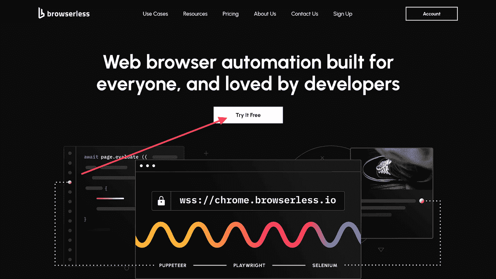
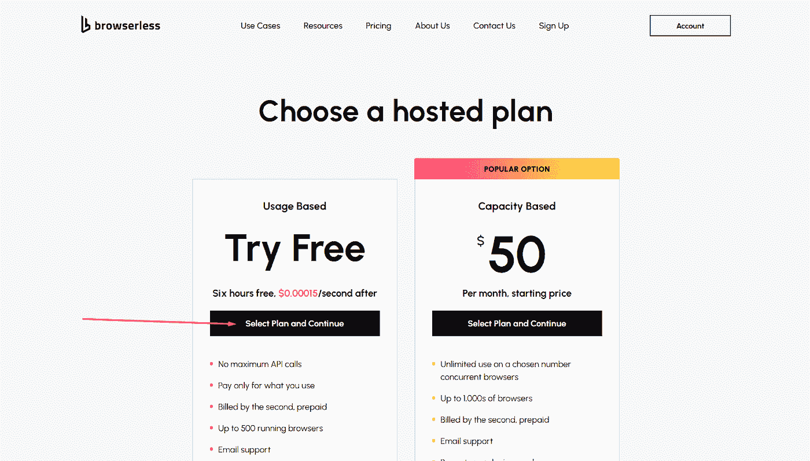
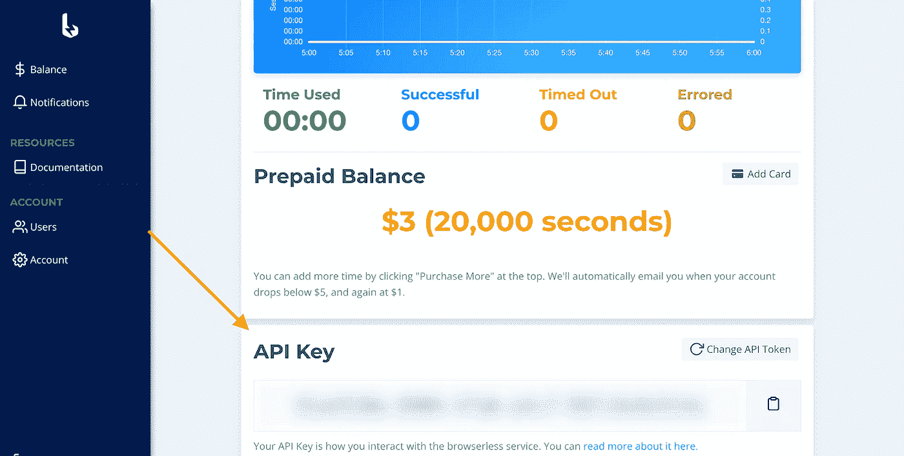
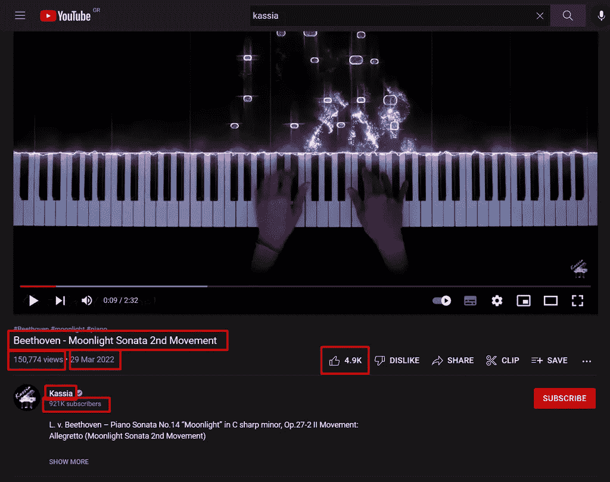

# 使用无浏览器自动化和 Node.js 来抓取 YouTube 视频[复制和粘贴代码示例]

> 原文：<https://levelup.gitconnected.com/web-scrape-youtube-videos-with-browserless-automation-and-node-js-copy-paste-code-example-7621cef55568>


威利安·贾斯丁·德·瓦斯康塞洛斯在 [Unsplash](https://unsplash.com/photos/T_Qe4QlMIvQ) 上拍摄的照片。

Youtube 是我们这一代最深刻的视频分享和社交媒体平台之一，它已经成功地成为我们日常生活方式的一部分，并已成为一个无处不在的行业。如今，这个平台容纳了大量不同的内容材料。随着互联网的兴起和对在线内容需求的增加，我们看到每天都有新频道兴起，希望娱乐、讨论、通知、宣传和利用观众向现代化信息媒体的转变。

要在这个竞争激烈的环境中取得成功，你必须了解自己的定位、受众和每段视频的相关信息，以决定最佳的行动方案。这可能需要几个小时来记录和分类每个相关的统计数据。

对我们来说幸运的是，有一种方法可以自动化这个过程。在这篇文章中，我们将发现使用 web 抓取技术和免费服务(如 Browserless 和神奇的木偶库)来收集 Youtube 视频的所有相关统计数据是多么容易。

让我们看看如何从 YouTube 抓取数据:

# 注册一个免费的无浏览器账户

[无浏览器](https://www.browserless.io/)是一个无头自动化 web 服务，提供快速、可扩展和可靠的 web 浏览器自动化，非常适合数据收集任务。这是一个开源平台，GitHub 上有超过 [4.5K 颗星，并与全球一些最大的公司合作，如宜家、彭博等。](https://github.com/browserless/chrome)

首先，我们必须创建一个帐户。



如果我们需要更强大的处理能力，该平台提供免费和付费计划。我们将选择 Free 计划，这对于我们的情况来说已经足够了。



完成注册过程后，平台向我们提供一个 API 密钥。稍后，我们将使用此密钥来访问无浏览器服务。



# YouTube scraper 步骤 2——建立一个基本的节点脚本

我们的下一步是建立一个简单的[节点](https://nodejs.org/en/)项目，并使用木偶库来抓取所需的 YouTube 内容。虽然[无浏览器服务可以与许多优秀的工具](https://docs.browserless.io/docs/puppeteer-library.html)和环境一起工作，比如 Python、Java、Go、C#、Ruby 和 Node，但是我们在这个例子中利用了 JavaScript 的简单性。

首先，让我们初始化一个新的节点项目并安装 Puppeteer 包。

**$ npm init -y & & npm i 傀儡核心**

是一个流行的 JavaScript 库，用于网络抓取任务。比 GitHub 上的 [78K 星还多，还积极维护。](https://github.com/puppeteer/puppeteer)[木偶核心](https://www.npmjs.com/package/puppeteer-core)包提供了主木偶包的所有功能，无需下载浏览器，从而减少了依赖工件。下一步是实例化一个浏览器实例。

```
const puppeteer = require('puppeteer-core')

const BROWSERLESS_API_KEY = ‘YOUR_API_KEY_HERE’

async function getYoutubeVideoStatistics(videoURL) {
  const browser = await puppeteer.connect({
    browserWSEndpoint: `wss://chrome.browserless.io?token=${BROWSERLESS_API_KEY}&stealth`,
  });

  const page = await browser.newPage()
  await page.goto(videoURL);

  // TODO: Use page selectors to retrieve the desired DOM elements

  await page.close();
  await browser.close()

  return {
    // TODO: Return the acquired statistics
  }
}

const videoStatistics = await getYoutubeVideoStatistics('https://www.youtube.com/watch?v=52vj8O8BYGM')

console.log(videoStatistics)
```

让我们快速浏览一下上面的脚本:

*   我们需要导入**木偶核心**包
*   我们声明变量 **BROWSERLESS_API_KEY** 来存储 API 密钥。
*   我们创建了一个异步函数**getyoutubevideostatics**，它接受视频 URL 并返回一个对象，该对象的键代表不同的统计数据。目前，我们返回一个空对象，因为我们还没有访问相关的 DOM 元素。
*   我们创建一个立即调用的函数表达式([life](https://developer.mozilla.org/en-US/docs/Glossary/IIFE))，该表达式调用**getyoutubevidostatistics**，并将其统计数据打印到终端。这个函数将是第一个在执行我们的脚本时运行的函数。

这里需要注意的关键部分是我们连接到无浏览器服务的方式。我们在 Puppeteer 实例上调用 **connect** 方法，这允许我们连接到远程浏览器，并使用 **browserWSEndpoint** 属性来指示连接 URI，它由三部分组成:

*   基 URI**WSS://chrome . browser less . io**
*   **令牌**查询字符串参数，该值是我们从仪表板中检索的 API 键。
*   **stealth** 查询参数确保我们的请求悄悄地运行。如果像 Cloudflare 这样的第三方安全服务阻止了我们试图访问的网站，这就方便了。

> 您可以在[正式文档](https://www.browserless.io/docs/chrome-flags)中了解所有可用的查询参数。

# YouTube scraper 第 3 步——找到合适的选择器

既然我们已经有了进行抓取的基本结构，我们就必须确定想要跟踪的视频指标及其对应的 DOM 元素，然后构建适当的选择器来获取所需的值。在撰写本文时，YouTube 的界面看起来类似于下面的截图:



每个视频至少包含以下详细信息(用红框标记):

*   一个标题
*   视图的数量
*   上传日期
*   喜欢的数量
*   频道名称
*   订户的数量

为了成功地从我们的脚本中检索信息，我们首先需要构建适当的查询字符串。为了使这篇文章简短，我们已经准备了合适的选择器。下面是访问标题的方法:

**h1>yt-formated-string[class = " style-scope YTD-video-primary-info-renderer "]**

为了完成这一部分，我们必须在抓取脚本中检索选择器的值。我们将调用页面对象上的 **$** 方法来获取元素句柄，然后使用 evaluate 方法访问相应的文本值。

```
const titleElement = await page.$('h1 > yt-formatted-string[class="style-scope ytd-video-primary-info-renderer"]')
const title = await titleElement.evaluate(el => el.getRawText())
```

我们还更新了 getYoutubeVideoStatistics 的返回值，以包含 title 属性，并对我们识别的所有其他选择器进行同样的操作。下面是最终的抓取脚本。

```
const puppeteer = require('puppeteer-core')

const BROWSERLESS_API_KEY = ‘YOUR_API_KEY_HERE’

async function getYoutubeVideoStatistics(videoURL) {
  const browser = await puppeteer.connect({
    browserWSEndpoint: `wss://chrome.browserless.io?token=${BROWSERLESS_API_KEY}&stealth`,
  });

  const page = await browser.newPage()

  await page.goto(videoURL);

  const titleElement = await page.$('h1 > yt-formatted-string[class="style-scope ytd-video-primary-info-renderer"]')
  const title = await titleElement.evaluate(el => el.textContent)

  const viewCountElement = await page.$('ytd-video-view-count-renderer[class="style-scope ytd-video-primary-info-renderer"] > span')
  const views = await viewCountElement.evaluate(el => el.textContent)

  const uploadDateElement = await page.$('#info-strings > yt-formatted-string[class="style-scope ytd-video-primary-info-renderer"]')
  const uploadDate = await uploadDateElement.evaluate(el => el.textContent)

  const likesCountElement = await page.$('yt-formatted-string#text[class="style-scope ytd-toggle-button-renderer style-text"]')
  const likes = await likesCountElement.evaluate(el => el.textContent)

  const channelElement = await page.$('yt-formatted-string#text > a[class="yt-simple-endpoint style-scope yt-formatted-string"]')
  const channel = await channelElement.evaluate(el => el.textContent)

  const channelSubscribersElement = await page.$('#owner-sub-count')
  const channelSubscribers = await channelSubscribersElement.evaluate(el => el.textContent)

  await page.close();
  await browser.close()

  return {
    title,
    views,
    uploadDate,
    likes,
    channel,
    channelSubscribers
  }
}

const videoStatistics = await getYoutubeVideoStatistics('https://www.youtube.com/watch?v=52vj8O8BYGM')console.log(videoStatistics)
```

# 执行脚本

运行上面的脚本，我们应该得到下面的输出。

```
{
  title: 'Beethoven - Moonlight Sonata 2nd Movement',
  views: '150,787 views',
  uploadDate: 'Mar 29, 2022',
  likes: '4.9K',
  channel: 'Kassia',
  channelSubscribers: '921K subscribers'
}
```

> 注意:YouTube 界面每隔几个月更新一次，使得上述选择器过时。您可能需要在页面上重新定位相应的元素。然而，即使在这些变化之后，脚本的基本结构仍然应该很好地为您服务。

# 收场白

在本文中，我们看到了如何利用[无浏览器](https://www.browserless.io/?utm_source=blog&utm_medium=youtube_scraper)和节点平台，通过网络抓取对 YouTube 视频进行数据检索。我们希望我们今天教了一些有趣的东西，这样你就可以改进你的工作流程。你也可以根据自己的需要调整代码，比如运行 YouTube 评论抓取器等。敬请关注更多教育类文章。