# 网页抓取 2.0

> 原文：<https://levelup.gitconnected.com/web-scraping-2-0-6600abca37de>


[Marjan Blan | @marjanblan](https://unsplash.com/@marjan_blan?utm_source=medium&utm_medium=referral) 在 [Unsplash](https://unsplash.com?utm_source=medium&utm_medium=referral) 上的照片

## 使用 Scrapy 进行顶层网络刮擦

Scrapy 是一个用于 web 抓取的全栈 python 框架。是大规模网页抓取的工具。它有一个名为选择器的内置机制，用于从网络中提取数据。它是一个用 python 编写的开源免费使用的框架。它可以使用自动油门机构自动控制爬行速度。Scrapy 在蜘蛛的帮助下从网站上抓取数据。它可以在几分钟内系统地爬遍整个网站。让我们来看看它的一些特性。

**功能:-**

*   CPU 和内存使用率低。
*   易于遵循的文档。
*   可以同时报废多个网站。
*   异步的
*   使用蜘蛛抓取网站。

安装:`pip install scrapy`

# Scrapy 的关键组件:-

## 1.粗糙的外壳

Scrapy 提供了一个交互式 shell，可以用来非常快速地调试和测试您的抓取代码，而无需运行蜘蛛。蜘蛛是定义一个站点如何被废弃的类。scrapy shell 是一种 python shell，这意味着您也可以在 shell 中运行和测试您的 python 脚本。

它主要用于测试 Xpath 和 CSS 表达式，以检查它们是否正常工作。

安装 Scrapy 后，您可以通过以下命令启动这个 shell

```
scrapy shellORscrapy shell "URL"
```

一旦外壳打开，你就可以用它从网上抓取任何数据。为了向 web 服务器发送一个爬行请求，我们使用了`fetch(URL)`

```
fetch(URL)-----
fetch('[http://books.toscrape.com/index.html](http://books.toscrape.com/index.html)')
```

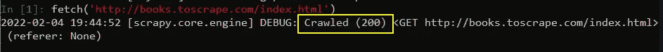

运行上述 fetch 命令后，您将会看到一条调试消息 Crawled(200)表示您的网站正在运行，并且连接请求成功。

在 scrapy 中，网站的源代码存储在一个变量`response`中，你可以通过传递一个选择器表达式来提取数据。

让我们用 shell 来抓取页面的标题—

```
response.css("title")----------------
[<Selector xpath='descendant-or-self::title' data='<title>\n    All products | Books to S...'>]
```

当您运行该命令时，会返回一个选择器列表作为输出，其中包含您所请求的特定 CSS 元素。

现在我们使用`extract()`从列表中删除标签

```
response.css("title").extract()---------------------------
['<title>\n    All products | Books to Scrape - Sandbox\n</title>'
```

返回的输出包含列表中的标签。为了从中获取文本，我们使用`::text`，并在选择器表达式的末尾指定它。

```
response.css("title::text").extract()-------------------------
'\n    All products | Books to Scrape - Sandbox\n'
```

现在，为了更清楚地测试，我们可以使用 strip()这样的字符串内置函数来删除空白，使用 replace 函数来替换某个关键字。

```
response.css('title::text').extract()[0].strip().replace('\n',' ')-----------------
'All products | Books to Scrape - Sandbox'
```

接下来，我们将尝试使用 shell 本身来抓取所有的书名。

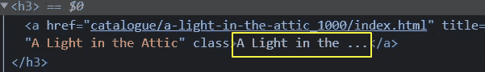

第一本书标题的 HTML 片段

第一本书的标题在 anchor `<a>`标签中，该标签是 heading 3 `<h3>`标签的子标签。为了抓取它，我们将首先瞄准< h3 >标签，然后瞄准< a >标签以从中获取文本。页面上所有标题的 HTML 结构都是一样的，所以如果我们抓取一个，所有标题都会自动抓取。抓取的数据存储在一个列表中。

```
response.css("h3 a::text").extract()
```

上面的代码将从网页中抓取所有的书名。尝试自己使用字符串函数删除空白和换行符。

您可以使用这个 shell 来调试和测试大型抓取项目中的一些代码行。现在，让我们继续创建一个项目。

## 2.项目结构

Scrapy 是一个完整的 web 抓取框架，遵循一个系统的方法来抓取数据。scrapy 遵循一个适当的项目结构。

您可以使用以下命令在 scrapy 中启动一个新项目。

```
scrapy startproject PROJECT_NAME------
scrapy startproject bookscraper
```

运行该命令后，您的项目结构将被创建，如下所示

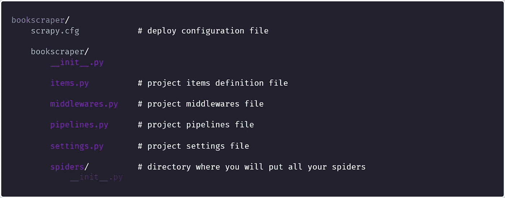

项目结构

现在你只需要关心一个文件夹，那就是`spiders`文件夹，你会把所有的蜘蛛放在那里，这意味着以后会抓取代码。

## 3.第一只蜘蛛

打开 spiders 文件夹，创建一个名为`book_scraper.py`的 python 文件并打开它。蜘蛛文件夹是你放置所有蜘蛛的地方。您可以创建多个抓取不同内容的蜘蛛，并将它们连接在一起。

让我们从官方文件中借用一个[的例子来更好地理解一切——](https://docs.scrapy.org/en/latest/intro/tutorial.html#:~:text=import%20scrapy%0A%0A%0Aclass,f%27Saved%20file%20%7Bfilename%7D%27))

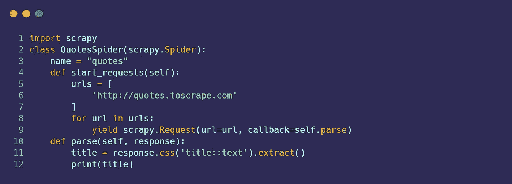

让我们一行一行地理解上面的代码

**第 1 行**:导入库。
**第二行**:我们将创建一个类，scrapy 使用它从 web 中抓取内容。你可以给它起任何名字，但重要的是它将继承类 Spider。
**第三行** : `name`是我们蜘蛛的名字。你也可以给它取任何名字，但是不要在文本之间添加任何空格，因为这个名字将会在你运行你的蜘蛛时使用。
**第 4 行**:是我们用来定义我们蜘蛛内部所有 URL 的函数。
**第 5 行** : `URLs`是要抓取的 URL 列表。
**第 8，9 行**:一个 for 循环，在 URL 列表上运行，逐个提取每个 URL，并传递给 scrapy 进行数据抓取。
**第 10 行** : `parse`是一个类的方法，它有两个输入，一个是`self`，另一个是`response`，它包含了你想要抓取的网站的源代码。你也可以重新命名。
**第 11 行**:在这一行中，我们试图使用 CSS 选择器抓取网页的标题。
**Line12** :我们只是简单的打印标题。

要运行上述代码，请运行以下命令—

```
scrapy crawl quotes
```

在命令中，`scrapy`是基本库，`crawl`是抓取的启动程序，`quotes`是您在编写 web 抓取代码时初始化的蜘蛛的名称。它将返回列表中的所有标题。

让我们在下一节更深入地了解这些选择器。

# 4.元素选择器

使用 scrapy 时，有两种方法可以选择 web 上的元素——CSS 和 Xpath。

## 1.CSS 选择器

`css()`中的条件被称为 CSS 选择器。让我们来看一些例子。

打开 Scrapy Shell，编写以下代码，在 Shell 和服务器之间建立连接。我们将使用 CSS 选择器抓取网站上所有书籍的书名和价格。

```
scrapy shell "[http://books.toscrape.com/index.html](http://books.toscrape.com/index.html)"
```

价格是我们首先想从所有书籍中剔除的。打开网站，将鼠标悬停在一个价格上，然后右键单击> inspect 打开该元素的源代码。

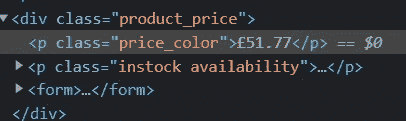

第一本书价格的 HTML 片段

我们的第一本书的价格在一个段落标签`<p>`中，它是 div 标签的子标签。这个`<p>`有一个`price-color`类。价格的惟一标识符将是一个 div，它有一个 p 标签作为子标签，类名为`price-color`，让我们用它来收集所有的价格。

```
response.css("div p**.price_color::text**").extract()
```

我们在`price_color`前用一个`.`来表示它是一个类。如果是 id，那么我们应该使用`#price_color`

接下来，我们将借助下面的代码抓取这本书的所有标题

```
response.css("h3 a::text").extract()
```

## 2.Xpath

Xpath 也是在 XML 文档中定位元素的一种方式。HTML 是 XML 的实现，所以我们也可以用它来定位 HTML 中的元素。

Xpath 的基本语法是—

```
**Xpath = //tagname[@Attribute='Value']**//       ➡ Select Current Node
tagname  ➡ Tagname like input, div,td,tr
@        ➡ Selects attribute
Attribute➡ Attribute name (class,id,name,etc)
value    ➡ value of the attribute
```

让我们使用 Xpath 提取书籍的标题和价格。

```
**## Scraping Titles** titles = response.xpath('//h3/a**/text()**').extract()**## Scraping Prices**
Prices = response.xpath('**//div/p[@class="price_color**"]**/text()**').extract()
```

Xpath 与 CSS 略有不同，这里我们使用`/text()`从抓取的文本中提取文本。

让我们来理解价格的 Xpath，首先，我们有`//div`表示顶层是一个 div 标签，然后我们有`//div/p`表示在一个 div 标签中我们有一个段落标签。最后，我们使用了`//div/p[@class="price_color"]`来定位一个段落元素，这个段落元素有一个 price_color 类和一个 div 标签的子元素。

你可以使用两种方法中的任何一种从网上抓取数据。运行代码后，返回两个列表`Titles, Prices`作为输出，其中包含第一页的标题和价格。

但是如果我们希望网站的每一页都有标题和价格呢？这里出现了多页抓取的概念。

# 4.多页刮擦

多页抓取是通过操作 URL 一次抓取网站多个页面的过程。

我们正在做的网站是 http://books.toscrape.com/index.html 的，

如果你滚动到底部，你会看到下一步按钮。

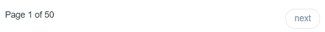

点击它，你会被重定向到第 2 页，网站的网址会变成[*http://books.toscrape.com/catalogue/page-2.html*](http://books.toscrape.com/catalogue/page-2.html)

现在再次滚动到底部，点击下一步并检查网址，它会更新到[*http://books.toscrape.com/catalogue/page-3.html*](http://books.toscrape.com/catalogue/page-3.html)

现在再做一次，检查 URL，这次它更新为[*http://books.toscrape.com/catalogue/page-4.html*](http://books.toscrape.com/catalogue/page-4.html)

你可以注意到，在第二页之后，只有一个地方发生了变化，那就是 URL 中的页码。我们可以用它来创建一个通用的 URL，用一个 f-string 变量替换它们`page-2`。

```
for page_number in range(50):
  url=f'http://books.toscrape.com/catalogue/**page-{page_number}**.html'
  print(url)
```

这个方法是一个通用的方法，即使下一个方法不起作用，你也可以使用。现在，让我们看一个更简单的方法。

向下滚动到最后，查看主页上的`next`按钮。

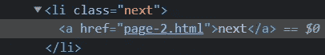

`<a>`标签包含了第二个网页的链接。现在，转到第二页，检查“next”按钮，您将看到这次它有第 3 页的链接。我们所需要的就是从这个标签上刮掉链接，scrapy 会为我们做其他的事情。

为了抓取链接，我们首先定位按钮，然后使用 XPath `//li[@class='next']/a/**@href**`，`@`从标签中提取属性的值。

让我们用这个来刮所有的网页。

使用以下命令运行上述代码

```
scrapy crawl books
```

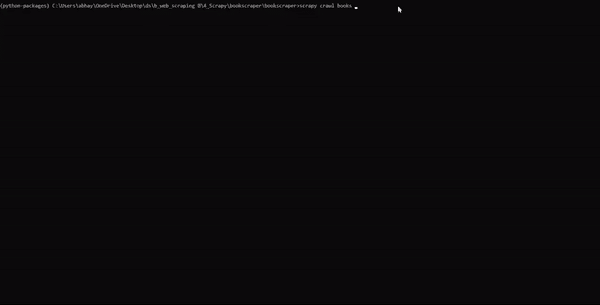

作者抓取的数据输出 Gif

您可以在开始时运行以下命令，将抓取的数据保存在 CSV、JSON 或 XML 文件中

```
 scrapy crawl books -o data.csv  
or   
 scrapy crawl books -o data.json  
or   
 scrapy crawl books -o data.xml
```


data.json 文件截图作者

# 5.有用的概念

## 1.项目容器

web 抓取的主要目标是从 web 上抓取非结构化数据，并以结构化的方式存储。这些项目容器用于存储数据。默认情况下，Scrapy 将数据作为项目返回。

items 提供了一个类似字典的 API，可用于将非结构化数据转换为结构化数据。`items.py`文件用于定义一个 scrapy 项目内部的容器。

当您使用 scrapy 创建一个项目时，会自动创建`items.py`文件。您需要将它导入到您的 spider 上，以利用项目容器，就像我们在上面的图书抓取代码的第 2 行中所做的那样。

```
from ..items item BookscraperItem
```

BookscraperItem 是启动项目时自动创建的类名。该类的名称取决于您的项目名称。它用于定义您的项目容器。

```
[**items.py**](https://docs.scrapy.org/en/latest/topics/items.html)**class BookscraperItem(scrapy.Item):**
# define the fields for your item here like:
# name = scrapy.Field()
    **link = scrapy.Field()
    price = scrapy.Field()
    title = scrapy.Field()**
```

一旦定义了容器，就可以用它们来存储数据。记住一件事，容器的名字应该和你的数据变量的名字一样。

## 2.从语法上分析

`parse`是一个负责处理响应并返回抓取的数据或更多 URL 的方法。它将`response`变量作为包含源代码的输入。此方法还用于将数据传递给项容器进行临时存储。

默认情况下，代码会将回调传递给 parse 方法，直到您指定其他内容。就像我们在图书抓取代码的第 13 行所做的那样。

```
def parse(self,response):
      ...
```

# 项目 1:亚马逊图书抓取

**任务**:我们的任务是从[亚马逊](https://www.amazon.com/s?k=python+programming&page=1&crid=YZEI0VGEO20K&qid=1644079860&sprefix=python+programming&ref=sr_pg_2)搜集所有关于 python 编程的书名、作者名和价格。

## 步骤 0:创建项目

运行`scrapy startproject amazon`启动一个新项目并生成文件夹结构。

接下来，定位到 spiders 文件夹，创建一个新的 python 文件`scraper.py`，用于编写 web 抓取代码。

## 步骤 1:导入库

```
import scrapy
from ..items import AmazonItem  *## class inside items.py*
```

## 步骤 2:创建类并命名蜘蛛

```
class Amazonbookscraper(scrapy.Spider):
   name = "amazonbooks"
```

## 步骤 3:准备起始 URL

```
start_urls = [
"[https://www.amazon.com/s?k=python+programming&page=1&crid=YZEI0VGEO20K&qid=1644079860&sprefix=python+programming&ref=sr_pg_2](https://www.amazon.com/s?k=python+programming&page=1&crid=YZEI0VGEO20K&qid=1644079860&sprefix=python+programming&ref=sr_pg_2)" 
]
```

`start_urls`是一个包含要抓取的 URL 列表的列表。这是一个更简单的方法来抓取你的 URL。

## 步骤 4:收集数据

1.  抓取标题

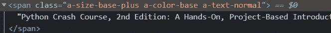

有三个类你可以任意使用

```
titles = response.css('**.a-size-base-plus**::text').extract()
```

2.削价

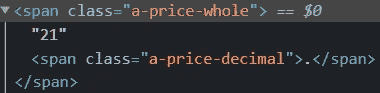

a-price-whole 类包含关于书籍价格的信息

```
prices = response.css('**.a-price-whole:**:text').extract()
```

现在，让我们使用 [**选择器小工具 chrome 扩展**](https://chrome.google.com/webstore/detail/selectorgadget/mhjhnkcfbdhnjickkkdbjoemdmbfginb?hl=en) 来收集作者和评级。看看这个 [**youtube 视频**](https://www.youtube.com/watch?v=oqNTfWrGdbk) 了解如何使用它来查找网页上特定元素的 CSS 或 XPath。

3.抓取作者

```
authors = response.css('.a-color-secondary .a-size-base+ .a-size-base::text').extract()
```

4.刮擦评级

```
ratings = response.css('.s-link-style .s-underline-text::text').extract()
```

## 步骤 5:在项目容器中存储数据

```
for i in list(zip(titles,prices,authors,ratings)):
  title,price,author,rating = i
  items['title']=title
  items['price']=price
  items['author']=author
  items['rating']=ratingyield items
```

## 第六步:抓取多个页面

```
next_page_url = "https://www.amazon.com"+response.xpath('//*[contains(concat( " ", @class, " " ), concat( " ", "s-pagination-next", " " ))]/@href')[0].extract()if next_page_url is not None:
  yield response.follow(next_page_url, callback=self.parse)
```

## 完整代码

使用命令`scrapy crawl amazonbooks`运行代码

你可能会陷入亚马逊的连接错误。这是因为亚马逊阻止了你的连接请求。为了防止这种情况，我们可以使用用户代理。有一个由 scrapy 爱好者创建的库，包含超过 2000 个用户代理，并经常更换用户代理，以便您不会被阻止。您可以使用以下命令安装该库。

```
pip install scrapy-user-agents
```

一旦安装完成，进入你的项目文件夹中的`settings.py`文件。将以下代码粘贴到下载恶意软件注释的下方。

```
DOWNLOADER_MIDDLEWARES = {
    'scrapy.downloadermiddlewares.useragent.UserAgentMiddleware': None,
    'scrapy_user_agents.middlewares.RandomUserAgentMiddleware': 400,
}
```

现在，再次尝试运行代码。这一次它将成功运行并从 amazon 抓取数据。

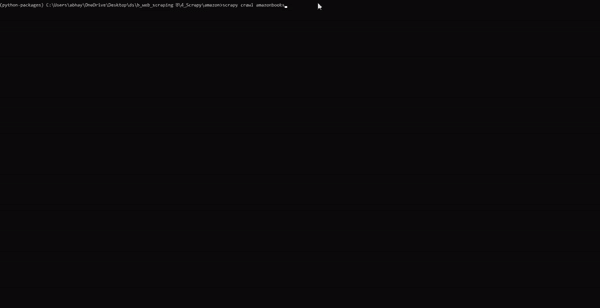

亚马逊图书刮刀输出


Books _ 细节. json 文件

# 推荐读物

[](https://medium.com/pythoneers/master-web-scraping-completly-from-zero-to-hero-38051423256b) [## 网络抓取大师从零到英雄🕸

### 用美汤和请求库同一个项目

medium.com](https://medium.com/pythoneers/master-web-scraping-completly-from-zero-to-hero-38051423256b) [](/master-the-art-of-writing-xpath-for-web-scraping-c14e2f7ee130) [## 掌握为 Web 抓取编写 Xpath 的艺术

### 网络抓取规则的简单介绍

levelup.gitconnected.com](/master-the-art-of-writing-xpath-for-web-scraping-c14e2f7ee130) [](https://medium.com/pythoneers/web-scraping-using-selenium-python-6c511258ab50) [## 使用 Selenium Python 进行 Web 抓取

### 一个项目的详细教程

medium.com](https://medium.com/pythoneers/web-scraping-using-selenium-python-6c511258ab50) 

## 参考

[1][https://docs.scrapy.org/en/latest/intro/tutorial.html](https://docs.scrapy.org/en/latest/intro/tutorial.html)

感谢你读到这里，如果你喜欢我的内容并想支持我，最好的方式是—

1.  跟我上 [*中*](http://abhayparashar31.medium.com/) 。
2.  在 [*LinkedIn*](https://www.linkedin.com/in/abhay-parashar-328488185/) 上联系我。
3.  使用 [*我的推荐链接*](https://abhayparashar31.medium.com/membership) 成为中等会员。你会费的一小部分会归我。
4.  订阅 [*我的邮件列表*](https://abhayparashar31.medium.com/subscribe) 永远不会错过我的一篇文章。