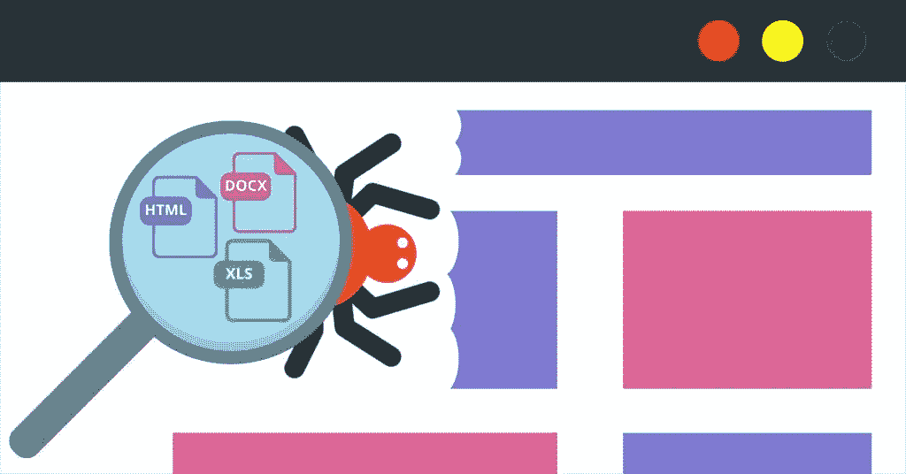

# 用 Golang 实现网页抓取和任务调度

> 原文：<https://levelup.gitconnected.com/web-scraping-and-task-scheduling-with-golang-da0421abd04c>

你有没有经历过不得不去不同的新闻网站，仅仅是为了获得你周围发生的事情的最新消息？这种情况发生在我身上，尤其是当我想阅读金融新闻时，有许多来源，例如《明星报》、《边缘报》、《商业内幕》、CNN(仅举几例)。这让我用 Golang 建立了自己的网络抓取工具。

因为会不时有新闻发布，所以我也计划安排网络抓取间隔运行。所以在这篇文章中，我们将着眼于两件事:网页抓取和任务调度。

Go 上有几个网页抓取框架，我选择了 [*colly*](https://github.com/gocolly/colly) ，因为它在 Github 上有许多星星，并且它允许轻松地遍历父/子/兄弟元素。

网页抓取技巧:

1.  充分利用浏览器自带的开发者工具。还要检查页面源代码，因为通过 inspect 元素看到的内容可能会被 Javascript 更改。
2.  对于无限滚动的页面，我们通常可以通过 Network 选项卡找到请求，并得到我们正在寻找的 JSON 格式的响应。

在我们开始之前，需要了解 colly 的一些内容:

1.  收集器是 colly 中管理网络通信的主要实体，负责回调的执行。
2.  有几个回调函数( [*这里指*](http://go-colly.org/docs/introduction/start/) )。最常用的回调函数之一是 OnHTML，它在收到响应后被调用，内容是 HTML。
3.  对于更复杂的 web 抓取任务或者有不同种类的子任务，我们可以使用多个收集器。

让我们看一个例子，在这里，我们试图刮明星新闻。首先，我们将转到主页(在这个例子中是金融类别)，那里有一个文章列表。我们还循环浏览了金融部分的 3 页，以获取所有的文章。

收到 HTML 内容后，我们将获得目标元素*a【data-content-category】*的子元素。请注意，我们有一个存储已访问链接的片段。该切片将用数据库中存储的所有 URL 填充。并且在扫描新文章 URL 时，它将存储到切片中。如果它看到切片中存在的文章 URL，那么它将不会再次访问该 URL。

获取星上文章列表的主收集器

一旦我们获得了文章链接，我们就使用另一个收集器开始从文章页面中提取信息。类似地，我们可以通过识别元素标签来获得我们感兴趣的所有元素(无论是属性还是文本)。

子收集器来获取星上的文章内容

根据上述代码，我们对标题、出版日期、内容和缩略图感兴趣。一旦我们得到了所有相关的信息，就该存储到我们的数据库中了。

这基本上是关于我们如何使用网络抓取技术从网站中提取信息。

最后但同样重要的是，我们将创建一个任务调度器，以每隔一段时间抓取新闻。这里，我们将使用 robfig 的 [cron](https://github.com/robfig/cron) ,在这里我们可以指定 cron 表达式。一定要看看 https://en.wikipedia.org/wiki/Cron 的[来了解更多关于 cron 的表情。我有这样一种方式写的表达式，它将运行从每天 0600 到 2300 每 15 分钟的网络抓取。](https://en.wikipedia.org/wiki/Cron)

为了保持 Go 程序运行，我们还使用 select{} block 来阻止程序退出。

使用 cron 调度 web 爬行任务

今天到此为止。下一步是我将添加更多的新闻源被抓取，并建立前端，让用户在一个地方阅读所有的新闻。敬请期待！

源代码:【https://github.com/wilsontwm/gocrawl 