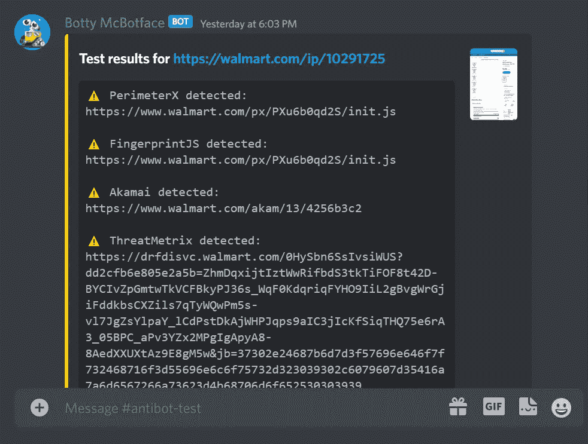
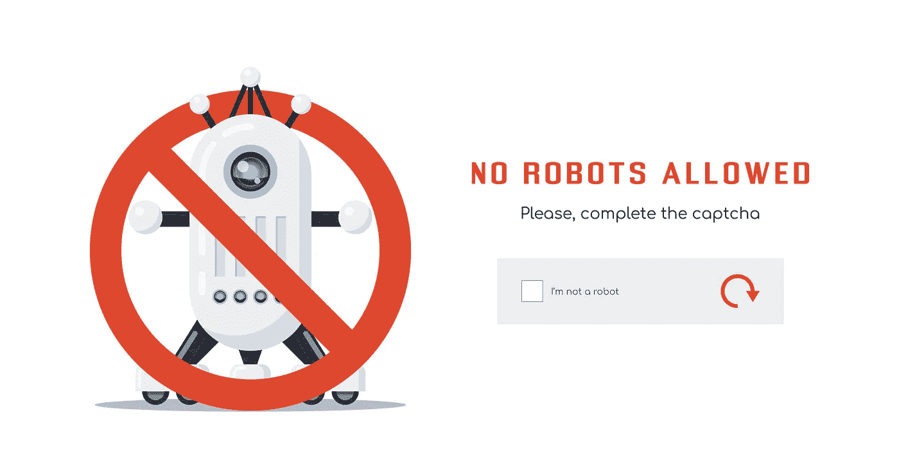
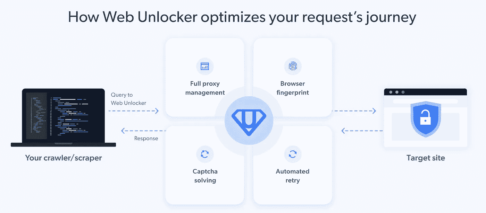

# 网络抓取和战争艺术:帮助你的机器人获胜的 5 个工具

> 原文：<https://levelup.gitconnected.com/web-scraping-and-the-art-of-war-5-tools-that-will-help-your-bot-win-c2a3840d8b71>


兵马俑由 MrDm 免费提供

**孙子兵法中最被引用的一段话是——**

> *“知己知彼，百战不殆。如果你了解自己但不了解敌人，那么每一次胜利都会让你遭受失败。知己知彼，* ***百战不殆*** *”*

**网络搜集**现在是一种流行的做法，每个管理网站的团队都希望防止其数据被收集。防刮擦技术可以帮助他们完成这项工作。

毫无疑问，作为一个网页抓取者或数据分析师，在这一点上，**你正在打仗，**正如孙子建议的那样，胜利的道路在于了解你的敌人，以及你自己。这就是我们编辑这份指南的原因——让需要公共网络数据的人了解他们在寻求提取这些数据时将面临的一些更具侵略性的策略。

但是在我们深入了解之前，让我们先从一些基础开始——最常见的防刮擦技术通常通过使用代理服务器来解决。


图片由 Shutterstock 提供

## 用代理解决网站上的封锁问题

一个简单的例子是，如果您经常使用同一个 IP 地址来锁定某个特定网站，目标网站可能会阻止您的 IP 地址。

为了避免这种情况，网络抓取最佳实践建议使用代理服务器，它可以隐藏你原来的 IP 地址。有很多这样的代理服务器提供商，你甚至可以找到一些免费的——但那些在实际上保存有价值数据的网站上不太好用。

现在仅仅使用代理 IP 是不够的。在大多数网站上，你必须确保你不会从一个代理 IP 地址发送太多的请求。当试图抓取不需要登录的网站公共页面(如亚马逊产品或 LinkedIn 个人资料)时，使用大量短期会话总是更好地从**多个代理 IP 地址**轮换您的请求。这仍然会导致您偶尔被阻止，但最终不会阻止您获取数据。

代理网络的类型也是一个因素。在简单的网站上，轮换数据中心代理 IP 将足以赢得这场战斗，而更先进的电子商务和社交媒体网站会识别这些数据中心 IP 并阻止它们，因此需要使用更昂贵的住宅代理 IP(真实用户设备的 IP 或从 ISP 获得的 IP)。

最后，也是最常见的问题是，当面对一个网站时，**会阻止来自一个地理区域**的整个 IP 池访问它。这通常使用防火墙来完成。你可能已经猜到了，解决方案是使用来自不同国家的代理服务器 IP。

正如我们所说的，以上都是非常基本的，大多数 web 抓取工具在抓取的最初几个月内掌握了这些最佳实践，要么通过将抓取工具代码与 [**代理管理器**](https://github.com/luminati-io) 集成，要么通过代理服务 API 发送请求。当你想要收集大规模的数据时，真正的挑战就开始了，这需要向一个网站发送数千甚至数百万个请求，或者面对一个使用尖端反机器人措施的网站。


这张图片来自功夫王国提供的电影《五种致命的毒液》(1978)

## 僵尸检测技术

因此，事不宜迟，以下是主题以及一些最先进的反僵尸工具和检测工具的具体例子，这些工具被经常成为攻击目标的网站所使用:

**1 —浏览器指纹识别技术**

对用户的浏览器进行指纹识别是识别独特浏览器和跟踪互联网使用情况的一种极其有效的方法。最初，浏览器指纹用于收集数据，以帮助建立用于营销目的的**用户档案**。巧合的是，通过收集关于你的浏览器类型和版本、操作系统、插件、时区、语言、屏幕分辨率和各种其他活动设置的信息，这些工具也可以确定用户是真人还是自动机器人。

虽然许多消费者使用旨在[隐藏他们独特的浏览器指纹](https://pixelprivacy.com/resources/browser-fingerprinting/)的插件，以防止再营销活动和有针对性的广告，但智能网络抓取器却恰恰相反——他们确保他们浏览器的**用户代理请求头**尽可能独特地出现，如果有必要，他们每隔几个请求就轮换这些字符串，这样网站就不会检测到一些通用的用户代理被反复使用。

以下是唯一用户代理字符串的一个示例:

```
Mozilla/5.0 (Windows NT 10.0; Win64; x64; rv:98.0) Gecko/20100101 Firefox/98.0
```

**2 —基于 Javascript 的检测**

开源库比如流行的 [FingerprintJS](https://fingerprint.com/products/bot-detection/) 及其替代品。这些库采用了几层 bot 检测，包括:

*   自动化检测器
*   搜索引擎检测器
*   浏览器欺骗
*   虚拟机检测

这些结果中的每一个都给每个用户一个 bot 概率分数，并且基于此，网站管理员可以创建何时阻止或使用其他预防技术的规则。

**3 —简单的定制检测技术**

这些可以是验证码和其他主要用于小型网站的标准机制。这些通常对产生大量销售收入的大型网站不太有吸引力，因为它们经常阻止临时用户，从而减少网站上的潜在买家流量。

**4 —高级定制检测技术**

复杂的机器人需要复杂的机器人检测。**高级行为分析**使组织不仅可以从机器人创建的流量中识别和解析出人类流量，还可以为下一代机器人做好更充分的准备。这些技术的主要支柱在很大程度上依赖于**逆向工程**，其中反机器人研究团队检查了数百种网络抓取算法。

领先的反机器人服务提供商的几个例子是:

*   [人类](https://www.humansecurity.com/)
*   [梭鱼网络](https://www.barracuda.com/products/advanced-bot-protection)
*   [Cloudflare Bot 管理](https://www.cloudflare.com/en-gb/products/bot-management/)
*   [Arkose 实验室](https://www.arkoselabs.com/)
*   [数据穹顶](https://datadome.co/bot-protection/)

## 帮助您绕过 bot 检测的 5 个工具

**孙子还写道——**

> 整个秘密在于迷惑敌人，让他摸不清我们的真正意图

因此，在我们解释了如何使用代理来应对简单的挑战之后，这里是我们从**经过战斗考验的** **网络搜集将军**那里收集的一些建议，关于如何应对上述每一种高级反机器人工具。你甚至可以在这个[不和谐服务器](https://discord.com/channels/737009125862408274/737009125862408277)上接近他们中的一些人。作为一条一般性建议，当你计划下一次活动时，请记住这一点——只要你的机器人**以普通用户**(或多个用户)的身份出现，网站的反机器人算法就不会影响到你。

**1 —僵尸检测工具检测**

有趣的标题，不是吗？首先，上面提到的 discord 服务器为其成员提供了一个名为***Boty mcbot face***的免费酷工具，它会告诉你在你瞄准的网站上使用了哪些先进的僵尸检测工具。请参见下面的响应示例:



截图来自刮痧爱好者的不和谐服务器

这种类型的领域情报在你如何抓取某个网站的策略中非常有用。

**2 —浏览器指纹测试**

有很多网站都有免费和付费的指纹测试工具，可以帮助你了解你的抓取机器人如何出现在使用浏览器指纹的网站上。您应该经常运行这些测试，以防止新的抓取项目出现问题。

*   [浏览页面](https://browserleaks.com/)
*   [bot . inclumitas](https://bot.incolumitas.com/)
*   [ipqualityscore](https://www.ipqualityscore.com/ip-reputation-check)
*   [recaptcha-3-测试分数](https://antcpt.com/eng/information/demo-form/recaptcha-3-test-score.html)
*   [dnscookie](http://dnscookie.com/)

**3 —隐形浏览器**

这些所谓的匿名或私人浏览器提供内置的 IP 隐藏代理，以及指纹管理和用户代理轮换。它们通常用于社交媒体账户自动化和其他营销策略，但也用于网络抓取。一些领先的浏览器有:

*   [卡姆莱奥](https://kameleo.io/)
*   [戈洛金](https://gologinapp.com/)
*   [多重登录](https://multilogin.com/)
*   [隐姓埋名](https://incogniton.com/)

虽然在某些情况下非常有用，但许多在线隐形浏览器的缺点是严重的安全问题，因为其中许多包含潜在的恶意软件。

**4 —闪避库**

你可以找到各种编码语言的开源库，尤其是在 **Github** 上。当然，这需要一些编码技能，但大多数都有简单易懂的指南，告诉你如何将它们与你现有的刮刀集成。我们测试了一些有用的工具:

*   [**木偶师-extra-plugin-stealth**](https://github.com/berstend/puppeteer-extra/tree/master/packages/puppeteer-extra-plugin-stealth)—[木偶师-extra](https://github.com/berstend/puppeteer-extra/tree/master/packages/puppeteer-extra) 和[剧作家-extra](https://github.com/berstend/puppeteer-extra/tree/master/packages/playwright-extra) 的检测预防插件。
*   [**curl-impersonate**](https://github.com/lwthiker/curl-impersonate)—一个特殊的 cURL 构建，可以模拟所有四种主要浏览器:Chrome、Firefox、Edge & Safari。
*   [**绝地爬虫**](https://github.com/spacenick/jedi-crawler) —一个简单语法的 Node/PhantomJS 爬虫。



图片由 [shai_halud](https://www.freepik.com/premium-vector/flat-style-design-captcha-web-page_10461700.htm#query=CAPTCHA&position=26&from_view=search) (freepik)提供

**5 —验证码求解器**

即使是最好的网页抓取工具有时也会遇到验证码。为了确保这不会干扰你的抓取，有几种验证码解决服务 **—** 人工操作的和基于机器学习的:

*   [防验证码](https://anti-captcha.com/)
*   [2 第一章](https://2captcha.com/)
*   [因验证码死亡](https://www.deathbycaptcha.com/)
*   [验证码-张量流](https://github.com/JackonYang/captcha-tensorflow)

**6 —网页抓取 API * * ***

这些是最全面的解封工具，整合了上述许多功能，让您更接近最难抓取的 web 数据。

市场上有多种选择，这让您很难选择哪一种最符合您的要求。但是，通过对这些工具进行测试和基准测试，以及研究使用它们的公司类型(中小型企业到财富 500 强企业等)。)我们整理了一个排名:

*   [**光明数据 Web 解锁器**](https://brightdata.com/products/web-unlocker) —传承构建在最佳代理基础设施之上的领先工具。下面的工具宣传了类似的好处，但是当你阅读小字时，它们与网络解锁器相比是有限的。
*   [刮刀](http://www.scraperapi.com/)
*   [废品](https://scrapfly.io/)
*   [报废蜜蜂](https://www.scrapingbee.com/)
*   [WebScrapingAPI](https://webscrapingapi.com/)



图片来自 Bright Data

Web 抓取可能是一项乏味且耗时的任务，但如果您想要获得您需要的 web 数据，这是值得的。通过遵循最佳实践和使用上面提到的策略，你可以很容易地**避免你的 IP 被屏蔽**并使你的网络抓取过程更加顺畅。我们很想听听你遵循的其他网络抓取最佳实践，并了解我们尚未尝试的新工具。

*** *你们中的一些人可能已经注意到标题是“帮助你的 5 个工具…”，而这个列表上升到了 6 个。这是因为网络抓取 API 通常是之前工具的组合。* ***