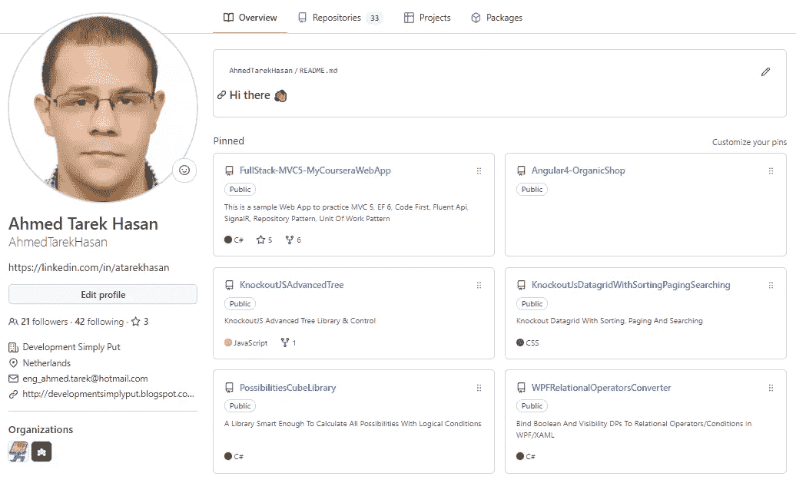
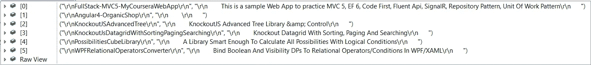

# 网页抓取。NET C#

> 原文：<https://levelup.gitconnected.com/web-scraping-in-net-c-934d6a85c32e>

## 提示和技巧

## 如何进行网页抓取的指南？NET C#，附带代码示例。

劳拉·奥克尔在 [Unsplash](https://unsplash.com/?utm_source=unsplash&utm_medium=referral&utm_content=creditCopyText) 上的照片

# 什么是网络抓取

在英语中，单词 **Scraping** 有不同的定义，但它们都是同一个意思。

在[Dictionary.com](https://www.dictionary.com/browse/scrape)

> 去除(外层、粘附物等))这样:把桌子上的油漆和清漆刮掉。

在[Dictionary.Cambridge.org](https://dictionary.cambridge.org/dictionary/english/scraping)

> 用锋利的边缘或粗糙的东西去除物体表面的行为。

然而，我们确实对**网页抓取**在**软件**中的含义感兴趣。

在软件中， **Web Scraping** 是从 Web 资源的用户界面而不是合法的 API 中提取一些信息的过程。因此，它不像调用网站的 REST API 来获取一些数据，它像浏览器一样检索网站页面，解析 HTML，然后提取渲染到 HTML 中的数据。

 [## 订阅艾哈迈德的时事通讯？

### 订阅艾哈迈德的时事通讯📰直接获得最佳实践、教程、提示、技巧和许多其他很酷的东西…

medium.com](https://medium.com/subscribe/@eng_ahmed.tarek) 

# 为什么我们需要废弃一个网站

很简单，因为我们需要在这个网站上展示数据，而这个网站没有提供合法的 API 让我们检索这些数据。

# 网络抓取合法吗

这取决于网络资源本身。一些网站把它写在某个地方，不管它是否合法，有时它并不写在任何地方。

此外，还有另一个因素是你将如何处理你收集到的数据。所以，永远要尽量谨慎，保证自己的安全。在开始实施之前先做研究。

# 如何做网页抓取

做这件事有不同的方法，但在大多数情况下，同样的概念适用；您编写一些代码来使用网站 URL 获取 HTML，解析 HTML，最后提取您想要的数据。

然而，如果我们只坚持这个定义，我们将会错过很多细节。

在某些情况下，事情比这更复杂。这要看网站的搭建方式。

对于**静态**网站，数据已经从第一个实例呈现到 HTML 中，您可以遵循我们描述的相同步骤。

然而，对于**动态**网站，数据不是从第一个实例就呈现到 HTML 中，而是通过 JavaScript 库和框架(如 Angular、React、Vue 等)动态加载的，您需要遵循另一种方法。

基本上，在这种情况下，你要做的是尝试模仿网络浏览器(如 Chrome、Firefox、IE、Edge 等)的功能，然后从你使用的虚拟浏览器中获得最终的 HTML。一旦有了呈现数据的完整 HTML，剩下的就都一样了。

# 我们应该自己从头开始吗

不，我们已经有一些库可以用来达到预期的效果。

例如，下面是我们可以使用的一些库的列表。

## 执行呼叫:

1.  [。NET HttpClient](https://docs.microsoft.com/en-us/dotnet/api/system.net.http.httpclient?view=net-6.0)
2.  [锐思锐](https://restsharp.dev/)

## 解析 HTML:

1.  [Html 敏捷包(HAP)](https://html-agility-pack.net/)
2.  [CSQuery](https://github.com/jamietre/CsQuery)
3.  [尖角](https://github.com/AngleSharp/AngleSharp)

## 虚拟浏览器:

1.  [无头铬合金](https://developers.google.com/web/updates/2017/04/headless-chrome)
2.  [Selenium WebDriver](https://www.selenium.dev/documentation/webdriver/)
3.  [机灵的木偶师](https://www.puppeteersharp.com/)

在我们的网络抓取项目中，我们需要帮助的不仅仅是这些库。如果你在网上搜索，你会发现更多。

马库斯·斯皮斯克在 [Unsplash](https://unsplash.com/?utm_source=unsplash&utm_medium=referral&utm_content=creditCopyText) 拍摄的照片

# 抓取静态网站

首先，让我们从尝试从静态网站中删除一些数据开始。在这个例子中，我们将放弃我自己的 GitHub 简介[https://github.com/AhmedTarekHasan](https://github.com/AhmedTarekHasan)

我们将尝试在我的配置文件中获取一个固定存储库的列表。每个条目将由存储库的**名称**及其**描述**组成。

因此，我们开始吧。

## 观察 HTML 中的数据结构

直到写这篇文章的时候，这就是我的 [GitHub 简介](https://github.com/AhmedTarekHasan)的样子。

图片由[艾哈迈德·塔里克](https://medium.com/@eng_ahmed.tarek)拍摄

当我检查 HTML 时，我发现了以下内容:

1.  我所有的固定存储库都在主容器中找到，路径是:**div[@ class = js-pinned-items-reorder-container]>ol>Li**
2.  每个固定的存储库都包含在一个容器中，其相对于父路径的路径是: **div > div**
3.  每个固定的存储库，在**div>div>span>a**中有它的**名称**，在 **p** 中有它的**描述**

## 编写代码

以下是我遵循的步骤:

1.  创建了一个控制台应用程序
    解决方案:WebScraping
    项目:WebScraper
2.  安装了 NuGet 包 [HtmlAgilityPack](https://html-agility-pack.net/) 。
3.  增加了使用指令`using HtmlAgilityPack;`
4.  定义了方法`private static Task<string> GetHtml()`来获取 HTML。
5.  定义了方法`private static List<(string RepositoryName, string Description)> ParseHtmlUsingHtmlAgilityPack(string html)`来解析 HTML。
6.  最后，代码应该如下所示:

运行这段代码，您将得到以下内容

图片由[艾哈迈德·塔里克](https://medium.com/@eng_ahmed.tarek)拍摄

当然，你可以对这里的琴弦进行一些清洗，但这没什么大不了的。

如你所见，使用 **HttpClient** 和 **HtmlAgilityPack** 很容易。你所需要的是习惯他们的 API，然后这将是一件容易的工作。

你还需要记住的是，一些网站需要你做更多的工作。有时候，网站需要登录细节、认证令牌、一些特定的标题等等

所有这些您仍然可以用 HttpClient 或其他可以用来执行调用的库来处理。

# 抓取动态网站

现在，我们应该尝试从动态网站中删除一些数据。然而，由于我应该在抓取网站之前保持谨慎，我会像以前一样应用相同的示例，但现在假设网站是动态的。

因此，在这个例子中，我们将放弃我自己的 GitHub 概要文件[https://github.com/AhmedTarekHasan](https://github.com/AhmedTarekHasan)

## 观察 HTML 中的数据结构

这将和以前一样。

## 编写代码

以下是我遵循的步骤:

1.  创建了一个控制台应用
    解决方案:WebScraping
    项目:WebScraper
2.  安装了 NuGet 包 [HtmlAgilityPack](https://html-agility-pack.net/) 。
3.  安装了 NuGet 包 Selenium.WebDriver。
4.  安装了 NuGet 包 selenium . web driver . chrome driver。
5.  增加了使用指令`using HtmlAgilityPack;`
6.  增加了使用指令`using OpenQA.Selenium.Chrome;`
7.  定义了方法`private static string GetHtml()`来获取 HTML。
8.  定义了方法`private static List<(string RepositoryName, string Description)> ParseHtmlUsingHtmlAgilityPack(string html)`来解析 HTML。
9.  最后，代码应该如下所示:

运行这段代码，您将得到以下内容

图片来自[艾哈迈德·塔里克](https://medium.com/@eng_ahmed.tarek)

当然，你可以对这里的琴弦进行一些清洗，但这没什么大不了的。

再次使用**硒。WebDriver** 和 **Selenium。如你所见，WebDriver.ChromeDriver** 很简单。

由 [Pablo Heimplatz](https://unsplash.com/@pabloheimplatz?utm_source=unsplash&utm_medium=referral&utm_content=creditCopyText) 在 [Unsplash](https://unsplash.com/?utm_source=unsplash&utm_medium=referral&utm_content=creditCopyText) 上拍摄的照片

# 最后的话

正如你所看到的，网页抓取并不困难，但它实际上取决于你要删除的网站。有时你可能会遇到一个网站，它需要一些技巧才能运行。

就这样，希望你觉得读这篇文章和我写这篇文章一样有趣。

# 希望这些内容对你有用。如果您想支持:

如果你还不是**中介**会员，你可以使用 [**我的推荐链接**](https://medium.com/@eng_ahmed.tarek/membership) ，这样我可以从**中介**那里得到你的一部分费用，你不需要支付任何额外费用。订阅 [**我的简讯**](https://medium.com/subscribe/@eng_ahmed.tarek) 将最佳实践、教程、提示、技巧和许多其他很酷的东西直接发送到您的收件箱。

# 其他资源

这些是你可能会发现有用的其他资源。

 [## 中介设计模式。NET C#

### 中了解中介器设计模式。NET C#与代码示例。

levelup.gitconnected.com](/mediator-design-pattern-in-net-c-e1bfcc96789d)  [## 标记枚举:如何在一个字段中表示特征组合

### 将[读、写、修改……]等功能及其组合表示到单个字段中。

levelup.gitconnected.com](/flagged-enumerations-how-to-represent-features-combinations-into-one-field-f32e46a0885)  [## 顶端。NET 开发人员和贡献者跟进

### 排行榜。NET 开发人员和贡献者联系，学习和获得新的技能。

levelup.gitconnected.com](/top-net-developers-contributors-to-follow-a2237f97d5c8)  [## 什么是软件系统中的缓存

### 软件系统中缓存的定义和最佳实践。

levelup.gitconnected.com](/what-is-caching-in-software-systems-cfa71c385bfc)