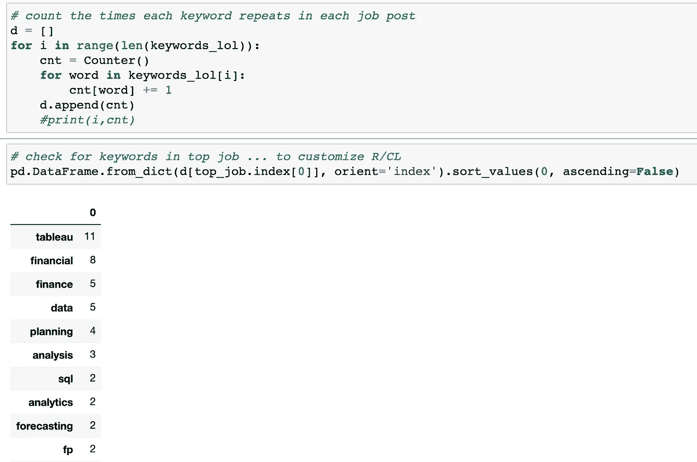

# 网络招聘公告板:如何更快更早地申请到最好的工作

> 原文：<https://levelup.gitconnected.com/web-scraping-job-boards-how-to-apply-for-the-best-jobs-first-and-faster-7d841fab43b8>

我们都听说过:找工作就是全职！

在本文中，我将向您介绍我开发的代码，这些代码用于收集职位信息，突出显示最佳职位，并定制我的应用程序。您将能够根据您的偏好、证书和技能调整代码。

我是一名金融分析师，在投资银行和私募股权领域有 10 年的经验。我期待着过渡到财务相关的角色，这将涉及到广泛使用数据分析来支持决策过程。

这个代码对我的求职很有帮助，我希望它也能帮助你。以下是它对我的一些帮助:

*   由于代码通读工作描述，减少了通读工作描述所需的时间
*   减少了定制简历和求职信的时间，因为关键词已经为我突出显示
*   由于代码根据我的标准和技能对工作进行评分，提高了将申请优先分配给最适合的工作的能力
*   由于对最适合我的工作的更好的质量申请，工作申请到达第二次面试或更高的比率增加了 300%

我将强调代码中最重要的部分。请随意从我的 [GitHub 页面](https://github.com/mdalisouayah/job_application_optimizer)克隆回购。

**设置工作搜索**

首先，你需要在与你最相关的网站上保存搜索结果。我用的是 Linkedin、Glassdoor、VentureFizz 和 Dice。

我在找工作的时候经常使用布尔值。这让我可以过滤掉那些没有我关键词的工作，还可以拓展那些职位名称不能反映相关技能的工作之外的机会。以下是保存的搜索在 Linkedin 上的显示示例

菜单栏>作业>管理通知是您找到已保存搜索的地方

激活电子邮件通知并将其设置为`Weekly`，这样您就可以将搜索结果的摘要发送到您的电子邮件中，如下所示:

保存的搜索结果的每周电子邮件通知

浏览这些工作，开始选择感兴趣的。另一种方法是开发一个代码，自动选择工作提醒中的所有工作。不利的一面是，有些工作在你的模型中得分很高，只有到那时，你才会发现，比如说，资历水平或你想找的角色类型并不重要。从职位名称中可以很容易地描述出来。

按下`command`按钮的同时点击职位名称，在新标签页中打开页面，同时保持在原来的标签页上。`Shift + 3`删除邮件，让你进入下一封邮件，以此类推。

一旦你选择了你感兴趣的工作，使用一个名为`copy all URLs`的 chrome 扩展，顾名思义，复制所有的 URL 并粘贴到一个`txt` 文件中。

标志是一把伞。[点击这里进入(免费)扩展](https://chrome.google.com/webstore/detail/copy-all-urls/djdmadneanknadilpjiknlnanaolmbfk?hl=en)

现在，让我们开始编码吧！

# 网页抓取工作职位

我使用了`requests`库中的`get`模块，并定义了一个变量响应来检查请求是否通过。一个`status code of 200`告诉你你的请求成功了。

然后我导入`BeautifulSoup`来读取帖子的`HTML`。代码如下所示:

我创建了一个为职位保留的空列表和一个`for-loop`，它遍历所有的 soup 对象(职位描述 HTMLs)并将它们附加到职位列表中。这是在检查每个工作板的结构并确定需要在`find`方法中指定的岗位的`tag`之后完成的。如下图`gist`所示:

使用`find_all`方法、`text`属性和`regex`库，我从每个工作帖子中提取每个单词。在这一点上，我们有一个包含每个工作描述的单词列表。

`try and except`块是为了避免代码中断，如果一个职位已经过期，在这种情况下，相应的 url 将被删除。

于 2020 年 6 月 16 日更新了最后一段代码

# 给工作打分

根据你的目标技能和工作职责，你将构建一个关键词字典，并为每个关键词分配一个权重。一个关键词对你越重要，权重就应该越高。这本字典可以根据你的需要而变得广泛或有选择性。从逻辑上讲，这些关键字与您在保存的搜索中已经使用的关键字或多或少是相同的。

在我的情况下，我认为我的语言技能和 CFA 认证是独一无二的，所以我赋予它们很高的权重，这样我就不会错过我有竞争力的工作。你也会高度重视那些你绝对想在工作中拥有的技能和品质，比如说，`Tableau`、`Python`、`data-driven`或`decision support`。这会让你优先申请那些需要这些技能或责任的工作。

然后我创建了一个`for-loop`,它将我的词典与每份工作描述中的单词列表对应起来。每场比赛，包括重复的比赛，都会有一个分数。这些分数的总和决定了每份工作的分数。此外，我们还会记录每个关键字重复的次数，以便深入了解，这一点我们将在后面看到。

# 创建数据框

我的数据框由 5 列组成:工作编号、工作发布的链接、分数和申请状态。我使用`a*ssign*` 方法将我的列表(链接和分数)转换成数据框的列。

表格格式的作业列表

然后，我将`*display.max_colwidth*` 选项应用于`*set_option*` 方法，这样 URL 就不会被截断，当我决定申请工作时，我可以在浏览器上选择并打开它。

最后，数据框按分数排序。

按分数排序的工作

瞧啊。根据您的工作偏好以表格格式排序的每周工作摘要。

# 申请工作

现在，你可以按照优先顺序浏览你的工作，从而确保你首先申请最好的工作。数据框中提供了该链接，您只需在浏览器中选择并打开它。更好的是，你可以先阅读你笔记本上的职位描述，以确保你有资格获得这份工作。

使用`Ctrl + f`并搜索词语`experience`和`require`。这会告诉你这份工作是否需要你不具备的经验或技能。如果你的经验和技能与工作相匹配，你就可以开始申请了。

在你开始申请之前，寻找可能的交易破坏者

申请的一个重要部分是根据职位要求定制你的简历和求职信。这不仅能清除人力资源申请人跟踪系统(ATS ),还能让你的申请在招聘团队审查时脱颖而出。

为此，我使用了不同关键字及其频率的计数器，如下所示:

主要职位描述关键字计数

一旦你申请了第一份工作，你就在“申请状态”栏选项下将其标记为第一份工作，然后你就可以申请第二份工作，以此类推。

我希望这能帮助你更快地整理工作，将更多的申请转化为面试！

你可以在这里找到完整的代码。非常感谢您的反馈和建议。

祝你好运！