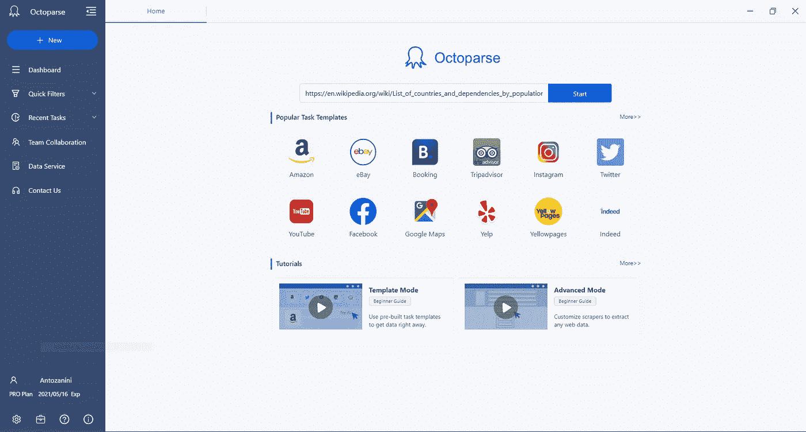
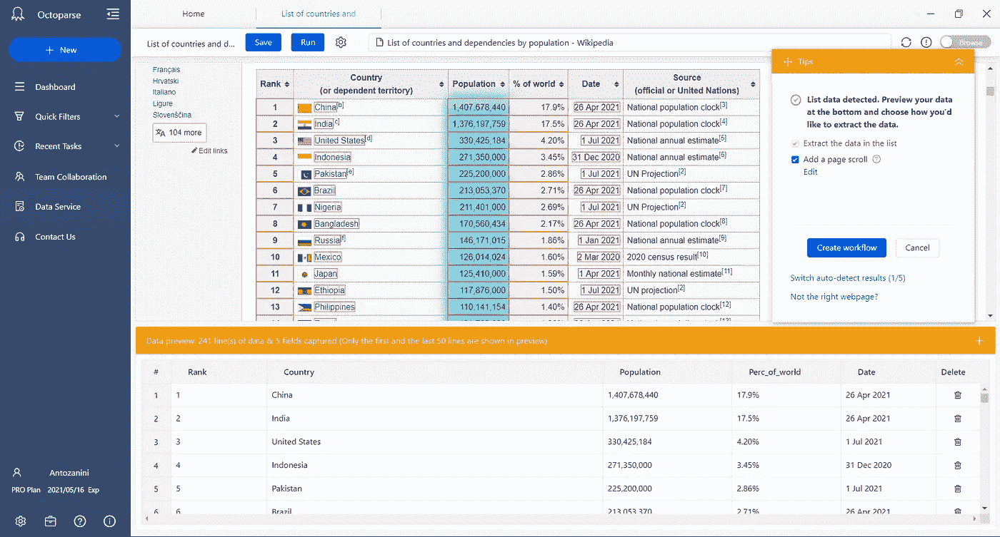
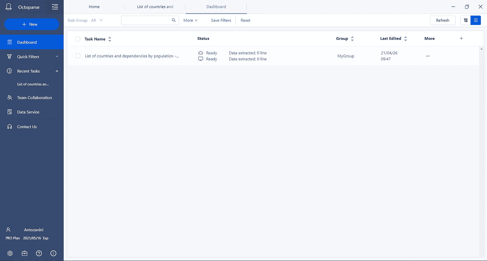
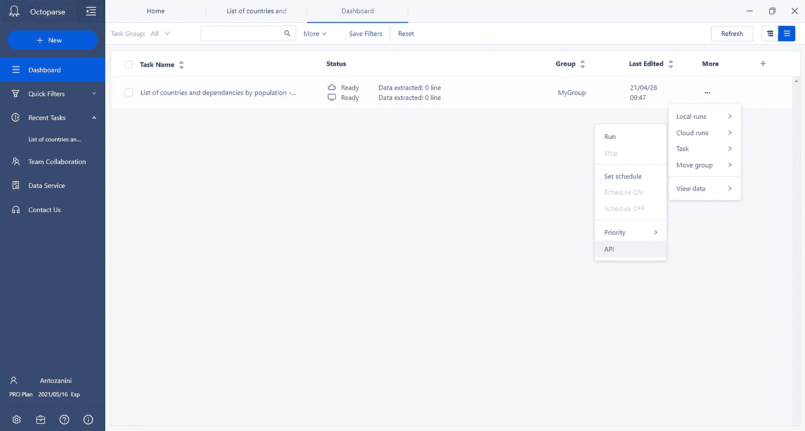
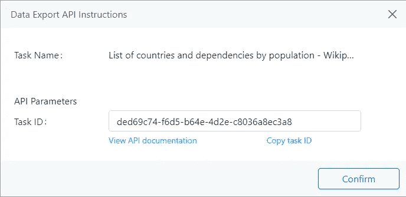
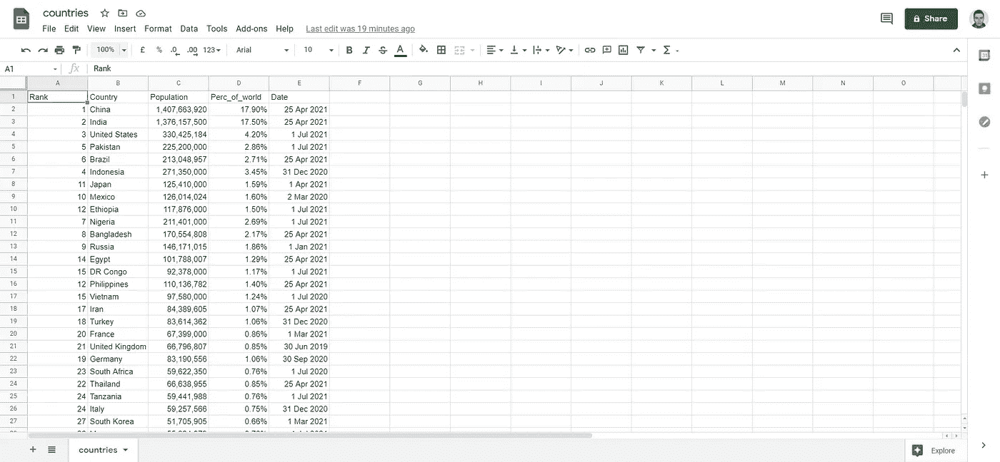

# Octoparse 简化了网页抓取

> 原文：<https://levelup.gitconnected.com/web-scraping-made-simple-with-octoparse-9a966d888414>

## 轻松提取数据并将其存储在 Google Sheets 文档中

迪安·普在 [Unsplash](https://unsplash.com/s/photos/python?utm_source=unsplash&utm_medium=referral&utm_content=creditCopyText) 上的照片

最近，我在寻找一种从网站上轻松抓取数据的方法。事实上，众所周知，[手动抓取网页会变成一项繁琐耗时的任务](https://codeburst.io/how-to-build-an-api-to-perform-web-scraping-in-spring-boot-e8bfaaa4622e)。当我在网上搜索更智能的解决方案来避免这些缺点时，我遇到了 Octoparse。

 [## 如何在 Spring Boot 建立一个 API 来执行网页抓取

### 动态抓取网页以检索公共数据

codeburst.io](https://codeburst.io/how-to-build-an-api-to-perform-web-scraping-in-spring-boot-e8bfaaa4622e) 

Octoparse 是一个网页抓取服务，它允许你从多个网站中提取数据，而不需要任何代码。因此，任何人都可以使用这个无代码工具。如果你想了解更多关于网页抓取的信息，请点击[链接。](https://www.octoparse.com/blog/what-is-web-scraping-basics-and-use-cases)

 [## 什么是网络抓取-基础和实际用途

### 带领你进入网络抓取世界的基本介绍。什么是网页抓取？它是如何工作的，如何使用的？什么…

www.octoparse.com](https://www.octoparse.com/blog/what-is-web-scraping-basics-and-use-cases) 

此外，它提供了[官方 API](https://helpcenter.octoparse.com/hc/en-us/articles/360026820692-Data-Export-API-and-Advanced-API)来按需执行之前定义的抓取任务，并将提取的数据保存在 CSV、TXT、Excel、HTML 或数据库中。这样，您可以同时拥有无代码工具和高级手动工具的优点。

让我们看看如何使用 Octoparse 创建一个抓取任务，从 Python 脚本执行它，并将提取的数据保存在 Google Sheets 文档中。

# 什么是八解析

> “Octoparse 是一个极其强大的数据提取工具，它优化并推动了我们的数据抓取工作到了一个新的水平”——[Octoparse 官网](https://www.octoparse.com/)

Octoparse 是一个强大的网站爬虫,旨在从网络上提取你需要的各种数据。它提供了大量的功能，包括[自动检测](https://www.octoparse.com/blog/extract-data-with-auto-detection)、[任务模板](https://service.octoparse.com/webscrapingtemplates)和[高级模式](https://helpcenter.octoparse.com/hc/en-us/articles/900003268086-Advanced-Mode-Build-your-own-crawler-using-point-and-click-Version-8-)。

第一种是基于自动检测算法，设计用于自动抓取包含嵌套在列表或表格中的项目的页面。第二种是一种简单的方法，它基于许多预先构建的模板收集数据，任何人都可以毫不费力地使用这些模板。而第三种是为那些需要更多定制需求的用户设计的灵活而强大的模式。

在每种情况下，Octoparse 都包含一个用户友好的点击式界面，旨在指导您完成整个数据提取过程。然后，从多个网站提取的数据可以很容易地以多种格式保存和组织。

此外，它还提供了一个[预定云提取功能](https://www.octoparse.com/blog/extracting-dynamic-data-with-octoparse)来实时提取动态数据。然后，它还附带了一个 API 程序，我将很快向您展示如何使用。

此外，尽管该工具再现了人类活动以与网页通信并避免在抓取时被检测到，但它也提供了 IP 代理服务器。它们可用于攻击性网站[隐藏 IP 并避免 IP 拦截](https://betterprogramming.pub/building-a-rotating-ip-and-user-agent-web-scraping-script-in-php-277bde659d20)。

 [## 用 PHP 构建一个旋转的 IP 和用户代理 Web 抓取脚本

### 强大、先进、现代的网络抓取

better 编程. pub](https://betterprogramming.pub/building-a-rotating-ip-and-user-agent-web-scraping-script-in-php-277bde659d20) 

总之，Octoparse 满足了大多数用户的抓取需求，无论是基本的还是高级的，不需要任何编码技能。

# 创建数据提取任务

假设我们想从维基百科页面的[列表中抓取数据。这是一个很好的例子，一个网页的数据随着时间的推移频繁更新。](https://en.wikipedia.org/wiki/List_of_countries_and_dependencies_by_population)

首先，我们将看到如何安装 Octoparse。然后，我们将定义一个旨在从该网页的主表中提取数据的抓取任务。

## 1.Octoparse 入门

首先，你需要安装 Octoparse。在本教程中，我将使用 **Octoparse 8.x** ，可以从这里下载:[https://www.octoparse.com/download](https://www.octoparse.com/download)。

然后，遵循以下几个步骤:

1.  解压缩下载的安装程序文件
2.  运行*octoparsetup . MSI*文件
3.  遵循安装说明
4.  用你的 Octoparse 帐户登录，或者如果你还没有帐户，在这里注册。

请注意，注册是免费的，但是为了访问 API 特性，需要一个标准计划。你可以在这里找到 Octoparse [提供的所有计划信息。](https://www.octoparse.com/pricing)

现在，您已经具备了开始利用 Octoparse 的能力所需的一切。

## 2.创建任务

因为目标是提取存储在表中的数据，所以强烈建议按照官方文档中的[指南来完成。](https://helpcenter.octoparse.com/hc/en-us/articles/900001295403)

启动 Octoparse，登录，在主字段中输入您想要的 URL，然后单击*开始*按钮。通过这种方式，系统将使用自动检测算法，这种算法非常适合由表组成的页面，例如:`[https://en.wikipedia.org/wiki/List_of_countries_and_dependencies_by_population](https://en.wikipedia.org/wiki/List_of_countries_and_dependencies_by_population)`。

输入输入 URL

等待加载页面并检测数据。当自动检测完成时，按照*提示*面板上的指示，在预览部分检查您的数据。最后，重命名数据字段或删除不需要的数据字段。

最终提取数据任务

首先，点击提示面板上的*创建工作流程*按钮。其次，点击*保存*按钮*顶栏中的*。然后，转到*仪表板*视图，您应该会看到您刚刚定义的任务，如下图所示:

“仪表板”视图

在这里，您可以重命名您的任务，在本地或云中执行它们。任务完成！您现在可以访问提取的数据了。教程现在可以结束了，但是如果你想通过 API 运行这个任务，你需要从*更多>云运行*菜单中点击 *API* 选项。

访问“API”选项

然后，将出现另一个显示您的任务 ID 的窗口。你以后会需要它，所以记得把它保存在一个安全的地方。

“任务 ID”窗口

# 使用 Python 以编程方式运行任务

现在，是时候深入研究如何使用 Octoparse APIs 创建一个脚本，旨在以编程方式运行之前定义的任务，并将提取的数据保存在 Google Sheets 文档中。

请注意，正如官方文件中所述，最后一个目标只能通过 API 来实现。具体而言，您可以使用以下 Python 脚本来实现这一点:

首先，执行登录，然后调用[*Get Data By Offset*API](http://advancedapi.octoparse.com/help#_actions_AllDataGetDataOfTaskByOffset)来启动所需的任务并检索 JSON 格式的提取数据。这些数据被转换成 CSV 格式，最后使用`[gspread](https://gspread.readthedocs.io/en/latest/index.html)`库导入到 Google Sheets 文档中。

执行该脚本后，您将能够看到由 Octoparse 任务提取的数据保存在您选择的 Google Sheets 文档中，如下所示:

填充了数据的 Google Sheets 文档

瞧啊！只用几行代码就实现了目标。

# 结论

在本文中，我们研究了如何使用 Octoparse(一个强大的数据提取工具)来轻松创建一个抓取任务。然后，我们看到了如何将这样的任务集成到 Python 脚本中，以编程方式运行，并将提取的数据保存在 Google Sheets 文档中。如图所示，由于官方的 Octoparse API 程序，这是可能的，它将 Octoparse 变成了一个无代码但非常先进的工具。

感谢阅读！我希望这篇文章对你有所帮助。如果有任何问题、意见或建议，请随时联系我。