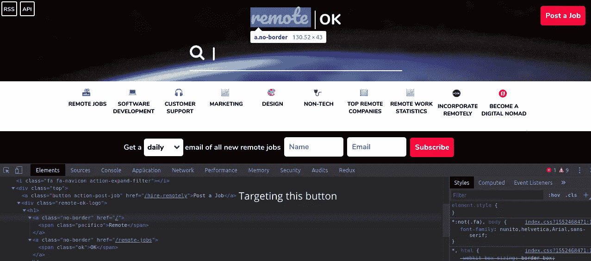

# 使用 Node.js 进行网页抓取

> 原文：<https://levelup.gitconnected.com/web-scraping-with-node-js-c93dcf76fe2b>


网络抓取是一种用于从网站检索数据的技术。您获取页面的内容，然后从页面中提取您需要的数据以进行处理、保存或简单地在您的应用程序上显示。当你试图抓取的应用程序/网站没有公开任何外部 API 供公众使用时，它就派上了用场。值得注意的是，一些网站不允许抓取，所以在你尝试之前要知道这一点。

在 Node.js 中，我们可以使用 HTTP 客户端获取网页，如 [*axios*](https://github.com/axios/axios) ，并使用 [*cheerio*](https://github.com/cheeriojs/cheerio) 从页面中提取我们需要的数据。

在这里，我将向大家介绍以下过程:

*   获取网页
*   从网页中提取数据
*   在网页上显示内容
*   以 JSON 格式保存数据

## 获取网页

我们将要抓取的站点是 [remoteok](http://remoteok.io) 。这是一个工作公告板，上面列出了远程工作、标签、公司名称和类别。

我们使用 *axios* 获取数据，但是首先，我们安装我们的依赖项

```
$ mkdir scraper && cd scrapper
$ npm init -y
$ npm install --save axios cheerio
```

像这样使用它:

*index.js*

```
const siteUrl = "https://remoteok.io/";
const axios = require("axios");const fetchData = async () => {
  const result = await axios.get(siteUrl);
  return cheerio.load(result.data);
};
```

# 从网页中提取数据

使用我们在上一节中创建的助手函数，我们可以获取网页，并且使用`cheerio`库，它为我们提供了方便地操作页面的实用函数。

在你喜欢的浏览器上打开开发者工具，检查你想要定位的元素。在 Google Chrome 上，你可以用`ctrl + shift + i`打开开发者工具，你会在*元素*标签上看到标记。您也可以轻松地在网页上右键单击该元素，然后单击*检查*。
我们将瞄准*发布作业*按钮，并将结果记录到控制台。



我们将针对*发布作业*按钮，并将结果记录到控制台。

```
const $ = await fetchData();
const postJobButton = $('.top > .action-post-job').text();
console.log(postJobButton) // Logs 'Post a Job'
```

我们已经成功抓取了 [remoteok](http://remoteok.io) 并从中提取了数据。

让我们做一些更有雄心的事情。我们将获得所有的标签、公司名称、位置和位置，这样我们就可以在网页上显示这些信息。我们将使用快递服务网页。我已经在我的 [github repo](https://github.com/the-bionic/node-scraping) 上完成了应用程序

## 设置

```
// continuing from the previous example$ npx express-generator //Scaffold an express app. Follow the                       command line instructions. 
$ npm install
```

我们将在 *app.js* 的底部添加这一行来启动服务器

*app.js*

```
const port = 9000app.listen(port, () => console.log(`App listening on port ${port}!`))
```

在项目根目录下添加一个 *scrapper.js* 文件，我们将在这里放入 scrapper 逻辑

*scraper.js*

```
const cheerio = require("cheerio");
const axios = require("axios");const siteUrl = "https://remoteok.io/";
let siteName = "";const categories = new Set();
const tags = new Set();
const locations = new Set();
const positions = new Set();
```

我们正在创建集合来保存我们的数据，因为有可能从网页上获得重复的类别、标签、位置或方位。`Set()`是一种不允许重复的数据结构。

继续前进…

*scraper.js*

```
const fetchData = async () => {
  const result = await axios.get(siteUrl);
  return cheerio.load(result.data);
};const getResults = async () => {
  const $ = await fetchData();
  siteName = $('.top > .action-post-job').text(); $(".tags .tag").each((index, element) => {
    tags.add($(element).text());
  }); $(".location").each((index, element) => {
   locations.add($(element).text());
  }); $("div.nav p").each((index, element) => {
   categories.add($(element).text());
  });

 $('.company_and_position [itemprop="title"]')
  .each((index, element) => {
  positions.add($(element).text());
 });//Convert to an array so that we can sort the results.return {
  positions: [...positions].sort(),
  tags: [...tags].sort(),
  locations: [...locations].sort(),
  categories: [...categories].sort(),
  siteName,
 };
};module.exports = getResults;
```

# 在网页上显示内容

*routes/index.js*

```
const express = require("express");
const router = express.Router();
const getResults = require("../scraper");/* GET home page. */
router.get("/", async function(req, res, next) {
  const result = await getResults();
  res.render("index", result);
});module.exports = router;
```

*views/index.jade*

```
extends layout
block content
 h1 #{siteName}!
 h3 Categories
 ul
  each val in categories
   li= val
 h3 Positions
 ul
  each val in positions
   li= val
 h3 Locations
 ul
 each val in locations
  li= val
 h3 Tags
 ul
  each val in tags
   li= val
```

启动节点服务器:

```
$ node app.js
```

访问端口`localhost:9000`查看 app。


## 以 JSON 格式保存数据

如果需要，我们还可以用少量代码将提取的数据保存在 JSON 文件中。

*utils/converter.js*

```
const fs = require('fs');
const getResults = require('../scraper');
(async () => {
  let results = await getResults()
  let jsonString = JSON.stringify(results);
  fs.writeFileSync('../output.json', jsonString, 'utf-8');
})()
```

这将在应用程序的根目录下用数据创建一个 output.json 文件。

## 警告

值得一提的是，抓取脚本很容易崩溃，因为你无法控制被抓取的站点的结构。即使你这样做，你仍然需要额外的警惕，不要破坏脚本。还有，有些网站不允许刮。确保你做你的研究之前，试图刮任何网站。

## 结论

正如我们所见，使用 cheerio 在 Node.js 中抓取网站非常容易。开始刮吧！

完整代码在此:[代码](https://github.com/the-bionic/node-scraping)

[](https://skilled.dev) [## 编写面试问题

### 一个完整的平台，在这里我会教你找到下一份工作所需的一切，以及…

技术开发](https://skilled.dev) [](https://gitconnected.com/learn/node-js) [## 学习 Node.js -最佳 Node.js 教程(2019) | gitconnected

### 前 33 个 Node.js 教程-免费学习 Node.js。课程由开发人员提交和投票，使您能够…

gitconnected.com](https://gitconnected.com/learn/node-js)