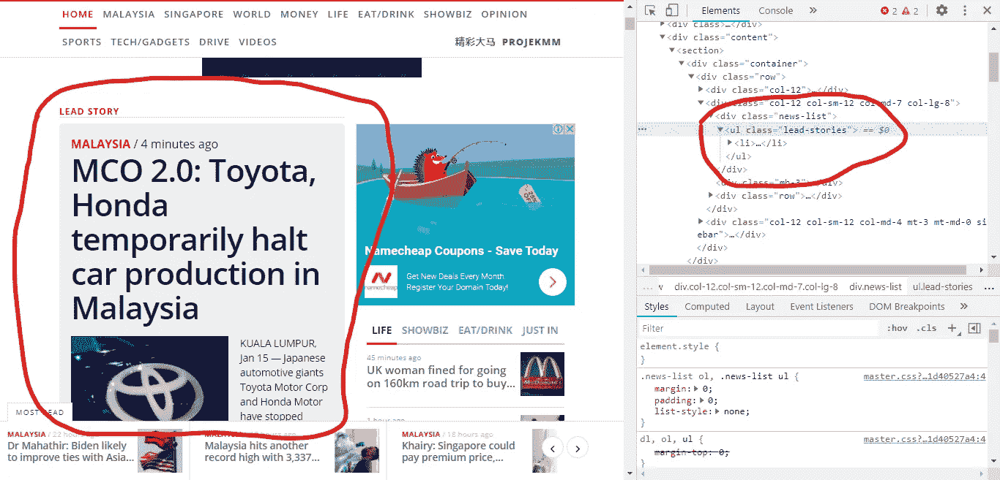
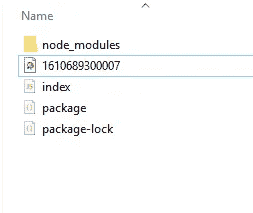
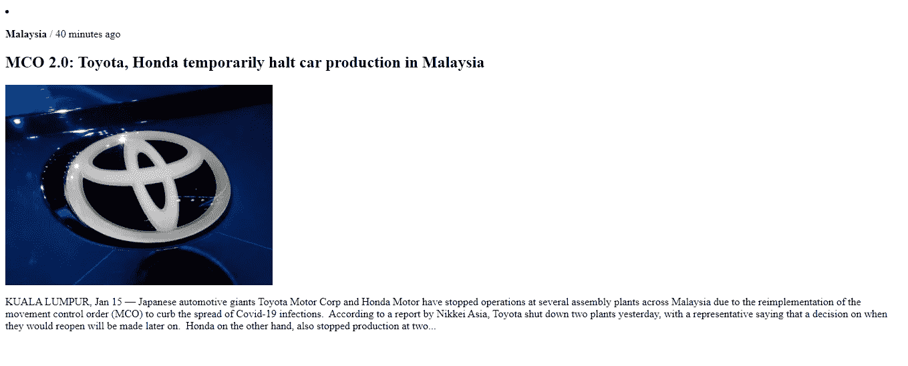

# 使用木偶师和 ExpressJS 进行网页抓取

> 原文：<https://levelup.gitconnected.com/web-scraping-with-puppeteer-and-expressjs-27de63a4d510>

我想在这里实现的是开发一个简单的网页抓取服务，以帮助我抓取网站上的某些信息。


埃文·菲茨尔在 [Unsplash](https://unsplash.com?utm_source=medium&utm_medium=referral) 上拍摄的照片

## 操纵木偶的人

如果你精通 Javascript，最容易使用的网络抓取框架叫做 Puppeteer

[https://pptr.dev](https://pptr.dev/)

木偶师所做的是创建一个典型的 Chromium 浏览器，然后能够浏览网站。然后，它会查看网站内的所有属性，并“抓取”你可能想要使用和查找的任何信息。

例如，如果您正在寻找一个“名称”部分，网站的开发人员将该字段或 div 命名为“名称”是合乎逻辑的。这可能是完全不同的东西，因此你需要事先查看目标网站的来源，以获得你所需要的信息。在这种情况下，木偶师所能做的就是找到“名称”部分，并将其返回给您供您阅读。

除了抓取(动词，单个 P)之外，它还可以抓取网站的截图和 pdf，并自动提交表单，这是网络抓取操作的关键。

因此，有人可能会问，我们如何运行木偶？在这种情况下，我将使用 ExpressJS 服务器构建它，它的设置和使用应该非常简单。

我将在这个项目中使用的版本:

> 节点编号:12.18.0
> 
> ExpressJS: 4.17.1

如果你赶时间，想要一份“马上就好”的食谱和完整的源代码，那就往下走，直到你看到两只非常英俊潇洒的骆驼的照片。否则，请继续阅读，我将一步一步地介绍如何构建 web 抓取服务。

## 步骤 0:设置

如果您不熟悉如何设置 ExpressJS 服务器，我建议您阅读 ExpressJS 网站上的“入门”文章。它很容易掌握，我不到一分钟就学会了。

[](https://www.expressjs.com) [## Express - Node.js web 应用程序框架

### Express 是一个最小且灵活的 Node.js web 应用程序框架，它为 web 和…

www.expressjs.com](https://www.expressjs.com) 

按照“开始”部分中的步骤进行操作，直到 *HelloWorld* 部分。复制整个 *HelloWorld* 代码，因为我们将以此为基础开始。我们现在可以开始用木偶师构建我们的项目了。

## 步骤 1:在项目中安装木偶师

从命令行，在 ExpressJS 项目中，键入以下命令:

```
npm install --save puppeteer
```

这将在您的项目中安装 Puppeteer，同时，它也将被添加到您的 package.json 文件中。

## 步骤 2:将木偶师添加到您的`index.js`项目中

```
const puppeteer = require('puppeteer');
```

这应该会将木偶师添加到您的项目中。一旦完成，让我们在`app.get`函数之外启动一个名为`crawlSite()`的函数。

至此，我们已经安装了木偶师，可以执行`crawlSite()`功能了。您的代码应该如下所示:

注意，我们将从第 15 行开始构建，在上面的例子中是在第 7 行执行的。第 4 行是我们将使用的`puppeteer` 声明。

## 我们在建造什么？

在我们继续之前，我只想谈谈我们将要构建的内容。让我们先构建一些简单的东西。从马来邮报网站上下载了一段。

基本上是在马来邮报(https://www.malaymail.com)的头版上抓取新闻，然后得到头条新闻。除此之外，我们还会对整个页面进行截图，并放入我们的文件夹中。

如前所述，我们将需要提前侦察我们想要刮的网站，并记下您想要刮的部分。在这种情况下，打开“查看源”查看网站的 HTML，我们发现头条新闻在类别`lead-stories`中的`div`和`ul:`中



马来邮件线索-故事部分

一旦我们确定了想要捕获的部分，下一步就是构建它。

## 第三步:让我们编码

如前所述，大多数“动作”将发生在`crawlSite()`功能中。下面是完整的`crawlSite()`函数:

让我们一行一行地检查这个函数:

在第 5 行的函数中，我们要做的第一件事是获取当前时间和时间戳。这是为了让我们可以使用时间戳来标记将由木偶师拍摄的截图。

这里我们要做的下一件事是启动页面，如第 9 行到第 11 行所示，这将导致第 14 行；以时间戳作为文件名的屏幕截图。

接下来是第 17 行，它主要搜索(eval)前面提到的`lead-stories`类，以从我们正在抓取的网站中获取头条新闻。通过在第 17 行末尾指定`innerHTML` ,返回的数据将是 HTML 格式的

最后，这个函数将返回`lead_story`变量，它应该包含 glorious HTML 中的主要故事。

## 第四步:展示销售线索

最后，下面是我从 ExpressJS 获得的显示故事的函数:

第 3 行基本上会执行这个函数。

在第 6 行，我包含了`HTML` 标签和`body` 标签来显示 HTML 中的变量`lead_story`。

就这样，这就是你需要做的一切。如果您能够提供 ExpressJS，除了您的文件夹中的 png 截图之外，您还应该能够获得类似于以下内容的内容:



1.文件夹内的截图



2.来自 malaymail.com 的头条新闻


照片由[卡里姆·曼吉拉](https://unsplash.com/@karim_manjra?utm_source=medium&utm_medium=referral)在 [Unsplash](https://unsplash.com?utm_source=medium&utm_medium=referral) 拍摄

我的完整代码:

## 摘要

我希望我能够展示用 Puppeteer 和 ExpressJS 构建 web 抓取服务是多么容易。你可以像上面演示的那样构建一个简单的抓取服务，或者甚至可以填写一个表单来提交。由于这一切都是通过简单的现有网络技术完成的，因此可能性是无穷无尽的。

最后，我希望你会发现这篇文章很有收获，并能激发出关于木偶师的伟大想法。

> 他们有条件
> 但是你可以看到
> 我没有条件

奥创

*塞拉马特·孟加图拉*