# 使用 R 进行网页抓取(第 1 部分—静态网页)

> 原文：<https://levelup.gitconnected.com/web-scraping-with-r-part-1-static-webpages-37e6d4f11d07>

有一段时间了，我很高兴回来了！在这整个期间，我花了很多时间在网上冲浪，我意识到那里的信息太多了。然而，当我们不得不手动滚动和阅读特定网站上的所有内容时，使用几行简单的代码来获取我们感兴趣的信息会有多好呢？

在我之前的帖子中，我写了一篇关于通过 Python 进行 web 抓取的文章，所以我决定做一些不同的事情，尝试用另一种编程语言 r 进行 web 抓取。

 [## 使用 Python 实现新闻文章的 Web 抓取和文本摘要

### 在这篇文章中，我想用 Python 从一个新闻中抓取并总结一个新闻文章链接的故事…

medium.com](https://medium.com/@lzpdatascience/web-scraping-and-text-summarization-of-news-articles-using-python-2ecfb3e71050) 

事不宜迟，让我们开始吧，希望你喜欢这篇文章。

在本教程中，我们将抓取静态网页。静态和动态网页的主要区别在于，后者忽略了 Javascript。因此，您可以抓取信息，而不需要服务器。

使用本教程中的步骤，您可能会遇到错误，这些错误可能不允许您抓取动态网页上的任何数据。在这种情况下，我们需要一个不同的解决方法，我将很快为此写另一个指南。

让我们从安装和加载必要的库开始:

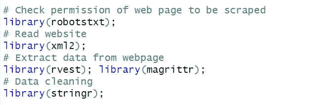

加载完库之后，我们可以首先将 URL 分配给一个对象，并检查网站的抓取权限。阅读网站的 robots.txt 文件是一个好习惯，以便在抓取特定网站之前了解所需的权限。

在我的例子中，我将从 https://scrapethissite.com/pages/simple/的 T2 获取国家数据。

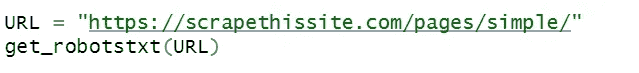

get_robotstxt()函数允许我们获取我们计划抓取的特定网站的抓取权限。在这种情况下，对于我感兴趣的链接，似乎没有很多限制来禁止用户代理进行 web 抓取。

为了更好地理解 robotstxt()的工作原理，下面的链接可能会有所帮助:【https://moz.com/learn/seo/robotstxt。

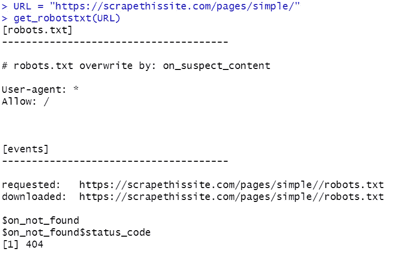

但是，有时该函数可能无法准确返回给定网站的权限。因此，您也可以在网站的扩展名后面添加/robots.txt，以获得更好的结果。

太好了！看起来我们可以继续抓取，但是不需要请求任何许可就可以避开课程和 FAQ 链接。

接下来，我们可以使用 read_html()函数读取静态 HTML 页面的内容。

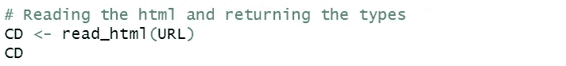

从输出中，我们可以看到 HTML 格式的网页内容。

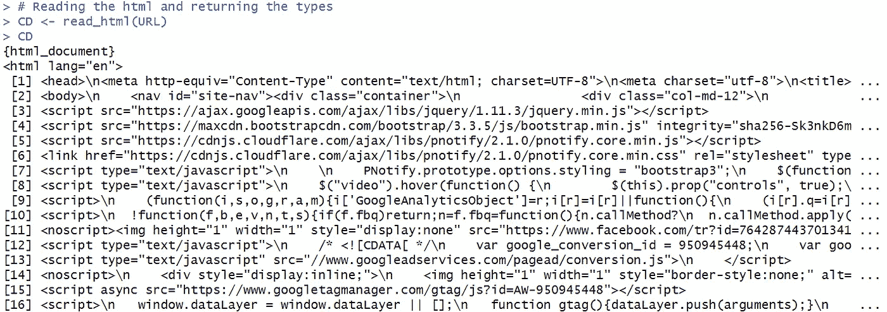

这可能看起来有点令人不知所措，但是不要担心，因为我们只对获取国家信息感兴趣，我们将继续使用 html_nodes()和 html_text()函数来获取包含我们感兴趣的内容的特定节点。

有两种方法来识别我们感兴趣的对象。第一种使用右键单击-> inspect ->定位包含我们想要抓取的元素的字符串。我们可以看到，我们感兴趣的信息似乎属于“国家信息”类。

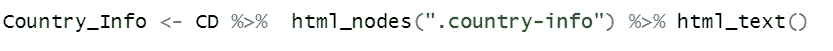

另一个我更喜欢的方法是使用 SelectorGadget chrome 扩展。使用这个工具，只需单击一下就可以返回我们想要的特定元素。它还提供了非常有用的 XPath / CSS 选择器输出。

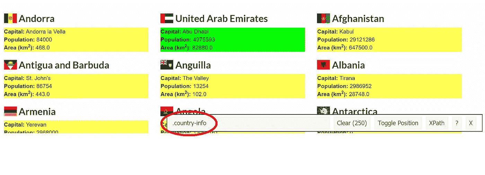

抓取元素后的输出

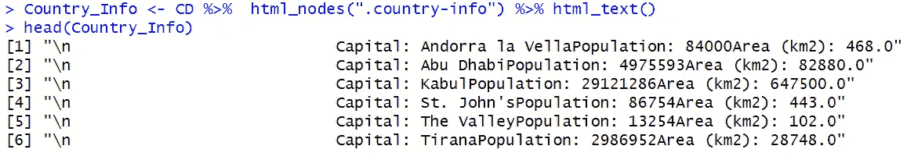

正如我们所看到的，字符串包含许多换行符“\n”和不必要的空格，这可能会使输出看起来有点混乱。因此，我们可以应用“stringr”库中的函数。

我们可以首先使用 str_remove_all()函数删除换行符。

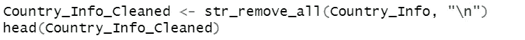

然而，输出中似乎仍有许多空白。

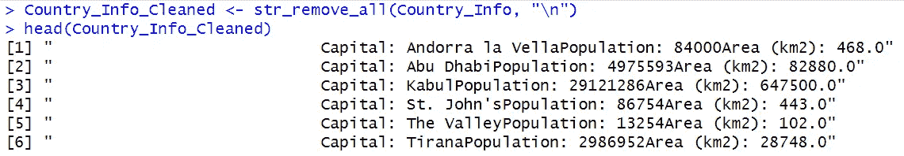

接下来，我们可以使用 str_squish()函数来修剪空白。

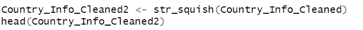

现在输出看起来整洁多了！

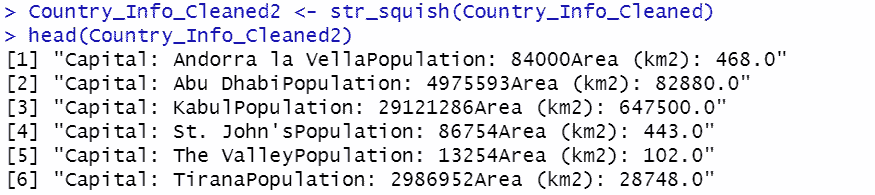

最后，根据需要，我们还可以将文档转换为数据框，并将文档导出为 Excel CSV 文件，以便在本地计算机上使用。

注意:记住使用 setwd()函数设置您想要导出 CSV 文件的工作目录，以便轻松定位您导出的文件！

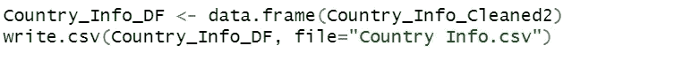

这就结束了关于使用 R！在未来，我们将在第 2 部分中寻找抓取动态网页的方法。

好奇的学习者？释放你在媒体上学习的全部潜力，用不到一杯咖啡的钱支持像我这样的作家。

 [## 通过我的推荐链接加入媒体——杰森·LZP

### 作为一个媒体会员，你的会员费的一部分会给你阅读的作家，你可以完全接触到每一个故事…

lzpdatascience.medium.com](https://lzpdatascience.medium.com/membership) 

刚接触 R 编程，不知道从哪里开始？看看我的电子书一步一步的指南！

 [## 数据科学入门指南(PDF /电子书

### 有一段时间了，我希望每个人都保持安全和健康。本月初，由于封锁，我刚刚…

link.medium.com](https://link.medium.com/oPliK2gNZbb)