# 用 R 进行网页抓取(第二部分——动态网页)

> 原文：<https://levelup.gitconnected.com/web-scraping-with-r-part-2-dynamic-webpages-de620a161671>

在我之前的文章中，我写了关于静态网页抓取的内容。

 [## 使用 R 进行网页抓取(第 1 部分—静态网页)

### 有一段时间了，我很高兴回来了！在这整个期间，我花了很多时间在网上冲浪，我…

levelup.gitconnected.com](/web-scraping-with-r-part-1-static-webpages-37e6d4f11d07) 

在本教程中，我们将看看如何抓取动态网页。与静态网页相比，动态网页是使用 Javascript 从数据库中提取数据的页面，并且信息变化频繁。

如果您尝试使用 Rvest 抓取静态网页，您可能无法在网站上获得通过 Javascript 创建的动态信息。因此，我们可以使用额外的库硒元素来解决这个问题。

首先，我们可以安装并加载 RSelenium 库以及之前用于静态网页的其他库。

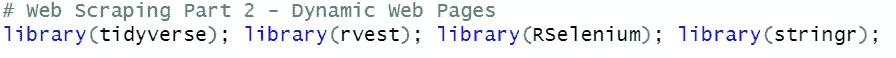

RSelenium 库允许我们打开一个浏览器来传递命令以获得所需的信息。在这个例子中，我会使用谷歌浏览器。

我们将首先通过 **rsDriver()** 函数启动 Selenium 服务器和浏览器。然后，我们将继续使用我们选择运行的端口号来设置浏览器类型。

如需了解更多信息，请查看 CRAN 软件包:[https://CRAN . r-project . org/web/packages/RSelenium/RSelenium . pdf](https://cran.r-project.org/web/packages/RSelenium/RSelenium.pdf)。

有时，由于谷歌 Chrome 版本的原因，加载 Selenium 服务器和浏览器可能会出现问题。因此，找到可用的 Selenium 版本的一个很好的方法是首先使用**binman::list _ versions(" chrome driver ")**函数检查当前获得的版本。

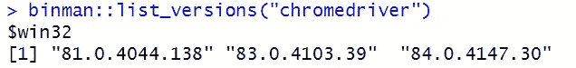

我从读者那里收到了一些消息，表明在运行上面的代码 binman::list_versions()时出现了一个错误。

## 编辑:变通解决方案

这可能是用户的浏览器不匹配，例如 Chrome 版本和 Selenium 的网络驱动程序。不要烦恼；这有一个简单的解决方法。

1.  删除 binman::list_versions()代码
2.  根据您的浏览器类型，首先，检查您的浏览器运行的版本。对于 Chrome，点击顶部的三个点>帮助>关于谷歌 Chrome，查看您当前使用的版本。

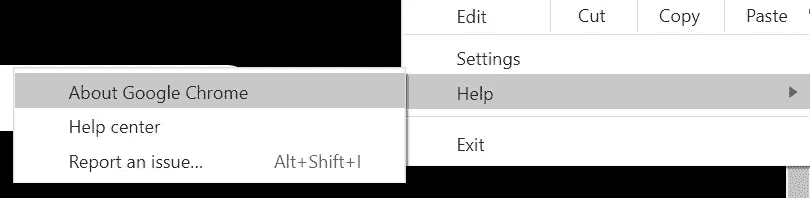

在我写这篇文章的时候，Chrome 的运行版本是 87.0.4280.141。(第 87 版)

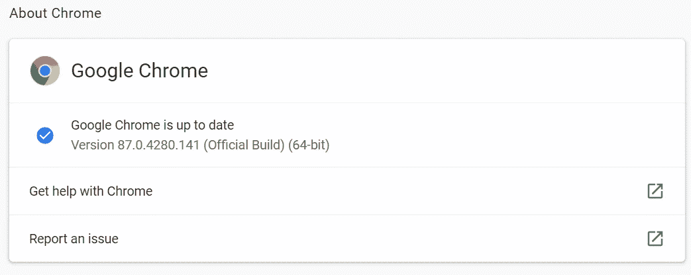

4.接下来，通过下面的链接查看不同 Chrome 版本的 Selenium web 驱动程序。[https://chromedriver.chromium.org/downloads](https://chromedriver.chromium.org/downloads)

我们可以看到，它建议我使用 ChromeDriver 87.0.4280.88，因为我的 Chrome 运行的是 87 版。

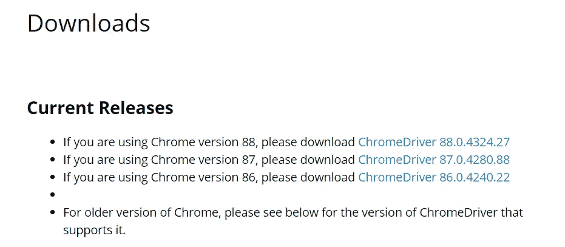

5.从那里，我们将在这个实例中输入 ChromeDriver 版本:87.0.4280.88 到我们的代码中，它应该允许我们启动一个远程浏览器。

完成后，您可以继续遵循下面的指南。如果您遇到任何问题，请随时联系我们，我会尽全力尽快解决。谢谢大家！

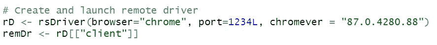

一旦我们获得了 chrome 的当前版本，我们就可以在我们的 **rsDriver()** 函数中输入版本。

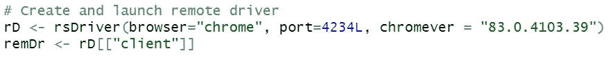

当该函数成功连接到远程服务器并打开新的 Google Chrome 浏览器来传递我们的参数时，您就会知道它成功了。

在这个例子中，假设我正在购买乐高玩具作为给朋友的生日礼物，我想获得在我国一个流行的购物平台上的各种乐高玩具的产品名称和价格。

首先，我会检查抓取权限，以避免违反网站的任何服务条款。如果您还没有阅读本教程的第 1 部分，我们可以通过在网站域名末尾添加/robots.txt 来快速检查一下。

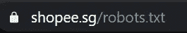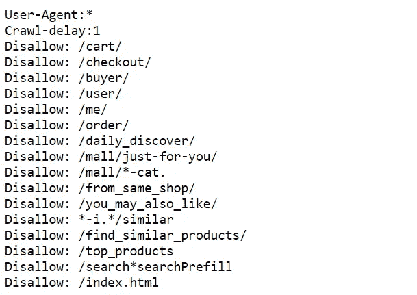

太好了！看来我们要刮的网站不在禁止列表下。然后，我们可以使用 **$navigate()** 函数导航我们的远程驱动程序。然后我们将使用 **remDr$getPageSource()** 来读取 HTML 数据。

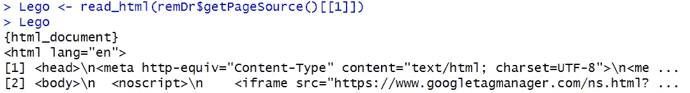

一旦我们到达这个阶段，我们就可以通过 Selenium 浏览器抓取动态网页。然后，我们将使用 Rvest 中的函数，就像我们在本指南的第 1 部分中所做的那样。

我们将使用方便的 SelectorGadget 工具来突出显示包含我们想要抓取的信息的节点。

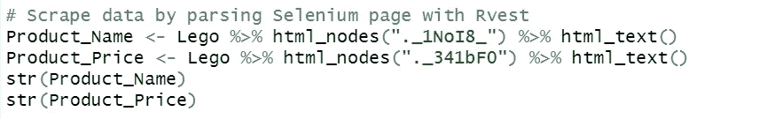

我们还使用了 **str()** 函数来确保获得正确的产品数量和价格，以防止在选择要抓取的节点时遗漏值。从我们的抓取输出来看似乎不错，似乎这个特定的页面包含 30 个产品。

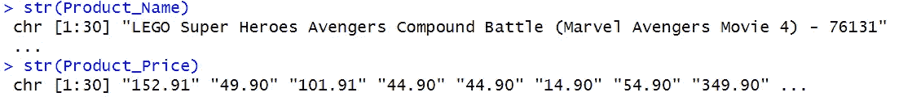

接下来，我们可以使用 **data.frame()** 函数将两个对象合并成一个数据框，或者将其导出为 CSV 文件。

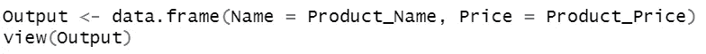

输出

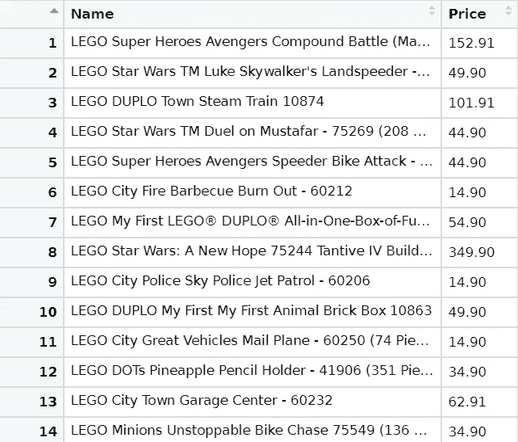

导出为 CSV 文件

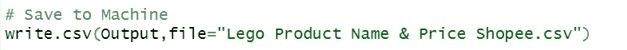

页（page 的缩写）记住使用 **setwd()** 函数设置您的工作目录，以便于定位您导出的文件！

在我们完成本教程之前的最后一步，因为我们知道通过启动 Selenium，我们在远程服务器上运行它，它必须被关闭才能在未来的应用程序中访问相同的端口号。

因此，当我们完成时，我们应该总是记得关闭我们的服务器和远程驱动程序。

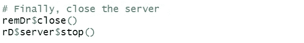

这是关于静态和动态网页抓取的快速 2 部分系列。我希望你已经学到了一些新的东西，并尝试抓取静态和动态网页。

好奇的学习者？释放你在媒体上学习的全部潜力，用不到一杯咖啡的钱支持像我这样的作家。

 [## 通过我的推荐链接加入媒体——杰森·LZP

### 作为一个媒体会员，你的会员费的一部分会给你阅读的作家，你可以完全接触到每一个故事…

lzpdatascience.medium.com](https://lzpdatascience.medium.com/membership) 

刚接触 R 编程，不知道从哪里开始？看看我的电子书一步一步的指南！

 [## 数据科学入门指南(PDF /电子书

### 有一段时间了，我希望每个人都保持安全和健康。本月初，由于封锁，我刚刚…

link.medium.com](https://link.medium.com/KoWL3MZMZbb)