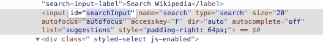

# Python 中 Selenium 的 Web 抓取

> 原文：<https://levelup.gitconnected.com/web-scraping-with-selenium-in-python-8fde2f0fd559>

## 一个业余的网页抓取者在现代互联网的迷宫中导航时能学到什么？


亚历克斯·安德鲁斯摄于 [Pexels](https://www.pexels.com/photo/shallow-focus-photography-of-black-and-silver-compasses-on-top-of-map-1203808/?utm_content=attributionCopyText&utm_medium=referral&utm_source=pexels)

当我第一次听说网络抓取这个概念时，它立刻吸引了我。我非常喜欢构建自动化流程，所以当我第一次使用`BeautifulSoup`以这种方式收集数据时，这是一种奇怪的令人满意的体验。然而，我很快意识到，只有当你有静态表，页面，你可以很容易地找出 URL 结构，并且没有 JavaScripts 运行加载新数据在同一个页面上时，`BeautifulSoup`才是伟大的。换句话说，只要网站所有者不介意与你分享信息，那就很好。但是，如果你想抓取一个保护数据的网站的内容，会发生什么呢？

一个快速(可能太快)的搜索把我带到了`selenium`，Python 中的另一个可用包。最大的好处是，它使你能够轻松地浏览网页，只需要最少的 HTML 知识。核心缺点是`selenium`不是**本身不是一个网页抓取工具**，它是为自动化测试而设计的。我发现有太多的指南忘记提到这条信息。使用`selenium`也相对较慢，因为你本质上是在后台使用浏览器。

然而，尽管如此，`selenium`对我的目的来说似乎是完美的。我不想下载大量数据，但我确实想浏览一个故意构建的令人困惑的网站，以获得我需要的信息。另外，我还想通过代码享受使用网络浏览器的乐趣。

在这篇博文中，我将分享我第一次使用`selenium`进行网络抓取的个人故事。首先，我们将讨论开始网络抓取时必须采取的预防措施，我认为这是一个在指南中经常被忽略的话题。然后，我们将看看我们将在稍后的维基百科中使用的核心功能。之后，我们将讨论如何在“现实生活”中部署铲运机，看看它会把我们引向何方。

## 预防措施


由 [Unsplash](https://unsplash.com/s/photos/danger?utm_source=unsplash&utm_medium=referral&utm_content=creditCopyText) 上的[暗室 sg](https://unsplash.com/@darkroomsg?utm_source=unsplash&utm_medium=referral&utm_content=creditCopyText) 拍摄

在我们开始之前，我认为强调一个人在抓取网页时面临的危险是很重要的。这是一个灰色和有争议的领域，许多网站不喜欢它，他们反对网络抓取。尽管有点讽刺意味的是，整个现代科技经济都建立在一个巨大的网络抓取器——谷歌之上。我不认为简单地以一种有效的方式从一个网站下载公开和免费的可用数据应该被认为是非法的，但再次强调，这是一个灰色地带。

然而，一个非常现实的可能性是**网站会在没有任何通知的情况下屏蔽你**，要么是因为他们误认为你是一个严重的威胁，要么是因为他们确实认为你是一个严重的威胁。我怎么强调都不为过。

如何防御被抓被堵？我在网上找到的建议可以分为两类:好的，似乎不起作用；坏的，可能成功率更高。我喜欢分别称这些*完美的*和*叛逆的*建议。

*Paragon* 建议包括以下内容:

*   阅读网站的条款文档，如果你找到了，它可能会包括网站上的所有价格都是公司的知识产权，它可能会使用更严厉的词语等。；
*   阅读 *robots.txt，*大多数网站的根目录中都有这个文件，如果你感兴趣，可以查看 [Medium 的](https://medium.com/robots.txt)，这些文件包含了关于所有者期望爬虫(最重要的是谷歌机器人)如何行为的指导方针，以及网站的哪些区域是禁止进入的；
*   总的来说，行为举止要得体、文明，明确请求所有者的许可，不要用请求轰炸网站，清楚地表明自己的身份，等等。

另一方面，叛逆的建议可能是这样的:

*   轮换您的 IP 地址，例如通过使用 VPN，这将使它不可能跟踪你一段时间；
*   内置随机点击、鼠标移动、等待时间，使算法的模式更难识别；
*   如果你正在使用一个无头浏览器(就像我们将要做的)，让浏览器很难被识别为自动的。

当我开始这个项目时，我天真地做了大多数*典型*的事情，除了请求网站所有者的许可来抓取网页，除了等待时间，我没有做任何背叛的事情。够了吗？我们很快就会看到。

## 系统设置

`Selenium`是一个开源的自动化测试套件，最初创建于 2004 年，主要用于跨不同浏览器和平台的 web 应用测试。要了解更多的背景信息和历史(包括这个名字起源的有趣轶事)，你可以查看这个[伟大的总结页面](https://www.guru99.com/introduction-to-selenium.html)。

开始使用 Python 中的`selenium`需要两件东西。

首先，你需要安装软件包本身，最简单的方法是通过`pip`中的终端:

```
pip install selenium
```

第二，你需要一个叫做`WebDriver`的东西，专门用于你的浏览器。这将提供一个交流自动化指令的框架，这对于所有不同的浏览器都是一样的。我在 MacOS 上使用的是 Chrome，但是对于不同的操作系统/浏览器来说，过程非常相似。这些是我用来安装`ChromeDriver`的[指令](https://www.kenst.com/2015/03/installing-chromedriver-on-mac-osx/)，我刚刚在终端上输入了这个:

```
brew cask install chromedriver
```

然后用以下命令检查版本:

```
chromedriver --version
```

您可能需要定义`WebDriver`的路径，但是在我的例子中它是自动工作的。如果一切正常，我们该去训练场了！

## 训练场

在这一部分，我们将在一个美好舒适的环境中测试`selenium`的核心功能，在维基百科中，一个完全欢迎美好且表现良好的机器人的网站。我们的任务是用拉丁文下载一个著名的罗马政治家网页的第一段。

我们首先创建一个新的`WebDriver`对象:

```
from selenium import webdriver
driver = webdriver.Chrome()
```

如果您做的一切都正确，您应该会看到一个新的浏览器窗口打开，看起来像这样:


注意*“Chrome 由自动化测试软件控制。”*消息。当您输入新命令时，这个单独的窗口将不断更新。你仍然可以像平常一样使用浏览器，你可以进入另一个网站，或者浏览这个网站。驱动程序对象将跟踪您所做的更改，并且能够从您离开的地方继续，因此您可以将自动和手动指令结合起来。

要导航到某个网站，您可以使用`get`方法:

```
driver.get('[https://wikipedia.com'](https://wikipedia.com'))
```

自动窗口现在应该在维基百科主页上。我们的任务是

*   改变语言；
*   键入搜索参数；
*   单击搜索按钮。

一旦我们到了这里，是时候开始一个 web scarping 项目的重要部分了:检查。如果您右键单击网站上的任何元素，并选择 Inspect，您可以阅读页面的 HTML 代码:


在网站上查找元素时，您有各种各样的可能性，包括通过类名、id、标签、XPath 等查找元素。要查看可能性列表，您可以键入`driver.find`并按 Tab 键。以`find_element`开头的方法将返回第一个元素，而`find_elements`(复数)将返回一个列表。

在维基百科主页上，我们可以通过搜索 id 并将其分配给`search_language`变量来选择带有语言选项的下拉按钮:


```
search_language = driver.find_element_by_id('searchLanguage')
```

这是下拉菜单本身。我们可以通过查看这个元素的`text`属性来检查我们是否成功了:

```
search_language.text
```

这将返回一个带有可能的语言选项的字符串。

要从下拉列表中选择一个项目，我们需要`Select`类，我们将使用`select_by_visible_text`方法:

```
from selenium.webdriver.support.ui import Select
Select(search_language).select_by_visible_text('Latina')
```

如果你回头看看这个网站，你会看到下拉列表变成了 LA:


该输入我们的搜索参数了，类似于语言下拉列表，我们可以通过 id 找到它，并将其分配给`search_textinput`变量:



```
search_textinput = driver.find_element_by_id('searchInput')
```

为了输入搜索元素，类似于下拉选择，我们还需要一个新的类`Keys`，我们将使用`send_keys`方法:

```
from selenium.webdriver.common.keys import Keys
search_textinput.send_keys('Marcus Aurelius')
```

这将使我们的搜索文本重新出现在网站上:


找到按钮变得更加困难，id 与按钮本身没有关系。一种总是有效且易于实现的方法是通过 XPath 查找元素。(XPath 是一种用于在 XML 文件中导航的查询语言，但是由于 HTML 和 XML 之间的相似性，它也适用于 HTML。)基本上就是树形结构中网站上元素的路径。要获取元素的 XPath，您可以将鼠标悬停在检查器窗口(在我们图片的右侧)中，右键单击并选择 full XPath:


有了这些信息，就可以找到按钮并将其分配给`search_button`变量，如下所示:

```
search_button = driver.find_element_by_xpath(
'/html/body/div[2]/form/fieldset/button/i'
)
```

显然，这种解决方案既不优雅，也不实用，因为对网站的任何小改动都会使我们的代码变得无用。但我们现在会冒险逃脱。

找到按钮后，您可以用`click`方法点击它，如下所示:

```
search_button.click()
```

检查驱动程序的当前 URL，看它是否与`current_url`一起工作:

```
driver.current_url
```

好吧，看起来我们在正确的页面上，我们做什么？假设我们要保存第一段，你可以集合所有标签名为`'p’`的元素，然后检查你需要哪一个:

```
paragraphs = content.find_elements_by_tag_name('p')
intro_paragraph_text = paragraphs[4].text
```

(当然，如何获得索引号是一个不同的问题，例如，您可以检查具有特定长度的第一个。)

最后，完成后关闭驱动程序非常重要，尤其是对于像 Chrome 这样的内存密集型浏览器:

```
driver.quit()
```

至此，我们的维基百科使命就完成了。

## 另外两个概念

在我们进一步讨论之前，我们需要快速讨论另外两个概念。

第一个是等待时间。在你的算法中建立等待时间可以被看作是一个典型的*(友好点，不要总是用请求轰炸网站)和一个*叛逆的*方法(让请求看起来不是来自人类)。在`selenium`中，有不同的内置等待函数，但它们更多的是为了有效处理页面加载时间，而不是为了强行限制工具的性能。(这还是因为`selenium`不是为网络抓取而设计的。)查看`selenium` [文档](https://selenium-python.readthedocs.io/waits.html)了解更多信息。我们要做的是使用一个标准的 Python 命令，并在我们的代码中插入`time.sleep(x)`行，其中`x`可以是一个数字，也可以是一个随机变量。这使得代码在执行下一行之前停止并停留`x`秒。*

*第二个概念是浏览器选项。当我们开始运行我们的自动化浏览器时，我们可以随时直观地检查它。这在开发过程中非常有用，但是当您运行代码时，您希望使额外的浏览器窗口不可见。这是一个`headless`浏览器的概念，当你第一次创建你的`WebDriver`对象时定义它。你可以在这里定义许多不同的附加参数，例如，你可以不加载图片来加速进程，等等。您可以使用`add_argument`方法添加这些选项:*

```
*chrome_options = webdriver.ChromeOptions()
chrome_options.add_argument('headless')
driver = webdriver.Chrome(options=chrome_options)*
```

*这将在你的电脑上创建一个不可见的`WebDriver`。当你完成时，确保用`quit`方法关闭它，很容易忘记它仍然在后台滴答作响！*

## *加入战斗*

*是时候在真正的网站上测试我们的技能了。我会显示我用来刮某航空公司价格变化的代码。我的项目目标是跟踪特定日期特定航班的价格，并分析其随时间的变化。你可能听说过关于机票价格的各种都市传说:不要在周四买票，在航班起飞前 3-6 个月买票，等等。我想对这些建议进行实证检验。*

*你会注意到，我们不会像处理维基百科的例子那样详细。我做这个练习的目的不是让我的项目完全可复制，而是给你一个如何构造 scraper 类的想法。我认为在一个特定的网站上寻找单个元素的细节是没有意义的，如果你想自己实现它，无论如何你都必须定制你的需求。然而，我下面使用的每一个与`selenium`相关的代码都是我们之前讨论过的。它实际上只是把碎片拼在一起。请注意，在下面的代码中，某些变量是大写字母，在我最初的项目中，这些都是字符串。*

*这是最初的一个类，为了演示的目的，我把它分成了三个部分。*

*首先，我们导入必要的库，定义类初始化，定义如何在`scraper`对象中创建新的`WebDriver`，并添加一个方法将它导航到我们感兴趣的网站:*

*我决定将`driver`对象放在`scraper`对象之外，这样我也可以在脚本之外独立地使用它。所以它总是作为方法的一个参数被传递。*

*然后，第一个主要功能的目的是通过输入出发/目的地机场和出发/返回日期来导航站点的搜索页面:*

*最后，第二个主函数的目的是在搜索页面上查找价格，并在`pandas` `DataFrame`中返回所有内容:*

*我使用脚本的方式是保存一个包含历史数据的`.csv`文件，当我在 Jupyter Notebook 中运行一个新的 scraper 时，我在`pandas`中连接新旧信息，然后覆盖旧文件。*

*我在考虑编写一个自动化的辅助层，在每天给定的时间运行脚本并自动收集价格，但目前，我对每天手动运行几次抓取序列感到满意。*

*有一段时间一切都很好。*

## *秋天*

*几天过去了，我对自己的成就感到非常自豪，使用我的专业定制包来收集数据。但是每一个好的黑手党故事都会有失败，你最终会为你的傲慢付出代价，我的故事也不例外。*

*一个阳光明媚的早晨，在我的代码意外返回一条错误消息后，我手动检查了站点，迎接我的是这条消息:*

**

*就这样，我被禁止访问我正在搜索的网站。我以为我可以一天三次下载四个不同航班的价格信息而不会有任何反应，但是我错了。*

*我飞得离太阳太近了。*

## *我本可以如何(潜在地)阻止它*

*关于这次经历有趣的是，我永远也不会确切地知道到底是什么出卖了我。也就是说，在我的过程中我发现了两个明显的错误:*

*   *无头浏览器可以被认为是一种自动化工具。
    在[这篇文章](https://intoli.com/blog/making-chrome-headless-undetectable/)中，有一个关于你的无头浏览器可能被识别的特征的很好的总结。你甚至可以自己检查你的浏览器是否能通过测试(作者的观点是，即使是合法的、人工控制的浏览器也经常失败)，但有趣的是我的`selenium` `WebDriver`确实通过了所有的标准:*

**

*   *即使我在不同的搜索之间增加了半分钟的等待时间，我的搜索模式还是非常明显的非人类。我可以通过添加随机睡眠时间而不是预定义的睡眠时间来避免这一点，最重要的是，通过 VPN 连接到网站，这将使我的 IP 地址在每次运行时都发生变化。我还发现了[这篇关于如何使用免费代理提供商的帖子](https://medium.com/datadriveninvestor/how-to-not-get-caught-while-web-scraping-88097b383ab8)，我将来肯定会使用它。*

## *我学到了什么*

**

*来自 [Pexels](https://www.pexels.com/photo/businessman-man-space-desk-7059/?utm_content=attributionCopyText&utm_medium=referral&utm_source=pexels) 的[启动股票照片](https://www.pexels.com/@startup-stock-photos?utm_content=attributionCopyText&utm_medium=referral&utm_source=pexels)的照片*

*这是一个有价值和多层面的教训。我学到了以下几点:*

*   *收集数据可能很困难/昂贵/有风险，像 kaggle.com 上的数据集收集这样的地方很受欢迎是有原因的。*
*   *你的问题越专业，你找到的资源就越少。例如，我无法找到不同`ChromeOptions`参数的完整列表，我的代码来自不同编程语言的多个讨论线程。*
*   *网站不好看，对内容高度保护，没人在乎规则。网络抓取不是一个玩具，它可以产生现实生活中的后果，人们应该比基于非专家撰写的高水平指南所设想的要小心得多。你最好的选择是不要懒惰，采取防御策略，玩阴的，做最坏的打算。*
*   *使用自动驱动程序浏览网站非常有趣。是一个有用的工具，除了基本的网络抓取之外，你还可以用它构建许多不同的有趣的应用。如果你感兴趣，可以看看这个[音乐网站脚本](https://realpython.com/modern-web-automation-with-python-and-selenium/)作为例子。*

## *结束语*

*当我第一次注意到我得了 403 分时，我非常难过。现在我很酷的博客想法被浪费了。毕竟，谁会关心一个一周后被抓的人写的指南呢？*

*但后来我意识到，当谈到某些话题时，拥抱自己业余的一面是很重要的。在我看来，有太多自称专家的人在缺乏研究的情况下散布虚假或误导性的信息。在这个时代，漂亮的封面图片和彩色图表等肤浅的美学决定了内容的价值和传播，即使在数据科学博客这样的所谓科学社区，这也可能是非常有害的。*

*在这样的环境中，诚实地承认我的业余性是很困难的，但我认为这最终是值得的。现在我有一个非常引人注目的故事，关于当你第一次诚实地尝试时，网络抓取实际上是如何进行的。*

*[](https://matepocs.medium.com/membership) [## 加入我的推荐链接-伴侣概念

### 作为一个媒体会员，你的会员费的一部分会给你阅读的作家，你可以完全接触到每一个故事…

matepocs.medium.com](https://matepocs.medium.com/membership) 

## 参考

 [## Selenium 与 Python - Selenium Python 绑定 2 文档

### 请注意，这不是正式文档。如果你想对这个文档有所贡献，你可以叉这个…

selenium-python.readthedocs.io](https://selenium-python.readthedocs.io/) [](https://www.guru99.com/introduction-to-selenium.html) [## 硒是什么？Selenium 自动化测试简介

### Selenium 是一个免费(开源)的自动化测试套件，适用于跨不同浏览器和平台的 web 应用程序…

www.guru99.com](https://www.guru99.com/introduction-to-selenium.html) [](https://medium.com/datadriveninvestor/how-to-not-get-caught-while-web-scraping-88097b383ab8) [## 如何在抓取网页时不被抓到？

### 制造一个机器人，模仿人类正常的上网行为，这样它就不会被注意到或者…

medium.com](https://medium.com/datadriveninvestor/how-to-not-get-caught-while-web-scraping-88097b383ab8) [](https://intoli.com/blog/making-chrome-headless-undetectable/) [## 让 Chrome Headless 无法被检测到

### 一篇名为《检测 Chrome Headless》的短文在周末出现在《黑客新闻》上，此后它一直被…

intoli.com](https://intoli.com/blog/making-chrome-headless-undetectable/) [](https://realpython.com/modern-web-automation-with-python-and-selenium/) [## 用 Python 和 Selenium 实现现代 Web 自动化——真正的 Python

### 学习高级 Python web 自动化技术的指南:Selenium、无头浏览、导出抓取的数据…

realpython.com](https://realpython.com/modern-web-automation-with-python-and-selenium/)*