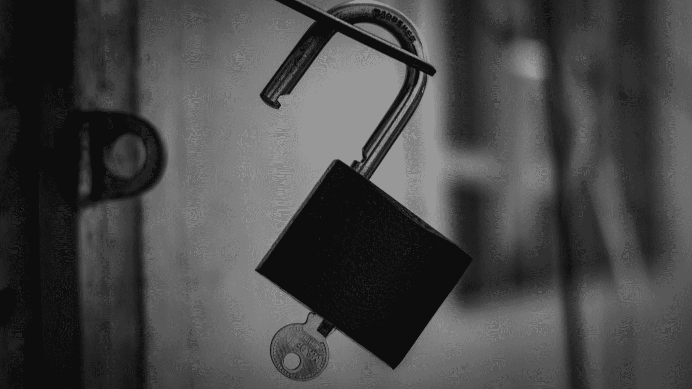

# 网络安全:什么是 CSRF 攻击？

> 原文：<https://levelup.gitconnected.com/web-security-what-is-a-csrf-attack-62d1ea0eeae0>

扎卡里·卡道夫在 [Unsplash](https://unsplash.com?utm_source=medium&utm_medium=referral) 上的照片

CSRF(跨站点请求伪造)攻击是一种恶意利用，可以用来访问某人的帐户或敏感信息。当黑客诱骗用户执行他们并不打算执行的操作时，就会发生这种类型的攻击。

## 冒充原创的恶意网站

我们可以考虑一个例子，你登录到你的电子邮件帐户，你收到一封来自朋友的电子邮件，说点击此链接参加比赛。但是这个链接实际上把你带到了一个看起来和你的电子邮件账户的登录页面一样的页面。但是，这个页面上的表单不会转到电子邮件登录页面，而是转到攻击者控制的页面。

现在，当您输入用户名和密码并点击提交时，攻击者就拥有了您的凭证。然后，他们可以使用这些凭据登录到您的帐户。他们还可以更改您的密码，使您无法登录和阻止他们。这种类型的 CSRF 攻击是可能的，因为由于登录页面看起来与原始登录页面相似，攻击者能够在您没有意识到的情况下欺骗您代表他们执行操作。

## 银行账户的例子

CSRF 攻击的另一个例子是，恶意应用程序诱使个人填写表格，如银行账户转账表格。该表单看似来自合法网站，但实际上是由恶意应用程序托管的。当个人填写他们的银行帐户信息并点击提交时，该表单将向原始银行的转账网站发送请求，将钱从不知情的个人转移到攻击者。

由 [Vanna Phon](https://unsplash.com/@phonvanna?utm_source=medium&utm_medium=referral) 在 [Unsplash](https://unsplash.com?utm_source=medium&utm_medium=referral) 上拍摄

## 作为开发人员防止 CSRF 攻击

防止 CSRF 攻击的一个方法是使用反 CSRF 令牌。这是一个由服务器生成的令牌，附加在网站上的每个表单上。提交表单时，服务器会在处理请求之前检查令牌是否有效。

这使得攻击者无法代表用户提交表单，因为他们没有有效的令牌。用户必须已经在网站上并从服务器收到令牌，然后才能提交表单。

## 如何避免成为 CSRF 袭击的受害者

作为用户，您可以采取一些措施来避免成为 CSRF 攻击的受害者。

*   在输入任何敏感信息之前，请务必检查网站的 URL。如果看起来不对，就不要输入任何内容。
*   仔细检查一个网站，以确保他们不是假冒的克隆。
*   在网站上寻找熟悉的头像或水印。

## 结论:

CSRF 攻击是一种恶意利用，可以用来访问某人的帐户或敏感信息。当黑客诱骗用户执行他们并不打算执行的操作时，就会发生这种类型的攻击。我希望这篇文章能消除你的任何困惑！